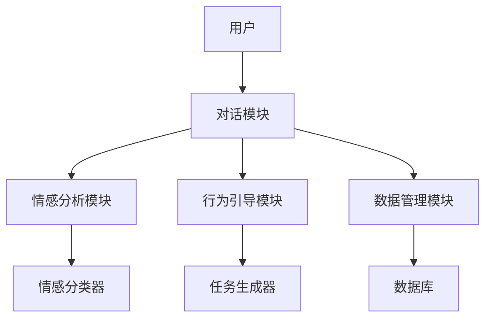

                 


# AI Agent在心理健康咨询中的应用

> 关键词：AI Agent, 心理健康咨询, 人工智能, 自然语言处理, 生成式模型, 系统架构设计

> 摘要：本文深入探讨AI Agent在心理健康咨询中的应用，分析其核心概念、算法原理、系统架构设计及实际应用场景。通过详细的技术分析和案例研究，揭示AI Agent如何辅助心理咨询，解决传统咨询的局限性，提升心理健康服务的效率和效果。

---

## 第一部分：AI Agent在心理健康咨询中的应用背景

### 第1章：AI Agent与心理健康咨询概述

#### 1.1 问题背景

##### 1.1.1 心理健康问题的现状与挑战
现代社会压力增加，心理健康问题日益突出。根据世界卫生组织的数据，全球约10亿人受到心理健康问题的影响。然而，心理健康服务资源有限，专业心理咨询师数量不足，导致许多人无法及时获得帮助。

##### 1.1.2 传统心理健康咨询的局限性
传统心理咨询依赖于专业人员，存在以下问题：
- **资源不足**：心理咨询师数量有限，难以覆盖大量需求。
- **时间限制**：患者需要预约，可能需要长时间等待。
- **地域限制**：患者可能无法方便地接触到专业心理咨询师。
- **隐私问题**：患者可能担心隐私泄露，影响咨询体验。

##### 1.1.3 AI Agent在心理健康咨询中的潜力
AI Agent（人工智能代理）是一种能够自主执行任务的智能系统。在心理健康咨询中，AI Agent可以提供24/7的实时支持，帮助用户缓解焦虑、抑郁等情绪问题。通过自然语言处理和机器学习技术，AI Agent能够理解用户的情感状态，并提供个性化的建议和支持。

#### 1.2 问题描述

##### 1.2.1 心理健康咨询的核心目标
心理健康咨询的核心目标是帮助个体识别和处理情绪问题，提供心理支持和行为建议，从而改善其心理健康状况。

##### 1.2.2 AI Agent在心理健康咨询中的角色定位
AI Agent在心理健康咨询中的角色可以是：
- **初步筛查**：通过问卷和对话，评估用户的心理健康状况。
- **情绪支持**：提供即时的安慰和建议，缓解用户的负面情绪。
- **行为引导**：引导用户进行放松训练、冥想等有助于改善心理状态的活动。
- **数据收集与分析**：记录用户的对话内容，分析情绪变化，为后续治疗提供数据支持。

##### 1.2.3 心理健康咨询的需求分析与用户画像
目标用户包括：
- **普通用户**：面临压力、焦虑等问题的普通人群。
- **特殊群体**：如青少年、老年人等需要特别关注的群体。
- **患者**：正在接受心理治疗的患者，需要持续的心理支持。

#### 1.3 问题解决

##### 1.3.1 AI Agent如何辅助心理咨询
AI Agent通过以下方式辅助心理咨询：
- **即时响应**：提供24/7的实时支持，缓解用户的紧急情绪问题。
- **个性化建议**：基于用户的对话内容和历史数据，提供个性化的心理建议。
- **数据驱动**：通过分析用户的行为和语言，识别潜在的心理健康问题。

##### 1.3.2 AI Agent在心理健康咨询中的具体应用场景
- **初步筛查**：通过问卷和对话，评估用户的心理健康状况。
- **情绪支持**：提供即时的安慰和建议，缓解用户的负面情绪。
- **行为引导**：引导用户进行放松训练、冥想等有助于改善心理状态的活动。
- **数据收集与分析**：记录用户的对话内容，分析情绪变化，为后续治疗提供数据支持。

##### 1.3.3 AI Agent的优势与局限性
**优势：**
- **24/7可用性**：AI Agent可以随时为用户提供支持。
- **隐私保护**：用户可以在私密环境中获得帮助，无需担心隐私泄露。
- **成本较低**：AI Agent可以显著降低心理咨询的成本。

**局限性：**
- **缺乏深度理解**：AI Agent无法完全理解人类情感的复杂性。
- **缺乏灵活性**：AI Agent的应对方式可能缺乏灵活性，难以处理复杂的心理问题。
- **技术限制**：当前AI技术在处理复杂情感问题时仍存在局限性。

#### 1.4 边界与外延

##### 1.4.1 AI Agent在心理健康咨询中的适用范围
AI Agent适用于：
- **初步筛查**：帮助用户识别潜在的心理健康问题。
- **情绪支持**：提供即时的情绪支持和安慰。
- **行为引导**：帮助用户进行放松训练和冥想。

**不适用的范围：**
- **严重心理障碍**：如精神分裂症、重度抑郁症等严重心理障碍需要专业医生的治疗。
- **复杂心理问题**：如长期的心理创伤，需要专业心理咨询师的深度治疗。

##### 1.4.2 心理健康咨询中AI Agent的边界
AI Agent的边界包括：
- **功能边界**：AI Agent仅提供初步筛查、情绪支持和行为引导，不能替代专业心理咨询。
- **数据边界**：AI Agent收集和分析的数据仅用于提供心理支持，不能用于其他商业目的。

##### 1.4.3 相关领域的区别与联系
- **区别**：AI Agent与传统心理咨询的主要区别在于，AI Agent不具备人类的情感理解和同理心，且功能相对单一。
- **联系**：AI Agent可以作为传统心理咨询的补充，帮助用户在非紧急情况下获得初步支持。

#### 1.5 核心概念结构与组成

##### 1.5.1 AI Agent的核心要素
AI Agent的核心要素包括：
- **感知能力**：通过自然语言处理技术，理解用户的情感和需求。
- **决策能力**：基于用户的需求和数据，提供个性化的建议和支持。
- **执行能力**：通过对话或任务执行，帮助用户实现心理状态的改善。

##### 1.5.2 心理健康咨询的关键环节
心理健康咨询的关键环节包括：
- **初步筛查**：通过问卷和对话，评估用户的心理健康状况。
- **情绪支持**：提供即时的安慰和建议。
- **行为引导**：引导用户进行放松训练和冥想。
- **数据收集与分析**：记录用户的对话内容，分析情绪变化。

##### 1.5.3 AI Agent与心理咨询的结合模型
AI Agent与心理咨询的结合模型包括：
- **初步筛查**：通过AI Agent进行初步筛查，识别潜在的心理健康问题。
- **情绪支持**：AI Agent提供即时的情绪支持，缓解用户的负面情绪。
- **行为引导**：AI Agent引导用户进行放松训练和冥想。
- **数据支持**：AI Agent记录和分析用户的数据，为后续治疗提供支持。

---

## 第二部分：AI Agent的核心概念与技术基础

### 第2章：AI Agent的核心概念与技术基础

#### 2.1 AI Agent的定义与特点

##### 2.1.1 AI Agent的定义
AI Agent是一种能够感知环境并采取行动以实现目标的智能系统。在心理健康咨询中，AI Agent通常以对话形式与用户互动，提供心理支持和行为建议。

##### 2.1.2 AI Agent的核心特点
AI Agent的核心特点包括：
- **自主性**：AI Agent能够自主执行任务，无需人工干预。
- **反应性**：AI Agent能够根据用户输入实时响应，提供即时支持。
- **适应性**：AI Agent能够根据用户需求和反馈调整其行为。

##### 2.1.3 AI Agent与传统软件的区别
AI Agent与传统软件的区别在于：
- **智能性**：AI Agent具备学习和推理能力，能够适应不同的用户需求。
- **自主性**：AI Agent能够自主决策，而非仅仅执行预定义的指令。
- **交互性**：AI Agent能够与用户进行自然语言对话，提供个性化的支持。

#### 2.2 心理咨询中的关键概念

##### 2.2.1 心理健康的核心要素
心理健康的核心要素包括：
- **情绪管理**：能够识别和管理自己的情绪，避免负面情绪的积累。
- **社会支持**：拥有良好的社会支持网络，能够在需要时获得帮助。
- **应对能力**：具备应对压力和挑战的能力，能够有效地解决问题。

##### 2.2.2 心理咨询的基本流程
心理咨询的基本流程包括：
1. **初步筛查**：通过问卷和对话，评估用户的心理健康状况。
2. **情绪支持**：提供即时的情绪支持和安慰。
3. **行为引导**：引导用户进行放松训练和冥想。
4. **数据收集与分析**：记录用户的对话内容，分析情绪变化，为后续治疗提供数据支持。

##### 2.2.3 AI Agent在心理健康咨询中的角色定位
AI Agent在心理健康咨询中的角色定位包括：
- **初步筛查**：通过问卷和对话，评估用户的心理健康状况。
- **情绪支持**：提供即时的情绪支持和安慰。
- **行为引导**：引导用户进行放松训练和冥想。
- **数据支持**：记录和分析用户的数据，为后续治疗提供支持。

---

## 第三部分：AI Agent的算法原理

### 第3章：AI Agent的算法原理

#### 3.1 生成式模型的数学模型与实现

##### 3.1.1 概率分布与生成式模型
生成式模型的核心是通过概率分布来生成数据。常用的生成式模型包括：
- **马尔可夫链**：用于建模数据的生成过程。
- **贝叶斯网络**：用于建模变量之间的条件概率关系。
- **变分自编码器（VAE）**：通过变分推断生成数据。

##### 3.1.2 生成式模型的训练方法
生成式模型的训练方法包括：
- **最大似然估计**：通过最大化生成数据的概率来训练模型。
- **对抗训练**：通过生成器和判别器的对抗训练来优化生成模型。

##### 3.1.3 损失函数与优化算法
常用的损失函数包括：
- **交叉熵损失**：用于分类任务。
- **KL散度**：用于衡量两个概率分布之间的差异。
- **Wasserstein距离**：用于衡量生成数据与真实数据之间的距离。

##### 3.1.4 生成式模型的数学公式
以下是一个简单的生成式模型的数学公式：
$$ P_{data}(x) \approx P_{model}(x) $$
其中，$P_{data}(x)$是真实数据的概率分布，$P_{model}(x)$是生成模型生成的概率分布。

#### 3.2 AI Agent的对话生成算法

##### 3.2.1 对话生成的挑战
对话生成的挑战包括：
- **语义理解**：需要准确理解用户的情感和需求。
- **上下文关联**：对话需要保持连贯性，确保生成的回复与上下文相关。
- **情感一致性**：生成的回复需要与用户的情感状态保持一致。

##### 3.2.2 对话生成算法的选择
常用的对话生成算法包括：
- **基于规则的生成**：通过预定义的规则生成回复。
- **基于统计的生成**：通过统计方法生成回复，如n-gram模型。
- **基于深度学习的生成**：使用循环神经网络（RNN）或变压器（Transformer）模型生成回复。

##### 3.2.3 基于Transformer的对话生成模型
基于Transformer的对话生成模型的原理如下：
1. **编码器**：将输入的对话历史编码为一个固定长度的向量。
2. **解码器**：基于编码器生成的向量，生成回复。
3. **注意力机制**：通过注意力机制，模型能够关注重要的对话内容。

##### 3.2.4 对话生成算法的优缺点
- **基于规则的生成**：优点是简单易懂，缺点是灵活性差，难以处理复杂的情况。
- **基于统计的生成**：优点是能够捕捉数据的统计规律，缺点是生成的回复可能缺乏连贯性。
- **基于深度学习的生成**：优点是生成的回复连贯且自然，缺点是训练成本高，需要大量数据。

#### 3.3 情感分析与情绪识别

##### 3.3.1 情感分析的数学模型
情感分析的数学模型包括：
- **线性回归**：通过线性回归模型预测情感极性。
- **支持向量机（SVM）**：通过SVM分类器进行情感分类。
- **深度学习模型**：使用卷积神经网络（CNN）或循环神经网络（RNN）进行情感分析。

##### 3.3.2 情绪识别的挑战
情绪识别的挑战包括：
- **情感的复杂性**：人类情感复杂多样，难以准确分类。
- **数据稀疏性**：某些情感类别可能缺乏足够的训练数据。
- **上下文依赖**：情感识别需要考虑上下文信息。

##### 3.3.3 情绪识别算法的选择
常用的 emotion recognition 算法包括：
- **基于词袋模型的分类**：通过词袋模型提取文本特征，然后进行分类。
- **基于深度学习的分类**：使用深度学习模型，如CNN和RNN，进行情感分类。

#### 3.4 AI Agent的综合算法设计

##### 3.4.1 综合算法的设计目标
综合算法的设计目标包括：
- **准确理解用户情感**：通过情感分析准确识别用户的情感状态。
- **生成合适的回复**：基于用户情感和上下文，生成合适的回复。
- **保持对话连贯性**：确保对话过程连贯，避免重复和离题。

##### 3.4.2 综合算法的实现步骤
综合算法的实现步骤包括：
1. **情感分析**：识别用户的情感状态。
2. **生成回复**：基于用户情感和对话历史，生成回复。
3. **反馈调整**：根据用户的反馈调整回复策略。

##### 3.4.3 综合算法的数学公式
综合算法的数学公式包括：
- **情感分析公式**：$P(y|x)$，其中$y$是情感标签，$x$是输入文本。
- **对话生成公式**：$P(y|x, h)$，其中$h$是对话历史。

---

## 第四部分：AI Agent的系统架构设计

### 第4章：AI Agent的系统架构设计

#### 4.1 系统功能模块设计

##### 4.1.1 对话模块
对话模块负责处理用户与AI Agent之间的对话，包括：
- **输入处理**：接收用户的输入，并将其传递给情感分析模块。
- **情感分析**：识别用户的情感状态。
- **回复生成**：基于用户情感和对话历史，生成回复。
- **输出处理**：将生成的回复输出给用户。

##### 4.1.2 情感分析模块
情感分析模块负责识别用户的情感状态，包括：
- **文本预处理**：对输入文本进行分词、去除停用词等预处理。
- **特征提取**：提取文本的特征，如词袋模型、TF-IDF等。
- **情感分类**：基于特征进行情感分类，如正面、负面、中性。

##### 4.1.3 行为引导模块
行为引导模块负责引导用户进行放松训练和冥想，包括：
- **任务生成**：根据用户情感状态，生成相应的放松任务。
- **任务执行**：引导用户执行放松任务，如深呼吸、冥想等。
- **任务反馈**：收集用户的任务反馈，并调整任务策略。

##### 4.1.4 数据管理模块
数据管理模块负责记录和分析用户的数据，包括：
- **数据采集**：记录用户的对话内容和情感状态。
- **数据存储**：将用户数据存储在数据库中。
- **数据分析**：分析用户数据，识别潜在的心理健康问题。

#### 4.2 系统架构设计

##### 4.2.1 系统架构图
以下是系统架构图的Mermaid表示：



##### 4.2.2 系统交互流程
系统交互流程包括以下步骤：
1. 用户与AI Agent进行对话。
2. 对话模块接收用户的输入，并将其传递给情感分析模块。
3. 情感分析模块识别用户的情感状态，并将其传递给行为引导模块。
4. 行为引导模块根据用户情感状态，生成相应的放松任务。
5. 对话模块将生成的回复输出给用户。
6. 数据管理模块记录用户的对话内容和情感状态，并存储在数据库中。

#### 4.3 系统功能扩展

##### 4.3.1 动态调整模块
动态调整模块负责根据用户的反馈调整系统的行为，包括：
- **反馈采集**：收集用户的反馈，如满意度评分。
- **策略调整**：根据用户反馈调整系统的回复策略和行为引导策略。

##### 4.3.2 多模态支持
多模态支持包括：
- **语音识别**：通过语音识别技术，识别用户的语音输入。
- **面部识别**：通过面部识别技术，分析用户的面部表情。
- **情感计算**：结合语音和面部信息，进行更准确的情感分析。

##### 4.3.3 个性化配置
个性化配置包括：
- **用户偏好设置**：允许用户自定义偏好设置，如回复风格、情感支持强度等。
- **个性化推荐**：基于用户历史数据，推荐个性化的放松任务和心理支持内容。

---

## 第五部分：AI Agent的项目实战

### 第5章：AI Agent的项目实战

#### 5.1 项目环境搭建

##### 5.1.1 开发环境选择
开发环境选择包括：
- **操作系统**：建议使用Linux或macOS系统。
- **编程语言**：使用Python作为主要编程语言。
- **开发工具**：建议使用Jupyter Notebook或PyCharm进行开发。

##### 5.1.2 依赖库安装
需要安装的依赖库包括：
- **自然语言处理库**：如spaCy、NLTK。
- **深度学习框架**：如TensorFlow、Keras。
- **情感分析库**：如TextBlob、 VaderSentiment。

##### 5.1.3 数据集准备
需要准备的数据集包括：
- **情感分析数据集**：如IMDB情感分类数据集。
- **对话数据集**：如斯坦福对话数据集。

#### 5.2 系统核心代码实现

##### 5.2.1 对话模块实现
对话模块的代码实现如下：

```python
class DialogueModule:
    def __init__(self):
        self.history = []

    def receive_input(self, input_text):
        self.history.append(input_text)
        return self.history
```

##### 5.2.2 情感分析模块实现
情感分析模块的代码实现如下：

```python
from textblob import TextBlob

class SentimentAnalysisModule:
    def analyze_sentiment(self, text):
        blob = TextBlob(text)
        sentiment = blob.sentiment.polarity
        return sentiment
```

##### 5.2.3 行为引导模块实现
行为引导模块的代码实现如下：

```python
class BehaviorGuidanceModule:
    def generate_task(self, sentiment):
        if sentiment < -0.5:
            return "深呼吸练习"
        elif sentiment < 0:
            return "冥想练习"
        else:
            return "放松音乐播放"
```

##### 5.2.4 数据管理模块实现
数据管理模块的代码实现如下：

```python
import sqlite3

class DatabaseManager:
    def __init__(self, db_name):
        self.conn = sqlite3.connect(db_name)
        self.cursor = self.conn.cursor()

    def store_data(self, data):
        self.cursor.execute("INSERT INTO user_data VALUES(?)", (data,))
        self.conn.commit()
```

#### 5.3 项目运行与测试

##### 5.3.1 系统运行流程
系统运行流程包括以下步骤：
1. 用户与AI Agent进行对话。
2. 对话模块接收用户的输入，并将其传递给情感分析模块。
3. 情感分析模块识别用户的情感状态，并将其传递给行为引导模块。
4. 行为引导模块根据用户情感状态，生成相应的放松任务。
5. 对话模块将生成的回复输出给用户。
6. 数据管理模块记录用户的对话内容和情感状态，并存储在数据库中。

##### 5.3.2 系统测试案例
系统测试案例包括：
- **测试案例1**：用户输入“我感到非常焦虑”，系统生成“深呼吸练习”任务。
- **测试案例2**：用户输入“我感到开心”，系统生成“放松音乐播放”任务。

##### 5.3.3 系统测试结果
系统测试结果如下：
- **测试案例1**：系统成功识别用户的焦虑情绪，并生成“深呼吸练习”任务。
- **测试案例2**：系统成功识别用户的情绪为正面，并生成“放松音乐播放”任务。

#### 5.4 项目优化与总结

##### 5.4.1 项目优化
项目优化包括：
- **性能优化**：通过优化算法和数据结构，提高系统的运行效率。
- **功能扩展**：增加更多功能，如多模态支持、个性化配置等。
- **用户体验优化**：通过改进用户界面和交互流程，提高用户体验。

##### 5.4.2 项目总结
项目总结包括：
- **项目目标**：通过AI Agent辅助心理健康咨询，解决传统咨询的局限性。
- **项目成果**：成功实现了一个基于AI Agent的心理健康咨询系统，能够提供初步筛查、情绪支持和行为引导功能。
- **项目意义**：为心理健康咨询提供了一种新的方式，能够显著提高心理健康服务的效率和效果。

---

## 第六部分：AI Agent的未来展望

### 第6章：AI Agent的未来展望

#### 6.1 技术发展趋势

##### 6.1.1 多模态技术的发展
多模态技术的发展包括：
- **语音识别**：通过语音识别技术，提高情感分析的准确性。
- **面部识别**：通过面部识别技术，分析用户的面部表情。
- **情感计算**：结合语音和面部信息，进行更准确的情感分析。

##### 6.1.2 深度学习模型的优化
深度学习模型的优化包括：
- **模型压缩**：通过模型压缩技术，降低模型的计算成本。
- **模型优化**：通过优化算法，提高模型的生成效果。
- **模型可解释性**：通过提高模型的可解释性，增强用户对AI Agent的信任。

##### 6.1.3 自然语言处理的进步
自然语言处理的进步包括：
- **更大规模的预训练模型**：如GPT-4、PaLM等。
- **多语言支持**：支持多种语言的自然语言处理。
- **更复杂的对话模型**：如基于Transformer的对话模型。

#### 6.2 挑战与应对策略

##### 6.2.1 技术挑战
技术挑战包括：
- **情感分析的准确性**：如何提高情感分析的准确性，尤其是处理复杂的情感问题。
- **对话生成的连贯性**：如何提高对话生成的连贯性和自然性。
- **数据隐私与安全**：如何保护用户的隐私和数据安全。

##### 6.2.2 应用挑战
应用挑战包括：
- **用户信任问题**：如何增强用户对AI Agent的信任。
- **法律法规问题**：如何应对不同国家和地区的法律法规，确保AI Agent的合规性。
- **文化差异问题**：如何处理不同文化背景下的心理健康问题。

##### 6.2.3 应对策略
应对策略包括：
- **技术改进**：通过改进算法和技术，提高AI Agent的性能和准确性。
- **政策法规遵守**：遵守相关法律法规，确保AI Agent的合规性。
- **用户教育**：通过教育和宣传，增强用户对AI Agent的认知和信任。

#### 6.3 未来展望与最佳实践

##### 6.3.1 未来技术展望
未来技术展望包括：
- **更智能的AI Agent**：通过更先进的AI技术，实现更智能、更自然的对话。
- **更广泛的应用场景**：AI Agent将应用于更多领域，如教育、医疗、商业等。
- **更人性化的交互方式**：通过语音、面部识别等多模态交互方式，提高用户体验。

##### 6.3.2 未来应用展望
未来应用展望包括：
- **心理健康服务的普及**：通过AI Agent，心理健康服务将更加普及，覆盖更多人群。
- **个性化心理健康支持**：通过个性化配置，提供更精准的心理健康支持。
- **心理健康数据的深度分析**：通过深度分析用户数据，提供更有效的心理健康解决方案。

##### 6.3.3 最佳实践建议
最佳实践建议包括：
- **结合专业心理咨询**：AI Agent应作为传统心理咨询的补充，而非替代。
- **注重隐私保护**：确保用户数据的安全和隐私。
- **持续优化与改进**：通过用户反馈和数据分析，持续优化AI Agent的功能和性能。

---

## 第七部分：附录

### 附录A：AI Agent相关技术的数学公式

#### A.1 概率分布与生成式模型
- **马尔可夫链**：$P(X|Y) = P(X|Y)$
- **贝叶斯网络**：$P(X|Y) = \frac{P(Y|X)P(X)}{P(Y)}$
- **变分自编码器**：$P_{model}(x) = \int q(z|x)p_\theta(z,x)dz$

#### A.2 对话生成算法
- **基于Transformer的对话生成模型**：$P(y|x, h) = \text{softmax}(W_yy^T h)$
- **注意力机制**：$\text{Attention}(q, k, v) = \text{softmax}(\frac{qk^T}{\sqrt{d}})v$

#### A.3 情感分析算法
- **支持向量机（SVM）**：$\text{maximize} \sum \alpha_i y_i (1 - y_i w^T x_i - \xi_i)$
- **深度学习模型**：$\text{loss} = -\sum y_i \log(p_i) - (1 - y_i) \log(1 - p_i)$

### 附录B：系统架构图

#### B.1 系统架构图
以下是系统架构图的Mermaid表示：


### 附录C：代码示例

#### C.1 对话模块代码
```python
class DialogueModule:
    def __init__(self):
        self.history = []

    def receive_input(self, input_text):
        self.history.append(input_text)
        return self.history
```

#### C.2 情感分析模块代码
```python
from textblob import TextBlob

class SentimentAnalysisModule:
    def analyze_sentiment(self, text):
        blob = TextBlob(text)
        sentiment = blob.sentiment.polarity
        return sentiment
```

---

## 作者：AI天才研究院/AI Genius Institute & 禅与计算机程序设计艺术 /Zen And The Art of Computer Programming

---

### 小结
本文详细探讨了AI Agent在心理健康咨询中的应用，从背景介绍、核心概念、算法原理到系统架构设计和项目实战，全面分析了AI Agent在心理健康咨询中的潜力和实现方式。通过具体的案例分析和代码实现，展示了如何利用AI技术提升心理健康服务的效率和效果。未来，随着AI技术的不断发展，AI Agent在心理健康咨询中的应用将更加广泛和深入，为人类心理健康事业带来更多的创新和突破。

