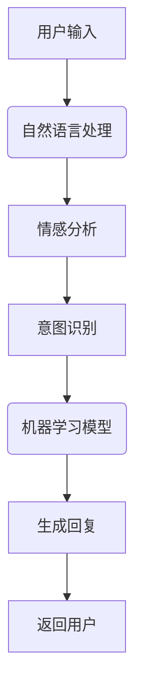
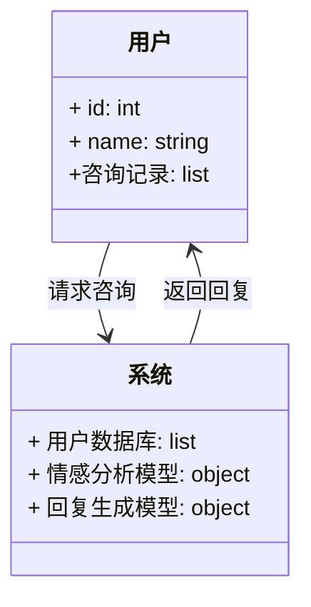
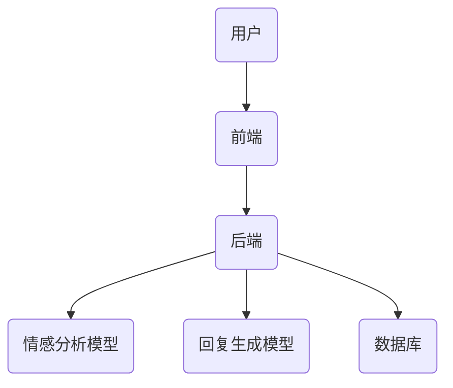
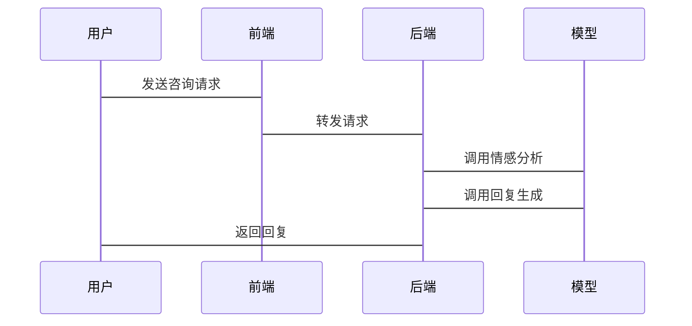

                 


# AI Agent在心理健康咨询中的应用与局限

> 关键词：AI Agent，心理健康咨询，自然语言处理，机器学习，认知行为疗法，伦理问题

> 摘要：本文探讨了AI Agent在心理健康咨询中的应用与局限。通过分析AI Agent的核心概念、算法原理、系统架构，以及实际案例，本文揭示了AI Agent在心理健康咨询中的潜力和挑战，包括技术局限性、伦理问题和用户接受度。最后，本文展望了AI Agent在心理健康咨询中的未来发展方向。

---

## 第一部分：AI Agent与心理健康咨询的背景与核心概念

### 第1章：AI Agent与心理健康咨询的背景

#### 1.1 AI Agent的定义与核心特征
AI Agent（人工智能代理）是一种能够感知环境并采取自主行动以实现目标的智能系统。其核心特征包括：
- **智能性**：通过学习和推理处理复杂问题。
- **自主性**：无需外部干预即可运行。
- **反应性**：能够实时感知并响应环境变化。
- **社会性**：能够与人类或其他系统进行交互。

#### 1.2 心理健康咨询的现状与挑战
心理健康咨询是一种通过对话帮助个体解决心理问题的专业服务。然而，当前面临以下挑战：
- **资源稀缺**：专业心理咨询师数量有限。
- **服务覆盖不足**：无法满足大规模用户需求。
- **个性化需求**：每个用户的心理问题具有独特性。

#### 1.3 AI Agent在心理健康咨询中的问题背景
AI Agent可以解决以下问题：
- **24/7支持**：提供全天候的心理咨询服务。
- **快速响应**：实时识别用户情绪并提供初步建议。
- **数据驱动**：通过分析用户数据提供个性化方案。

#### 1.4 AI Agent在心理健康咨询中的边界与外延
AI Agent的应用边界在于其无法完全替代专业心理咨询师。其外延包括与其他技术（如物联网和大数据）的结合，以实现更全面的心理健康服务。

---

## 第二部分：AI Agent与心理健康咨询的核心概念与联系

### 第2章：AI Agent与心理健康咨询的核心概念

#### 2.1 AI Agent的核心概念原理
AI Agent的核心原理包括：
- **自然语言处理（NLP）**：用于理解和生成人类语言。
- **机器学习（ML）**：通过数据训练模型以识别模式。

#### 2.2 心理健康咨询的核心概念原理
心理健康咨询的核心方法包括：
- **认知行为疗法（CBT）**：通过改变思维模式改善情绪。
- **人本主义疗法**：强调共情和非评判性支持。

#### 2.3 AI Agent与心理健康咨询的核心联系
AI Agent作为辅助工具，通过自然语言处理和机器学习，模拟心理咨询师的部分功能，提供初步支持和引导。

---

## 第三部分：AI Agent在心理健康咨询中的算法原理

### 第3章：AI Agent的算法原理

#### 3.1 自然语言处理（NLP）在AI Agent中的应用
NLP用于解析用户的情感和意图，例如使用情感分析模型识别用户的负面情绪。

#### 3.2 机器学习（ML）在AI Agent中的应用
ML模型通过训练数据学习如何生成符合上下文的回复，例如使用循环神经网络（RNN）生成对话。

#### 3.3 算法流程图（mermaid）


#### 3.4 数学模型与公式
AI Agent的回复生成可以使用以下公式：
$$ P(word_{i+1} | word_1, word_2, ..., word_i) $$

---

## 第四部分：AI Agent的心理健康咨询系统架构

### 第4章：系统分析与架构设计

#### 4.1 系统功能设计
系统功能包括：
- 用户输入处理
- 情感分析
- 意图识别
- 回复生成

#### 4.2 领域模型类图（mermaid）


#### 4.3 系统架构图（mermaid）


#### 4.4 接口设计与交互流程图（mermaid）


---

## 第五部分：AI Agent在心理健康咨询中的项目实战

### 第5章：项目实战

#### 5.1 环境安装
安装必要的库：
```bash
pip install numpy
pip install tensorflow
pip install scikit-learn
```

#### 5.2 系统核心实现源代码
```python
import numpy as np
import tensorflow as tf
from sklearn.model_selection import train_test_split

# 数据准备
data = [...]  # 数据集

# 划分训练集和测试集
X_train, X_test, y_train, y_test = train_test_split(data, test_size=0.2)

# 模型构建
model = tf.keras.Sequential([
    tf.keras.layers.Embedding(input_dim=..., output_dim=...),
    tf.keras.layers.LSTM(units=64),
    tf.keras.layers.Dense(1, activation='sigmoid')
])

# 模型训练
model.compile(optimizer='adam', loss='binary_crossentropy', metrics=['accuracy'])
model.fit(X_train, y_train, epochs=10, batch_size=32)
```

#### 5.3 代码应用解读与分析
该代码实现了一个基于LSTM的情感分类模型，用于识别用户的情感状态。

#### 5.4 案例分析与详细讲解
以一个抑郁识别案例为例，展示如何通过AI Agent识别用户的抑郁情绪并提供初步建议。

#### 5.5 项目小结
总结项目的实现过程，并提出改进建议。

---

## 第六部分：AI Agent在心理健康咨询中的局限与挑战

### 第6章：AI Agent的局限性

#### 6.1 技术局限性
- **情感识别的准确性**：AI Agent可能无法准确理解复杂的情感。
- **个性化不足**：缺乏对个体独特性的深度理解。

#### 6.2 伦理问题
- **隐私泄露**：用户数据的安全性问题。
- **责任归属**：AI Agent引发问题时的责任划分。

#### 6.3 用户接受度
- **信任问题**：用户可能不信任AI Agent提供的建议。

#### 6.4 应对策略
- **提升技术准确性**：优化算法和数据质量。
- **加强隐私保护**：采用加密技术和数据匿名化。
- **建立信任机制**：通过透明化和用户教育提升信任。

---

## 第七部分：AI Agent在心理健康咨询中的未来展望

### 第7章：未来发展方向

#### 7.1 技术进步
- **更先进的NLP模型**：如GPT-3、GPT-4等。
- **多模态交互**：结合视觉、听觉信息进行咨询。

#### 7.2 新的应用场景
- **结合AR/VR技术**：提供沉浸式心理咨询服务。
- **家庭健康助手**：作为家庭成员的心理健康辅助工具。

#### 7.3 心理健康咨询的数字化转型
- **智能化服务**：通过AI Agent实现更高效的心理健康服务。
- **个性化解决方案**：基于大数据提供精准的心理咨询。

---

## 附录

### 附录A：术语表
- AI Agent：人工智能代理
- NLP：自然语言处理
- ML：机器学习
- CBT：认知行为疗法

### 附录B：参考文献
- 文献1：介绍AI Agent的基本原理。
- 文献2：探讨心理健康咨询的技术应用。
- 文献3：分析AI在心理健康领域的伦理问题。

### 附录C：索引
按主题和关键词排列的索引列表。

---

## 作者

作者：AI天才研究院/AI Genius Institute & 禅与计算机程序设计艺术 /Zen And The Art of Computer Programming

---

本文通过详细分析AI Agent在心理健康咨询中的应用与局限，为读者提供了全面的技术视角和实践指导。希望本文能为AI技术在心理健康领域的应用提供有价值的参考。

