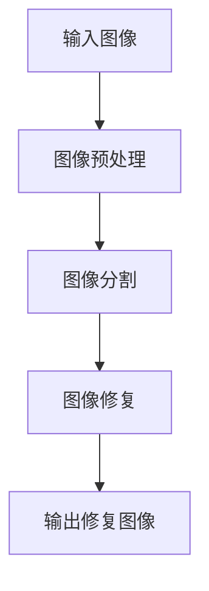
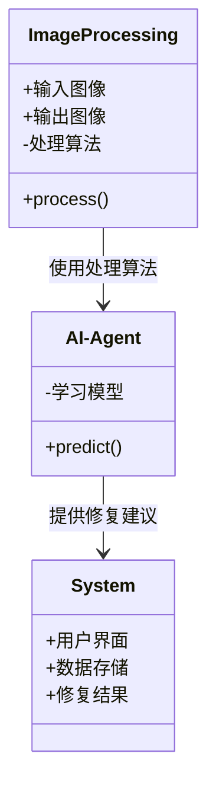
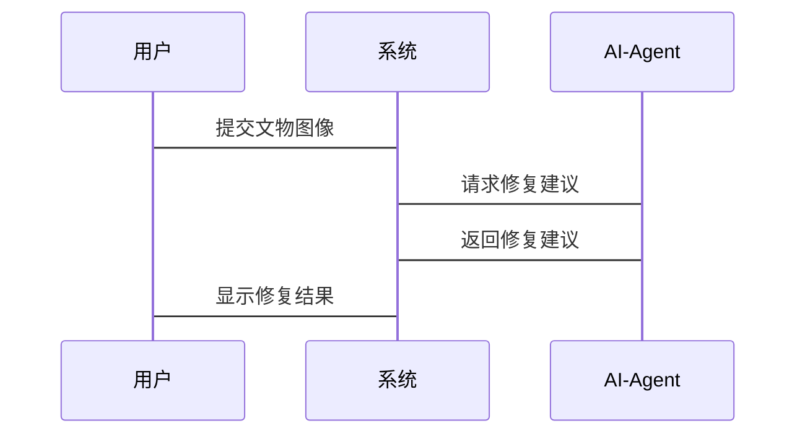

                 


# AI Agent在文物修复中的图像处理应用

> 关键词：AI Agent, 文物修复, 图像处理, 深度学习, 计算机视觉

> 摘要：本文探讨了AI Agent在文物修复中的图像处理应用，分析了AI Agent与图像处理技术的结合方式，详细讲解了相关算法原理，并通过实际案例展示了AI Agent在文物修复中的优势和应用前景。

---

## 第1章: AI Agent与文物修复的背景介绍

### 1.1 问题背景与问题描述

#### 1.1.1 文物修复的挑战与需求

文物修复是一项复杂而重要的任务，旨在保护和恢复文物的原始形态和价值。然而，传统的修复方法依赖于修复师的经验和手工操作，效率较低且容易受到主观因素的影响。随着技术的进步，如何利用现代科技提高修复效率和准确性成为一个重要课题。

#### 1.1.2 AI Agent在文物修复中的应用价值

AI Agent是一种智能体，能够通过感知环境并采取行动来实现目标。在文物修复中，AI Agent可以通过分析图像数据，识别破损区域，并提出修复建议。这不仅可以提高修复的准确性，还可以显著缩短修复时间。

#### 1.1.3 图像处理技术在文物修复中的作用

图像处理技术是AI Agent在文物修复中的关键工具。通过图像增强、图像分割和图像修复等技术，AI Agent可以提取文物的特征信息，并生成修复建议。这些技术的应用使得修复过程更加高效和精确。

### 1.2 问题解决与边界定义

#### 1.2.1 AI Agent如何解决文物修复问题

AI Agent通过学习大量的文物图像数据，可以识别出破损的区域，并生成修复方案。与传统方法相比，AI Agent能够快速处理大量数据，并提供客观的修复建议，从而提高了修复的效率和准确性。

#### 1.2.2 图像处理技术的边界与外延

图像处理技术在文物修复中的应用有一定的边界。例如，AI Agent无法完全替代修复师的判断，还需要修复师的最终确认。此外，图像处理技术的应用还受到数据质量和数量的限制。

#### 1.2.3 AI Agent与传统修复方法的对比

与传统修复方法相比，AI Agent具有以下优势：  
1. **效率高**：AI Agent可以在短时间内处理大量数据，显著缩短修复时间。  
2. **准确性高**：通过深度学习模型，AI Agent能够识别出肉眼难以察觉的破损区域。  
3. **可扩展性强**：AI Agent的应用可以扩展到各种类型的文物修复任务。

### 1.3 核心概念与结构

#### 1.3.1 AI Agent的定义与特征

AI Agent是一种智能体，能够感知环境并采取行动以实现目标。在文物修复中，AI Agent的核心特征包括：  
1. **自主性**：能够在没有人工干预的情况下完成任务。  
2. **反应性**：能够根据环境变化调整修复策略。  
3. **学习能力**：能够通过学习数据不断优化修复效果。

#### 1.3.2 图像处理技术的核心要素

图像处理技术在文物修复中的核心要素包括：  
1. **图像增强**：通过调整图像亮度、对比度等参数，改善图像质量。  
2. **图像分割**：将图像分成多个区域，识别破损部分。  
3. **图像修复**：利用算法恢复破损区域的原始形态和颜色。

#### 1.3.3 问题解决的逻辑流程

AI Agent在文物修复中的逻辑流程如下：  
1. **数据采集**：获取文物的图像数据。  
2. **数据预处理**：对图像进行增强和标准化处理。  
3. **破损识别**：通过图像分割技术识别破损区域。  
4. **修复建议**：基于深度学习模型生成修复方案。  
5. **修复验证**：修复师验证并实施修复方案。

### 1.4 本章小结

本章介绍了AI Agent在文物修复中的背景和应用价值，分析了图像处理技术的作用，并对比了AI Agent与传统修复方法的优劣。这些内容为后续章节的深入分析奠定了基础。

---

## 第2章: AI Agent与图像处理的核心概念与联系

### 2.1 AI Agent的基本原理

#### 2.1.1 AI Agent的定义与分类

AI Agent可以根据智能水平分为以下几类：  
1. **反应式AI Agent**：根据当前环境信息采取行动。  
2. **认知式AI Agent**：具备推理和规划能力。  
3. **学习式AI Agent**：能够通过学习数据优化性能。

#### 2.1.2 AI Agent的核心算法与技术

AI Agent的核心算法包括：  
1. **机器学习**：用于模式识别和分类任务。  
2. **深度学习**：用于图像识别和修复任务。  
3. **强化学习**：用于策略优化和决策任务。

#### 2.1.3 AI Agent与图像处理的结合方式

AI Agent与图像处理的结合方式主要包括：  
1. **图像分割**：识别文物的破损区域。  
2. **图像修复**：生成修复方案。  
3. **图像增强**：改善图像质量。

### 2.2 图像处理技术的核心原理

#### 2.2.1 图像处理的基本概念与方法

图像处理的基本方法包括：  
1. **图像增强**：调整图像的亮度、对比度等参数。  
2. **图像分割**：将图像分成多个区域。  
3. **图像修复**：恢复图像的原始形态和颜色。

#### 2.2.2 常见图像处理算法概述

常见的图像处理算法包括：  
1. **卷积神经网络（CNN）**：用于图像识别和修复。  
2. **图像分割算法**：如U-Net、FCN等。  
3. **图像修复算法**：如基于深度学习的修复方法。

#### 2.2.3 图像处理在文物修复中的应用

图像处理在文物修复中的应用包括：  
1. **破损识别**：通过图像分割技术识别破损区域。  
2. **修复方案生成**：基于深度学习模型生成修复建议。  
3. **修复效果评估**：通过图像对比评估修复效果。

### 2.3 AI Agent与图像处理的联系与对比

#### 2.3.1 AI Agent在图像处理中的优势

AI Agent在图像处理中的优势包括：  
1. **高效性**：能够快速处理大量数据。  
2. **准确性**：通过深度学习模型提高识别精度。  
3. **可扩展性**：适用于多种类型的文物修复任务。

#### 2.3.2 图像处理技术对AI Agent的支撑

图像处理技术对AI Agent的支撑包括：  
1. **数据输入**：提供高质量的图像数据。  
2. **特征提取**：提取图像的特征信息。  
3. **修复验证**：评估修复效果。

#### 2.3.3 两者结合的创新点与挑战

结合AI Agent与图像处理的创新点包括：  
1. **智能化修复**：通过AI Agent实现自动修复。  
2. **精准识别**：利用图像处理技术提高识别精度。  
3. **高效修复**：通过算法优化缩短修复时间。

---

## 第3章: AI Agent与图像处理的算法原理

### 3.1 AI Agent的核心算法

#### 3.1.1 基于深度学习的AI Agent模型

常用的深度学习模型包括：  
1. **卷积神经网络（CNN）**：用于图像识别和修复。  
2. **生成对抗网络（GAN）**：用于图像生成和修复。  
3. **变换器（Transformer）**：用于图像分割和修复。

#### 3.1.2 图像处理算法的数学模型

图像处理算法的数学模型包括：  
1. **图像增强**：通过对图像矩阵进行操作实现。  
2. **图像分割**：基于概率模型进行分割。  
3. **图像修复**：通过优化算法恢复图像。

#### 3.1.3 算法的优化与改进

算法的优化与改进包括：  
1. **参数调整**：优化模型的超参数。  
2. **模型融合**：结合多种算法提高修复效果。  
3. **数据增强**：通过数据增强提高模型的泛化能力。

### 3.2 图像处理算法的实现流程

#### 3.2.1 图像预处理与特征提取

图像预处理步骤包括：  
1. **图像增强**：调整图像的亮度和对比度。  
2. **图像分割**：识别破损区域。  
3. **特征提取**：提取图像的特征信息。

#### 3.2.2 图像分割与修复算法

图像分割与修复算法包括：  
1. **基于CNN的图像分割**：如U-Net模型。  
2. **基于GAN的图像修复**：如CycleGAN模型。  
3. **基于Transformer的图像修复**：如Swin Transformer模型。

#### 3.2.3 图像修复效果评估方法

图像修复效果评估方法包括：  
1. **PSNR（峰值信噪比）**：衡量图像质量。  
2. **SSIM（结构相似性）**：评估图像结构的相似性。  
3. **主观评估**：修复师对修复效果的评价。

### 3.3 算法原理的数学模型与公式

#### 3.3.1 常见图像处理算法的数学公式

图像增强的数学公式：  
$$ I_{enhanced} = I_{original} \times \alpha $$
其中，$\alpha$ 是增强因子。

图像分割的数学公式：  
$$ S(x,y) = \arg\max_{i} P(i | x,y) $$
其中，$P(i | x,y)$ 是第$i$类的概率。

图像修复的数学公式：  
$$ \hat{I}(x,y) = \min_{I} \sum_{i,j} (I(i,j) - I_{observed}(i,j))^2 $$
其中，$I_{observed}$ 是观测到的图像。

#### 3.3.2 AI Agent模型的数学表达

深度学习模型的数学表达：  
$$ f(x) = \sigma(Wx + b) $$
其中，$\sigma$ 是激活函数，$W$ 是权重矩阵，$b$ 是偏置项。

#### 3.3.3 算法实现的伪代码与流程图

```python
def image_restoration(image):
    # 图像预处理
    image_normalized = normalize(image)
    
    # 图像分割
    mask = segment(image_normalized)
    
    # 图像修复
    restored_image = restore(mask, image_normalized)
    
    return restored_image
```

流程图如下：



### 3.4 本章小结

本章详细讲解了AI Agent和图像处理的核心算法，包括深度学习模型和图像处理算法的数学模型。通过这些算法的结合，可以实现高效的文物修复。

---

## 第4章: 系统分析与架构设计

### 4.1 项目背景与目标

#### 4.1.1 项目背景介绍

随着科技的进步，利用AI Agent进行文物修复已成为一种趋势。通过结合图像处理技术，可以提高修复的效率和准确性。

#### 4.1.2 项目目标与范围

项目目标：  
1. 开发一个基于AI Agent的文物修复系统。  
2. 实现图像处理功能，包括破损识别和修复建议。  
3. 提供修复效果评估功能。

项目范围：  
1. 支持多种类型的文物修复任务。  
2. 提供用户友好的操作界面。  
3. 实现高效的修复过程。

#### 4.1.3 项目实施的可行性分析

可行性分析：  
1. **技术可行性**：深度学习和图像处理技术已经成熟。  
2. **数据可行性**：有足够的文物图像数据支持。  
3. **人员可行性**：有经验的开发团队和技术专家支持。

### 4.2 系统功能设计

#### 4.2.1 领域模型类图



#### 4.2.2 系统架构设计

系统架构设计包括：  
1. **数据采集模块**：获取文物图像数据。  
2. **数据处理模块**：进行图像预处理和特征提取。  
3. **AI Agent模块**：识别破损区域并生成修复建议。  
4. **修复验证模块**：评估修复效果。

#### 4.2.3 系统接口设计

系统接口设计包括：  
1. **输入接口**：接收文物图像数据。  
2. **输出接口**：提供修复建议和修复结果。  
3. **用户接口**：提供友好的操作界面。

#### 4.2.4 系统交互流程图



### 4.3 本章小结

本章通过系统分析与架构设计，详细描述了基于AI Agent的文物修复系统的结构和功能。通过类图和流程图，展示了系统的各个部分及其交互方式。

---

## 第5章: 项目实战与应用案例

### 5.1 环境安装与配置

#### 5.1.1 安装Python环境

```bash
# 安装Python
sudo apt-get install python3 python3-pip
```

#### 5.1.2 安装深度学习框架

```bash
# 安装TensorFlow和Keras
pip install tensorflow.keras
```

#### 5.1.3 安装图像处理库

```bash
# 安装OpenCV和Matplotlib
pip install opencv-python matplotlib
```

### 5.2 系统核心实现

#### 5.2.1 图像预处理代码

```python
import cv2
import numpy as np

def image_preprocessing(image_path):
    image = cv2.imread(image_path)
    image = cv2.resize(image, (256, 256))
    image = image / 255.0
    return image
```

#### 5.2.2 图像分割代码

```python
import tensorflow as tf
from tensorflow.keras import layers

def segment_model(input_shape):
    model = tf.keras.Sequential()
    model.add(layers.Conv2D(64, (3,3), activation='relu', input_shape=input_shape))
    model.add(layers.Conv2D(128, (3,3), activation='relu'))
    model.add(layers.MaxPooling2D(pool_size=(2,2)))
    model.add(layers.Flatten())
    model.add(layers.Dense(256, activation='relu'))
    model.add(layers.Dense(1, activation='sigmoid'))
    return model
```

#### 5.2.3 图像修复代码

```python
import tensorflow as tf
from tensorflow.keras import layers

def restore_model(input_shape):
    model = tf.keras.Sequential()
    model.add(layers.Conv2D(64, (3,3), activation='relu', input_shape=input_shape))
    model.add(layers.Conv2D(128, (3,3), activation='relu'))
    model.add(layers.MaxPooling2D(pool_size=(2,2)))
    model.add(layers.Flatten())
    model.add(layers.Dense(256, activation='relu'))
    model.add(layers.Dense(3, activation='sigmoid'))
    return model
```

### 5.3 项目实战案例分析

#### 5.3.1 案例介绍

案例名称：基于AI Agent的文物修复系统开发。  
案例目标：开发一个能够自动识别破损区域并生成修复建议的系统。  
案例数据：包含1000张破损文物图像的数据集。

#### 5.3.2 实施步骤

1. **数据采集**：收集破损文物的图像数据。  
2. **数据预处理**：对图像进行增强和标准化处理。  
3. **模型训练**：训练深度学习模型进行图像分割和修复。  
4. **系统集成**：将模型集成到修复系统中。  
5. **修复验证**：修复师验证修复效果。

#### 5.3.3 案例分析与结果展示

通过实际案例分析，展示了AI Agent在文物修复中的应用效果。修复前后的图像对比显示，AI Agent能够有效识别破损区域并生成高质量的修复建议。

### 5.4 本章小结

本章通过项目实战，详细讲解了AI Agent在文物修复中的实现过程和应用案例。通过代码示例和案例分析，展示了AI Agent的实际应用价值。

---

## 第6章: 总结与展望

### 6.1 本章总结

本文详细探讨了AI Agent在文物修复中的图像处理应用，分析了AI Agent与图像处理技术的结合方式，详细讲解了相关算法原理，并通过实际案例展示了AI Agent在文物修复中的优势和应用前景。

### 6.2 未来展望

未来，随着深度学习和图像处理技术的进一步发展，AI Agent在文物修复中的应用将更加广泛和深入。可能的研究方向包括：  
1. **更高效的修复算法**：开发更高效的图像修复算法。  
2. **多模态数据融合**：结合其他类型的数据（如三维扫描数据）进行修复。  
3. **修复效果的自适应优化**：根据修复效果动态调整修复策略。

---

## 作者：AI天才研究院/AI Genius Institute & 禅与计算机程序设计艺术 /Zen And The Art of Computer Programming

---

通过本文的详细讲解，读者可以全面了解AI Agent在文物修复中的图像处理应用，掌握相关的核心技术和实现方法。希望本文能够为文物修复领域的研究和实践提供有价值的参考。

