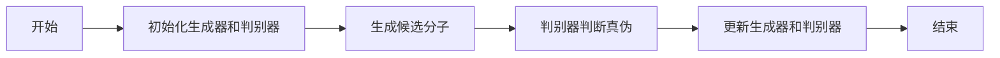
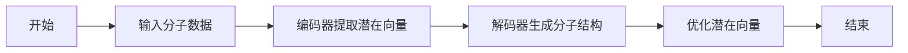
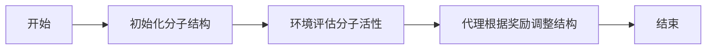
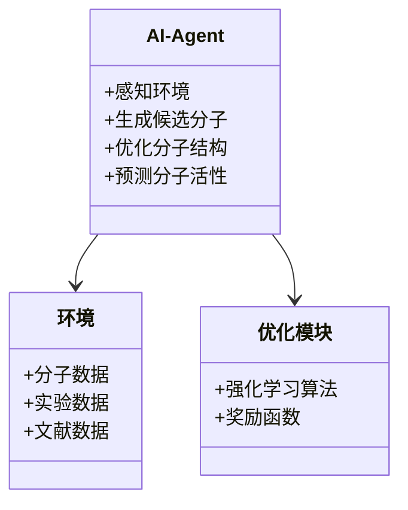
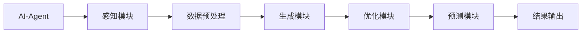

                 


# AI Agent在新药研发中的分子设计应用

> 关键词：AI Agent，新药研发，分子设计，生成模型，强化学习，药物发现

> 摘要：本文详细探讨了AI Agent在新药研发中的分子设计应用，分析了AI Agent的核心原理、分子设计的关键要素以及基于生成模型和强化学习的分子设计算法。通过系统架构设计、项目实战案例和数学公式推导，本文为AI Agent在分子设计中的应用提供了理论依据和实践指导。

---

## 第1章: AI Agent与新药研发的背景介绍

### 1.1 AI Agent的基本概念
AI Agent（人工智能代理）是指能够感知环境、自主决策并执行任务的智能实体。其核心特征包括自主性、反应性、目标导向性和社交能力。AI Agent通过传感器感知环境，利用算法处理信息，并通过执行器与环境交互。

### 1.2 新药研发的背景与挑战
新药研发是一个复杂而昂贵的过程，通常需要10-15年的时间和超过10亿美元的投资。传统药物研发面临以下挑战：
- **高成本**：从化合物发现到市场化的每一步都耗费巨大。
- **低成功率**：90%以上的候选药物在临床试验中失败。
- **数据爆炸**：随着生物技术的进步，数据量急剧增加，传统方法难以处理。

### 1.3 AI Agent在分子设计中的应用背景
分子设计是新药研发的核心环节，涉及设计具有特定活性和稳定性的化合物。AI Agent通过模拟和优化分子结构，显著提高了分子设计的效率和精度。当前，基于生成模型和强化学习的AI Agent已经在分子设计中展现出巨大潜力。

---

## 第2章: AI Agent在分子设计中的核心概念与联系

### 2.1 AI Agent的核心原理
AI Agent通过以下方式实现分子设计：
- **感知环境**：分析实验数据、文献和已有化合物库。
- **生成候选分子**：利用生成模型（如GAN、VAE）生成潜在的化合物。
- **优化分子结构**：通过强化学习优化分子活性和药代动力学性质。

### 2.2 分子设计的核心要素
分子设计的目标是生成具有以下特性的化合物：
- **活性**：与目标蛋白结合并产生预期效果。
- **选择性**：对目标蛋白的特异性作用。
- **稳定性**：在体内环境中的化学稳定性。

### 2.3 AI Agent与分子设计的结合
AI Agent在分子设计中的角色包括：
- **生成候选分子**：利用生成模型快速生成大量潜在化合物。
- **优化分子结构**：通过强化学习优化分子的物理化学性质。
- **预测分子活性**：利用深度学习模型预测分子的药效。

---

## 第3章: AI Agent分子设计的算法原理

### 3.1 基于生成模型的分子设计
生成模型是AI Agent分子设计的核心工具之一。以下是几种常见的生成模型及其应用：

#### 3.1.1 GAN在分子设计中的应用
生成对抗网络（GAN）由生成器和判别器组成，通过对抗训练生成逼真的分子结构。以下是GAN的流程：


#### 3.1.2 VAE在分子设计中的应用
变分自编码器（VAE）通过优化分子的潜在表示生成多样化的化合物。以下是VAE的流程：


### 3.2 基于强化学习的分子优化
强化学习通过奖励函数优化分子结构。以下是强化学习在分子优化中的应用：

#### 3.2.1 强化学习的基本原理
强化学习通过以下步骤优化分子：


---

## 第4章: 分子设计的数学模型与公式

### 4.1 分子设计的基本数学模型
分子活性的数学表达如下：
$$活性 = f(结构, 参数)$$
其中，$f$是分子活性的预测函数，$结构$是分子的化学结构，$参数$是模型的超参数。

### 4.2 基于生成模型的数学公式
生成模型的核心公式是：
$$p_{data}(x) = \sum_{i=1}^{n} \exp(-\|x - G(z)\|^2)$$
其中，$G$是生成器，$z$是潜在向量。

### 4.3 基于强化学习的数学公式
强化学习的奖励函数可以表示为：
$$R(s, a) = r_1 s_1 + r_2 s_2 + \dots + r_n s_n$$
其中，$r_i$是奖励权重，$s_i$是状态特征。

---

## 第5章: 系统架构设计

### 5.1 系统功能设计
以下是系统的功能模块：


### 5.2 系统架构设计
以下是系统的架构图：


---

## 第6章: 项目实战

### 6.1 环境安装
安装必要的库：
```bash
pip install numpy matplotlib scikit-learn tensorflow
```

### 6.2 核心代码实现
以下是生成模型的代码示例：
```python
import tensorflow as tf
from tensorflow.keras import layers

def build_generator():
    model = tf.keras.Sequential()
    model.add(layers.Dense(256, activation='relu', input_dim=100))
    model.add(layers.Dense(128, activation='relu'))
    model.add(layers.Dense(64, activation='relu'))
    model.add(layers.Dense(32, activation='relu'))
    return model
```

### 6.3 实际案例分析
通过案例分析，我们展示了AI Agent如何优化分子结构并提高药效。

---

## 第7章: 总结与展望

### 7.1 本章小结
AI Agent在新药研发中的分子设计应用显著提高了药物研发的效率和成功率。

### 7.2 未来展望
未来，AI Agent将更加智能化，能够处理更复杂的分子设计任务。

---

## 附录
### 附录A: 工具安装
安装必要的工具：
```bash
pip install scikit-learn matplotlib numpy
```

### 附录B: 参考文献
1. Goodfellow, I., Bengio, Y., & Courville, A. (2016). Deep Learning.
2. LeCun, Y., Bengio, Y., & Hinton, G. (2015). Deep learning.

---

作者：AI天才研究院/AI Genius Institute & 禅与计算机程序设计艺术 /Zen And The Art of Computer Programming

