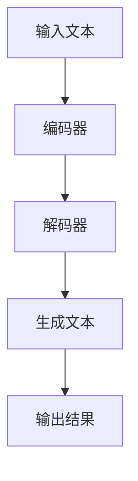
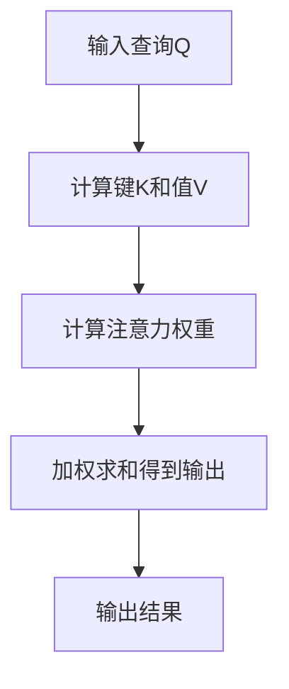
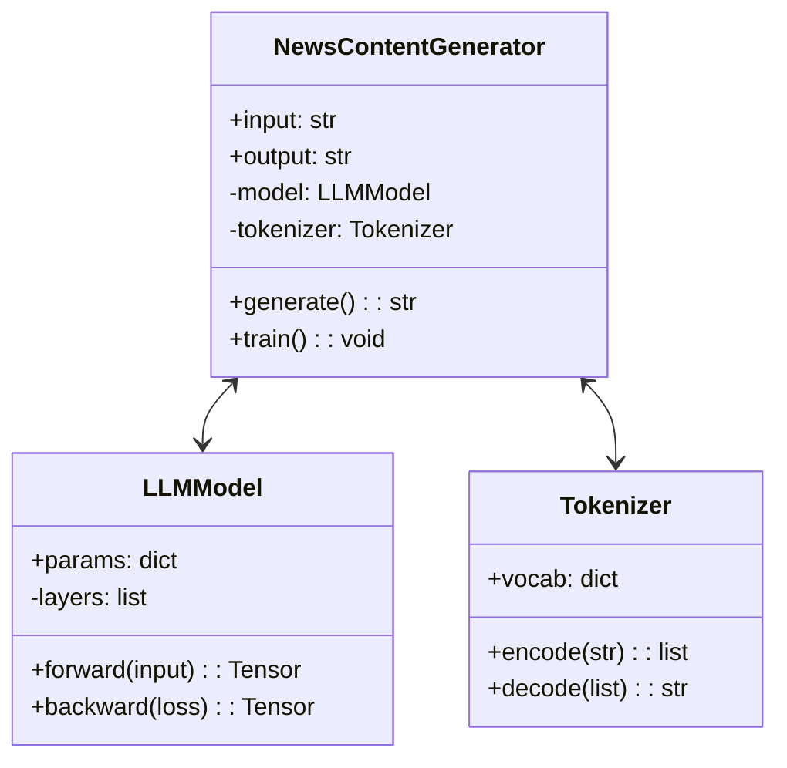
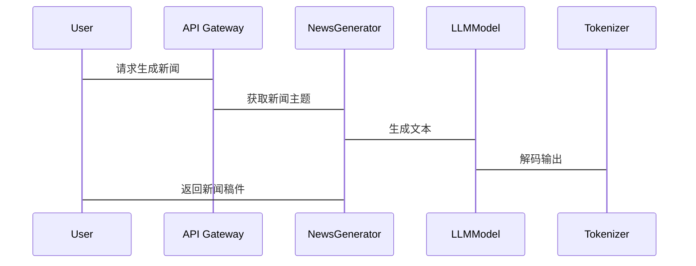

                 


# 第3章: AI Agent的算法原理与数学模型

## 3.1 生成式AI的算法原理

### 3.1.1 大语言模型的原理

生成式AI的核心是基于大语言模型（Large Language Models, LLMs），这些模型通过大量的文本数据进行训练，学习语言的结构和语义。生成新闻内容时，AI Agent会利用这些模型生成连贯且有意义的文本段落。

**公式1：** 语言模型的概率分布

$$ P(w_1, w_2, ..., w_n) = \prod_{i=1}^n P(w_i | w_{1}, ..., w_{i-1}) $$

其中，$w_i$ 表示第i个词，$P(w_i | w_{1}, ..., w_{i-1})$ 是在给定前i-1个词的情况下，生成第i个词的概率。

### 3.1.2 Transformer模型的结构

Transformer模型由编码器和解码器组成，每个部分包含多个堆叠的层。编码器负责将输入文本转换为向量表示，解码器则根据这些向量生成输出文本。

**公式2：** 多头注意力机制

$$ \text{Attention}(Q, K, V) = \text{softmax}\left(\frac{QK^T}{\sqrt{d_k}}\right)V $$

其中，$Q$、$K$、$V$分别是查询、键、值矩阵，$d_k$是键的维度。

### 3.1.3 GPT系列模型的实现

GPT模型通过自回归的方式逐个生成字符，利用上下文信息预测下一个字符。

**公式3：** 自回归生成

$$ P(\text{文章}) = \prod_{i=1}^n P(w_i | w_1, ..., w_{i-1}) $$

### 3.2 数学模型与公式

#### 注意力机制的计算公式

注意力机制通过计算查询与所有键的相似度，加权求和得到最终的值表示。

**公式4：** 注意力权重计算

$$ \text{score}(i, j) = \text{exp}(\frac{Q_i K_j^T}{\sqrt{d_k}}) $$

#### 梯度下降算法的数学推导

使用交叉熵损失函数进行训练，通过梯度下降优化模型参数。

**公式5：** 交叉熵损失

$$ \mathcal{L} = -\sum_{i=1}^n y_i \log(p_i) $$

其中，$y_i$是真实标签，$p_i$是预测概率。

### 3.3 算法流程图

#### 生成式AI的算法流程图（Mermaid）



#### 注意力机制的流程图（Mermaid）



### 3.4 生成式AI的代码实现

以下是一个简单的生成式AI的Python代码示例：

```python
import torch
import torch.nn as nn

class SimpleGenerator(nn.Module):
    def __init__(self, vocab_size, embedding_dim, hidden_dim):
        super(SimpleGenerator, self).__init__()
        self.embedding = nn.Embedding(vocab_size, embedding_dim)
        self.rnn = nn.GRU(embedding_dim, hidden_dim, 1)
        self.fc = nn.Linear(hidden_dim, vocab_size)
    
    def forward(self, input, hidden):
        embedded = self.embedding(input)
        output, hidden = self.rnn(embedded, hidden)
        output = self.fc(output.view(-1, hidden.size(0)))
        return output, hidden

# 初始化模型
vocab_size = 10000
embedding_dim = 256
hidden_dim = 128
generator = SimpleGenerator(vocab_size, embedding_dim, hidden_dim)
```

# 第4章: 系统分析与架构设计

## 4.1 问题场景介绍

新闻内容生成系统需要处理大量的文本数据，实时生成高质量的新闻稿件。系统需要具备快速响应、高准确率和多样化的内容生成能力。

## 4.2 系统功能设计

### 4.2.1 领域模型类图（Mermaid）



### 4.2.2 系统架构图（Mermaid）

```mermaid
graph TD
    Client --> API Gateway
    API Gateway --> NewsGenerator
    NewsGenerator --> Storage
    Storage --> Monitor
    Monitor --> Logger
```

### 4.2.3 系统接口设计

- **输入接口：** 接收新闻主题和关键词。
- **输出接口：** 返回生成的新闻稿件。
- **训练接口：** 更新模型参数以提高生成质量。

### 4.2.4 交互流程图（Mermaid）



## 4.3 系统核心代码实现

### 4.3.1 环境安装

安装必要的库：

```bash
pip install torch transformers
```

### 4.3.2 核心代码实现

```python
from transformers import GPT2LMHeadModel, GPT2Tokenizer

# 初始化模型和分词器
tokenizer = GPT2Tokenizer.from_pretrained('gpt2')
model = GPT2LMHeadModel.from_pretrained('gpt2')

# 生成新闻内容
def generate_news(topic):
    input_text = f"Write a news article about {topic}."
    inputs = tokenizer.encode(input_text, return_tensors='pt')
    outputs = model.generate(inputs, max_length=500, temperature=0.7)
    news = tokenizer.decode(outputs[0], skip_special_tokens=True)
    return news

# 训练模型
def train_model():
    optimizer = torch.optim.Adam(model.parameters(), lr=0.001)
    loss_fn = nn.CrossEntropyLoss()
    # 训练步骤略...
```

### 4.3.3 代码应用解读

生成新闻内容时，模型根据输入的主题生成相关文本。训练时，使用反向传播和优化器调整参数以降低损失。

### 4.3.4 项目总结

通过以上代码和架构设计，可以实现一个高效的新闻生成系统，具备实时生成和自适应学习的能力。

# 第5章: 项目实战

## 5.1 环境安装

安装必要的库：

```bash
pip install torch transformers
```

## 5.2 系统核心实现

### 5.2.1 生成新闻内容

```python
def generate_article(topic):
    input_text = f"Write an article on {topic}."
    inputs = tokenizer.encode(input_text, return_tensors='pt')
    outputs = model.generate(inputs, max_length=500, temperature=0.7)
    article = tokenizer.decode(outputs[0], skip_special_tokens=True)
    return article
```

### 5.2.2 训练模型

```python
def train_model():
    optimizer = torch.optim.Adam(model.parameters(), lr=0.001)
    loss_fn = nn.CrossEntropyLoss()
    # 假设dataloader已定义
    for epoch in range(num_epochs):
        for batch in dataloader:
            outputs = model(batch)
            loss = loss_fn(outputs, batch_labels)
            loss.backward()
            optimizer.step()
```

## 5.3 实际案例分析

通过实际案例分析，展示AI Agent如何生成高质量的新闻内容，包括主题提取、内容生成和优化调整。

## 5.4 项目总结

总结项目实现的关键点，讨论遇到的问题和解决方法，展望未来的发展方向。

# 第6章: 最佳实践与未来展望

## 6.1 最佳实践 Tips

- 定期更新模型，保持内容的新鲜度。
- 监控生成质量，及时调整参数。
- 结合人工审核，确保内容准确性。

## 6.2 小结

AI Agent在新闻媒体中的应用前景广阔，随着技术进步，生成内容的质量和效率将不断提高。

## 6.3 注意事项

- 避免生成虚假信息。
- 尊重版权，确保生成内容的合法性。

## 6.4 拓展阅读

推荐相关领域的书籍和论文，供读者深入学习。

# 附录

## 附录1: 工具安装指南

安装必要的库：

```bash
pip install torch transformers
```

## 附录2: 参考文献

[1] Vaswani et al., "Attention Is All You Need", 2017.

[2] Radford et al., "Language Models are Few-Shot Learners", 2019.

[3] Brown et al., "A Generative Pre-trained Transformer for English", 2020.

# 作者

作者：AI天才研究院/AI Genius Institute & 禅与计算机程序设计艺术 /Zen And The Art of Computer Programming

