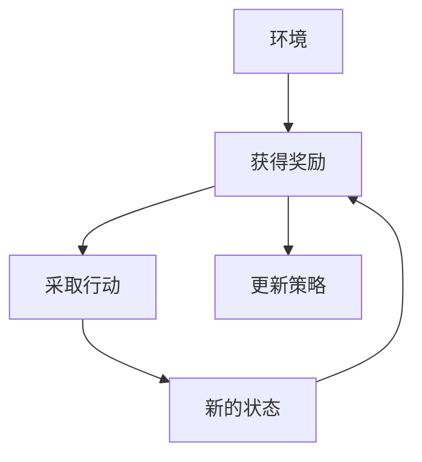
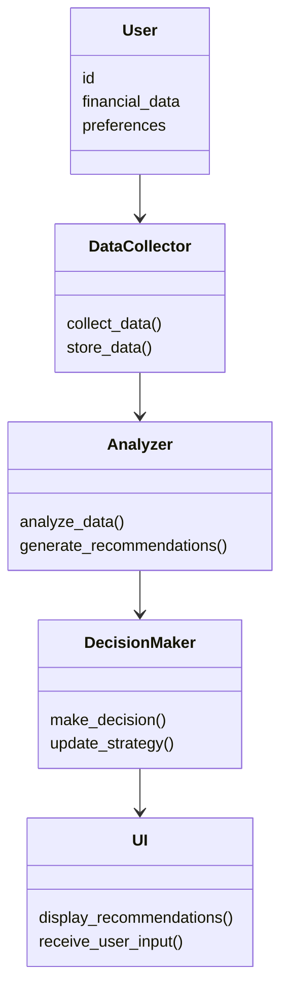
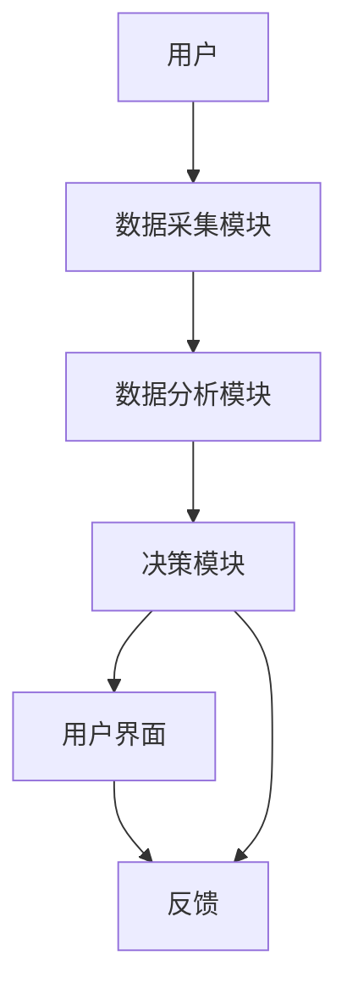
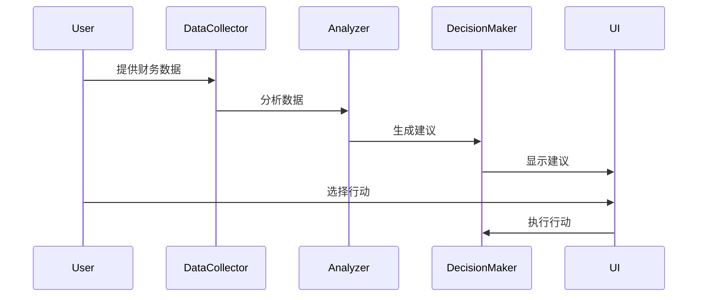

                 


# AI Agent在智能个人理财中的角色

> 关键词：AI Agent，智能理财，个人理财，机器学习，强化学习，财务规划

> 摘要：本文探讨AI Agent在智能个人理财中的应用，分析其核心概念、算法原理、系统架构，并通过实际案例展示其在个性化财务管理和投资决策中的优势。文章深入解析AI Agent如何利用强化学习、监督学习等算法，结合数学模型，为用户提供智能化的理财服务，帮助用户优化财务状况和投资组合。

---

## 第1章 引言

### 1.1 背景介绍
随着人工智能技术的快速发展，AI Agent（人工智能代理）在各个领域的应用日益广泛。AI Agent是一种能够感知环境、自主决策并采取行动以实现特定目标的智能体。在个人理财领域，AI Agent的应用潜力巨大。传统的个人理财方式依赖于人工分析和决策，效率低下且容易出错。而AI Agent可以通过自动化和智能化的方式，帮助用户更高效地管理财务，优化投资组合，并实时监控市场动态。

### 1.2 问题描述与目标
在个人理财中，用户面临诸多挑战，例如如何优化支出结构、如何选择合适的投资产品、如何应对市场波动等。这些问题不仅复杂多样，而且需要及时的反馈和调整。传统的理财方式往往依赖于手动记录和分析，效率低下且容易出错。AI Agent通过自动化数据处理和智能决策，能够显著提高理财效率和准确性。本文旨在探讨AI Agent在智能个人理财中的角色，分析其核心概念、算法原理、系统架构，并通过实际案例展示其在个性化财务管理中的优势。

---

## 第2章 AI Agent的核心概念与原理

### 2.1 AI Agent的定义与类型
AI Agent是一种智能体，能够感知环境、自主决策并执行任务。根据不同的应用场景，AI Agent可以分为以下几种类型：

1. **简单反射型Agent**：基于预设的规则直接做出反应，适用于简单的任务。
2. **基于模型的反射型Agent**：利用内部模型分析环境并做出决策，适用于复杂任务。
3. **目标驱动型Agent**：根据特定目标选择最优行动路径。
4. **制度驱动型Agent**：遵循预设的规则和限制进行决策。

### 2.2 AI Agent在个人理财中的应用
AI Agent在个人理财中的应用主要体现在以下几个方面：

1. **财务规划与投资建议**：AI Agent可以根据用户的财务状况和风险偏好，提供个性化的投资建议。
2. **风险管理与预警**：通过实时监控市场动态和用户资产，AI Agent可以及时发现潜在风险并发出预警。
3. **个性化服务与用户体验**：AI Agent能够根据用户的消费习惯和偏好，提供个性化的财务管理服务。

### 2.3 AI Agent的核心原理
AI Agent的核心原理包括感知、决策和执行三个主要阶段。以下是详细的原理分析：

1. **感知阶段**：AI Agent通过数据采集模块获取用户的财务数据，包括收入、支出、资产和负债等信息。
2. **决策阶段**：利用机器学习算法，AI Agent对数据进行分析和处理，生成最优的理财建议。
3. **执行阶段**：AI Agent根据决策结果执行相应的操作，例如调整投资组合或发出预警通知。

---

## 第3章 AI Agent涉及的算法原理

### 3.1 算法原理概述
AI Agent在个人理财中的应用涉及多种算法，包括强化学习、监督学习和无监督学习等。以下是一些常用的算法及其应用场景：

1. **强化学习**：通过试错机制优化投资组合，适用于动态变化的金融市场。
2. **监督学习**：基于历史数据进行分类和预测，适用于风险评估和资产定价。
3. **无监督学习**：发现数据中的隐藏模式，适用于客户细分和异常检测。

### 3.2 强化学习的流程图
以下是强化学习在投资组合优化中的流程图：



### 3.3 算法实现示例
以下是强化学习算法的Python实现示例：

```python
import numpy as np

class InvestmentAgent:
    def __init__(self, states, actions):
        self.states = states
        self.actions = actions
        self.q_table = np.zeros((states, actions))
    
    def choose_action(self, state, epsilon=0.1):
        if np.random.random() < epsilon:
            return np.random.choice(self.actions)
        else:
            return np.argmax(self.q_table[state])
    
    def learn(self, state, action, reward, next_state, alpha=0.1):
        self.q_table[state, action] += alpha * (reward + np.max(self.q_table[next_state]) - self.q_table[state, action])
```

### 3.4 数学模型与公式
以下是强化学习中的Q-learning算法的数学公式：

$$ Q(s, a) = Q(s, a) + \alpha \times (r + \max Q(s', a') - Q(s, a)) $$

其中：
- \( Q(s, a) \)：当前状态 \( s \) 下采取行动 \( a \) 的Q值。
- \( \alpha \)：学习率。
- \( r \)：奖励。
- \( s' \)：下一个状态。
- \( a' \)：下一个状态下的最优行动。

---

## 第4章 系统分析与架构设计

### 4.1 问题场景与系统介绍
AI Agent在智能个人理财中的系统架构需要解决以下问题：
1. 如何高效采集和处理用户财务数据？
2. 如何实现个性化的理财建议？
3. 如何确保系统的安全性和隐私性？

### 4.2 系统功能设计
以下是系统功能的类图：



### 4.3 系统架构设计
以下是系统的架构图：



### 4.4 接口设计与交互流程图
以下是用户与系统交互的流程图：



---

## 第5章 项目实战

### 5.1 环境搭建与开发工具
为了实现AI Agent在智能个人理财中的应用，需要以下工具和库：
- **编程语言**：Python
- **机器学习库**：TensorFlow、Scikit-learn
- **数据处理工具**：Pandas、NumPy
- **可视化工具**：Matplotlib、Seaborn

### 5.2 核心代码实现
以下是实现AI Agent的Python代码示例：

```python
import pandas as pd
from sklearn.model_selection import train_test_split
from sklearn.tree import DecisionTreeRegressor

# 数据预处理
data = pd.read_csv('financial_data.csv')
X = data[['income', 'expenses', 'assets', ' liabilities']]
y = data['net_worth']

X_train, X_test, y_train, y_test = train_test_split(X, y, test_size=0.2)

# 模型训练
model = DecisionTreeRegressor()
model.fit(X_train, y_train)

# 模型预测
predictions = model.predict(X_test)
print('预测值:', predictions)
print('真实值:', y_test.values)
```

### 5.3 项目案例分析
假设一个用户希望优化其投资组合，AI Agent可以通过分析市场趋势和用户的风险偏好，推荐合适的投资策略。以下是具体步骤：

1. **数据采集**：收集用户的财务数据，包括收入、支出、资产和负债。
2. **数据分析**：利用机器学习算法分析数据，生成投资建议。
3. **决策与执行**：根据分析结果，AI Agent建议用户调整投资组合，例如增加股票配置或减少债券比例。
4. **监控与反馈**：实时监控市场动态和投资表现，及时调整策略。

---

## 第6章 总结与展望

### 6.1 小结
AI Agent在智能个人理财中的应用前景广阔。通过自动化数据处理和智能决策，AI Agent能够显著提高理财效率和准确性。本文详细分析了AI Agent的核心概念、算法原理和系统架构，并通过实际案例展示了其在个性化财务管理中的优势。

### 6.2 注意事项
在实际应用中，需要注意以下几点：
1. **数据隐私**：确保用户数据的安全性和隐私性。
2. **模型解释性**：提高AI Agent的决策透明度，便于用户理解和信任。
3. **持续优化**：定期更新模型和算法，确保AI Agent的决策能力与时俱进。

### 6.3 拓展阅读
1. 《强化学习入门》
2. 《机器学习在金融领域的应用》
3. 《系统设计与架构》

---

## 作者信息

作者：AI天才研究院（AI Genius Institute） & 禅与计算机程序设计艺术（Zen And The Art of Computer Programming）

---

通过本文的详细分析，读者可以深入了解AI Agent在智能个人理财中的角色，并能够实际应用这些知识，开发出高效的智能理财系统。希望本文能为相关领域的研究和实践提供有价值的参考。

