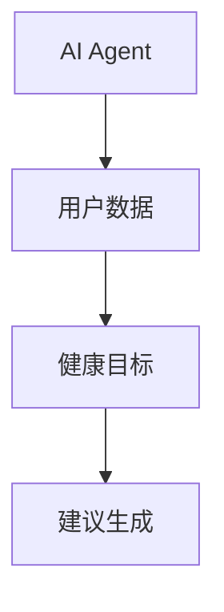
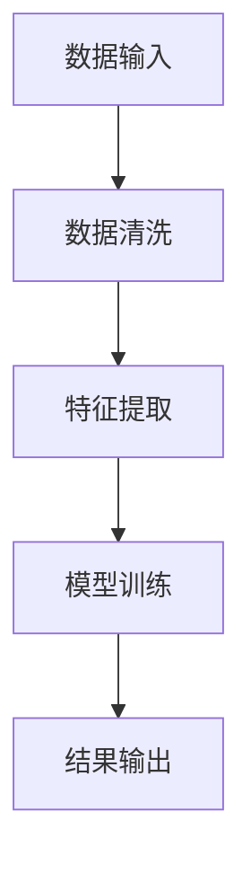
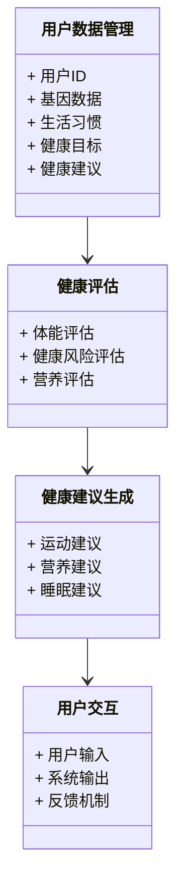
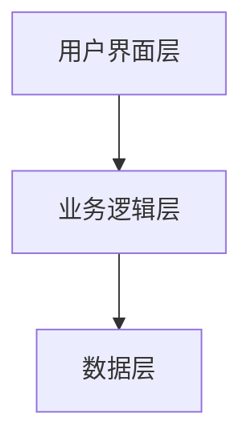
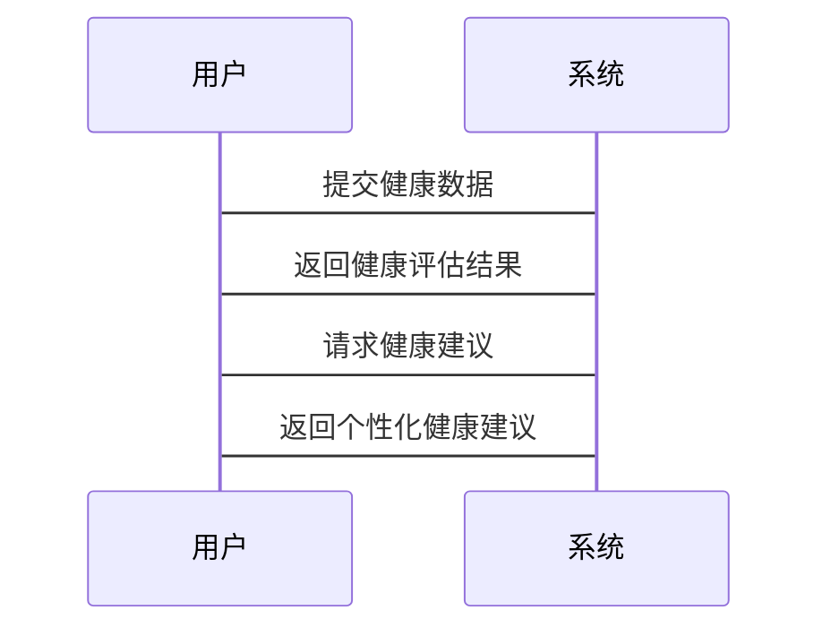

                 


# AI Agent在智能个性化健康建议中的应用

## 关键词：AI Agent, 智能个性化健康建议, 人工智能, 个性化医疗, 健康管理

## 摘要：本文探讨了AI Agent在智能个性化健康建议中的应用，从概念、原理、算法到系统设计和实战案例进行了全面分析，深入解析了AI Agent如何通过数据驱动和智能算法为用户提供精准、个性化的健康建议。

---

# 第一章: AI Agent与智能个性化健康建议的背景

## 1.1 AI Agent的基本概念

### 1.1.1 什么是AI Agent
AI Agent（人工智能代理）是指具备自主决策能力的智能实体，能够根据环境信息和目标进行感知、推理、规划和行动。AI Agent可以是软件程序，也可以是物理设备，其核心在于能够通过算法实现智能化的决策和执行。

### 1.1.2 AI Agent的核心特征
1. **自主性**：能够在没有外部干预的情况下独立运行。
2. **反应性**：能够实时感知环境并做出反应。
3. **目标导向**：基于预设目标或用户需求进行决策。
4. **学习能力**：通过数据和经验不断优化自身性能。

### 1.1.3 AI Agent在健康领域中的应用潜力
AI Agent在健康领域的应用潜力巨大，尤其是在个性化健康建议方面。通过收集和分析用户的健康数据，AI Agent可以为用户提供个性化的健康方案，帮助用户实现健康目标。

---

## 1.2 智能个性化健康建议的定义

### 1.2.1 个性化健康建议的内涵
个性化健康建议是指根据用户的个体特征（如基因、生活习惯、健康状况等）制定的定制化健康方案。其核心在于“个性化”，即针对不同用户的需求提供差异化的健康建议。

### 1.2.2 智能化健康建议的特点
1. **数据驱动**：基于大量的健康数据进行分析和决策。
2. **实时反馈**：能够实时监测用户的健康状况并提供反馈。
3. **动态调整**：根据用户的变化不断优化建议内容。
4. **多模态交互**：支持多种交互方式（如语音、文本、图形等）。

### 1.2.3 个性化健康建议的实现方式
个性化健康建议的实现方式主要包括数据采集、数据分析、算法推理和结果输出四个阶段。AI Agent在这一过程中起到了关键作用，能够高效地完成数据处理和决策任务。

---

## 1.3 AI Agent在健康建议中的问题背景

### 1.3.1 传统健康建议的局限性
传统的健康建议通常基于通用的健康指南，缺乏个性化和动态调整能力。用户需求多样化、健康数据复杂化等问题使得传统健康建议难以满足用户的个性化需求。

### 1.3.2 个性化健康需求的兴起
随着人们对健康的关注度不断提高，个性化健康需求逐渐兴起。用户希望获得基于自身数据的定制化健康方案，这为AI Agent的应用提供了广阔的市场空间。

### 1.3.3 AI Agent在健康建议中的作用
AI Agent通过整合多源数据、应用智能算法，能够为用户提供精准、个性化的健康建议。其在健康建议中的作用主要体现在数据处理、智能推理和结果输出三个方面。

---

## 1.4 本章小结
本章从AI Agent的基本概念出发，详细阐述了智能个性化健康建议的内涵和特点，并分析了AI Agent在健康建议中的作用。通过对比传统健康建议和个性化健康建议，进一步明确了AI Agent在健康领域中的应用价值。

---

# 第二章: AI Agent的核心概念与联系

## 2.1 AI Agent的原理

### 2.1.1 感知与理解
AI Agent通过传感器、数据库等渠道获取环境信息，并利用自然语言处理、计算机视觉等技术对信息进行理解和解析。

### 2.1.2 分析与决策
基于感知到的信息，AI Agent通过机器学习、知识图谱等技术进行分析和推理，生成决策方案。

### 2.1.3 行动与反馈
AI Agent根据决策结果采取相应行动，并通过反馈机制不断优化自身的决策能力。

---

## 2.2 个性化健康建议的核心要素

### 2.2.1 用户健康数据
用户健康数据包括基因数据、生活习惯、疾病史、运动数据等，是个性化健康建议的基础。

### 2.2.2 健康目标设定
健康目标设定是个性化健康建议的核心，用户需要根据自身需求设定短期和长期的健康目标。

### 2.2.3 建议生成机制
建议生成机制是AI Agent的关键部分，负责根据用户数据和健康目标生成个性化的健康建议。

---

## 2.3 AI Agent与个性化健康建议的关系

### 2.3.1 数据流分析
AI Agent通过收集和分析用户数据，为个性化健康建议提供数据支持。

### 2.3.2 知识图谱构建
通过构建健康领域的知识图谱，AI Agent能够更好地理解用户需求和健康问题。

### 2.3.3 交互机制设计
AI Agent与用户的交互机制是个性化健康建议实现的关键，支持多种交互方式以满足用户需求。

---

## 2.4 核心概念对比表
| 概念         | 描述                                                         |
|--------------|--------------------------------------------------------------|
| AI Agent     | 具备自主决策能力的智能体，能够感知环境、分析信息并采取行动。 |
| 个性化健康建议 | 根据用户个体特征制定的定制化健康方案，强调个性化和动态调整。 |

---

## 2.5 ER实体关系图


---

## 2.6 本章小结
本章详细分析了AI Agent的核心概念和个性化健康建议的关系，通过对比和图表展示了两者之间的联系。这为后续的算法分析和系统设计奠定了基础。

---

# 第三章: AI Agent的算法原理

## 3.1 AI Agent的核心算法

### 3.1.1 机器学习算法
机器学习算法是AI Agent的核心算法之一，主要用于数据分析和模式识别。常用的机器学习算法包括支持向量机（SVM）、随机森林（Random Forest）和神经网络（Neural Network）等。

### 3.1.2 自然语言处理算法
自然语言处理（NLP）算法主要用于文本理解和生成。常用的NLP算法包括分词、实体识别、情感分析和机器翻译等。

### 3.1.3 决策树算法
决策树算法是一种基于树状结构的分类和回归算法，常用于决策推理和规则生成。

---

## 3.2 个性化健康建议的生成算法

### 3.2.1 数据预处理
数据预处理是个性化健康建议生成的第一步，主要包括数据清洗、特征提取和数据标准化。

### 3.2.2 模型训练
模型训练是个性化健康建议生成的核心，通过机器学习算法对数据进行训练，生成健康建议生成模型。

### 3.2.3 结果输出
结果输出是个性化健康建议的最后一步，通过模型推理生成具体的健康建议，并以用户友好的形式呈现。

---

## 3.3 算法流程图


---

## 3.4 本章小结
本章详细分析了AI Agent的核心算法及其在个性化健康建议中的应用，通过流程图展示了个性化健康建议的生成过程。这为后续的系统设计和项目实战奠定了基础。

---

# 第四章: AI Agent的系统分析与架构设计

## 4.1 问题场景介绍
个性化健康建议系统需要解决的主要问题是如何通过AI Agent实现数据采集、分析和建议生成。系统需要支持多源数据输入、智能分析和个性化输出。

---

## 4.2 项目介绍
个性化健康建议系统是一个基于AI Agent的智能健康管理系统，旨在为用户提供精准、个性化的健康建议。系统主要包括用户数据采集、健康评估、健康建议生成和用户交互四个模块。

---

## 4.3 系统功能设计

### 4.3.1 领域模型


---

## 4.4 系统架构设计

### 4.4.1 分层架构
个性化健康建议系统的架构设计采用分层架构，主要包括数据层、业务逻辑层和用户界面层。

### 4.4.2 架构图


---

## 4.5 系统接口设计
系统接口设计主要包括用户数据接口、健康评估接口和健康建议生成接口。通过API实现各模块之间的数据交互。

---

## 4.6 系统交互设计

### 4.6.1 序列图


---

## 4.7 本章小结
本章详细分析了个性化健康建议系统的架构设计和接口设计，通过图表展示了系统的各个模块及其交互方式。这为后续的项目实战奠定了基础。

---

# 第五章: 项目实战

## 5.1 环境安装

### 5.1.1 安装Python
```bash
python --version
pip install --upgrade pip
```

### 5.1.2 安装TensorFlow
```bash
pip install tensorflow
pip install numpy
pip install scikit-learn
```

---

## 5.2 系统核心实现源代码

### 5.2.1 数据预处理代码
```python
import numpy as np
import pandas as pd

# 数据加载
data = pd.read_csv('health_data.csv')

# 数据清洗
data.dropna(inplace=True)
data = pd.get_dummies(data)
```

### 5.2.2 模型训练代码
```python
from sklearn.model import DecisionTreeClassifier

# 模型训练
model = DecisionTreeClassifier()
model.fit(X_train, y_train)
```

### 5.2.3 结果输出代码
```python
# 预测结果
y_pred = model.predict(X_test)

# 输出建议
for i in range(len(y_pred)):
    print(f"建议{i+1}: {y_pred[i]}")
```

---

## 5.3 案例分析与详细讲解
以一个用户的健康数据为例，展示如何通过AI Agent生成个性化健康建议。通过代码实现和结果解读，详细分析了AI Agent在个性化健康建议中的应用过程。

---

## 5.4 本章小结
本章通过实战案例详细展示了AI Agent在个性化健康建议中的具体应用，通过代码实现和结果分析，进一步验证了AI Agent在健康领域的应用价值。

---

# 第六章: 最佳实践、小结、注意事项和拓展阅读

## 6.1 最佳实践
1. 数据隐私保护：在处理用户数据时，必须严格遵守数据隐私保护法规。
2. 模型优化：通过不断优化模型和算法，提高个性化健康建议的准确性和实用性。
3. 用户教育：通过教育用户如何正确使用AI Agent，提高系统的用户体验。

---

## 6.2 小结
本文从AI Agent的基本概念出发，详细分析了其在个性化健康建议中的应用，通过算法原理、系统设计和项目实战展示了AI Agent在健康领域的巨大潜力。

---

## 6.3 注意事项
1. 数据安全：在处理用户健康数据时，必须确保数据的安全性和隐私性。
2. 算法优化：通过不断优化算法和模型，提高个性化健康建议的准确性和实用性。
3. 用户反馈：通过收集用户反馈，不断改进系统功能和用户体验。

---

## 6.4 拓展阅读
1. 《人工智能：一种现代方法》
2. 《机器学习实战》
3. 《自然语言处理入门》

---

# 作者：AI天才研究院/AI Genius Institute & 禅与计算机程序设计艺术 /Zen And The Art of Computer Programming

