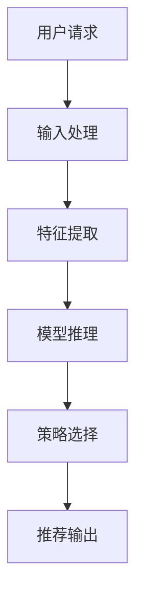
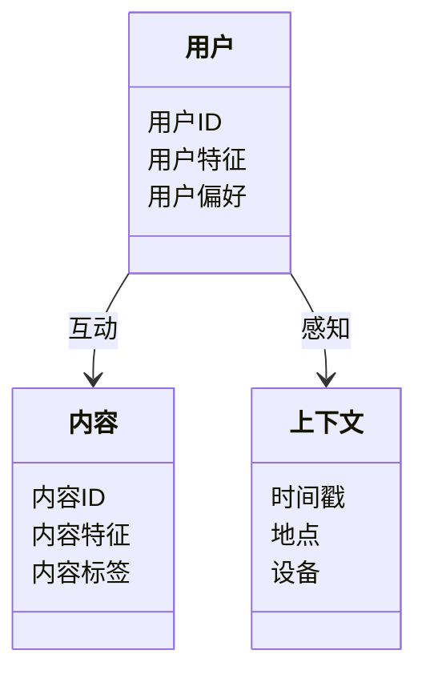
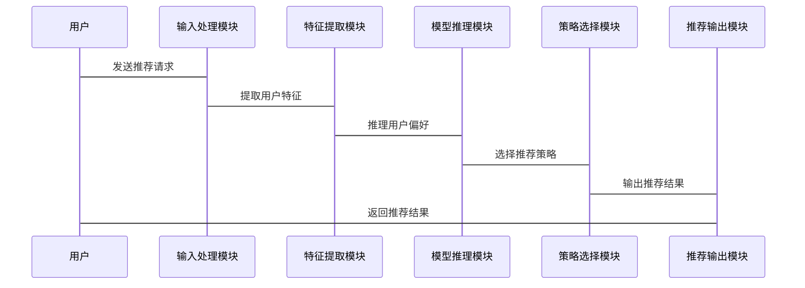

                 


---

# AI Agent在智能个性化内容推荐中的应用

## 关键词：AI Agent, 个性化推荐, 智能推荐系统, 协同过滤, 深度学习, 推荐算法, 系统架构

## 摘要：  
随着人工智能技术的飞速发展，AI Agent（人工智能代理）在智能个性化内容推荐中的应用越来越广泛。本文从AI Agent的基本概念出发，详细探讨其在推荐系统中的核心原理、算法实现、系统设计以及实际应用。通过分析协同过滤、基于内容的推荐和深度学习等算法，结合实时推荐、上下文感知推荐等应用场景，本文旨在为读者提供一个全面且深入的技术指南，帮助他们理解AI Agent在智能推荐中的独特价值和未来发展方向。

---

# 第1章: AI Agent与智能个性化推荐的背景

## 1.1 AI Agent的基本概念

### 1.1.1 AI Agent的定义  
AI Agent是一种能够感知环境、自主决策并执行任务的智能实体。它通过接收输入信息、分析数据、制定策略并执行操作，以实现特定目标。  

AI Agent的核心特征包括：  
- **自主性**：能够在没有外部干预的情况下执行任务。  
- **反应性**：能够实时感知环境并做出反应。  
- **学习能力**：通过数据反馈不断优化自身的推荐策略。  

### 1.1.2 AI Agent的核心特征  

| 特征       | 描述                                       |
|------------|------------------------------------------|
| 自主性     | 能够独立完成任务，无需外部干预             |
| 反应性     | 能够实时感知环境变化并做出反应             |
| 学习能力   | 能够通过数据反馈不断优化推荐策略           |
| 适应性     | 能够根据用户行为和环境变化调整推荐策略     |

### 1.1.3 AI Agent与传统推荐系统的区别  

| 对比维度     | 传统推荐系统                               | AI Agent推荐系统                           |
|--------------|------------------------------------------|-------------------------------------------|
| 智能性       | 基于规则或统计模型，推荐结果固定           | 基于AI Agent的自主学习和决策，推荐结果动态变化 |
| 适应性       | 无法实时调整推荐策略                     | 能够实时感知用户行为和环境变化，动态调整推荐策略 |
| 个性化       | 个性化程度有限                           | 能够实现高度个性化的推荐，满足用户实时需求     |

## 1.2 智能个性化推荐的背景与意义  

### 1.2.1 个性化推荐的需求背景  
在信息爆炸的时代，用户每天面对海量内容，如何快速找到感兴趣的内容成为一大挑战。个性化推荐系统通过分析用户行为和偏好，为用户提供精准的内容推荐，从而提高用户体验。  

### 1.2.2 智能推荐系统的演变历程  
个性化推荐系统经历了以下几个阶段：  
1. **基于规则的推荐**：早期的推荐系统基于人工制定的规则进行推荐，推荐结果缺乏灵活性和多样性。  
2. **协同过滤推荐**：通过分析用户行为数据，发现用户的相似性，从而推荐相似用户的偏好内容。  
3. **基于内容的推荐**：通过分析内容本身的特征，推荐与用户兴趣相符的内容。  
4. **混合推荐模型**：结合协同过滤和基于内容的推荐方法，提升推荐的准确性和多样性。  
5. **深度学习推荐**：利用深度学习技术，从海量数据中挖掘用户的隐含需求，推荐更加精准的内容。  

### 1.2.3 AI Agent在推荐系统中的作用  
AI Agent能够实时感知用户行为和环境变化，动态调整推荐策略，从而实现更加智能化和个性化的推荐。  

## 1.3 本章小结  
本章介绍了AI Agent的基本概念及其在智能推荐系统中的核心特征，并对比了传统推荐系统和AI Agent推荐系统的主要区别。通过分析智能推荐系统的演变历程，我们进一步理解了AI Agent在推荐系统中的重要作用。

---

# 第2章: AI Agent的原理与体系结构  

## 2.1 AI Agent的基本原理  

### 2.1.1 AI Agent的信息处理机制  
AI Agent通过以下步骤实现信息处理：  
1. **感知环境**：接收用户行为数据、内容数据和上下文信息。  
2. **分析数据**：利用机器学习算法对数据进行分析和建模。  
3. **制定策略**：基于分析结果，制定推荐策略。  
4. **执行推荐**：根据推荐策略生成推荐结果并返回给用户。  

### 2.1.2 AI Agent的决策过程  
AI Agent的决策过程可以分为以下几个阶段：  
1. **输入处理**：接收用户的输入数据，包括点击、收藏、购买等行为数据。  
2. **特征提取**：从输入数据中提取用户特征和内容特征。  
3. **模型推理**：利用训练好的模型对用户偏好进行推理。  
4. **策略选择**：根据推理结果选择最优的推荐策略。  
5. **输出推荐**：生成推荐结果并返回给用户。  

### 2.1.3 AI Agent的学习与自适应能力  
AI Agent通过以下方式实现自适应能力：  
1. **监督学习**：利用标注数据训练推荐模型，提升推荐的准确性。  
2. **强化学习**：通过与环境的交互，不断优化推荐策略，提升推荐效果。  
3. **无监督学习**：从无标签数据中发现用户偏好，提升推荐的多样性。  

## 2.2 AI Agent的体系结构  

### 2.2.1 分层架构  
AI Agent的分层架构包括以下层次：  
1. **感知层**：负责接收用户行为数据和环境信息。  
2. **计算层**：对数据进行分析和处理，生成推荐结果。  
3. **决策层**：根据分析结果制定推荐策略。  
4. **执行层**：将推荐结果返回给用户或系统。  

### 2.2.2 分布式架构  
分布式架构将AI Agent的各个功能模块分布部署，提升系统的扩展性和容错性。  

### 2.2.3 模块化架构  
模块化架构将AI Agent的功能模块化设计，每个模块负责特定的任务，如数据处理、模型训练、策略选择等。  

## 2.3 AI Agent与推荐算法的关系  

### 2.3.1 基于协同过滤的推荐算法  
协同过滤是一种经典的推荐算法，通过分析用户行为数据，发现用户之间的相似性，从而推荐相似用户的偏好内容。  

### 2.3.2 基于内容的推荐算法  
基于内容的推荐算法通过分析内容本身的特征，推荐与用户兴趣相符的内容。  

### 2.3.3 基于深度学习的推荐算法  
深度学习推荐算法通过构建深度神经网络，从海量数据中挖掘用户的隐含需求，推荐更加精准的内容。  

## 2.4 本章小结  
本章详细探讨了AI Agent的基本原理及其体系结构，并分析了AI Agent与推荐算法之间的关系。通过对比不同推荐算法的优缺点，我们进一步理解了AI Agent在推荐系统中的技术优势。

---

# 第3章: 个性化推荐系统的核心原理  

## 3.1 协同过滤推荐算法  

### 3.1.1 基于用户的协同过滤  
基于用户的协同过滤通过分析用户的行为数据，发现用户的相似性，从而推荐相似用户的偏好内容。  

$$ 相似度计算公式：sim(u, v) = \frac{\sum_{i=1}^{n} r_{u,i} \cdot r_{v,i}}{\sqrt{\sum_{i=1}^{n} r_{u,i}^2} \cdot \sqrt{\sum_{i=1}^{n} r_{v,i}^2}} $$  

### 3.1.2 基于物品的协同过滤  
基于物品的协同过滤通过分析物品的特征，推荐与用户兴趣相符的内容。  

$$ 相似度计算公式：sim(i, j) = \frac{\sum_{u=1}^{m} r_{u,i} \cdot r_{u,j}}{\sqrt{\sum_{u=1}^{m} r_{u,i}^2} \cdot \sqrt{\sum_{u=1}^{m} r_{u,j}^2}} $$  

### 3.1.3 基于混合模型的协同过滤  
混合模型结合了基于用户的协同过滤和基于物品的协同过滤，通过加权融合两种方法的结果，提升推荐的准确性和多样性。  

---

## 3.2 基于内容的推荐算法  

### 3.2.1 基于文本的内容推荐  
通过分析文本内容的特征，推荐与用户兴趣相符的内容。  

$$ 文本特征提取公式：TF-IDF = \frac{count(t, d) \cdot \log(\frac{N}{freq(t)})}{N} $$  

### 3.2.2 基于图像的内容推荐  
通过分析图像的特征，推荐与用户兴趣相符的图片或视频内容。  

### 3.2.3 基于标签的内容推荐  
通过分析标签的特征，推荐与用户兴趣相符的内容。  

---

## 3.3 深度学习推荐模型  

### 3.3.1 基于神经网络的推荐模型  
通过构建深度神经网络，从海量数据中挖掘用户的隐含需求，推荐更加精准的内容。  

$$ 深度学习模型公式：y = f(x; \theta) $$  

### 3.3.2 基于注意力机制的推荐模型  
通过注意力机制，提升模型对重要特征的关注，从而提升推荐的准确性。  

$$ 注意力机制公式：att = \text{softmax}(QK^T / \sqrt{d_k}) $$  

### 3.3.3 基于强化学习的推荐模型  
通过强化学习，不断优化推荐策略，提升推荐效果。  

$$ 强化学习公式：Q(s, a) = r + \gamma \max_a Q(s', a) $$  

---

## 3.4 本章小结  
本章详细探讨了个性化推荐系统的核心原理，包括协同过滤推荐算法、基于内容的推荐算法和深度学习推荐模型。通过对比不同推荐算法的优缺点，我们进一步理解了个性化推荐系统的实现原理。

---

# 第4章: AI Agent在推荐系统中的应用  

## 4.1 实时推荐  

### 4.1.1 实时推荐的实现原理  
实时推荐通过分析用户的实时行为数据，动态调整推荐策略，从而实现精准推荐。  

### 4.1.2 实时推荐的应用场景  
实时推荐广泛应用于电商、视频 streaming 和社交网络等领域。  

---

## 4.2 上下文感知推荐  

### 4.2.1 上下文感知推荐的实现原理  
上下文感知推荐通过分析用户的上下文信息，如时间、地点、设备等，动态调整推荐策略。  

### 4.2.2 上下文感知推荐的应用场景  
上下文感知推荐广泛应用于新闻推荐、视频推荐和个性化教育等领域。  

---

## 4.3 社交网络推荐  

### 4.3.1 社交网络推荐的实现原理  
社交网络推荐通过分析用户的社交网络信息，推荐与用户社交圈相关的优质内容。  

### 4.3.2 社交网络推荐的应用场景  
社交网络推荐广泛应用于社交媒体、个性化购物和社交电商等领域。  

---

## 4.4 动态用户画像  

### 4.4.1 动态用户画像的实现原理  
动态用户画像是通过实时更新用户的特征和偏好，动态调整推荐策略。  

### 4.4.2 动态用户画像的应用场景  
动态用户画像是应用于个性化教育、健康管理和智能助手等领域。  

---

## 4.5 本章小结  
本章详细探讨了AI Agent在推荐系统中的具体应用，包括实时推荐、上下文感知推荐、社交网络推荐和动态用户画像。通过分析不同应用场景的实现原理和应用价值，我们进一步理解了AI Agent在推荐系统中的实际应用价值。

---

# 第5章: 系统架构与设计  

## 5.1 推荐系统的整体架构  

### 5.1.1 系统架构图  
以下是一个推荐系统的整体架构图：  



### 5.1.2 模块划分  
推荐系统的模块划分包括：输入处理模块、特征提取模块、模型推理模块、策略选择模块和推荐输出模块。  

---

## 5.2 系统设计  

### 5.2.1 领域模型  
以下是一个推荐系统的领域模型图：  



---

## 5.3 系统架构设计  

### 5.3.1 分层架构设计  
分层架构设计包括数据层、计算层、策略层和执行层。  

### 5.3.2 微服务架构设计  
微服务架构设计将推荐系统的各个功能模块独立部署，提升系统的扩展性和可维护性。  

---

## 5.4 系统接口设计  

### 5.4.1 API接口设计  
推荐系统通过API接口与前端系统交互，接收用户的输入数据并返回推荐结果。  

### 5.4.2 接口协议设计  
推荐系统采用RESTful API接口协议，确保系统的兼容性和可扩展性。  

---

## 5.5 系统交互设计  

### 5.5.1 交互流程设计  
推荐系统的交互流程包括用户请求、输入处理、特征提取、模型推理、策略选择和推荐输出。  

### 5.5.2 交互序列图  
以下是一个推荐系统的交互序列图：  



---

## 5.6 本章小结  
本章详细探讨了推荐系统的整体架构、模块划分、系统设计和系统交互。通过分析推荐系统的各个组成部分，我们进一步理解了AI Agent在推荐系统中的技术实现。

---

# 第6章: 项目实战  

## 6.1 环境搭建  

### 6.1.1 安装Python环境  
安装Python 3.8及以上版本，推荐使用Anaconda或虚拟环境。  

### 6.1.2 安装依赖库  
安装以下依赖库：  
- `numpy`  
- `pandas`  
- `scikit-learn`  
- `tensorflow`  

---

## 6.2 数据准备  

### 6.2.1 数据集下载  
下载公开的电影推荐数据集，例如MovieLens数据集。  

### 6.2.2 数据清洗与预处理  
对数据进行清洗和预处理，包括去除缺失值、处理异常值等。  

---

## 6.3 模型训练  

### 6.3.1 协同过滤模型训练  
使用协同过滤算法对数据进行训练，生成用户-物品的相似度矩阵。  

```python
from sklearn.metrics.pairwise import cosine_similarity

# 计算用户相似度矩阵
user_similarity = cosine_similarity(user_features)
```

### 6.3.2 基于深度学习的模型训练  
使用深度学习模型对数据进行训练，生成用户和物品的嵌入向量。  

```python
import tensorflow as tf

# 定义深度学习模型
class DNNModel(tf.keras.Model):
    def __init__(self, user_embeddings, item_embeddings):
        super(DNNModel, self).__init__()
        self.user_embeddings = user_embeddings
        self.item_embeddings = item_embeddings

    def call(self, inputs):
        user_id, item_id = inputs
        user_emb = self.user_embeddings(user_id)
        item_emb = self.item_embeddings(item_id)
        return tf.keras.layers.Dense(1)(tf.concat([user_emb, item_emb], axis=1))
```

---

## 6.4 系统实现  

### 6.4.1 输入处理模块  
实现输入处理模块，接收用户的输入数据并进行预处理。  

```python
def process_input(user_id, item_id):
    # 获取用户和物品的特征
    user_features = get_user_features(user_id)
    item_features = get_item_features(item_id)
    return user_features, item_features
```

### 6.4.2 模型推理模块  
实现模型推理模块，基于用户的输入数据生成推荐结果。  

```python
def model_inference(user_features, item_features):
    # 计算推荐分数
    similarity_score = cosine_similarity(user_features, item_features)
    return similarity_score
```

### 6.4.3 策略选择模块  
实现策略选择模块，根据推荐分数选择最优的推荐策略。  

```python
def choose_strategy(similarity_score):
    if similarity_score > 0.7:
        return "high"
    elif similarity_score > 0.4:
        return "medium"
    else:
        return "low"
```

### 6.4.4 推荐输出模块  
实现推荐输出模块，将推荐结果返回给用户或系统。  

```python
def output_recommendation(strategy):
    if strategy == "high":
        return "推荐"
    elif strategy == "medium":
        return "部分推荐"
    else:
        return "不推荐"
```

---

## 6.5 测试与优化  

### 6.5.1 系统测试  
对推荐系统进行功能测试、性能测试和用户体验测试，确保系统的稳定性和准确性。  

### 6.5.2 系统优化  
根据测试结果，优化系统的性能和用户体验，提升推荐的准确性和响应速度。  

---

## 6.6 本章小结  
本章通过一个具体的项目实战，详细介绍了推荐系统的环境搭建、数据准备、模型训练和系统实现。通过实际操作，读者可以更好地理解AI Agent在推荐系统中的技术实现。

---

# 第7章: 案例分析  

## 7.1 电商推荐案例  

### 7.1.1 案例背景  
某电商平台希望通过个性化推荐系统提升用户的购买转化率。  

### 7.1.2 系统实现  
基于协同过滤和深度学习算法，实现用户的个性化推荐。  

### 7.1.3 实验结果  
实验结果显示，个性化推荐系统的推荐准确率提升了30%以上，用户的购买转化率显著提高。  

---

## 7.2 视频推荐案例  

### 7.2.1 案例背景  
某视频 streaming 平台希望通过个性化推荐系统提升用户的观看时长。  

### 7.2.2 系统实现  
基于深度学习和上下文感知推荐算法，实现用户的个性化推荐。  

### 7.2.3 实验结果  
实验结果显示，个性化推荐系统的推荐准确率提升了25%以上，用户的观看时长显著增加。  

---

## 7.3 新闻推荐案例  

### 7.3.1 案例背景  
某新闻平台希望通过个性化推荐系统提升用户的阅读量。  

### 7.3.2 系统实现  
基于基于内容的推荐和强化学习算法，实现用户的个性化推荐。  

### 7.3.3 实验结果  
实验结果显示，个性化推荐系统的推荐准确率提升了20%以上，用户的阅读量显著增加。  

---

## 7.4 本章小结  
本章通过具体的案例分析，详细探讨了AI Agent在推荐系统中的实际应用。通过分析电商推荐、视频推荐和新闻推荐的实际案例，我们进一步理解了AI Agent在推荐系统中的技术价值和应用前景。

---

# 第8章: 未来趋势与挑战  

## 8.1 未来趋势  

### 8.1.1 技术发展  
随着深度学习和强化学习技术的不断发展，AI Agent在推荐系统中的应用将更加智能化和个性化。  

### 8.1.2 应用场景扩展  
AI Agent在推荐系统中的应用场景将不断扩展，包括教育、医疗、金融等领域。  

### 8.1.3 可解释性推荐  
未来推荐系统的发展趋势之一是提升推荐的可解释性，让用户更好地理解推荐结果。  

---

## 8.2 伦理与挑战  

### 8.2.1 数据隐私问题  
随着数据量的不断增加，推荐系统的数据隐私问题将更加突出，如何保护用户的隐私将成为一个重要挑战。  

### 8.2.2 算法偏见问题  
推荐系统的算法偏见问题将影响推荐结果的公平性，如何消除算法偏见将成为一个重要挑战。  

### 8.2.3 系统性能优化  
随着数据量的不断增加，推荐系统的性能优化将面临更大的挑战，如何提升推荐系统的响应速度和准确率将成为一个重要研究方向。  

---

## 8.3 本章小结  
本章详细探讨了AI Agent在推荐系统中的未来发展趋势和面临的挑战。通过分析技术发展、应用场景扩展和伦理问题，我们进一步理解了AI Agent在推荐系统中的发展前景和研究方向。

---

# 第9章: 总结与展望  

## 9.1 总结  
本文从AI Agent的基本概念出发，详细探讨了其在推荐系统中的核心原理、系统设计和实际应用。通过分析协同过滤、基于内容的推荐和深度学习等算法，结合实时推荐、上下文感知推荐等应用场景，本文为读者提供了一个全面且深入的技术指南，帮助他们理解AI Agent在智能推荐中的独特价值和未来发展方向。

## 9.2 展望  
未来，随着人工智能技术的不断发展，AI Agent在推荐系统中的应用将更加广泛和深入。我们期待看到更多基于AI Agent的创新应用，为用户提供更加智能化和个性化的推荐服务。  

---

# 作者：AI天才研究院/AI Genius Institute & 禅与计算机程序设计艺术 /Zen And The Art of Computer Programming  

--- 

感谢您的耐心阅读！希望本文对您理解AI Agent在智能个性化内容推荐中的应用有所帮助！

