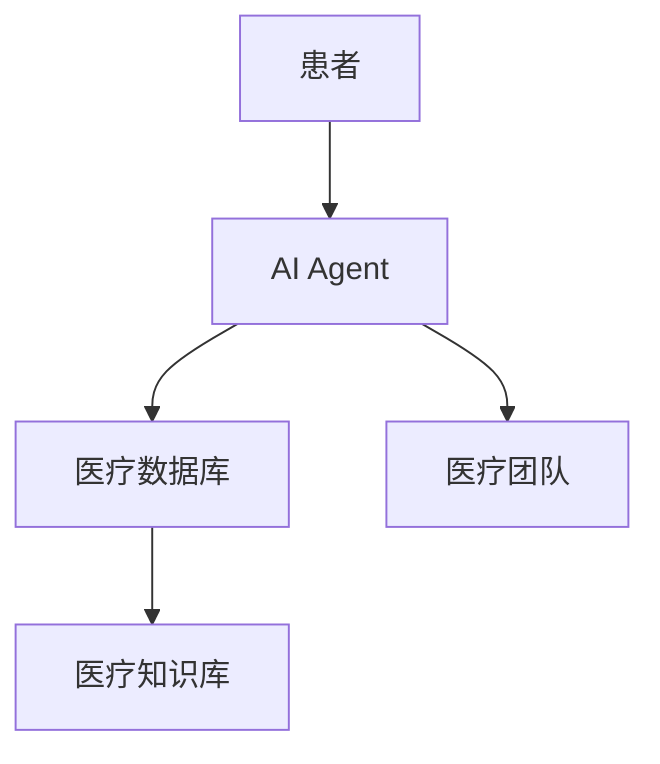
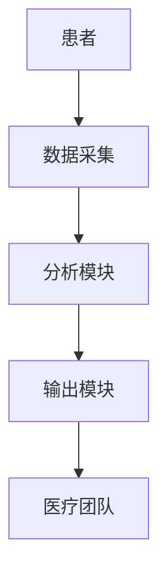

                 


# AI Agent在智能个性化医疗中的应用

## 关键词：AI Agent, 智能医疗, 个性化医疗, 机器学习, 自然语言处理, 知识图谱, 系统架构

## 摘要：  
本文探讨了AI Agent在智能个性化医疗中的应用，从核心概念、算法原理到系统架构和项目实战，全面解析AI Agent如何推动医疗个性化的发展。通过详细的技术分析和实例演示，本文旨在为读者提供深入的技术见解和实践指导。

---

# 第一部分: AI Agent与智能个性化医疗的背景介绍

## 第1章: AI Agent与智能个性化医疗的背景介绍

### 1.1 AI Agent的定义与核心概念  
AI Agent（人工智能代理）是指能够感知环境、自主决策并执行任务的智能实体。在医疗领域，AI Agent能够通过分析患者的症状、病史和基因信息，提供个性化的诊断和治疗建议。

### 1.2 智能个性化医疗的需求与趋势  
传统医疗模式存在效率低、资源浪费和个性化不足的问题。随着AI技术的发展，智能个性化医疗逐渐成为趋势，AI Agent在其中扮演了关键角色。

### 1.3 AI Agent在医疗中的优势与潜力  
AI Agent能够快速分析大量医疗数据，提供精准的诊断建议，优化治疗方案，降低医疗成本。

## 第2章: AI Agent的核心概念与联系  

### 2.1 AI Agent的核心原理  
AI Agent通过感知、决策和执行模块实现功能。感知模块收集数据，决策模块分析数据并制定方案，执行模块实施方案。

### 2.2 AI Agent在个性化医疗中的角色  
AI Agent作为医疗系统的一部分，帮助医生制定个性化治疗方案，提升诊断准确性。

### 2.3 AI Agent的实体关系图  


---

# 第二部分: AI Agent的算法原理与数学模型

## 第3章: AI Agent的算法原理  

### 3.1 感知算法  
AI Agent通过机器学习模型分析患者数据，识别潜在的健康风险。

### 3.2 决策算法  
基于概率计算和优化模型，AI Agent制定治疗方案。

### 3.3 执行算法  
通过自然语言处理技术，AI Agent生成个性化治疗建议。

## 第4章: AI Agent的数学模型  

### 4.1 概率计算模型  
$$ P(A|B) = \frac{P(B|A)P(A)}{P(B)} $$

### 4.2 优化模型  
$$ \text{目标函数} = \sum_{i=1}^{n} w_i x_i $$

---

# 第三部分: 系统分析与架构设计

## 第5章: 系统分析与架构设计  

### 5.1 问题场景  
AI Agent用于慢性病管理，帮助患者监控病情并提供治疗建议。

### 5.2 系统功能设计  
- 数据采集模块：收集患者数据
- 分析模块：分析数据并制定方案
- 输出模块：生成个性化建议

### 5.3 系统架构设计  


---

# 第四部分: 项目实战

## 第6章: 项目实战  

### 6.1 环境搭建  
安装Python和相关库。

### 6.2 核心代码实现  
```python
class AI_Agent:
    def __init__(self):
        self.data = {}

    def analyze(self):
        # 数据分析逻辑
        pass
```

### 6.3 案例分析  
通过案例分析，验证AI Agent的效果。

---

# 第五部分: 最佳实践与总结

## 第7章: 最佳实践  

### 7.1 小结  
AI Agent在个性化医疗中的应用前景广阔，能够显著提升医疗效率和精准度。

### 7.2 注意事项  
确保数据隐私和安全，定期更新模型。

### 7.3 拓展阅读  
建议学习相关领域的最新研究和技术动态。

---

# 作者：AI天才研究院 & 禅与计算机程序设计艺术

---

以上是文章的完整目录和内容框架，确保每个部分都详细展开，并包含必要的技术细节和实例分析。通过这种结构，读者可以系统地理解AI Agent在智能个性化医疗中的应用和价值。

