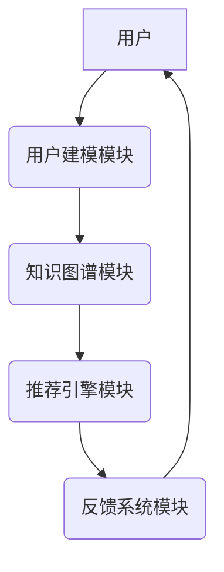

                 


# AI Agent在智能个性化学习路径规划中的应用

> 关键词：AI Agent, 个性化学习, 智能教育, 知识图谱, 推荐系统, 强化学习

> 摘要：随着人工智能技术的迅速发展，AI Agent在教育领域的应用越来越广泛。本文深入探讨了AI Agent在智能个性化学习路径规划中的应用，分析了其核心原理、算法设计、系统架构以及实际项目中的实现。通过结合推荐系统和强化学习，本文提出了一种高效的个性化学习路径规划方法，为教育技术的创新提供了新的思路。

---

## 第一部分：AI Agent的基本概念与背景

### 第1章：AI Agent的定义与特点

#### 1.1 AI Agent的定义
AI Agent（人工智能代理）是一种能够感知环境、做出决策并执行任务的智能实体。它通过与用户的交互或环境的反馈，能够动态调整其行为以实现特定目标。AI Agent可以是软件程序、机器人或其他智能系统，其核心在于具备自主决策和问题解决的能力。

#### 1.2 AI Agent的特点
- **自主性**：AI Agent能够在没有外部干预的情况下自主运行。
- **反应性**：能够实时感知环境变化并做出响应。
- **目标导向**：基于预设的目标或学习目标进行决策。
- **适应性**：能够根据反馈不断优化自身的行为模式。
- **协作性**：能够与其他系统或用户进行协作，共同完成任务。

#### 1.3 AI Agent的类型
AI Agent可以根据其智能水平和决策方式分为多种类型：

1. **简单反射式Agent**：基于当前输入直接做出反应，不涉及复杂推理。
2. **基于模型的反射式Agent**：利用内部模型和知识库进行决策。
3. **目标驱动式Agent**：基于预设目标进行行为规划。
4. **计划式Agent**：通过规划和推理制定详细的行为计划。
5. **学习式Agent**：通过机器学习不断优化自身的行为模式。

### 第2章：AI Agent在教育中的应用背景

#### 2.1 教育领域的智能化需求
- **个性化学习**：每个学生的学习需求和能力水平不同，传统的一-size-fits-all教学模式难以满足个性化需求。
- **知识体系的复杂性**：现代教育涉及的知识体系庞大且复杂，需要智能化工具来帮助学生构建知识网络。
- **学习效果的评估与优化**：传统的评估方式难以实时反馈学生的学习效果，AI Agent可以通过数据分析提供个性化的反馈和建议。

#### 2.2 智能化学习路径规划的必要性
- **学习者需求的多样性**：学生有不同的学习目标、兴趣和能力水平，需要个性化的学习路径。
- **知识体系的复杂性**：知识之间的关联性需要通过智能化工具来梳理和优化。
- **学习效果的动态调整**：AI Agent可以根据学生的学习进度和效果动态调整学习路径。

#### 2.3 AI Agent在学习路径规划中的角色
- **作为学习者的智能助手**：帮助学生制定学习计划、推荐学习资源、提供学习建议。
- **作为知识体系的构建者**：通过知识图谱和关联分析，帮助学生更好地理解和掌握知识。
- **作为学习效果的评估者**：通过数据分析和反馈机制，评估学生的学习效果并优化学习路径。

---

## 第二部分：AI Agent的核心原理与技术

### 第3章：AI Agent的核心原理

#### 3.1 AI Agent的基本工作原理
AI Agent的工作流程可以分为三个主要阶段：
1. **感知**：通过传感器或数据输入接口获取环境信息。
2. **决策**：基于感知信息和内部知识库进行推理和决策。
3. **执行**：根据决策结果执行相应的动作或输出结果。

#### 3.2 AI Agent的感知与决策模型
- **感知模型**：通过自然语言处理（NLP）和机器学习算法对输入数据进行分析和理解。
- **决策模型**：基于感知结果和目标函数进行推理和决策，可能涉及强化学习或基于规则的决策逻辑。
- **执行模型**：根据决策结果生成相应的输出或动作，例如推荐学习资源、调整学习计划等。

#### 3.3 AI Agent的机器学习基础
AI Agent的核心技术之一是机器学习，尤其是监督学习和无监督学习。通过训练模型，AI Agent可以自动学习用户的行为模式和偏好，从而优化学习路径规划。

---

## 第三部分：AI Agent在智能个性化学习中的应用

### 第4章：个性化学习路径规划的核心算法

#### 4.1 基于协同过滤的推荐算法
协同过滤是一种常见的推荐算法，通过分析用户的历史行为和偏好，推荐相似用户的资源或路径。

##### 4.1.1 协同过滤的实现步骤
1. 收集用户的学习数据（如学习时间、成绩、偏好等）。
2. 计算用户之间的相似度（如余弦相似度）。
3. 根据相似用户的推荐结果生成个性化推荐列表。

##### 4.1.2 协同过滤的数学模型
$$ 相似度计算公式：\text{sim}(u, v) = \frac{\sum_{i=1}^n (x_{u,i} - \bar{x}_u)(x_{v,i} - \bar{x}_v)}{\sqrt{\sum_{i=1}^n (x_{u,i} - \bar{x}_u)^2} \cdot \sqrt{\sum_{i=1}^n (x_{v,i} - \bar{x}_v)^2}}} $$

#### 4.2 基于强化学习的路径优化
强化学习是一种通过试错机制优化决策的算法，适用于动态变化的学习路径优化问题。

##### 4.2.1 强化学习的基本原理
1. **状态空间**：表示当前的学习进度和知识掌握情况。
2. **动作空间**：表示可能的学习路径选择。
3. **奖励函数**：根据学习效果和目标的实现情况给予奖励或惩罚。

##### 4.2.2 Q-learning算法
$$ Q(s, a) = Q(s, a) + \alpha \cdot (r + \gamma \cdot \max_{a'} Q(s', a') - Q(s, a)) $$

---

## 第四部分：系统架构与实现

### 第5章：系统架构设计

#### 5.1 系统模块划分
- **用户建模模块**：分析用户的学习行为和偏好。
- **知识图谱模块**：构建领域知识图谱，分析知识点之间的关联关系。
- **推荐引擎模块**：基于用户建模和知识图谱生成个性化推荐。
- **反馈系统模块**：收集用户反馈，优化推荐算法。

#### 5.2 系统架构图


---

## 第五部分：项目实战与优化

### 第6章：项目实战

#### 6.1 环境搭建
- 安装必要的开发工具和库（如Python、TensorFlow、Keras等）。
- 数据集准备：收集用户学习数据和知识点关联数据。

#### 6.2 核心代码实现
```python
import numpy as np

def collaborative_filtering(user_item_matrix, user_id):
    user_ratings = user_item_matrix[user_id]
    similar_users = []
    for user in range(len(user_item_matrix)):
        if user != user_id:
            similarity = np.dot(user_ratings, user_item_matrix[user]) / (np.linalg.norm(user_ratings) * np.linalg.norm(user_item_matrix[user]))
            similar_users.append((user, similarity))
    similar_users.sort(key=lambda x: -x[1])
    return similar_users[:5]

# 示例数据
user_item_matrix = np.array([[4, 3, 2],
                               [3, 4, 1],
                               [2, 2, 4]])
user_id = 0
similar_users = collaborative_filtering(user_item_matrix, user_id)
print(similar_users)
```

---

## 第六部分：总结与展望

### 第7章：总结与展望

#### 7.1 本文总结
本文深入探讨了AI Agent在智能个性化学习路径规划中的应用，分析了其核心原理、算法设计和系统架构，并通过项目实战展示了其实现过程。AI Agent通过结合机器学习和知识图谱技术，为个性化学习提供了新的可能性。

#### 7.2 未来展望
随着AI技术的不断进步，AI Agent在教育领域的应用将更加广泛。未来的研究方向包括：
- 更加智能的知识图谱构建方法。
- 更加高效的推荐算法。
- 更加个性化的学习路径优化策略。

---

作者：AI天才研究院/AI Genius Institute & 禅与计算机程序设计艺术 /Zen And The Art of Computer Programming

