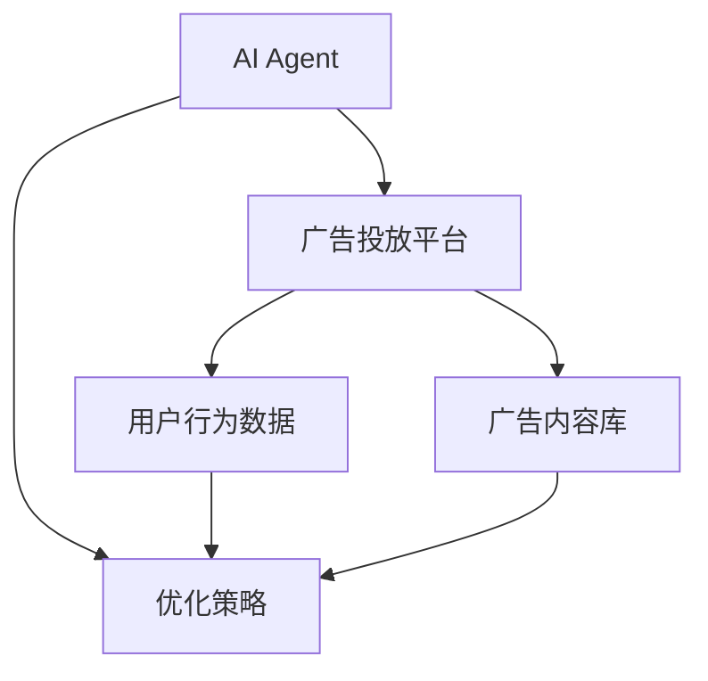
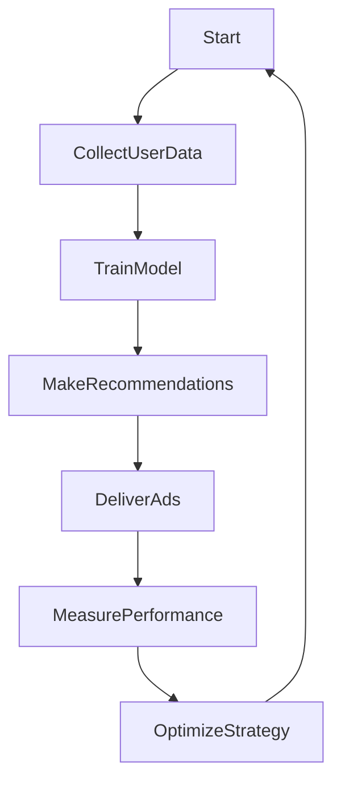
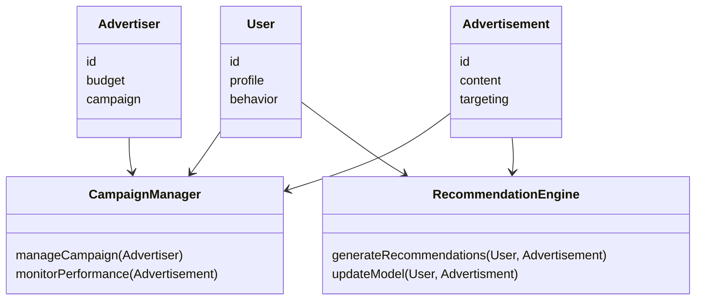
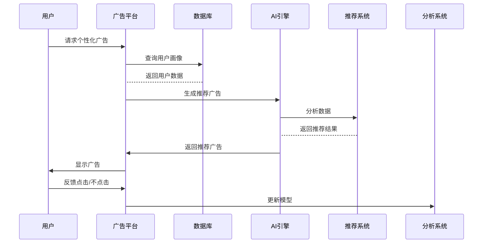

                 


# AI Agent在智能个性化广告投放中的应用

## 关键词：AI Agent, 个性化广告, 智能投放, 机器学习, 数据分析, 广告推荐系统

## 摘要：  
本文系统地探讨了AI Agent在智能个性化广告投放中的应用。首先介绍了AI Agent的基本概念及其在广告投放中的重要性，然后深入分析了个性化广告的核心要素和AI Agent的关联性，接着通过算法原理、系统架构、项目实战等多维度详细阐述了AI Agent在广告投放中的具体应用。最后总结了最佳实践和未来发展方向。

---

### 目录

---

### 第1章: AI Agent与智能广告投放的背景

#### 1.1 AI Agent的基本概念  
- 1.1.1 AI Agent的定义  
- 1.1.2 AI Agent的核心特征  
- 1.1.3 AI Agent与传统广告投放的区别  

#### 1.2 智能个性化广告投放的背景  
- 1.2.1 广告投放的历史演变  
- 1.2.2 个性化广告的需求驱动  
- 1.2.3 AI技术在广告投放中的作用  

#### 1.3 本章小结  

---

### 第2章: AI Agent与个性化广告的核心概念  

#### 2.1 AI Agent在广告投放中的核心原理  
- 2.1.1 数据驱动的广告推荐  
- 2.1.2 用户行为分析与预测  
- 2.1.3 动态优化的广告投放策略  

#### 2.2 个性化广告的核心要素  
- 2.2.1 用户画像与需求分析  
- 2.2.2 广告内容的精准匹配  
- 2.2.3 广告效果的实时反馈  

#### 2.3 AI Agent与个性化广告的关联性  
- 2.3.1 AI Agent在广告投放中的角色  
- 2.3.2 个性化广告对AI Agent的依赖性  
- 2.3.3 两者结合的协同效应  

---

### 第3章: 核心概念的属性特征对比与实体关系图  

#### 3.1 AI Agent与个性化广告的属性特征对比  
| 特性 | AI Agent | 个性化广告 |  
|------|-----------|--------------|  
| 数据源 | 用户行为、上下文 | 用户画像、历史点击 |  
| 目标 | 提供决策支持 | 提高点击率和转化率 |  
| 技术基础 | 机器学习、NLP | 推荐系统、实时计算 |  

#### 3.2 实体关系图（Mermaid）  


---

### 第4章: 算法原理讲解  

#### 4.1 协同过滤算法的流程图（Mermaid）  


#### 4.2 协同过滤算法的Python代码示例  
```python
import numpy as np
from sklearn.metrics.pairwise import cosine_similarity

# 示例数据：用户-物品评分矩阵
users = ['user1', 'user2', 'user3']
items = ['item1', 'item2', 'item3']
ratings = {
    'user1': {'item1': 5, 'item2': 4, 'item3': 3},
    'user2': {'item1': 3, 'item2': 5, 'item3': 4},
    'user3': {'item1': 4, 'item2': 3, 'item3': 5}
}

# 转换为矩阵形式
rating_matrix = np.zeros((len(users), len(items)))
for i, user in enumerate(users):
    for j, item in enumerate(items):
        rating_matrix[i][j] = ratings[user][item]

# 计算余弦相似度
similarity_matrix = cosine_similarity(rating_matrix)

# 推荐算法实现
def recommend(user_idx, similarity_matrix, rating_matrix, top_n=3):
    # 找到用户相似度最高的top_n用户
    user_similarities = similarity_matrix[user_idx]
    similar_users = [i for i in range(len(user_similarities))]
    similar_users.remove(user_idx)
    similar_users.sort(key=lambda x: user_similarities[x], reverse=True)
    similar_users = similar_users[:top_n]

    # 统计每个物品的推荐次数
    recommendations = {}
    for user in similar_users:
        for item_idx in range(len(items)):
            if rating_matrix[user][item_idx] != 0:
                if item_idx not in recommendations:
                    recommendations[item_idx] = 0
                recommendations[item_idx] += rating_matrix[user][item_idx]
    
    # 返回推荐的物品
    return [(item, rating) for item, rating in sorted(recommendations.items(), key=lambda x: x[1], reverse=True)]

# 示例推荐
user_idx = 0
print(recommend(user_idx, similarity_matrix, rating_matrix))
```

#### 4.3 协同过滤算法的数学模型  
协同过滤的数学模型可以表示为：  
$$ sim(u, v) = \frac{\sum_{i=1}^{n} (r_{u,i} - \bar{r}_u)(r_{v,i} - \bar{r}_v)}{\sqrt{\sum_{i=1}^{n} (r_{u,i} - \bar{r}_u)^2} \cdot \sqrt{\sum_{i=1}^{n} (r_{v,i} - \bar{r}_v)^2}}} $$  
其中，$sim(u, v)$ 是用户 $u$ 和用户 $v$ 的相似度，$r_{u,i}$ 是用户 $u$ 对物品 $i$ 的评分，$\bar{r}_u$ 是用户 $u$ 的平均评分。

---

### 第5章: 系统分析与架构设计方案  

#### 5.1 广告投放场景介绍  
- 广告投放的典型场景  
- 系统的目标与需求  

#### 5.2 系统功能设计  
##### 5.2.1 领域模型（Mermaid 类图）  


#### 5.3 系统架构设计  
##### 5.3.1 系统架构图（Mermaid 架构图）  


#### 5.4 系统接口设计  
##### 5.4.1 接口描述  
- RESTful API 示例：`GET /api/users/{id}/recommendations`  

#### 5.5 系统交互流程（Mermaid 序列图）  


---

### 第6章: 项目实战  

#### 6.1 环境安装  
- 安装Python、Jupyter、Pandas、Scikit-learn  

#### 6.2 系统核心实现  
##### 6.2.1 用户画像构建  
- 数据清洗与特征提取  
- 使用机器学习模型进行用户分群  

##### 6.2.2 广告推荐系统实现  
- 推荐算法的实现与优化  
- 模型部署与测试  

#### 6.3 实际案例分析  
##### 6.3.1 案例背景  
- 某电商平台的广告投放优化  

##### 6.3.2 数据分析与处理  
```python
import pandas as pd
from sklearn.metrics import accuracy_score

# 示例数据加载
data = pd.read_csv('advertising.csv')
```

##### 6.3.3 算法实现与效果分析  
- 算法效果对比：点击率、转化率、收益  

#### 6.4 本章小结  

---

### 第7章: 最佳实践与总结  

#### 7.1 小结  
- AI Agent在广告投放中的核心作用  
- 技术实现的关键点  

#### 7.2 注意事项  
- 数据隐私与安全问题  
- 模型的实时更新与优化  

#### 7.3 拓展阅读  
- 推荐系统前沿技术  
- AI在广告投放中的未来趋势  

---

### 作者：AI天才研究院/AI Genius Institute & 禅与计算机程序设计艺术 /Zen And The Art of Computer Programming

