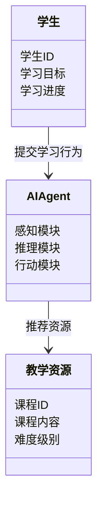
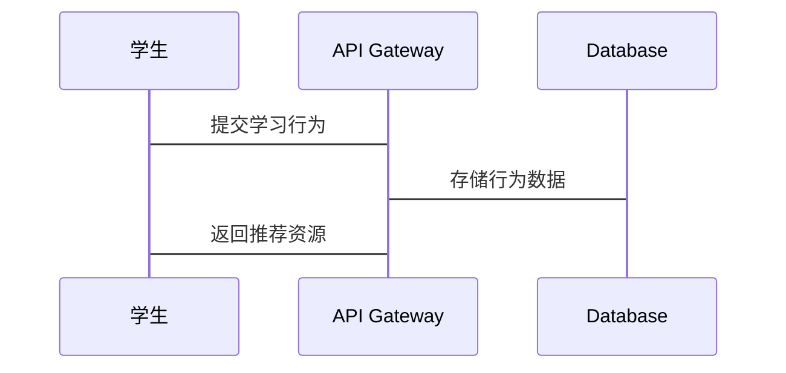

                 

<think>
好的，我将按照您的要求来撰写这篇文章。首先，我会先列出文章的标题和关键词，然后撰写摘要。接下来，我会根据目录大纲逐步撰写每一章的内容，确保每章都有详细的分析和具体的案例。

**文章标题：AI Agent在智能个性化教育中的应用**

**关键词：AI Agent, 智能教育, 个性化学习, 机器学习, 教育科技**

**摘要：**
AI Agent在教育领域的应用正逐渐改变传统的教学方式。通过分析学生的学习行为和需求，AI Agent能够为每个学生量身定制个性化学习计划。本文从AI Agent的基本概念出发，深入探讨其在个性化教育中的核心原理与应用场景。结合具体案例，分析AI Agent的推荐算法与自适应学习系统，最后总结其在教育中的最佳实践与未来发展方向。

---

# AI Agent在智能个性化教育中的应用

> **关键词：** AI Agent, 智能教育, 个性化学习, 机器学习, 教育科技

> **摘要：**  
> AI Agent在教育领域的应用正逐渐改变传统的教学方式。通过分析学生的学习行为和需求，AI Agent能够为每个学生量身定制个性化学习计划。本文从AI Agent的基本概念出发，深入探讨其在个性化教育中的核心原理与应用场景。结合具体案例，分析AI Agent的推荐算法与自适应学习系统，最后总结其在教育中的最佳实践与未来发展方向。

---

# 第一部分: AI Agent与智能个性化教育的背景与概念

## 第1章: AI Agent的基本概念与教育应用

### 1.1 AI Agent的定义与特点

#### 1.1.1 AI Agent的基本定义
AI Agent（人工智能代理）是一种能够感知环境并采取行动以实现目标的智能实体。它可以是一个软件程序、一个机器人，甚至是嵌入在教育平台中的算法模块。AI Agent的核心目标是通过自动化的方式解决问题、优化决策并提供个性化的服务。

#### 1.1.2 AI Agent的核心特点
- **自主性**：AI Agent能够自主决策，无需人工干预。
- **反应性**：能够实时感知环境变化并做出反应。
- **目标导向**：所有的行为都围绕着特定的目标展开。
- **学习能力**：通过数据和经验不断优化自身的决策能力。

#### 1.1.3 AI Agent与传统教育技术的区别
传统的教育技术主要依赖于固定的课程安排和标准化的教学内容，而AI Agent能够根据学生的需求和行为动态调整教学策略，提供更加灵活和个性化的服务。

---

### 1.2 智能个性化教育的背景与需求

#### 1.2.1 个性化教育的定义与目标
个性化教育是一种以学生为中心的教育模式，旨在根据每个学生的兴趣、能力和学习进度制定专属的学习计划。其目标是最大限度地激发学生的潜能，提升学习效果。

#### 1.2.2 当前教育中的痛点与挑战
- **标准化教学**：传统课堂难以满足每个学生的个性化需求。
- **学习效率低**：学生在学习过程中常常遇到瓶颈，缺乏针对性的指导。
- **资源浪费**：教师和教育资源被低效利用。

#### 1.2.3 AI技术在教育中的应用潜力
AI Agent能够通过数据分析和机器学习，帮助教师更好地了解学生的学习情况，优化教学策略，从而实现个性化教育。

---

### 1.3 AI Agent在教育中的应用场景

#### 1.3.1 个性化学习路径规划
AI Agent可以根据学生的学习历史、兴趣爱好和能力水平，推荐适合的学习材料和课程安排。

#### 1.3.2 智能教学辅助工具
AI Agent可以作为教师的辅助工具，帮助教师批改作业、分析学生表现并提供改进建议。

#### 1.3.3 学生行为分析与反馈
通过分析学生的学习行为数据，AI Agent可以实时反馈学习效果，帮助学生调整学习策略。

---

### 1.4 本章小结
本章介绍了AI Agent的基本概念和特点，并探讨了其在个性化教育中的应用场景。AI Agent通过自主学习和动态调整，为个性化教育提供了新的可能性。

---

# 第二部分: AI Agent的核心原理与技术实现

## 第2章: AI Agent的核心原理

### 2.1 AI Agent的基本原理

#### 2.1.1 问题背景与核心概念
AI Agent的核心目标是通过感知环境和采取行动来优化目标的实现。在教育场景中，环境是学生的学习行为和教学资源，目标是提升学习效果。

#### 2.1.2 AI Agent的决策机制
AI Agent的决策机制包括感知、推理和行动三个步骤：
1. **感知**：通过传感器或数据输入获取环境信息。
2. **推理**：基于感知信息和知识库进行逻辑推理。
3. **行动**：根据推理结果采取相应的行动。

#### 2.1.3 知识表示与推理方法
知识表示是AI Agent进行推理的基础。常用的表示方法包括：
- **规则表示法**：通过逻辑规则描述知识。
- **语义网络法**：通过节点和边表示概念及其关系。
- **概率图模型**：通过概率分布描述不确定性。

---

### 2.2 AI Agent的感知与行动能力

#### 2.2.1 感知层的实现原理
感知层主要通过数据采集和特征提取来获取环境信息。在教育场景中，感知层可以通过以下方式获取数据：
- **学生行为数据**：包括点击、输入、提交等操作。
- **学习成果数据**：包括考试成绩、作业完成情况等。
- **外部数据**：包括学习资源、课程安排等。

#### 2.2.2 行动层的实现原理
行动层是AI Agent根据推理结果采取具体行动的部分。在教育场景中，行动层可以通过以下方式实现：
- **推荐学习资源**：根据学生的需求推荐课程、视频或练习题。
- **调整教学策略**：动态调整教学计划和内容。
- **提供实时反馈**：根据学生的学习情况提供即时反馈。

#### 2.2.3 感知与行动的协同工作
感知与行动是AI Agent的核心组成部分，它们协同工作以实现目标。感知层为行动层提供数据支持，而行动层为感知层提供反馈，从而形成一个闭环系统。

---

### 2.3 AI Agent的算法与模型

#### 2.3.1 基于规则的AI Agent
基于规则的AI Agent通过预定义的逻辑规则进行决策。例如，当学生连续三次错误回答同一问题时，AI Agent可以推荐相关的知识点讲解视频。

#### 2.3.2 基于机器学习的AI Agent
基于机器学习的AI Agent能够通过历史数据自动学习规律并进行预测。常用的算法包括：
- **决策树**：通过特征选择构建决策树模型。
- **随机森林**：通过集成学习提升模型的准确率。
- **支持向量机**：通过高维空间的分割进行分类。

#### 2.3.3 基于深度学习的AI Agent
基于深度学习的AI Agent能够处理复杂的数据模式。常用的模型包括：
- **卷积神经网络（CNN）**：适用于图像识别任务。
- **循环神经网络（RNN）**：适用于序列数据处理。
- **长短期记忆网络（LSTM）**：适用于时间序列数据。

---

### 2.4 本章小结
本章详细讲解了AI Agent的核心原理，包括决策机制、感知与行动能力以及常用的算法与模型。AI Agent通过感知环境、推理和行动，能够实现智能化的教育服务。

---

## 第3章: AI Agent在个性化教育中的应用

### 3.1 个性化教育的需求分析

#### 3.1.1 学生特征分析
个性化教育需要考虑学生的学习能力、兴趣爱好和学习目标。例如，一个数学基础薄弱的学生可能需要更多的练习题和知识点讲解。

#### 3.1.2 教学目标分析
教学目标需要根据学生的实际情况动态调整。例如，对于一个目标是考上重点大学的学生，AI Agent需要制定更具挑战性的学习计划。

#### 3.1.3 教学资源分析
AI Agent需要分析可用的教学资源，包括课程内容、教学视频、练习题等，并根据学生的需求进行推荐。

---

### 3.2 个性化教育系统的功能设计

#### 3.2.1 学生画像构建
学生画像是通过收集和分析学生的行为数据和学习成果，构建一个全面的学生特征模型。例如，AI Agent可以通过分析学生的作业完成情况，识别出学生的薄弱知识点。

#### 3.2.2 学习路径规划
AI Agent根据学生的学习目标和能力水平，制定个性化的学习计划。例如，为一个英语基础薄弱的学生推荐语法讲解和听力练习。

#### 3.2.3 智能推荐系统
智能推荐系统通过机器学习算法，实时推荐适合的学习资源。例如，当学生完成一道数学题时，AI Agent可以推荐类似的题目进行练习。

---

### 3.3 个性化教育系统的架构设计

#### 3.3.1 系统模块划分
个性化教育系统可以划分为以下几个模块：
- **数据采集模块**：负责采集学生的行为数据和学习成果。
- **数据处理模块**：对数据进行清洗和预处理。
- **模型训练模块**：通过机器学习算法训练推荐模型。
- **推荐服务模块**：根据模型结果推荐学习资源。

#### 3.3.2 数据流设计
数据流设计包括数据的输入、处理和输出。例如，学生的行为数据通过数据采集模块输入，经过数据处理模块清洗后，进入模型训练模块进行训练，最终由推荐服务模块输出推荐结果。

#### 3.3.3 系统交互流程
系统交互流程包括学生与系统的互动，例如学生完成一道题目，系统根据完成情况推荐下一个练习题。

---

### 3.4 本章小结
本章探讨了AI Agent在个性化教育中的应用，包括需求分析和系统设计。AI Agent通过构建学生画像、制定学习路径和智能推荐，为个性化教育提供了有效的解决方案。

---

## 第4章: AI Agent的推荐算法

### 4.1 推荐算法的分类与对比

#### 4.1.1 基于协同过滤的推荐算法
协同过滤是一种常用的推荐算法，分为基于用户的协同过滤和基于物品的协同过滤。例如，基于用户的协同过滤会根据用户的相似性推荐相关内容。

#### 4.1.2 基于内容的推荐算法
基于内容的推荐算法通过分析内容的特征进行推荐。例如，根据文章的主题推荐相关文章。

#### 4.1.3 基于深度学习的推荐算法
基于深度学习的推荐算法通过神经网络学习数据的特征。例如，使用神经网络进行图像识别和推荐。

---

### 4.2 基于机器学习的推荐模型

#### 4.2.1 矩阵分解模型
矩阵分解模型是一种常用的推荐算法，通过将用户-物品的交互矩阵分解为用户因子和物品因子，从而推荐相似的物品。

#### 4.2.2 基于聚类的推荐模型
聚类模型通过将用户或物品进行聚类，推荐相似的聚类中的内容。例如，将学生的学习行为进行聚类，推荐适合的课程。

#### 4.2.3 基于神经网络的推荐模型
神经网络推荐模型通过深度学习技术，提取数据的高层次特征进行推荐。例如，使用LSTM模型进行序列推荐。

---

### 4.3 本章小结
本章详细讲解了AI Agent的推荐算法，包括协同过滤、内容推荐和深度学习推荐。推荐算法是实现个性化教育的核心技术之一。

---

## 第5章: AI Agent的自适应学习系统

### 5.1 自适应学习系统的基本原理

#### 5.1.1 自适应学习的定义
自适应学习是一种根据学生的学习情况动态调整教学策略的教育模式。例如，当学生在学习过程中遇到困难时，系统会自动调整教学内容的难度。

#### 5.1.2 自适应学习的核心要素
自适应学习的核心要素包括学生特征、学习目标和教学资源。例如，AI Agent需要根据学生的特征动态调整教学内容。

---

### 5.2 自适应学习系统的实现

#### 5.2.1 学习路径动态调整
学习路径动态调整是根据学生的学习情况实时调整学习计划。例如，当学生在某一知识点上表现不佳时，系统会增加该知识点的练习题。

#### 5.2.2 学习资源动态推荐
学习资源动态推荐是根据学生的学习进度和兴趣推荐相关内容。例如，当学生完成一章的课程后，系统会推荐相关的练习题和测试题。

#### 5.2.3 学习效果实时反馈
学习效果实时反馈是通过数据分析和机器学习算法，实时反馈学生的学习效果。例如，系统可以实时显示学生的正确率和进步情况。

---

### 5.3 本章小结
本章详细讲解了AI Agent的自适应学习系统，包括基本原理和实现方式。自适应学习系统是个性化教育的重要组成部分。

---

# 第三部分: AI Agent的系统分析与架构设计

## 第6章: AI Agent的系统分析与架构设计

### 6.1 问题场景介绍
个性化教育系统需要解决的主要问题包括：
- 如何根据学生的学习情况动态调整教学计划。
- 如何实时推荐适合的学习资源。
- 如何高效分析学生的学习行为并提供反馈。

### 6.2 系统功能设计

#### 6.2.1 领域模型设计
领域模型是系统功能设计的核心，通过Mermaid类图可以清晰地展示系统的模块和交互。



#### 6.2.2 系统架构设计
系统架构设计需要考虑系统的可扩展性和可维护性。通过Mermaid架构图可以展示系统的各个模块及其交互。


#### 6.2.3 系统接口设计
系统接口设计需要定义各个模块之间的交互接口。例如，学生行为采集模块需要与API网关进行通信，将学生的行为数据传输到数据库。

#### 6.2.4 系统交互流程
系统交互流程通过Mermaid序列图展示系统的交互过程。



---

### 6.3 本章小结
本章详细分析了AI Agent在个性化教育中的系统架构设计，包括问题场景、功能设计和系统交互流程。

---

## 第7章: AI Agent的项目实战

### 7.1 项目背景与目标
本项目的目标是开发一个基于AI Agent的个性化教育系统，实现学生学习行为分析、学习资源推荐和学习效果反馈。

### 7.2 项目环境安装
项目环境需要安装以下工具：
- Python 3.8+
- pip
- TensorFlow
- scikit-learn
- Mermaid
- Jupyter Notebook

### 7.3 核心代码实现

#### 7.3.1 学生行为数据采集
```python
import pandas as pd

# 读取学生行为数据
behavior_data = pd.read_csv('student_behavior.csv')
print(behavior_data.head())
```

#### 7.3.2 学生画像构建
```python
from sklearn.cluster import KMeans

# 数据预处理
behavior_data_processed = behavior_data.dropna()
behavior_data_processed = behavior_data_processed[behavior_data_processed.columns[~behavior_data_processed.columns.str.contains('Unnamed')]]

# 聚类分析
kmeans = KMeans(n_clusters=3, random_state=42)
kmeans.fit(behavior_data_processed)
clusters = kmeans.predict(behavior_data_processed)

# 可视化结果
import matplotlib.pyplot as plt

plt.scatter(behavior_data_processed.iloc[:, 0], behavior_data_processed.iloc[:, 1], c=clusters, cmap='viridis')
plt.xlabel('特征1')
plt.ylabel('特征2')
plt.title('学生画像聚类结果')
plt.show()
```

#### 7.3.3 智能推荐系统实现
```python
from sklearn.neighbors import NearestNeighbors

# 训练邻居模型
nbrs = NearestNeighbors(n_neighbors=5, algorithm='ball_tree').fit(behavior_data_processed)

# 推荐相似的学生
distances, indices = nbrs.kneighbors(behavior_data_processed.iloc[0].values.reshape(1, -1))
print(indices)
```

---

### 7.4 项目案例分析
通过实际案例分析，展示AI Agent在个性化教育中的应用效果。例如，通过学生行为数据的分析，AI Agent能够准确识别学生的薄弱知识点，并推荐相关的学习资源。

---

### 7.5 项目小结
本章通过一个实际的项目案例，展示了AI Agent在个性化教育中的实现过程。从环境安装到核心代码实现，再到案例分析，读者可以逐步掌握AI Agent的应用技巧。

---

# 第四部分: 总结与展望

## 第8章: 总结与展望

### 8.1 最佳实践 Tips
- 数据质量是AI Agent的核心，确保数据的准确性和完整性。
- 在实际应用中，建议采用分布式架构以提高系统的扩展性和性能。
- 定期更新模型参数，保持系统的适应性。

### 8.2 小结
本文从AI Agent的基本概念出发，深入探讨了其在个性化教育中的应用场景、算法实现和系统设计。AI Agent通过感知环境、推理和行动，为个性化教育提供了智能化的解决方案。

### 8.3 注意事项
- 数据隐私保护是个性化教育系统设计中的重要问题。
- 在实际应用中，需要考虑系统的可解释性和透明度。

### 8.4 拓展阅读
- 《机器学习实战》
- 《深度学习》
- 《教育技术研究》

---

# 作者：AI天才研究院/AI Genius Institute & 禅与计算机程序设计艺术/Zen And The Art of Computer Programming

