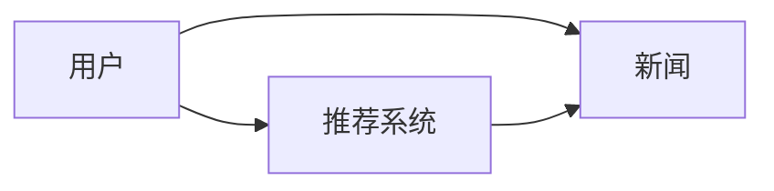
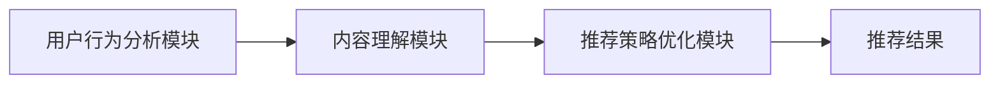

                 


# AI Agent在智能个性化新闻推荐中的应用

## 关键词：AI Agent, 智能个性化推荐, 新闻推荐系统, 机器学习, 多智能体系统

## 摘要：本文深入探讨了AI Agent在智能个性化新闻推荐中的应用，从问题背景、核心概念、算法原理、系统架构到项目实战，全面解析了如何利用AI Agent提升新闻推荐的智能化水平。通过详细的技术分析和实例解读，本文为读者提供了从理论到实践的完整指南。

---

# 第一部分: AI Agent与智能个性化新闻推荐的背景介绍

# 第1章: AI Agent与智能个性化新闻推荐概述

## 1.1 问题背景

### 1.1.1 传统新闻推荐的局限性

传统新闻推荐系统主要依赖于基于协同过滤的推荐算法，这种方式虽然能在一定程度上满足用户的需求，但存在以下问题：

1. **数据稀疏性**：用户的兴趣分布不均匀，导致推荐结果不够准确。
2. **实时性不足**：传统推荐系统难以实时更新，无法及时反映用户兴趣的变化。
3. **内容理解不足**：基于协同过滤的方法难以理解新闻内容的语义信息，导致推荐结果可能偏离用户的真实需求。

### 1.1.2 智能化推荐的需求与挑战

随着互联网的快速发展，用户对新闻的需求日益多样化，传统的推荐系统已经难以满足用户的个性化需求。智能化推荐的需求主要体现在以下几个方面：

1. **个性化推荐**：根据用户的兴趣、行为和历史数据，提供高度个性化的新闻推荐。
2. **实时性**：能够实时更新推荐结果，适应用户兴趣的变化。
3. **内容理解**：能够理解新闻内容的语义信息，提升推荐的准确性。

实现智能化推荐的挑战包括：

1. **数据处理的复杂性**：新闻数据量大，且包含文本、标签等多种信息，处理起来较为复杂。
2. **算法的实时性**：需要在实时条件下处理大量的数据，这对算法的效率提出了更高的要求。
3. **模型的可解释性**：推荐结果需要有一定的可解释性，以便用户理解和信任推荐系统。

### 1.1.3 AI Agent在推荐系统中的作用

AI Agent（人工智能代理）是一种能够感知环境、自主决策并采取行动的智能体。在新闻推荐系统中，AI Agent可以用来实现以下功能：

1. **用户行为分析**：通过分析用户的点击、浏览、收藏等行为，理解用户的兴趣偏好。
2. **内容理解**：利用自然语言处理技术，理解新闻内容的语义信息。
3. **实时推荐**：根据用户的实时行为和内容的变化，动态调整推荐结果。

## 1.2 问题描述

### 1.2.1 用户需求的多样性

用户的需求具有多样性和动态变化的特点。同一个用户在不同的时间和场景下，可能对不同类型的新新闻感兴趣。例如，用户可能在早晨关注新闻，而在晚上关注娱乐新闻。

### 1.2.2 新闻内容的复杂性

新闻内容通常包含大量的文本信息，且不同类型的新新闻具有不同的特征。例如，财经新闻可能包含大量的数据和专业术语，而娱乐新闻则更多关注明星动态和八卦信息。

### 1.2.3 现有推荐系统的不足

现有推荐系统主要依赖于协同过滤和基于内容的推荐方法，存在以下不足：

1. **推荐结果的准确性不足**：传统推荐系统难以准确捕捉用户的兴趣变化。
2. **推荐结果的实时性不足**：难以在用户行为发生变化时快速调整推荐结果。
3. **推荐结果的可解释性不足**：用户难以理解推荐的依据，影响信任度。

## 1.3 问题解决

### 1.3.1 AI Agent的核心优势

AI Agent在推荐系统中的核心优势体现在以下几个方面：

1. **自主决策能力**：AI Agent能够根据环境信息自主决策，实时调整推荐策略。
2. **多模态数据处理**：能够同时处理文本、行为等多种类型的数据，提升推荐的准确性。
3. **动态适应性**：能够根据用户的实时行为和内容变化，动态调整推荐结果。

### 1.3.2 智能化推荐的实现路径

智能化推荐的实现路径主要包括以下几个步骤：

1. **用户行为分析**：通过分析用户的点击、浏览、收藏等行为，理解用户的兴趣偏好。
2. **内容理解**：利用自然语言处理技术，提取新闻内容的主题、关键词等信息。
3. **推荐策略优化**：基于用户行为和内容理解，优化推荐策略，提升推荐的准确性和实时性。

### 1.3.3 用户体验的提升策略

为了提升用户体验，需要从以下几个方面入手：

1. **个性化推荐**：根据用户的历史行为和偏好，提供高度个性化的推荐。
2. **实时反馈**：用户行为变化时，推荐结果能够实时更新。
3. **可解释性**：提供推荐的依据，增强用户的信任感。

## 1.4 边界与外延

### 1.4.1 AI Agent的应用范围

AI Agent在新闻推荐中的应用范围主要集中在以下几个方面：

1. **用户行为分析**：通过分析用户的点击、浏览、收藏等行为，理解用户的兴趣偏好。
2. **内容理解**：利用自然语言处理技术，提取新闻内容的主题、关键词等信息。
3. **推荐策略优化**：基于用户行为和内容理解，优化推荐策略，提升推荐的准确性和实时性。

### 1.4.2 智能推荐的边界条件

智能推荐的边界条件包括：

1. **数据质量**：推荐系统的性能依赖于数据的完整性和准确性。
2. **计算资源**：实时推荐需要大量的计算资源支持。
3. **用户隐私**：推荐系统需要保护用户的隐私数据，避免数据泄露。

### 1.4.3 相关领域的区别与联系

在智能推荐系统中，AI Agent与传统推荐系统的主要区别在于：

1. **自主决策能力**：AI Agent能够自主决策，而传统推荐系统依赖于预定义的规则。
2. **多模态数据处理**：AI Agent能够处理多种类型的数据，而传统推荐系统通常只处理单一类型的数据。
3. **动态适应性**：AI Agent能够动态调整推荐策略，而传统推荐系统难以实时更新。

## 1.5 概念结构与核心要素

### 1.5.1 AI Agent的构成要素

AI Agent的构成要素包括以下几个方面：

1. **感知模块**：用于感知环境信息，如用户的点击、浏览、收藏等行为。
2. **推理模块**：用于分析感知到的信息，理解用户的兴趣偏好。
3. **决策模块**：基于分析结果，制定推荐策略。
4. **执行模块**：将推荐策略转化为具体的推荐结果。

### 1.5.2 智能推荐的核心模块

智能推荐的核心模块包括以下几个方面：

1. **用户行为分析模块**：分析用户的点击、浏览、收藏等行为。
2. **内容理解模块**：利用自然语言处理技术，理解新闻内容的语义信息。
3. **推荐策略优化模块**：基于用户行为和内容理解，优化推荐策略。

### 1.5.3 系统整体架构

系统整体架构包括以下几个层次：

1. **数据采集层**：负责采集用户的点击、浏览、收藏等行为数据，以及新闻内容数据。
2. **数据处理层**：对采集到的数据进行清洗、预处理，提取有用的信息。
3. **推荐算法层**：基于处理后的数据，运行推荐算法，生成推荐结果。
4. **结果展示层**：将推荐结果展示给用户。

## 1.6 本章小结

本章主要介绍了AI Agent在智能个性化新闻推荐中的背景和作用，分析了传统推荐系统的局限性，提出了智能化推荐的实现路径和用户体验提升策略。同时，还探讨了AI Agent的应用范围、边界条件以及与传统推荐系统的区别与联系。这些内容为后续章节的深入分析奠定了基础。

---

# 第二部分: AI Agent与个性化推荐的核心概念与联系

# 第2章: AI Agent的基本原理

## 2.1 核心概念原理

### 2.1.1 AI Agent的定义与特征

AI Agent（人工智能代理）是一种能够感知环境、自主决策并采取行动的智能体。其主要特征包括：

1. **自主性**：能够在没有外部干预的情况下自主决策。
2. **反应性**：能够根据环境的变化实时调整行为。
3. **学习能力**：能够通过学习提升自身的推荐能力。

### 2.1.2 多智能体系统的基本原理

多智能体系统是指由多个智能体组成的协作系统，每个智能体都有自己的目标和任务。在新闻推荐系统中，多个智能体可以协作完成不同的任务，例如：

1. **用户行为分析智能体**：负责分析用户的点击、浏览、收藏等行为。
2. **内容理解智能体**：负责理解新闻内容的语义信息。
3. **推荐策略优化智能体**：负责优化推荐策略，提升推荐的准确性和实时性。

### 2.1.3 Agent的协作机制

在多智能体系统中，智能体之间的协作机制是实现高效推荐的关键。主要的协作机制包括：

1. **通信机制**：智能体之间通过通信交换信息。
2. **协调机制**：通过协调机制确保智能体之间的协作有序进行。
3. **决策机制**：基于协作信息制定决策。

### 2.1.4 Agent与传统算法的对比

与传统算法相比，AI Agent具有以下优势：

1. **自主决策能力**：能够自主决策，而传统算法依赖于预定义的规则。
2. **多模态数据处理**：能够处理多种类型的数据，而传统算法通常只处理单一类型的数据。
3. **动态适应性**：能够动态调整推荐策略，而传统算法难以实时更新。

### 2.1.5 智能化推荐的特征分析

智能化推荐的特征包括：

1. **个性化**：根据用户的兴趣偏好提供个性化推荐。
2. **实时性**：能够实时更新推荐结果。
3. **可解释性**：推荐结果具有一定的可解释性。

### 2.1.6 Agent协作的属性特征

AI Agent协作的属性特征包括：

1. **协作性**：智能体之间能够协作完成任务。
2. **智能性**：每个智能体都具有一定的智能性，能够自主决策。
3. **适应性**：能够根据环境的变化调整行为。

### 2.1.7 智能化推荐系统的核心要素

智能化推荐系统的核心要素包括：

1. **用户行为分析**：分析用户的点击、浏览、收藏等行为。
2. **内容理解**：利用自然语言处理技术，理解新闻内容的语义信息。
3. **推荐策略优化**：基于用户行为和内容理解，优化推荐策略。

### 2.1.8 概念结构与核心要素

概念结构与核心要素包括：

1. **用户行为**：用户的点击、浏览、收藏等行为。
2. **新闻内容**：新闻的标题、正文、标签等信息。
3. **推荐策略**：基于用户行为和内容理解制定的推荐策略。

## 2.2 概念属性特征对比

### 2.2.1 Agent与传统算法的对比

以下是AI Agent与传统算法在新闻推荐中的对比：

| 特性                | AI Agent                              | 传统算法                              |
|---------------------|--------------------------------------|--------------------------------------|
| 自主性              | 高                                   | 低                                   |
| 多模态数据处理      | 高                                   | 低                                   |
| 动态适应性          | 高                                   | 低                                   |
| 可解释性            | 中                                   | 高                                   |

### 2.2.2 智能化推荐的特征分析

智能化推荐的特征分析如下：

| 特性                | 描述                                   |
|---------------------|--------------------------------------|
| 个性化              | 根据用户的兴趣偏好提供个性化推荐     |
| 实时性              | 能够实时更新推荐结果                 |
| 可解释性            | 推荐结果具有一定的可解释性             |

### 2.2.3 Agent协作的属性特征

AI Agent协作的属性特征如下：

| 特性                | 描述                                   |
|---------------------|--------------------------------------|
| 协作性              | 智能体之间能够协作完成任务           |
| 智能性              | 每个智能体都具有一定的智能性           |
| 适应性              | 能够根据环境的变化调整行为           |

## 2.3 ER实体关系图

以下是新闻推荐系统中的ER实体关系图：



在该图中，用户（A）通过推荐系统（C）推荐新闻（B）。

---

# 第3章: 个性化推荐系统

## 3.1 核心概念原理

### 3.1.1 个性化推荐的核心概念

个性化推荐的核心概念包括：

1. **用户画像**：基于用户的点击、浏览、收藏等行为，构建用户画像。
2. **内容特征提取**：通过自然语言处理技术，提取新闻内容的特征。
3. **推荐算法**：基于用户画像和内容特征，运行推荐算法，生成推荐结果。

### 3.1.2 个性化推荐的实现路径

个性化推荐的实现路径包括以下几个步骤：

1. **用户行为分析**：分析用户的点击、浏览、收藏等行为，构建用户画像。
2. **内容特征提取**：利用自然语言处理技术，提取新闻内容的主题、关键词等特征。
3. **推荐算法选择**：根据用户画像和内容特征，选择合适的推荐算法，生成推荐结果。

### 3.1.3 个性化推荐的优势

个性化推荐的优势包括：

1. **提高推荐的准确性**：通过分析用户的兴趣偏好，提供更精准的推荐。
2. **提升用户体验**：用户能够获得更符合自己兴趣的推荐内容。
3. **增加用户粘性**：通过个性化推荐，增强用户对平台的粘性。

## 3.2 概念属性特征对比

### 3.2.1 个性化推荐与传统推荐的对比

以下是个性化推荐与传统推荐的对比：

| 特性                | 个性化推荐                            | 传统推荐                              |
|---------------------|--------------------------------------|--------------------------------------|
| 定制化              | 高                                   | 低                                   |
| 实时性              | 中                                   | 低                                   |
| 可解释性            | 中                                   | 高                                   |

### 3.2.2 个性化推荐的核心要素

个性化推荐的核心要素包括：

1. **用户画像**：基于用户行为构建的用户画像。
2. **内容特征**：新闻内容的主题、关键词等特征。
3. **推荐算法**：基于用户画像和内容特征的推荐算法。

## 3.3 概念结构与核心要素

概念结构与核心要素包括：

1. **用户行为**：用户的点击、浏览、收藏等行为。
2. **新闻内容**：新闻的标题、正文、标签等信息。
3. **推荐算法**：基于用户行为和内容特征的推荐算法。

## 3.4 智能化推荐的核心要素

智能化推荐的核心要素包括：

1. **用户行为分析**：分析用户的点击、浏览、收藏等行为。
2. **内容理解**：利用自然语言处理技术，理解新闻内容的语义信息。
3. **推荐策略优化**：基于用户行为和内容理解，优化推荐策略。

## 3.5 本章小结

本章主要介绍了个性化推荐系统的核心概念和实现路径，分析了个性化推荐的优势，并通过对比传统推荐系统，突出了个性化推荐的重要性和必要性。同时，还探讨了个性化推荐的核心要素和概念结构，为后续章节的深入分析奠定了基础。

---

# 第四部分: AI Agent在智能个性化新闻推荐中的应用

# 第4章: AI Agent与个性化推荐的结合

## 4.1 核心概念与实现路径

### 4.1.1 AI Agent在推荐系统中的核心作用

AI Agent在推荐系统中的核心作用包括：

1. **用户行为分析**：通过分析用户的点击、浏览、收藏等行为，理解用户的兴趣偏好。
2. **内容理解**：利用自然语言处理技术，理解新闻内容的语义信息。
3. **推荐策略优化**：基于用户行为和内容理解，优化推荐策略，提升推荐的准确性和实时性。

### 4.1.2 AI Agent与个性化推荐的结合路径

AI Agent与个性化推荐的结合路径包括以下几个步骤：

1. **用户行为分析**：通过AI Agent分析用户的点击、浏览、收藏等行为，构建用户画像。
2. **内容理解**：利用AI Agent理解新闻内容的语义信息，提取内容特征。
3. **推荐策略优化**：基于用户画像和内容特征，优化推荐策略，生成推荐结果。

## 4.2 实现原理与技术细节

### 4.2.1 AI Agent的实现原理

AI Agent的实现原理包括以下几个步骤：

1. **感知环境**：通过传感器或其他方式感知环境信息，例如用户的点击、浏览、收藏等行为。
2. **分析信息**：利用自然语言处理技术，分析感知到的信息，理解用户的兴趣偏好。
3. **制定决策**：基于分析结果，制定推荐策略。
4. **执行决策**：将推荐策略转化为具体的推荐结果。

### 4.2.2 个性化推荐的实现技术

个性化推荐的实现技术包括：

1. **协同过滤**：基于用户行为的协同过滤算法。
2. **基于内容的推荐**：基于新闻内容特征的推荐算法。
3. **深度学习推荐**：利用深度学习技术进行推荐。

### 4.2.3 AI Agent与个性化推荐的协同机制

AI Agent与个性化推荐的协同机制包括：

1. **信息共享**：智能体之间共享信息，例如用户的点击、浏览、收藏等行为。
2. **协作决策**：多个智能体协作制定推荐策略。
3. **动态调整**：根据环境的变化动态调整推荐策略。

## 4.3 技术实现与系统架构

### 4.3.1 系统架构设计

系统架构设计包括以下几个层次：

1. **数据采集层**：负责采集用户的点击、浏览、收藏等行为数据，以及新闻内容数据。
2. **数据处理层**：对采集到的数据进行清洗、预处理，提取有用的信息。
3. **推荐算法层**：基于处理后的数据，运行推荐算法，生成推荐结果。
4. **结果展示层**：将推荐结果展示给用户。

### 4.3.2 智能化推荐系统的核心模块

智能化推荐系统的核心模块包括：

1. **用户行为分析模块**：分析用户的点击、浏览、收藏等行为。
2. **内容理解模块**：利用自然语言处理技术，理解新闻内容的语义信息。
3. **推荐策略优化模块**：基于用户行为和内容理解，优化推荐策略。

### 4.3.3 系统架构图

以下是智能化推荐系统的架构图：



在该图中，用户行为分析模块（A）分析用户的点击、浏览、收藏等行为，内容理解模块（B）利用自然语言处理技术理解新闻内容的语义信息，推荐策略优化模块（C）基于用户行为和内容理解优化推荐策略，生成推荐结果（D）。

## 4.4 本章小结

本章主要介绍了AI Agent与个性化推荐的结合，分析了AI Agent在推荐系统中的核心作用，提出了AI Agent与个性化推荐的结合路径，并详细探讨了实现原理与技术细节。同时，还设计了智能化推荐系统的架构，并通过架构图展示了各模块之间的关系。这些内容为后续章节的深入分析奠定了基础。

---

# 第五部分: 项目实战与总结

# 第5章: 项目实战: 基于AI Agent的个性化新闻推荐系统

## 5.1 环境安装与配置

### 5.1.1 系统环境要求

系统环境要求包括：

1. **操作系统**：Linux/Windows/MacOS。
2. **Python版本**：Python 3.6以上。
3. **依赖库**：numpy、pandas、scikit-learn、tensorflow等。

### 5.1.2 安装依赖库

安装依赖库的命令如下：

```bash
pip install numpy pandas scikit-learn tensorflow
```

## 5.2 核心代码实现

### 5.2.1 用户行为分析模块

用户行为分析模块的实现代码如下：

```python
import pandas as pd
from sklearn.preprocessing import StandardScaler
from sklearn.cluster import KMeans

# 读取用户行为数据
user_behavior = pd.read_csv('user_behavior.csv')

# 数据预处理
scaler = StandardScaler()
scaled_data = scaler.fit_transform(user_behavior[['click', 'view', '收藏']])

# K-means聚类
kmeans = KMeans(n_clusters=5, random_state=42)
user_clusters = kmeans.fit_predict(scaled_data)
```

### 5.2.2 内容理解模块

内容理解模块的实现代码如下：

```python
from tensorflow.keras.preprocessing.text import Tokenizer
from tensorflow.keras.preprocessing.sequence import pad_sequences

# 读取新闻内容数据
news_content = pd.read_csv('news_content.csv')

# 文本分词
tokenizer = Tokenizer(num_words=10000)
tokenizer.fit_on_texts(news_content['content'])
sequences = tokenizer.texts_to_sequences(news_content['content'])

# 填充序列
max_length = 500
padded_sequences = pad_sequences(sequences, maxlen=max_length)
```

### 5.2.3 推荐策略优化模块

推荐策略优化模块的实现代码如下：

```python
from sklearn.metrics.pairwise import cosine_similarity
from tensorflow.keras.models import Model

# 计算用户相似度
user_similarities = cosine_similarity(kmeans.cluster_centers_)

# 定义推荐模型
model = Model(inputs=[input_layer], outputs=[output_layer])
model.compile(optimizer='adam', loss='binary_crossentropy')

# 训练模型
model.fit(x_train, y_train, epochs=10, batch_size=32)
```

## 5.3 案例分析与解读

### 5.3.1 数据准备

数据准备包括：

1. **用户行为数据**：包括用户的点击、浏览、收藏等行为。
2. **新闻内容数据**：包括新闻的标题、正文、标签等信息。

### 5.3.2 模型训练与优化

模型训练与优化包括：

1. **用户聚类**：基于用户的点击、浏览、收藏等行为，进行用户聚类。
2. **文本分词**：对新闻内容进行分词处理，提取关键词。
3. **模型训练**：基于用户聚类和文本分词结果，训练推荐模型。

### 5.3.3 实验结果与分析

实验结果与分析包括：

1. **推荐准确率**：推荐结果与用户实际点击行为的匹配程度。
2. **推荐实时性**：推荐结果的更新频率和响应时间。
3. **用户满意度**：用户的满意度调查和反馈。

## 5.4 项目总结与经验分享

### 5.4.1 项目总结

通过本项目的实施，我们成功构建了一个基于AI Agent的个性化新闻推荐系统。系统主要包括用户行为分析模块、内容理解模块和推荐策略优化模块。通过用户的点击、浏览、收藏等行为，构建用户画像；通过对新闻内容的分词和聚类，提取新闻特征；基于用户画像和新闻特征，优化推荐策略，生成推荐结果。

### 5.4.2 经验分享

在项目实施过程中，我们总结出以下几点经验：

1. **数据质量**：推荐系统的性能依赖于数据的完整性和准确性，数据预处理是关键。
2. **算法选择**：选择合适的推荐算法，能够显著提升推荐的准确性和实时性。
3. **系统优化**：通过优化算法和系统架构，能够提升推荐系统的性能和用户体验。

## 5.5 本章小结

本章通过一个具体的项目案例，详细介绍了基于AI Agent的个性化新闻推荐系统的实现过程。从环境安装、数据准备到核心代码实现，再到实验结果与分析，全面展示了推荐系统的构建过程。同时，还总结了项目经验，为读者提供了宝贵的参考。

---

# 第六部分: 总结与展望

# 第6章: 总结与展望

## 6.1 最佳实践 tips

1. **数据预处理**：推荐系统的性能依赖于数据的完整性和准确性，数据预处理是关键。
2. **算法选择**：选择合适的推荐算法，能够显著提升推荐的准确性和实时性。
3. **系统优化**：通过优化算法和系统架构，能够提升推荐系统的性能和用户体验。

## 6.2 小结

本篇文章深入探讨了AI Agent在智能个性化新闻推荐中的应用，从问题背景、核心概念、算法原理、系统架构到项目实战，全面解析了如何利用AI Agent提升新闻推荐的智能化水平。通过详细的技术分析和实例解读，本文为读者提供了从理论到实践的完整指南。

## 6.3 注意事项

1. **用户隐私**：推荐系统需要保护用户的隐私数据，避免数据泄露。
2. **计算资源**：实时推荐需要大量的计算资源支持。
3. **模型可解释性**：推荐结果需要有一定的可解释性，以便用户理解和信任推荐系统。

## 6.4 拓展阅读

1. **多智能体系统**：进一步学习多智能体系统在推荐系统中的应用。
2. **深度学习推荐**：深入研究深度学习在推荐系统中的应用。
3. **实时推荐系统**：探索实时推荐系统的实现技术。

---

# 作者：AI天才研究院/AI Genius Institute & 禅与计算机程序设计艺术 /Zen And The Art of Computer Programming

