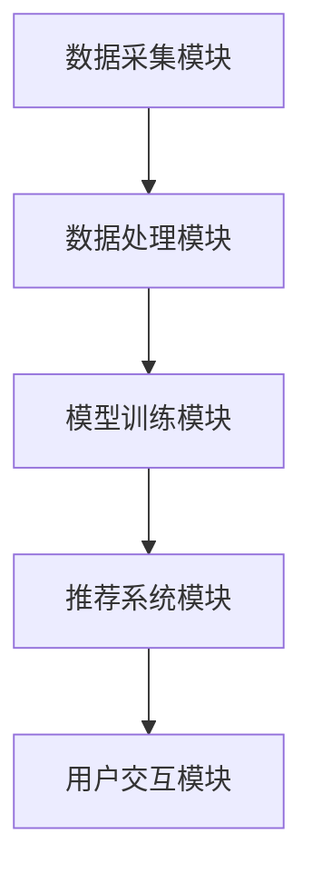

                 


# AI Agent在智能个性化营销中的应用

> 关键词：AI Agent, 智能个性化营销, 人工智能, 营销技术, 数据驱动, 推荐系统

> 摘要：本文详细探讨了AI Agent在智能个性化营销中的应用，从基本概念到核心技术，从系统架构到项目实战，全面解析AI Agent如何通过数据驱动的方式实现精准营销。文章内容涵盖AI Agent的核心原理、算法实现、系统架构设计、项目实战以及最佳实践，旨在为读者提供深入的技术指导和实践参考。

---

# 第一部分: AI Agent与智能个性化营销概述

## 第1章: AI Agent与智能个性化营销概述

### 1.1 AI Agent的基本概念

#### 1.1.1 AI Agent的定义与特点
- **定义**：AI Agent（人工智能代理）是指能够感知环境、自主决策并执行任务的智能实体。它可以是一个软件程序、机器人或其他智能系统，具备学习、推理和自适应能力。
- **特点**：
  - **自主性**：能够自主决策，无需人工干预。
  - **反应性**：能够实时感知环境并做出反应。
  - **学习性**：通过数据和经验不断优化自身行为。
  - **协作性**：能够与其他系统或人类协同工作。

#### 1.1.2 AI Agent的核心原理
AI Agent的核心原理包括感知、决策和执行三个主要环节：
1. **感知**：通过传感器或数据输入接口获取环境信息。
2. **决策**：基于感知到的信息，利用算法进行推理和判断。
3. **执行**：根据决策结果执行相应的动作或输出。

#### 1.1.3 AI Agent与传统营销的区别
- **传统营销**：依赖人工经验，营销策略固定，难以实时调整。
- **AI Agent驱动的营销**：通过数据驱动，实时分析用户行为，动态调整营销策略，实现精准营销。

---

### 1.2 智能个性化营销的概念

#### 1.2.1 个性化营销的定义与特点
- **定义**：个性化营销是指根据用户的特征、行为和偏好，提供定制化的产品、服务或内容的营销方式。
- **特点**：
  - **精准性**：基于用户数据进行个性化推荐。
  - **实时性**：能够实时响应用户需求。
  - **互动性**：通过与用户的互动不断优化营销策略。

#### 1.2.2 AI Agent在智能个性化营销中的作用
- **用户画像**：AI Agent通过分析用户数据，构建详细的用户画像，帮助识别用户的兴趣和需求。
- **推荐系统**：AI Agent可以根据用户的偏好，实时推荐相关产品或内容。
- **动态调整**：AI Agent能够根据市场变化和用户反馈，动态调整营销策略。

#### 1.2.3 AI Agent与智能个性化营销的结合
AI Agent通过以下方式实现智能个性化营销：
1. **数据采集**：收集用户的行为数据，如点击、浏览、购买等。
2. **数据分析**：利用机器学习算法分析数据，提取用户特征。
3. **策略制定**：根据分析结果制定个性化的营销策略。
4. **执行与优化**：通过自动化系统执行策略，并实时优化。

---

### 1.3 AI Agent在智能个性化营销中的应用背景

#### 1.3.1 传统营销的局限性
- **信息不对称**：传统营销难以精准识别用户需求。
- **效率低下**：营销策略固定，难以快速响应市场变化。
- **成本高昂**：传统营销需要大量人工干预，成本较高。

#### 1.3.2 数据驱动的营销趋势
- **数据的重要性**：数据成为营销决策的核心驱动力。
- **技术的进步**：人工智能和大数据技术的发展为个性化营销提供了技术支持。
- **用户体验的提升**：通过数据驱动的个性化营销，可以显著提升用户体验和转化率。

#### 1.3.3 AI Agent在营销中的潜力
- **实时响应**：AI Agent能够实时分析用户行为，快速调整营销策略。
- **精准推荐**：通过深度学习算法，AI Agent可以实现精准的个性化推荐。
- **自动化决策**：AI Agent能够自主决策，减少人工干预。

---

## 1.4 本章小结
本章介绍了AI Agent的基本概念、核心原理以及在智能个性化营销中的作用。AI Agent通过数据驱动的方式，能够实时感知用户需求，动态调整营销策略，从而实现精准营销。下一章将深入探讨AI Agent的核心原理与算法，帮助读者更好地理解其技术实现。

---

# 第二部分: AI Agent的核心原理与算法

## 第2章: AI Agent的核心原理与算法

### 2.1 AI Agent的核心原理

#### 2.1.1 感知与数据采集
- **感知**：AI Agent通过传感器或数据接口获取环境信息，例如用户的行为数据、市场趋势等。
- **数据采集**：数据采集是AI Agent的核心输入，主要包括结构化数据（如用户点击数据）和非结构化数据（如文本、图像）。

#### 2.1.2 决策与算法实现
- **决策**：AI Agent基于感知到的数据，利用算法进行推理和判断，生成决策方案。
- **算法实现**：常用的算法包括强化学习（如Q-learning）和监督学习（如随机森林、神经网络）。

#### 2.1.3 执行与反馈
- **执行**：AI Agent根据决策结果执行相应的动作，例如发送推荐信息或调整营销策略。
- **反馈**：通过用户的反馈（如点击、购买）优化AI Agent的行为。

---

### 2.2 AI Agent的核心算法

#### 2.2.1 强化学习算法
- **Q-learning算法**：一种经典的强化学习算法，通过奖励机制优化决策策略。
- **算法实现**：
  ```python
  def q_learning():
      env = Environment()
      agent = Agent()
      for episode in range(num_episodes):
          state = env.reset()
          while not done:
              action = agent.act(state)
              next_state, reward, done = env.step(action)
              agent.learn(state, action, reward, next_state)
  ```

#### 2.2.2 监督学习算法
- **随机森林**：用于分类和回归任务，适合处理非线性关系。
- **神经网络**：用于复杂模式识别，适合处理大量数据。

---

### 2.3 算法的数学模型

#### 2.3.1 强化学习的数学模型
- **Q-learning的更新公式**：
  $$ Q(s, a) = Q(s, a) + \alpha (r + \gamma \max Q(s', a') - Q(s, a)) $$
  其中，$\alpha$ 是学习率，$\gamma$ 是折扣因子。

#### 2.3.2 监督学习的数学模型
- **线性回归**：$$ y = \theta^T x + \epsilon $$
- **逻辑回归**：$$ P(y=1|x) = \sigma(\theta^T x) $$

---

## 2.4 本章小结
本章详细介绍了AI Agent的核心原理和算法实现，包括感知、决策和执行三个环节。通过强化学习和监督学习的算法，AI Agent能够实现自主决策和优化。下一章将探讨智能个性化营销的核心技术，包括用户画像、推荐系统和自然语言处理。

---

# 第三部分: 智能个性化营销的核心技术

## 第3章: 智能个性化营销的核心技术

### 3.1 用户画像

#### 3.1.1 用户画像的构建
- **数据采集**：收集用户的基本信息、行为数据和交互数据。
- **特征提取**：从数据中提取有用的特征，例如用户的年龄、性别、兴趣爱好等。
- **模型训练**：利用机器学习模型构建用户画像。

#### 3.1.2 用户画像的特征分析
- **用户分群**：将用户分为不同的群体，例如高价值用户、潜在用户等。
- **用户行为分析**：通过分析用户的点击、浏览和购买行为，识别用户的兴趣和偏好。

---

### 3.2 推荐系统

#### 3.2.1 推荐系统的实现
- **协同过滤**：基于用户相似性或物品相似性推荐相关内容。
- **基于内容的推荐**：通过分析物品的特征（如文本、图像）进行推荐。
- **混合推荐**：结合协同过滤和基于内容的推荐方法，提升推荐效果。

#### 3.2.2 推荐系统的算法实现
- **协同过滤的实现**：
  ```python
  def collaborative_filtering(user_id):
      similarity = calculate_similarity(user_id)
      recommendations = get_top_n(similarity, n=10)
      return recommendations
  ```

---

### 3.3 自然语言处理

#### 3.3.1 NLP在营销中的应用
- **情感分析**：分析用户评论的情感倾向，用于产品优化和客户服务。
- **文本分类**：将用户评论分类为正面、中性或负面。

#### 3.3.2 NLP的算法实现
- **情感分析的实现**：
  ```python
  def sentiment_analysis(text):
      model = load_model()
      prediction = model.predict(text)
      return "positive" if prediction[0] == 1 else "negative"
  ```

---

## 3.4 本章小结
本章详细介绍了智能个性化营销的核心技术，包括用户画像、推荐系统和自然语言处理。通过这些技术，AI Agent能够实现精准的用户识别和个性化推荐，提升营销效果。下一章将探讨AI Agent驱动的个性化营销系统的架构设计。

---

# 第四部分: 系统架构设计

## 第4章: 系统架构设计

### 4.1 系统模块划分

#### 4.1.1 模块划分
- **数据采集模块**：负责采集用户数据。
- **数据处理模块**：对数据进行清洗和预处理。
- **模型训练模块**：训练机器学习模型。
- **推荐系统模块**：根据模型输出结果进行推荐。
- **用户交互模块**：与用户进行实时交互。

#### 4.1.2 模块之间的关系
- 数据采集模块向数据处理模块提供原始数据。
- 数据处理模块将预处理后的数据传递给模型训练模块。
- 模型训练模块生成推荐结果，并传递给推荐系统模块。
- 推荐系统模块通过用户交互模块与用户进行实时交互。

---

### 4.2 系统架构图


---

### 4.3 系统功能设计

#### 4.3.1 功能模块设计
- **数据采集**：支持多种数据源的采集，如网页抓取、API接口等。
- **数据处理**：包括数据清洗、特征提取和数据增强。
- **模型训练**：支持多种算法的训练和调优。
- **推荐系统**：实现个性化推荐，并支持实时更新。
- **用户交互**：提供友好的用户界面，支持实时反馈。

#### 4.3.2 系统接口设计
- **API接口**：提供RESTful API，方便与其他系统集成。
- **数据接口**：支持多种数据格式的输入和输出。

---

## 4.4 本章小结
本章详细介绍了AI Agent驱动的个性化营销系统的架构设计，包括模块划分、系统架构图和功能设计。通过合理的系统架构，可以实现高效的数据处理和精准的推荐服务。下一章将通过一个具体的项目实战，进一步展示AI Agent在智能个性化营销中的应用。

---

# 第五部分: 项目实战

## 第5章: 项目实战

### 5.1 项目背景

#### 5.1.1 项目介绍
- **项目名称**：智能个性化推荐系统。
- **项目目标**：通过AI Agent实现用户的个性化推荐，提升用户转化率和满意度。

#### 5.1.2 项目需求
- **数据需求**：用户行为数据、产品信息数据。
- **功能需求**：实现用户画像、个性化推荐和实时反馈。

---

### 5.2 项目实施

#### 5.2.1 环境配置
- **开发环境**：Python 3.8+
- **依赖库安装**：
  ```bash
  pip install numpy pandas scikit-learn tensorflow
  ```

#### 5.2.2 数据准备
- **数据采集**：从数据库中提取用户行为数据。
- **数据预处理**：清洗数据、特征提取。

#### 5.2.3 模型训练
- **算法选择**：使用协同过滤算法进行推荐。
- **模型训练**：
  ```python
  from sklearn.metrics.pairwise import cosine_similarity
  def train_model(users, items):
      user_item_matrix = create_matrix(users, items)
      similarity_matrix = cosine_similarity(user_item_matrix)
      return similarity_matrix
  ```

#### 5.2.4 系统部署
- **部署环境**：Docker容器化部署。
- **服务启动**：启动推荐服务，监听用户请求。

---

### 5.3 项目实现

#### 5.3.1 核心代码实现
- **协同过滤实现**：
  ```python
  def get_recommendations(user_id, similarity_matrix):
      user_index = user_id_to_index[user_id]
      similar_users = get_top_n相似用户(user_index, n=5)
      recommended_items = get推荐物品(similar_users)
      return recommended_items
  ```

#### 5.3.2 系统测试
- **功能测试**：测试推荐系统的准确性、实时性和稳定性。
- **性能测试**：测试系统的响应时间和吞吐量。

---

## 5.4 本章小结
本章通过一个具体的项目实战，详细展示了AI Agent在智能个性化营销中的应用。从环境配置到数据准备，从模型训练到系统部署，整个过程完整且详细。读者可以通过本章内容，掌握AI Agent在实际项目中的具体实现方法。

---

# 第六部分: 最佳实践与总结

## 第6章: 最佳实践与总结

### 6.1 最佳实践

#### 6.1.1 数据隐私与安全
- **数据加密**：确保用户数据的安全性。
- **隐私保护**：遵守相关法律法规，保护用户隐私。

#### 6.1.2 模型优化
- **模型调优**：通过交叉验证等方法优化模型性能。
- **模型解释性**：确保模型的可解释性，便于分析和调整。

#### 6.1.3 用户行为分析
- **实时监控**：实时监控用户行为，及时调整营销策略。
- **用户反馈**：收集用户的反馈，不断优化推荐算法。

---

### 6.2 总结与展望

#### 6.2.1 本章总结
- AI Agent通过数据驱动的方式，能够实现精准的个性化营销。
- 通过合理的系统架构和算法实现，可以显著提升营销效果。

#### 6.2.2 未来展望
- **多模态交互**：结合视觉、听觉等多种感官，提升用户体验。
- **边缘计算**：通过边缘计算优化实时响应能力。
- **自动化决策**：进一步提升AI Agent的自主决策能力。

---

## 作者：AI天才研究院/AI Genius Institute & 禅与计算机程序设计艺术 /Zen And The Art of Computer Programming

---

以上是《AI Agent在智能个性化营销中的应用》的技术博客文章的详细目录大纲和部分正文内容，涵盖了从基础概念到系统设计，再到项目实战的完整内容。通过这样的结构和内容安排，读者可以系统地学习和理解AI Agent在智能个性化营销中的应用。

