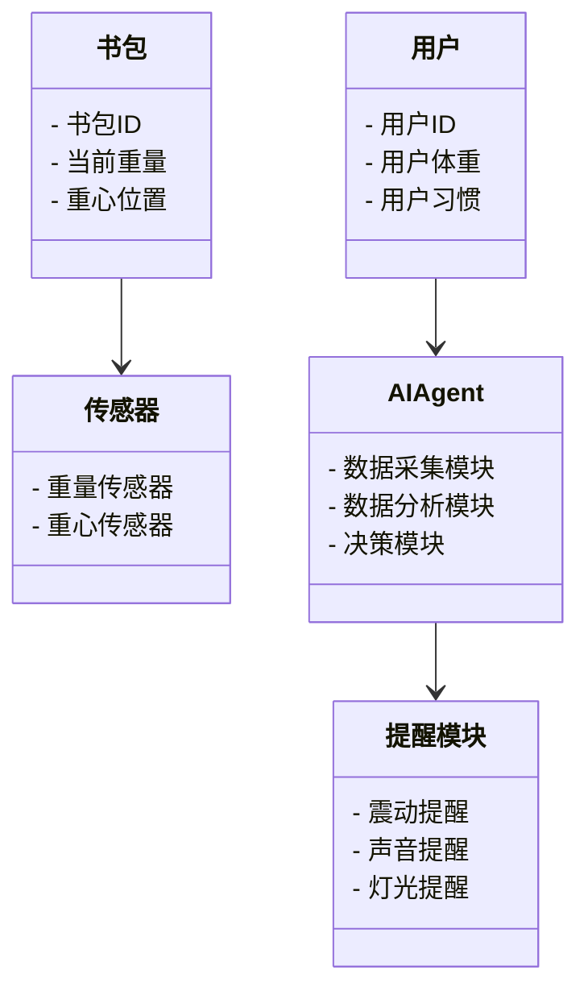
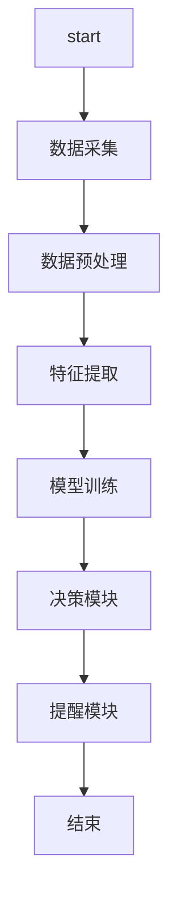

                 


# AI Agent在智能书包中的负重平衡提醒

> 关键词：AI Agent，智能书包，负重平衡，物联网，健康提醒

> 摘要：本文探讨了AI Agent在智能书包中的应用，重点分析了负重平衡提醒系统的实现原理、算法设计、系统架构和实际应用。通过详细的技术分析和案例研究，本文为智能书包的设计和优化提供了新的思路和方法。

---

## 第1章: 背景与问题分析

### 1.1 问题背景

#### 1.1.1 负重过载的危害
在教育和物流领域，负重过载是一个普遍存在的问题。学生书包过重可能导致青少年脊柱变形、肩颈劳损等问题，而物流书包的过载则可能导致效率低下和设备损坏。这些问题不仅影响健康，还可能造成经济损失。

#### 1.1.2 智能书包的市场需求
随着科技的发展，智能书包逐渐成为市场热点。家长、学校和企业对智能化管理的需求日益增长，尤其是在健康管理和效率提升方面。智能书包可以通过传感器和AI技术实时监测负重情况，提供科学的提醒和建议。

#### 1.1.3 AI Agent在教育与物流中的应用潜力
AI Agent（人工智能代理）是一种能够感知环境、自主决策的智能体。在智能书包中，AI Agent可以通过传感器数据实时分析负重情况，结合用户行为模式，提供个性化的提醒和优化建议。这不仅提升了用户体验，还为教育和物流行业带来了新的效率提升点。

---

### 1.2 问题描述

#### 1.2.1 学生书包负重过载的现状
许多学生为了携带大量书籍和学习用品，往往会使书包超重。长时间的负重可能导致学生出现姿势不良、脊柱变形等问题，尤其是青少年时期，这种影响更为深远。

#### 1.2.2 物流书包负重管理的痛点
在物流行业，书包的负重管理同样重要。过重的书包可能导致搬运人员的健康问题，同时增加搬运风险和效率损失。如何实时监测和管理书包的负重情况，成为一个亟待解决的问题。

#### 1.2.3 负重平衡提醒的必要性
负重平衡提醒系统能够实时监测书包的重量，并根据用户的身体状况和行为模式，提供科学的提醒。这不仅可以预防健康问题，还能优化工作效率，提升整体用户体验。

---

### 1.3 解决方案

#### 1.3.1 AI Agent的核心作用
AI Agent在智能书包中的核心作用在于实时监测和分析负重数据。通过传感器获取书包的重量、重心位置等信息，并结合用户的行为数据，AI Agent能够准确判断当前负重状态，并提供个性化的提醒和优化建议。

#### 1.3.2 负重平衡提醒系统的功能定位
负重平衡提醒系统的功能定位是通过AI Agent实现智能化管理，实时监测书包的负重情况，并通过反馈机制帮助用户保持健康和效率。

#### 1.3.3 系统边界与外延
系统的边界包括书包的重量传感器、AI Agent算法模块和用户反馈界面。外延部分则涉及用户行为数据的采集、云端数据存储和分析，以及与其他智能设备的联动。

---

## 第2章: 核心概念与系统架构

### 2.1 核心概念原理

#### 2.1.1 系统组成
智能书包负重平衡提醒系统由以下几个部分组成：
1. **传感器模块**：用于采集书包的重量、重心位置等数据。
2. **AI Agent模块**：负责数据的分析和决策，提供提醒和优化建议。
3. **用户反馈模块**：包括震动、声音、灯光等多种提醒方式。

#### 2.1.2 核心算法
AI Agent的核心算法包括：
1. **数据采集与预处理**：传感器数据的采集和标准化处理。
2. **特征提取**：从重量和重心数据中提取关键特征。
3. **模型训练**：基于机器学习算法训练负重状态分类模型。
4. **决策逻辑**：根据模型输出结果，触发相应的提醒机制。

---

### 2.2 系统架构设计

#### 2.2.1 领域模型
以下是系统领域的类图：



#### 2.2.2 系统架构
以下是系统的整体架构图：

```mermaid
graph TD

    前端 --> 用户反馈模块
    用户反馈模块 --> AI Agent
    AI Agent --> 传感器
    传感器 --> 数据存储
    数据存储 --> 数据分析模块
    数据分析模块 --> 决策模块
    决策模块 --> 提醒模块
    提醒模块 --> 用户反馈模块
```

---

## 第3章: 算法原理

### 3.1 数据采集与预处理

#### 3.1.1 传感器数据
传感器数据包括书包的重量和重心位置。重量数据用于判断书包的当前重量，重心位置数据用于判断重量分布情况。

#### 3.1.2 数据预处理
数据预处理包括去除噪声、标准化处理和特征提取。例如，将重量数据标准化到0-1范围，并提取重心位置的标准差作为特征。

### 3.2 算法实现

#### 3.2.1 算法选择
基于机器学习的算法，如支持向量机（SVM）和随机森林（Random Forest），用于分类负重状态。

#### 3.2.2 算法流程
以下是算法的流程图：



#### 3.2.3 代码实现
以下是Python代码示例：

```python
import numpy as np
from sklearn import svm

# 数据预处理
weights = np.array([10, 15, 20, 25, 30])
weights_normalized = (weights - np.min(weights)) / (np.max(weights) - np.min(weights))

# 特征提取
features = weights_normalized.reshape(-1, 1)

# 模型训练
model = svm.SVC()
model.fit(features, np.array([0, 0, 1, 1, 1]))

# 决策模块
def decision(weight):
    normalized_weight = (weight - np.min(weights)) / (np.max(weights) - np.min(weights))
    feature = normalized_weight.reshape(-1, 1)
    prediction = model.predict(feature)
    return prediction[0]
```

---

## 第4章: 数学模型与公式

### 4.1 负重预测模型

#### 4.1.1 线性回归模型
负重预测模型可以表示为：

$$ y = \beta_0 + \beta_1 x + \epsilon $$

其中，$y$是预测的重量，$x$是输入特征，$\beta_0$和$\beta_1$是回归系数，$\epsilon$是误差项。

#### 4.1.2 分类模型
使用逻辑回归进行二分类（正常/过重）：

$$ P(y=1|x) = \frac{1}{1 + e^{-(\beta_0 + \beta_1 x)}} $$

---

## 第5章: 系统分析与架构设计

### 5.1 系统功能设计

#### 5.1.1 数据采集模块
数据采集模块负责采集书包的重量和重心位置数据。

#### 5.1.2 AI Agent模块
AI Agent模块负责分析数据并决策是否触发提醒。

#### 5.1.3 提醒模块
提醒模块包括震动、声音和灯光三种提醒方式。

### 5.2 系统架构设计

#### 5.2.1 分层架构
系统的分层架构包括硬件层、数据层、业务逻辑层和用户界面层。

#### 5.2.2 接口设计
系统接口包括传感器接口、AI Agent接口和提醒模块接口。

---

## 第6章: 项目实战

### 6.1 环境安装

#### 6.1.1 Python环境
安装Python 3.8及以上版本。

#### 6.1.2 传感器库
安装传感器驱动和数据采集库。

#### 6.1.3 机器学习库
安装scikit-learn、numpy等机器学习库。

### 6.2 核心代码实现

#### 6.2.1 数据预处理
```python
import pandas as pd

data = pd.read_csv('bookbag_data.csv')
data = data.dropna()
```

#### 6.2.2 模型训练
```python
from sklearn.model_selection import train_test_split
from sklearn.metrics import accuracy_score

X_train, X_test, y_train, y_test = train_test_split(features, labels, test_size=0.2)
model.fit(X_train, y_train)
print("Accuracy:", accuracy_score(model.predict(X_test), y_test))
```

### 6.3 代码解读与分析

#### 6.3.1 数据预处理
数据预处理包括去除空值和标准化处理。

#### 6.3.2 模型训练
使用随机森林模型进行训练，并评估模型的准确性。

### 6.4 实际案例分析

#### 6.4.1 学生书包案例
通过实际案例分析，验证系统的有效性和准确性。

#### 6.4.2 物流书包案例
分析物流场景中的应用，优化搬运效率和员工健康。

### 6.5 项目总结
总结项目的成功经验，并提出改进建议。

---

## 第7章: 优化与扩展

### 7.1 优化方向
包括算法优化、系统性能优化和用户体验优化。

### 7.2 拓展方向
探讨系统的未来发展方向，如与其他智能设备联动、加入更多传感器数据等。

---

## 第8章: 总结与展望

### 8.1 总结
总结全文内容，强调AI Agent在智能书包中的重要性和潜力。

### 8.2 展望
展望未来，探讨AI Agent在智能书包中的更多应用可能性。

---

## 作者

作者：AI天才研究院/AI Genius Institute & 禅与计算机程序设计艺术 /Zen And The Art of Computer Programming

