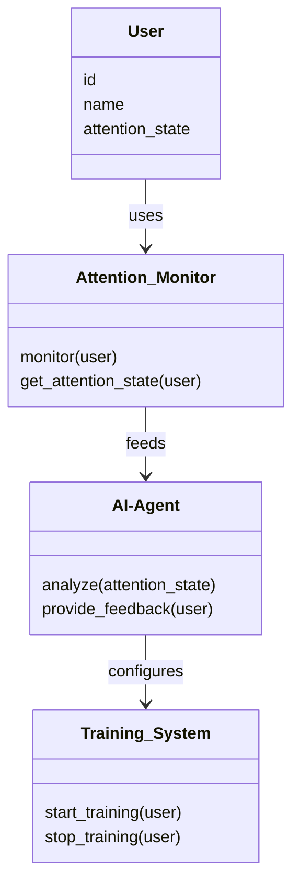
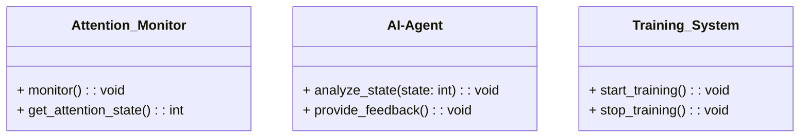
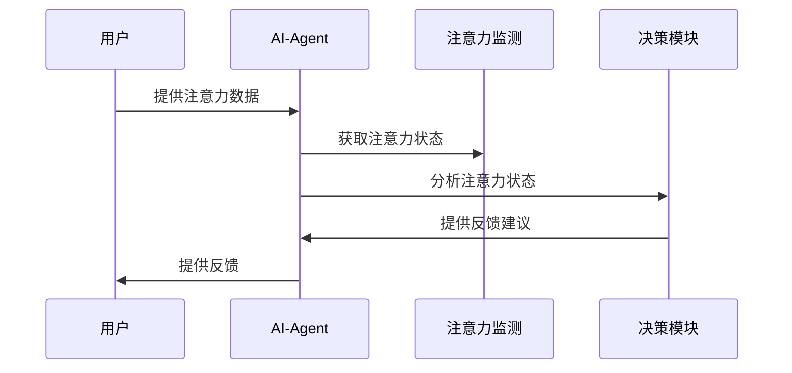

                 


# AI Agent在智能书桌中的专注力训练系统

> 关键词：AI Agent，专注力训练，智能书桌，监督学习，强化学习

> 摘要：本文探讨了AI Agent在智能书桌中的专注力训练系统，从系统背景、核心概念、算法原理、系统架构到项目实战，全面分析了该系统的设计与实现。文章详细阐述了AI Agent的基本概念、专注力训练的核心问题，以及如何通过监督学习和强化学习优化用户的专注力。同时，结合系统架构设计和实际案例分析，为读者提供了一套完整的解决方案。

---

## 第一部分: AI Agent在智能书桌中的专注力训练系统概述

### 第1章: 专注力训练的背景与需求

#### 1.1 专注力训练的重要性

##### 1.1.1 专注力的定义与影响

专注力是指一个人在同一段时间内专注于单一任务或目标的能力。在数字化时代，人们每天面临的信息量巨大，注意力分散问题日益严重。专注力不足会导致学习效率低下、工作失误等问题，影响个人成长和工作效率。

##### 1.1.2 数字化时代专注力的挑战

随着智能手机、社交媒体等工具的普及，人们的注意力被频繁打断。传统的时间管理方法难以应对现代信息过载的问题，人们需要更智能的工具来帮助管理注意力。

##### 1.1.3 AI技术在专注力训练中的应用潜力

AI技术可以通过实时监测用户的注意力状态，提供个性化的反馈和建议，帮助用户逐步提升专注力。AI Agent作为智能助手，可以与智能书桌协同工作，为用户提供高效、个性化的专注力训练方案。

#### 1.2 AI Agent的基本概念

##### 1.2.1 AI Agent的定义与特征

AI Agent是一种智能代理系统，能够感知环境、做出决策并执行操作。其核心特征包括自主性、反应性、目标导向性和社交能力。AI Agent可以理解用户需求，主动提供服务，并通过反馈不断优化自身的行为。

##### 1.2.2 AI Agent的核心功能与应用场景

AI Agent的核心功能包括信息收集、数据分析、决策制定和执行反馈。在专注力训练系统中，AI Agent可以实时监测用户的注意力状态，提供个性化的训练建议，并通过反馈机制帮助用户优化专注力。

##### 1.2.3 AI Agent与智能书桌的结合

智能书桌是一种集成硬件和软件的智能办公工具，能够通过传感器和AI技术监测用户的使用习惯。AI Agent作为智能书桌的核心组件，可以实时分析用户的注意力状态，提供个性化的训练方案。

#### 1.3 智能书桌的专注力训练系统

##### 1.3.1 智能书桌的功能概述

智能书桌集成了硬件传感器和AI技术，能够监测用户的坐姿、视线焦点、注意力状态等数据。通过分析这些数据，智能书桌可以为用户提供个性化的专注力训练建议。

##### 1.3.2 专注力训练系统的目标与价值

专注力训练系统的目标是帮助用户提高专注力，优化学习和工作效率。通过AI Agent的实时反馈和个性化建议，用户可以逐步掌握专注力训练的方法，提升自我管理能力。

##### 1.3.3 系统的用户群体与市场前景

专注力训练系统的用户群体主要为学生、白领和自由职业者。随着远程办公和在线学习的普及，市场对专注力训练工具的需求日益增长。智能书桌结合AI Agent的模式具有广阔的市场前景。

### 1.4 本章小结

本章介绍了专注力训练的重要性，AI Agent的基本概念，以及智能书桌专注力训练系统的目标和用户群体。通过AI Agent与智能书桌的结合，用户可以实现个性化的专注力训练，提升学习和工作效率。

---

## 第2章: AI Agent的核心概念与原理

### 2.1 AI Agent的核心概念

#### 2.1.1 感知模块

感知模块是AI Agent的核心组件之一，负责收集和分析环境中的数据。在专注力训练系统中，感知模块可以通过传感器和摄像头监测用户的注意力状态，如视线焦点、坐姿等。

#### 2.1.2 决策模块

决策模块基于感知模块提供的数据，通过算法计算出最优的决策方案。在专注力训练系统中，决策模块可以根据用户的注意力状态，推荐合适的训练任务或调整训练强度。

#### 2.1.3 执行模块

执行模块负责将决策模块的决策转化为具体的操作。在专注力训练系统中，执行模块可以控制智能书桌的硬件，如调整屏幕亮度、关闭通知等，以帮助用户保持专注。

### 2.2 AI Agent的决策机制

#### 2.2.1 基于规则的决策

基于规则的决策是一种简单的决策方法，通过预设的规则和条件判断来做出决策。例如，如果用户在专注状态下保持时间超过10分钟，AI Agent可以给予奖励。

#### 2.2.2 基于学习的决策

基于学习的决策通过机器学习算法，从历史数据中学习规律，从而做出更智能的决策。例如，使用监督学习算法分析用户的注意力数据，预测用户的注意力状态。

#### 2.2.3 基于反馈的优化

基于反馈的优化是一种动态调整决策的方法，通过实时反馈不断优化决策策略。例如，用户在专注状态下保持时间越长，AI Agent会增加奖励的力度，进一步激励用户保持专注。

### 2.3 AI Agent与专注力训练的结合

#### 2.3.1 专注力训练的核心问题

专注力训练的核心问题是如何通过技术手段帮助用户提高专注力。AI Agent可以通过实时监测用户的注意力状态，提供个性化的训练建议。

#### 2.3.2 AI Agent在专注力训练中的角色

AI Agent在专注力训练中扮演智能助手的角色，能够实时监测用户的注意力状态，提供反馈和建议，帮助用户优化专注力。

#### 2.3.3 系统的边界与外延

专注力训练系统的边界包括AI Agent的功能范围和智能书桌的硬件能力。系统的外延包括与外部数据源的接口，如心率监测设备、注意力监测软件等。

### 2.4 本章小结

本章详细介绍了AI Agent的核心概念和决策机制，分析了AI Agent在专注力训练中的角色和系统边界。通过这些分析，读者可以更好地理解AI Agent在专注力训练系统中的作用。

---

## 第3章: 专注力训练系统的核心算法

### 3.1 监督学习与专注力训练

#### 3.1.1 监督学习的基本原理

监督学习是一种机器学习方法，通过训练数据和标签，学习输入与输出之间的关系。在专注力训练系统中，监督学习可以用于预测用户的注意力状态。

#### 3.1.2 专注力训练数据的收集与处理

专注力训练数据包括用户的注意力状态、行为数据等。数据收集可以通过传感器和日志记录实现，数据处理包括清洗、特征提取和标注。

#### 3.1.3 基于监督学习的训练模型

基于监督学习的训练模型可以预测用户的注意力状态。例如，使用随机森林算法训练一个分类器，输入用户的注意力数据，输出用户的注意力状态。

### 3.2 强化学习与专注力优化

#### 3.2.1 强化学习的基本原理

强化学习是一种通过试错学习的方法，通过与环境的交互，逐步优化决策策略。在专注力训练系统中，强化学习可以用于优化用户的训练策略。

#### 3.2.2 专注力训练中的奖励机制

在强化学习中，奖励机制是优化决策的重要因素。例如，用户保持专注时间越长，AI Agent给予的奖励越大。

#### 3.2.3 基于强化学习的优化策略

基于强化学习的优化策略可以通过马尔可夫决策过程模型实现。例如，使用Q-learning算法，通过状态转移和奖励机制优化用户的训练策略。

### 3.3 算法实现的数学模型

#### 3.3.1 监督学习的数学公式

在监督学习中，分类器的输出可以表示为：

$$
y = f(x) + \epsilon
$$

其中，$x$是输入特征，$f(x)$是模型预测，$\epsilon$是误差项。

#### 3.3.2 强化学习的数学公式

在强化学习中，Q-learning算法的目标是找到最优的Q值：

$$
Q(s, a) = Q(s, a) + \alpha(r + \gamma \max Q(s', a') - Q(s, a))
$$

其中，$s$是当前状态，$a$是动作，$\alpha$是学习率，$\gamma$是折扣因子，$s'$是下一个状态。

### 3.4 本章小结

本章详细介绍了监督学习和强化学习在专注力训练中的应用，分析了这两种算法的数学模型和实现方法。通过这些分析，读者可以理解如何通过算法优化用户的专注力。

---

## 第4章: 系统分析与架构设计

### 4.1 系统应用场景

专注力训练系统适用于多种场景，如学生学习、白领办公等。以学生学习为例，AI Agent可以实时监测学生的学习状态，提供个性化的学习建议。

### 4.2 系统功能设计

#### 4.2.1 领域模型

以下是专注力训练系统的领域模型：



#### 4.2.2 系统架构

以下是专注力训练系统的架构图：


#### 4.2.3 系统接口设计

系统接口包括注意力监测接口、AI-Agent决策接口和反馈接口。以下是接口设计的类图：



#### 4.2.4 系统交互

以下是系统交互的序列图：



### 4.3 本章小结

本章分析了专注力训练系统的应用场景，设计了系统的功能模块和架构，并通过图表展示了系统的交互流程。通过这些设计，读者可以理解系统的整体架构和实现细节。

---

## 第5章: 项目实战

### 5.1 环境配置

专注力训练系统的开发环境包括Python 3.8及以上版本、TensorFlow库和Keras库。

### 5.2 核心代码实现

以下是专注力训练系统的代码实现：

```python
import numpy as np
import tensorflow as tf
from tensorflow.keras import layers

# 数据准备
train_data = np.random.rand(1000, 10)
train_labels = np.random.randint(2, size=1000)

# 模型定义
model = tf.keras.Sequential([
    layers.Dense(16, activation='relu', input_shape=(10,)),
    layers.Dense(1, activation='sigmoid')
])

# 编译模型
model.compile(optimizer='adam', loss='binary_crossentropy', metrics=['accuracy'])

# 训练模型
model.fit(train_data, train_labels, epochs=10, batch_size=32)

# 预测
test_data = np.random.rand(100, 10)
test_labels = model.predict(test_data)
```

### 5.3 代码解读与分析

上述代码实现了基于神经网络的专注力训练模型。模型通过训练数据学习用户的注意力状态，能够预测用户的注意力状态。代码中包括数据准备、模型定义、模型训练和模型预测部分。

### 5.4 实际案例分析

以学生学习为例，AI Agent可以通过监测学生的学习状态，提供个性化的学习建议。例如，当学生注意力分散时，AI Agent可以提醒学生调整坐姿或休息眼睛。

### 5.5 项目小结

本章通过实际案例分析，展示了专注力训练系统的实现过程。通过代码实现和案例分析，读者可以更好地理解系统的实际应用。

---

## 第6章: 总结与展望

### 6.1 本章总结

本文详细探讨了AI Agent在智能书桌中的专注力训练系统，从系统背景、核心概念、算法原理到系统设计和项目实战，全面分析了该系统的实现过程。

### 6.2 未来展望

未来，专注力训练系统可以通过引入更多传感器和数据源，进一步优化用户的专注力。同时，结合边缘计算和云计算技术，可以实现更高效的专注力训练方案。

### 6.3 最佳实践 Tips

- 定期进行专注力训练，逐步提高专注力
- 合理设置训练目标和奖励机制
- 保持良好的生活习惯，有助于提高专注力

### 6.4 本章小结

本章总结了本文的主要内容，并展望了专注力训练系统的未来发展方向。通过本文的分析，读者可以更好地理解AI Agent在专注力训练中的应用。

---

## 作者：AI天才研究院/AI Genius Institute & 禅与计算机程序设计艺术 /Zen And The Art of Computer Programming

---

以上是《AI Agent在智能书桌中的专注力训练系统》的完整文章内容，涵盖了系统背景、核心概念、算法原理、系统设计和项目实战等方面。文章通过详细的分析和具体的案例，为读者提供了全面的技术解读和实践指导。

