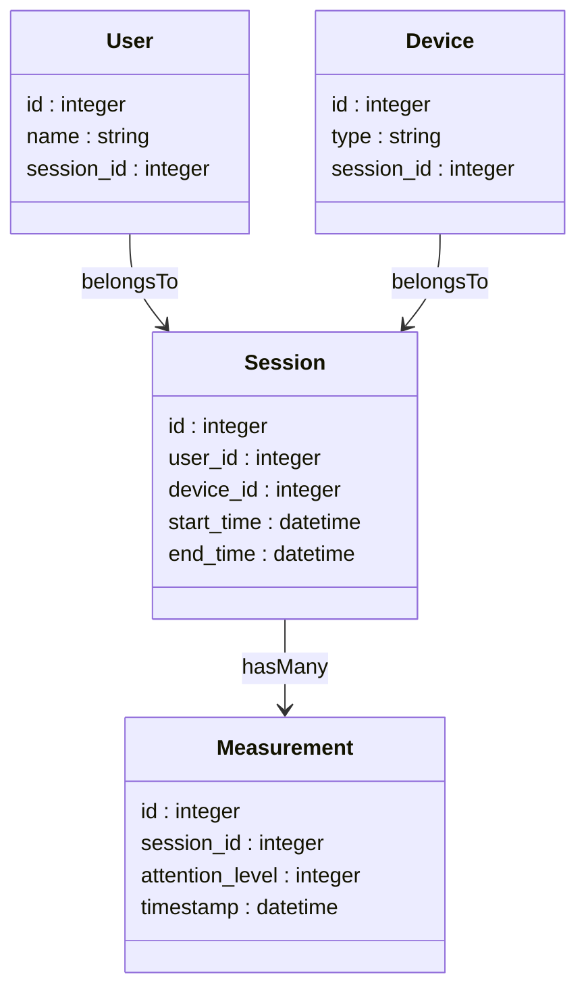
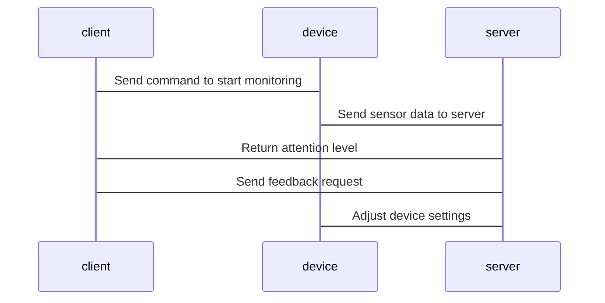

                 


# AI Agent在智能书桌中的专注度监测

## 关键词：AI Agent, 智能书桌, 专注度监测, 用户行为分析, 注意力分配模型, 系统架构设计, 项目实战

## 摘要：本文详细探讨了AI Agent在智能书桌中的专注度监测技术。通过背景分析、核心概念讲解、算法原理阐述、系统架构设计、项目实战实现等多维度内容，全面解析了AI Agent如何通过监测用户行为和注意力分配，优化智能书桌的功能，提升用户体验。文章结合理论与实践，提供了详细的实现方案和代码示例，为读者提供了深入的技术指导。

---

# 第一部分: AI Agent在智能书桌中的专注度监测背景与概念

## 第1章: 专注度监测的背景与问题描述

### 1.1 专注度监测的背景
#### 1.1.1 数字化学习与工作的兴起
随着信息技术的飞速发展，数字化学习和远程办公已成为现代生活的常态。用户每天需要处理大量的信息，但注意力分散的问题日益严重，影响了学习和工作效率。

#### 1.1.2 用户注意力分散的现状
现代社会信息碎片化严重，用户在使用智能设备时，常常受到多任务干扰，导致注意力难以集中。例如，用户在学习或工作中，经常会被手机通知、社交媒体等打断，降低专注度。

#### 1.1.3 提高专注度的重要性
专注度是影响工作效率和学习成果的关键因素。通过提高专注度，用户可以更高效地完成任务，减少疲劳感，提升整体生活质量。

---

### 1.2 AI Agent的基本概念
#### 1.2.1 什么是AI Agent
AI Agent（人工智能代理）是一种能够感知环境、执行任务的智能实体。它可以通过传感器获取信息，并根据预设的目标和规则做出决策，执行相应的动作。AI Agent可以是软件程序，也可以是硬件设备。

#### 1.2.2 AI Agent的核心功能
AI Agent的核心功能包括感知环境、决策推理、执行动作和与用户交互。例如，AI Agent可以通过摄像头和传感器感知用户的注意力状态，并根据这些数据调整设备的设置。

#### 1.2.3 AI Agent与传统软件的区别
与传统软件相比，AI Agent具有更强的自主性和适应性。它能够通过学习和优化，不断提升自身的性能，而传统软件则需要手动编程来实现功能。

---

### 1.3 智能书桌的概念与特点
#### 1.3.1 智能书桌的定义
智能书桌是一种集成多种智能技术的办公和学习设备，能够通过传感器和AI技术监测用户的使用状态，并提供相应的反馈和优化建议。

#### 1.3.2 智能书桌的功能模块
智能书桌的功能模块包括：
- **环境监测**：监测光线、温度、湿度等环境参数。
- **用户行为监测**：监测用户的坐姿、注意力状态等。
- **智能调节**：根据监测数据，自动调节书桌的高度、屏幕亮度等。

#### 1.3.3 智能书桌的应用场景
智能书桌广泛应用于办公室、学校、家庭等场景，帮助用户在学习和工作中保持最佳状态。

---

### 1.4 问题背景与问题描述
#### 1.4.1 用户专注度监测的必要性
用户在学习和工作中，常常因为注意力分散而导致效率低下。通过监测用户的专注度，智能书桌可以提供实时反馈，帮助用户调整状态。

#### 1.4.2 当前专注度监测的痛点
当前专注度监测技术存在以下问题：
- 数据采集困难：需要多种传感器协同工作。
- 精度不足：现有技术难以准确捕捉用户的注意力变化。
- 用户隐私问题：监测数据涉及用户隐私，需确保数据安全。

#### 1.4.3 AI Agent在专注度监测中的作用
AI Agent可以通过整合多种传感器数据，实时分析用户的注意力状态，并提供个性化的优化建议。例如，当用户注意力下降时，AI Agent可以提醒用户调整坐姿或休息。

---

### 1.5 专注度监测的边界与外延
#### 1.5.1 监测的边界
专注度监测的边界包括：
- **数据采集范围**：仅采集与专注度相关的数据，如眼动数据、心率等。
- **监测时间**：仅在用户使用智能书桌时进行监测。

#### 1.5.2 监测的外延
专注度监测的外延包括：
- **情绪监测**：监测用户的情绪状态，进一步优化专注度。
- **环境监测**：监测环境因素对专注度的影响。

#### 1.5.3 监测的伦理与隐私问题
专注度监测需要遵守相关伦理规范，确保用户隐私不被侵犯。例如，监测数据需加密存储，未经用户许可不得外泄。

---

### 1.6 本章小结
本章从背景、概念、功能和问题描述等方面，详细介绍了AI Agent在智能书桌中的专注度监测技术。通过分析当前专注度监测的痛点，明确了AI Agent在这一领域的重要作用。

---

# 第二部分: AI Agent专注度监测的核心概念与联系

## 第2章: 专注度监测的核心概念与联系

### 2.1 专注度监测的核心概念
#### 2.1.1 用户行为分析
用户行为分析是专注度监测的重要手段。通过分析用户的鼠标操作、键盘输入、眼动数据等，可以推断用户的注意力状态。

#### 2.1.2 注意力分配模型
注意力分配模型是描述用户注意力分布的数学模型。例如，基于时间-注意力曲线的模型可以反映用户在不同时间点的注意力水平。

#### 2.1.3 用户状态识别
用户状态识别是通过分析传感器数据，判断用户的当前状态（如专注、分心、疲劳等）。

---

### 2.2 AI Agent与专注度监测的关系
#### 2.2.1 AI Agent在专注度监测中的角色
AI Agent在专注度监测中扮演数据处理器和决策者的角色。它整合多种传感器数据，通过算法分析用户的注意力状态，并提供相应的反馈。

#### 2.2.2 AI Agent与用户交互的方式
AI Agent可以通过语音交互、图形界面等方式与用户交互。例如，当用户注意力下降时，AI Agent可以通过语音提醒用户休息。

#### 2.2.3 AI Agent如何优化专注度
AI Agent可以通过调整书桌高度、屏幕亮度等方式，优化用户的专注度。例如，当用户长时间保持同一姿势时，AI Agent可以自动调整书桌高度，缓解疲劳。

---

### 2.3 核心概念的属性对比
#### 表2-1: 专注度监测与行为分析的属性对比

| 属性           | 专注度监测                          | 行为分析                          |
|----------------|------------------------------------|------------------------------------|
| 数据来源       | 眼动数据、心率、坐姿等              | 鼠标操作、键盘输入等              |
| 监测目标       | 用户注意力状态                     | 用户行为模式                     |
| 应用场景       | 提高学习和工作效率                | 优化用户操作体验                |

---

### 2.4 ER实体关系图
#### 图2-1: 专注度监测系统的ER实体关系图
```mermaid
erDiagram
    user [U] {
        id : integer
        name : string
    }
    device [D] {
        id : integer
        type : string
    }
    session [S] {
        id : integer
        user_id : integer
        device_id : integer
        start_time : datetime
        end_time : datetime
    }
    measurement [M] {
        id : integer
        session_id : integer
        attention_level : integer
        timestamp : datetime
    }
    user --> session : belongsTo
    device --> session : belongsTo
    session --> measurement : hasMany
```

---

## 第三章: 专注度监测的算法原理

### 3.1 注意力模型
#### 3.1.1 注意力模型的定义
注意力模型是一种描述用户注意力分配的数学模型。它通过分析用户的视觉焦点、眼球运动等数据，推断用户的注意力分布。

#### 3.1.2 注意力模型的实现
注意力模型的实现步骤如下：
1. 数据采集：采集用户的眼动数据。
2. 数据预处理：对数据进行去噪和平滑处理。
3. 模型训练：使用深度学习模型（如卷积神经网络）训练注意力模型。
4. 模型推理：根据实时数据，推断用户的注意力分布。

#### 3.1.3 注意力模型的代码实现
```python
import numpy as np
import tensorflow as tf

# 数据预处理
def preprocess(data):
    # 对数据进行去噪和平滑处理
    return data

# 模型训练
def train_model(train_data, train_labels):
    model = tf.keras.Sequential([
        tf.keras.layers.Conv2D(32, (3,3), activation='relu', input_shape=(64,64,1)),
        tf.keras.layers.MaxPooling2D((2,2)),
        tf.keras.layers.Conv2D(64, (3,3), activation='relu'),
        tf.keras.layers.MaxPooling2D((2,2)),
        tf.keras.layers.Flatten(),
        tf.keras.layers.Dense(64, activation='relu'),
        tf.keras.layers.Dense(1, activation='sigmoid')
    ])
    model.compile(optimizer='adam', loss='binary_crossentropy', metrics=['accuracy'])
    model.fit(train_data, train_labels, epochs=10, batch_size=32)
    return model

# 模型推理
def infer_model(model, test_data):
    predictions = model.predict(test_data)
    return predictions
```

---

### 3.2 行为分析算法
#### 3.2.1 行为分析算法的定义
行为分析算法是一种通过分析用户的操作行为，推断用户状态的技术。例如，通过分析用户的键盘输入频率，判断用户是否在分心。

#### 3.2.2 行为分析算法的实现
行为分析算法的实现步骤如下：
1. 数据采集：采集用户的键盘输入和鼠标操作数据。
2. 数据预处理：对数据进行归一化处理。
3. 模型训练：使用随机森林或支持向量机（SVM）训练分类模型。
4. 模型推理：根据实时数据，分类用户状态。

#### 3.2.3 行为分析算法的代码实现
```python
from sklearn.ensemble import RandomForestClassifier

# 数据预处理
def preprocess(data):
    # 对数据进行归一化处理
    return data

# 模型训练
def train_model(train_data, train_labels):
    model = RandomForestClassifier(n_estimators=100)
    model.fit(train_data, train_labels)
    return model

# 模型推理
def infer_model(model, test_data):
    predictions = model.predict(test_data)
    return predictions
```

---

### 3.3 算法原理的总结
专注度监测的算法原理包括注意力模型和行为分析算法。通过整合多种传感器数据，AI Agent可以更准确地判断用户的注意力状态，并提供个性化的优化建议。

---

# 第四部分: 系统分析与架构设计

## 第4章: 专注度监测系统的分析与架构设计

### 4.1 问题场景介绍
专注度监测系统的应用场景包括办公室、学校和家庭。用户在使用智能书桌时，系统实时监测用户的注意力状态，并提供相应的反馈。

---

### 4.2 系统功能设计
#### 4.2.1 领域模型类图


---

### 4.3 系统架构设计
#### 4.3.1 系统架构图
```mermaid
archiDiagram
    client [Client] {
        UI
        Input/Output
    }
    server [Server] {
        Database
        API
    }
    device [Device] {
        Sensors
        Communication
    }
    client --> server : HTTP request
    server --> device : Command
    device --> server : Data
```

---

### 4.4 系统接口设计
#### 4.4.1 系统接口设计
系统接口设计包括：
- **数据采集接口**：接收传感器数据。
- **数据处理接口**：处理传感器数据，生成专注度报告。
- **用户反馈接口**：向用户发送优化建议。

---

### 4.5 系统交互序列图
#### 4.5.1 系统交互序列图


---

## 第五章: 项目实战

### 5.1 环境安装与配置
#### 5.1.1 环境要求
- 操作系统：Windows 10 或更高版本
- Python版本：Python 3.8 或更高版本
- 依赖库：TensorFlow、Scikit-learn、Mermaid、Matplotlib

#### 5.1.2 安装步骤
```bash
pip install tensorflow scikit-learn mermaid matplotlib
```

---

### 5.2 系统核心实现
#### 5.2.1 核心代码实现
```python
import tensorflow as tf
from sklearn.ensemble import RandomForestClassifier
import numpy as np

# 数据预处理
def preprocess(data):
    return data

# 模型训练
def train_model(train_data, train_labels):
    # 训练注意力模型
    attention_model = tf.keras.Sequential([
        tf.keras.layers.Conv2D(32, (3,3), activation='relu', input_shape=(64,64,1)),
        tf.keras.layers.MaxPooling2D((2,2)),
        tf.keras.layers.Conv2D(64, (3,3), activation='relu'),
        tf.keras.layers.MaxPooling2D((2,2)),
        tf.keras.layers.Flatten(),
        tf.keras.layers.Dense(64, activation='relu'),
        tf.keras.layers.Dense(1, activation='sigmoid')
    ])
    attention_model.compile(optimizer='adam', loss='binary_crossentropy', metrics=['accuracy'])
    attention_model.fit(train_data, train_labels, epochs=10, batch_size=32)

    # 训练行为分析模型
    behavior_model = RandomForestClassifier(n_estimators=100)
    behavior_model.fit(train_data, train_labels)
    return attention_model, behavior_model

# 模型推理
def infer_model(models, test_data):
    attention_model, behavior_model = models
    attention_predictions = attention_model.predict(test_data)
    behavior_predictions = behavior_model.predict(test_data)
    return attention_predictions, behavior_predictions
```

---

### 5.3 代码解读与分析
#### 5.3.1 代码解读
- **preprocess函数**：对数据进行预处理，包括去噪和平滑处理。
- **train_model函数**：训练注意力模型和行为分析模型。
- **infer_model函数**：根据实时数据，推理用户的注意力状态和行为状态。

---

### 5.4 实际案例分析
#### 5.4.1 案例分析
假设用户在学习时注意力下降，AI Agent会自动调整书桌高度，并提醒用户休息。

---

### 5.5 项目小结
本章通过实际案例，详细讲解了专注度监测系统的实现过程，包括环境配置、代码实现和案例分析。

---

# 第六章: 总结与展望

## 第6章: 总结与展望

### 6.1 核心结论
AI Agent在智能书桌中的专注度监测技术能够有效提高用户的学习和工作效率。通过整合多种传感器数据，AI Agent可以实时监测用户的注意力状态，并提供个性化的优化建议。

---

### 6.2 未来展望
未来，专注度监测技术将更加智能化和个性化。例如，AI Agent可以通过分析用户的情绪状态，进一步优化专注度监测算法。同时，随着边缘计算技术的发展，专注度监测系统将更加实时和高效。

---

## 作者：AI天才研究院/AI Genius Institute & 禅与计算机程序设计艺术 /Zen And The Art of Computer Programming

---

**感谢您的阅读！**

