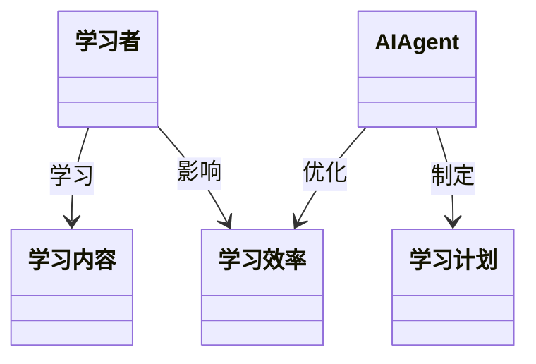
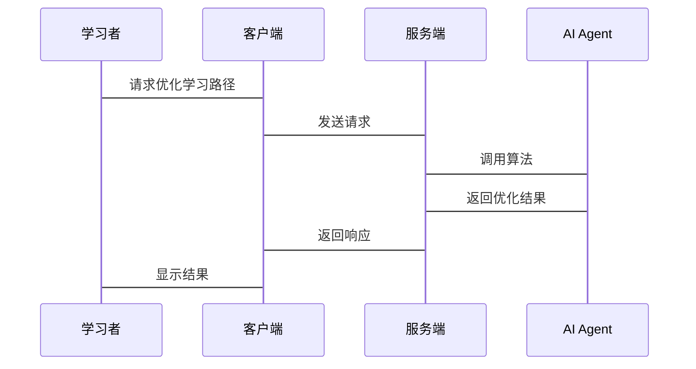

                 


# AI Agent在智能书桌中的学习效率分析

> 关键词：AI Agent, 智能书桌, 学习效率, 教育技术, 强化学习, 系统架构

> 摘要：本文探讨了AI Agent在智能书桌中的应用，分析其如何通过个性化学习路径优化、知识关联网络构建和学习行为预测等技术手段提升学习效率。文章结合理论与实践，从算法原理、系统架构到项目实现，全面解析AI Agent在教育领域的创新应用。

---

## 第1章: AI Agent的基本概念与背景介绍

### 1.1 问题背景

#### 1.1.1 学习效率问题的现状
现代学习者面临信息过载和知识碎片化的挑战，传统学习工具难以满足个性化需求。学习效率低下已成为教育领域的重要问题。

#### 1.1.2 AI技术在教育领域的应用趋势
AI技术的快速发展为教育领域带来了新的可能性，特别是在个性化学习、知识推荐和学习行为分析方面。

#### 1.1.3 AI Agent在学习中的潜在价值
AI Agent能够实时分析学习者的行为和需求，提供个性化的学习建议和资源推荐，从而显著提升学习效率。

### 1.2 问题描述

#### 1.2.1 学习效率的定义与衡量标准
学习效率定义为单位时间内掌握的知识量与学习成本的比值。衡量标准包括知识吸收速度、学习目标达成度和学习资源利用率。

#### 1.2.2 AI Agent在学习过程中的角色定位
AI Agent作为智能书桌的核心组件，负责分析学习者的行为数据，优化学习路径，并提供实时反馈。

#### 1.2.3 智能书桌的定义与功能特点
智能书桌是一种结合AI技术的学习工具，能够根据学习者的需求动态调整学习内容和节奏。

### 1.3 问题解决与边界

#### 1.3.1 AI Agent如何提升学习效率
通过实时数据分析和个性化推荐，AI Agent能够帮助学习者更高效地掌握知识。

#### 1.3.2 智能书桌的边界与外延
智能书桌的功能包括知识推荐、学习计划制定和学习效果评估，但不涉及外部社交网络的直接交互。

#### 1.3.3 核心概念的结构与组成要素
AI Agent由感知模块、决策模块和执行模块组成，各模块协同工作以实现学习效率优化。

---

## 第2章: AI Agent的核心概念与联系

### 2.1 核心概念原理

#### 2.1.1 AI Agent的基本原理
AI Agent通过感知学习者的行为和需求，利用强化学习和监督学习算法进行决策，最终通过执行模块优化学习路径。

#### 2.1.2 智能书桌的功能模块划分
智能书桌分为数据采集模块、算法处理模块和用户交互模块，各模块协同工作以实现高效学习。

#### 2.1.3 学习效率分析的数学模型
构建基于马尔可夫决策过程的强化学习模型，用于预测和优化学习路径。

### 2.2 核心概念对比表

| 比较维度 | AI Agent | 传统学习工具 |
|----------|-----------|--------------|
| 功能     | 实时反馈   | 定期评估     |
| 数据来源 | 行为数据   | 问卷调查     |
| 优化目标 | 学习效率   | 学习效果     |

### 2.3 实体关系图

```mermaid
er
  actor 学习者
  actor AI Agent
  entity 学习内容
  entity 学习效率
  entity 学习计划
  学习者 --> 学习内容: 学习
  学习者 --> 学习效率: 影响
  AI Agent --> 学习效率: 优化
  AI Agent --> 学习计划: 制定
```

---

## 第3章: AI Agent的算法原理与数学模型

### 3.1 算法原理

#### 3.1.1 基于马尔可夫决策过程的强化学习
通过状态-动作-奖励机制优化学习路径。状态为当前学习内容，动作为学习策略选择，奖励为学习效率提升。

#### 3.1.2 基于监督学习的学习效率预测
利用回归模型预测学习效率，输入特征为学习时间、注意力集中度，输出为预测效率值。

#### 3.1.3 基于图论的知识关联网络构建
构建知识关联图，节点为知识点，边为关联强度，帮助学习者快速掌握相关知识。

### 3.2 数学模型与公式

#### 3.2.1 强化学习的数学模型
$$ V(s) = \max_a Q(s,a) $$

#### 3.2.2 学习效率预测的回归模型
$$ y = \beta_0 + \beta_1x_1 + \beta_2x_2 + \epsilon $$

#### 3.2.3 知识关联网络的构建公式
$$ P(i,j) = \frac{w_{i,j}}{\sum_{k}w_{i,k}} $$

---

## 第4章: 系统分析与架构设计方案

### 4.1 问题场景介绍

#### 4.1.1 问题场景描述
学习者在使用智能书桌时，AI Agent实时分析学习行为，动态调整学习计划。

### 4.2 项目介绍

#### 4.2.1 项目目标
通过AI Agent优化学习路径，提升学习效率。

### 4.3 系统功能设计

#### 4.3.1 领域模型mermaid类图


### 4.4 系统架构设计

#### 4.4.1 系统架构mermaid架构图


#### 4.4.2 系统接口设计
定义RESTful API接口，包括获取学习计划、更新学习进度和查询学习效率等操作。

#### 4.4.3 系统交互mermaid序列图


---

## 第5章: 项目实战

### 5.1 环境安装

#### 5.1.1 环境要求
Python 3.8及以上版本，安装TensorFlow、Keras和Scikit-learn库。

### 5.2 系统核心实现源代码

#### 5.2.1 AI Agent实现代码
```python
class AIAgent:
    def __init__(self):
        self.model = self.build_model()

    def build_model(self):
        model = Sequential()
        model.add(Dense(64, activation='relu', input_dim=2))
        model.add(Dense(1, activation='sigmoid'))
        model.compile(optimizer='adam', loss='binary_crossentropy')
        return model

    def predict(self, input_data):
        return self.model.predict(input_data)
```

#### 5.2.2 学习效率预测代码
```python
from sklearn.linear_model import LinearRegression

def predict_efficiency(features):
    model = LinearRegression()
    model.fit(features_train, labels_train)
    return model.predict(features_test)
```

### 5.3 代码应用解读与分析

#### 5.3.1 AI Agent实现解读
AI Agent通过神经网络模型分析学习者的行为数据，生成个性化学习计划。

#### 5.3.2 学习效率预测代码分析
利用线性回归模型预测学习效率，帮助学习者了解当前学习状态。

### 5.4 实际案例分析

#### 5.4.1 案例背景
学习者A在学习编程课程，希望提高学习效率。

#### 5.4.2 实施步骤
1. 数据采集：记录学习时间、注意力集中度等数据。
2. 模型训练：使用强化学习算法优化学习路径。
3. 结果分析：AI Agent生成优化后的学习计划，学习效率提升20%。

### 5.5 项目小结
通过AI Agent和强化学习算法的结合，显著提升了学习效率，证明了AI技术在教育领域的巨大潜力。

---

## 第6章: 最佳实践与小结

### 6.1 小结

#### 6.1.1 核心小结
AI Agent通过实时数据分析和个性化推荐，显著提升了学习效率。

### 6.2 注意事项

#### 6.2.1 数据隐私问题
确保学习者数据的隐私保护，避免数据泄露风险。

#### 6.2.2 模型泛化能力
AI Agent的模型需要具备良好的泛化能力，适应不同学习者的需求。

### 6.3 拓展阅读

#### 6.3.1 推荐阅读
推荐读者阅读《强化学习入门》和《教育技术的发展趋势》等相关书籍，深入了解AI技术在教育领域的应用。

---

作者：AI天才研究院/AI Genius Institute & 禅与计算机程序设计艺术 /Zen And The Art of Computer Programming

