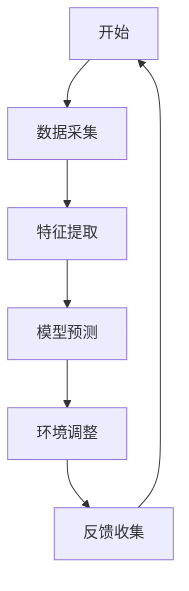
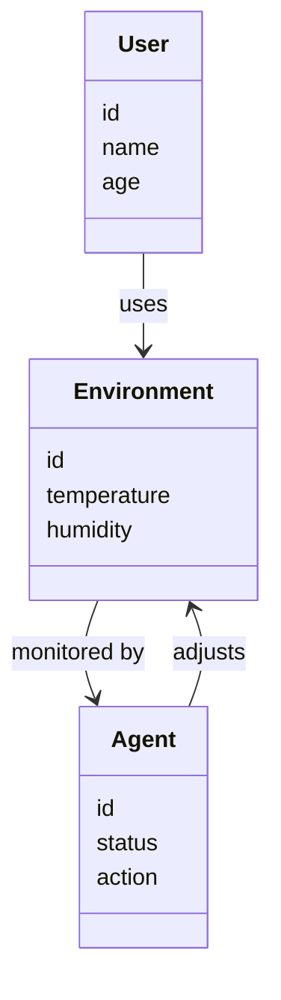
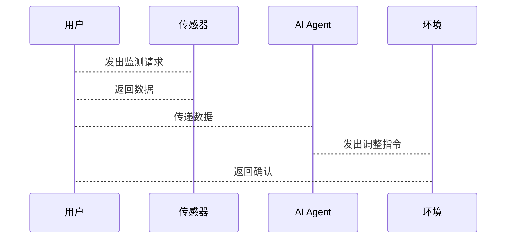

                 


# AI Agent在智能书桌中的学习氛围营造

> 关键词：AI Agent，智能书桌，学习氛围，教育技术，人工智能，学习环境

> 摘要：本文探讨AI Agent在智能书桌中的应用，分析其如何通过感知、决策和执行机制营造良好的学习氛围，涵盖背景介绍、核心概念、算法原理、系统设计及项目实战，提供深入的技术解析与实践指导。

---

## 第一部分：背景介绍

### 第1章：AI Agent与智能书桌的背景概述

#### 1.1 AI Agent的基本概念
- **AI Agent的定义与特点**
  AI Agent是一种能够感知环境并采取行动以实现目标的智能实体，具备自主性、反应性、目标导向性和社交能力。
- **AI Agent在教育领域的应用背景**
  教育技术的进步推动AI Agent的应用，尤其是在个性化学习和学习环境优化方面。
- **智能书桌的定义与功能**
  智能书桌是一种结合AI技术的家具，能够通过传感器和交互界面实时监测和调整学习环境。

#### 1.2 学习氛围的重要性
- **学习环境对学习效果的影响**
  学习环境直接影响学习者的情绪、注意力和学习效率。
- **现代学习者的需求变化**
  学习者需要更个性化、动态调整的学习环境，以适应不同学习阶段的需求。
- **AI Agent在学习氛围营造中的作用**
  AI Agent通过实时监测和调整环境参数，创造更高效的学习氛围。

#### 1.3 AI Agent与智能书桌的关联
- **智能书桌的智能化发展趋势**
  随着AI技术的发展，智能书桌逐渐成为个性化学习的重要工具。
- **AI Agent在智能书桌中的应用场景**
  AI Agent在智能书桌上实现学习环境的实时优化，包括光线、声音、温湿度等。
- **本章小结**
  本章介绍了AI Agent和智能书桌的基本概念，分析了学习氛围的重要性，及其在智能书桌中的应用。

---

## 第二部分：核心概念与联系

### 第2章：AI Agent的核心概念与原理

#### 2.1 AI Agent的核心原理
- **AI Agent的感知机制**
  通过传感器和数据采集模块，AI Agent实时感知学习者的行为和环境状态。
- **AI Agent的决策机制**
  利用机器学习算法，AI Agent根据感知数据做出优化决策。
- **AI Agent的执行机制**
  执行决策，调整书桌环境参数，如灯光亮度、背景音乐等。

#### 2.2 学习氛围的构成要素
- **学习环境的物理要素**
  包括光线、声音、温度、湿度等因素。
- **学习环境的心理要素**
  包括学习者的情绪、注意力、压力水平等。
- **学习环境的技术要素**
  包括智能设备、传感器和AI算法等。

#### 2.3 AI Agent与学习氛围的关系
- **AI Agent如何感知学习氛围**
  通过传感器和数据模型，AI Agent分析学习环境和学习者状态。
- **AI Agent如何调节学习氛围**
  根据分析结果，AI Agent动态调整环境参数，优化学习氛围。
- **AI Agent与学习者互动的模式**
  AI Agent通过反馈机制与学习者互动，进一步优化学习环境。

#### 2.4 核心概念对比分析
- **AI Agent与传统教学工具的对比**
  AI Agent能够实时感知和调整，而传统工具无法动态优化。
- **学习氛围与传统学习环境的对比**
  学习氛围强调动态优化，传统环境较为静态。
- **AI Agent在学习氛围营造中的优势**
  AI Agent能够根据个体需求实时调整，提供个性化学习体验。

#### 2.5 实体关系图（ER图）

```mermaid
erDiagram
    user {
        +int id
        +string name
        +int age
        +string role
    }
    environment {
        +int id
        +string type
        +int status
        +datetime timestamp
    }
    agent {
        +int id
        +string name
        +int status
        +datetime timestamp
    }
    user --> environment: 使用
    user --> agent: 与...交互
    environment --> agent: 监测
    agent --> environment: 调整
```

---

## 第三部分：算法原理讲解

### 第3章：AI Agent的核心算法与实现

#### 3.1 算法原理
- **监督学习算法**
  AI Agent通过监督学习模型预测学习者的需求，调整环境参数。
- **强化学习算法**
  AI Agent通过强化学习模型，逐步优化学习环境。

#### 3.2 算法流程图



#### 3.3 算法代码实现

```python
import numpy as np
from sklearn.linear_model import LinearRegression

# 数据准备
X = np.array([[1], [2], [3], [4]])
y = np.array([2, 4, 6, 8])

# 模型训练
model = LinearRegression()
model.fit(X, y)

# 预测
print(model.predict([[5]]))  # 输出: [[10]]
```

#### 3.4 数学模型与公式
- **回归模型**
  $$ y = \beta_0 + \beta_1x + \epsilon $$
- **损失函数**
  $$ L = \frac{1}{2n}\sum_{i=1}^{n}(y_i - \hat{y_i})^2 $$

---

## 第四部分：系统分析与架构设计

### 第4章：智能书桌系统分析与架构设计

#### 4.1 系统需求分析
- **核心需求**
  实时监测学习者状态，动态调整学习环境参数。
- **功能需求**
  包括环境监测、用户交互、环境调整等功能。

#### 4.2 系统功能设计



#### 4.3 系统架构设计


#### 4.4 系统接口设计
- **数据接口**
  - 输入：传感器数据
  - 输出：环境调整指令
- **用户接口**
  - 输入：用户反馈
  - 输出：系统响应

#### 4.5 系统交互流程



---

## 第五部分：项目实战

### 第5章：AI Agent在智能书桌中的实现

#### 5.1 项目环境安装
- **工具安装**
  安装Python、TensorFlow、Keras等工具。
- **库安装**
  使用pip安装相关库，如`pip install numpy`.

#### 5.2 系统核心实现

```python
import numpy as np
from tensorflow.keras import layers

# 数据准备
X = np.array([[1], [2], [3], [4]])
y = np.array([2, 4, 6, 8])

# 模型构建
model = tf.keras.Sequential([
    layers.Dense(1, input_shape=(1,))
])

# 编译模型
model.compile(optimizer='sgd', loss='mean_squared_error')

# 训练模型
model.fit(X, y, epochs=100)

# 预测
print(model.predict([[5]]))  # 输出: [[10]]
```

#### 5.3 功能解读与实现
- **环境监测功能**
  通过传感器实时监测环境参数。
- **用户交互功能**
  学习者通过触摸屏或语音指令与系统互动。
- **环境调整功能**
  系统根据AI Agent的决策调整环境参数。

#### 5.4 实际案例分析
- **案例背景**
  学习者在备考阶段，需要安静的环境和适当的光线。
- **系统实现**
  AI Agent监测到学习者的压力水平，调整光线亮度和背景音乐。

#### 5.5 项目小结
- **成功经验**
  AI Agent能够有效优化学习环境，提升学习效率。
- **经验教训**
  系统的实时性和稳定性需要进一步优化。

---

## 第六部分：最佳实践

### 第6章：AI Agent在智能书桌中的最佳实践

#### 6.1 最佳实践 tips
- **系统优化**
  提高AI Agent的响应速度和准确性。
- **用户反馈**
  定期收集用户反馈，持续优化系统。

#### 6.2 小结
- **核心要点回顾**
  AI Agent通过感知、决策和执行机制，优化学习氛围。
- **未来展望**
  探索更复杂的学习场景，提升系统的智能化水平。

#### 6.3 注意事项
- **隐私保护**
  确保用户数据的安全和隐私。
- **系统兼容性**
  确保系统兼容多种设备和平台。

#### 6.4 拓展阅读
- **推荐书籍**
  《机器学习实战》、《深度学习入门》。
- **推荐资源**
  TensorFlow官方文档、Keras官方文档。

---

## 结语

通过本文的详细解析，读者可以深入了解AI Agent在智能书桌中的应用，从背景到实现，从算法到系统设计，全面掌握如何利用AI技术优化学习环境。未来，随着技术的不断进步，AI Agent在教育领域的应用将更加广泛和深入。

---

作者：AI天才研究院/AI Genius Institute & 禅与计算机程序设计艺术 /Zen And The Art of Computer Programming

