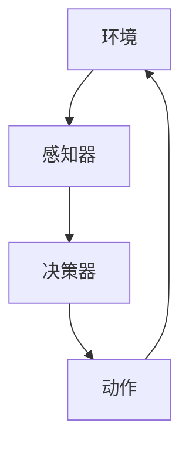
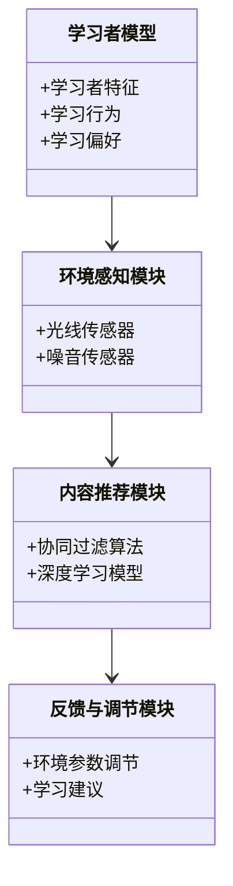
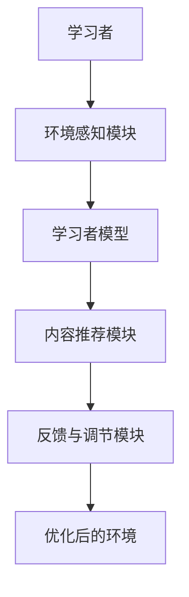
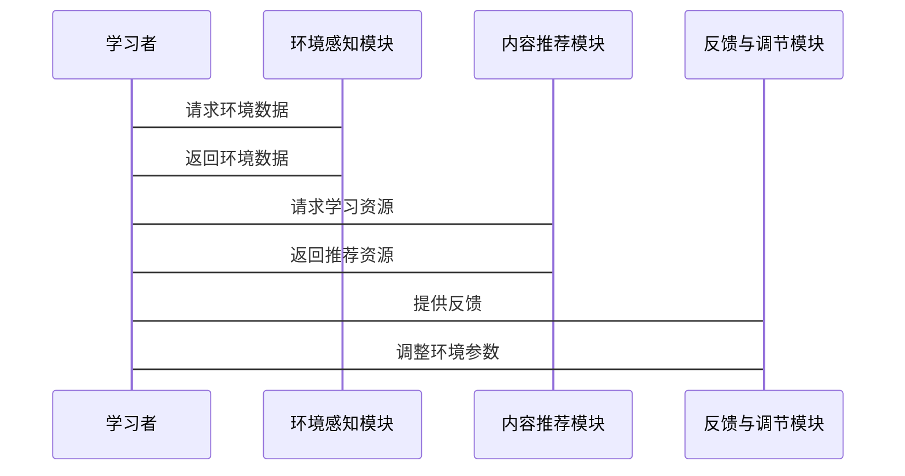

                 


# AI Agent在智能书桌中的学习环境优化

> 关键词：AI Agent, 智能书桌, 学习环境优化, 教育科技, 人工智能

> 摘要：本文探讨AI Agent在智能书桌中的应用，分析其如何通过优化学习环境提升学习效果，详细介绍AI Agent的核心原理、系统架构、算法实现及实际案例，为教育科技的发展提供新思路。

---

# 第1章 AI Agent与智能书桌概述

## 1.1 AI Agent的基本概念
### 1.1.1 什么是AI Agent
AI Agent（人工智能代理）是能够感知环境并采取行动以实现目标的智能实体。它通过传感器获取信息，利用算法处理数据，做出决策并执行动作。

### 1.1.2 AI Agent的核心特征
| 特性 | 描述 |
|------|------|
| 感知能力 | 通过传感器或数据接口获取环境信息 |
| 决策能力 | 基于机器学习模型做出最优决策 |
| 自适应能力 | 根据反馈调整行为和策略 |
| 交互能力 | 与用户或其他系统进行实时互动 |

### 1.1.3 AI Agent在教育领域的应用潜力
AI Agent在教育中的潜力主要体现在个性化学习、资源推荐和学习效果评估等方面，能够显著提升学习效率。

## 1.2 智能书桌的概念与特点
### 1.2.1 智能书桌的定义
智能书桌是一种结合了物联网和AI技术的智能学习工具，能够实时感知学习者的行为和环境，提供个性化支持。

### 1.2.2 智能书桌的功能模块
1. **环境感知模块**：监测光照、噪音等环境因素。
2. **学习者行为分析模块**：分析学习者的注意力、情绪等。
3. **个性化推荐模块**：根据学习者需求推荐学习资源。
4. **反馈与调节模块**：实时调整学习环境参数。

### 1.2.3 智能书桌与传统书桌的区别
智能书桌通过AI技术实现动态优化，而传统书桌不具备智能调节功能。

## 1.3 学习环境优化的重要性
### 1.3.1 学习环境对学习效果的影响
良好的学习环境能够提高学习效率和质量，反之则会影响学习效果。

### 1.3.2 传统学习环境的局限性
传统学习环境往往缺乏个性化和动态调节能力，难以满足不同学习者的需求。

### 1.3.3 AI Agent在优化学习环境中的优势
AI Agent能够实时感知和调整环境，提供个性化的学习支持，显著提升学习效果。

## 1.4 本章小结
本章介绍了AI Agent的基本概念、智能书桌的功能模块及其在优化学习环境中的优势，为后续章节的深入分析奠定基础。

---

# 第2章 AI Agent的核心原理

## 2.1 AI Agent的基本原理
### 2.1.1 AI Agent的感知与决策机制
AI Agent通过感知环境、分析信息、制定策略和执行动作来实现目标。

### 2.1.2 基于强化学习的决策模型
**强化学习**：通过奖励机制训练AI Agent，使其在与环境交互中不断优化决策。



### 2.1.3 AI Agent的反馈机制
AI Agent通过反馈机制调整行为，确保决策的最优性。

## 2.2 AI Agent的核心技术
### 2.2.1 自然语言处理技术
自然语言处理（NLP）使AI Agent能够理解并生成人类语言，支持智能交互。

### 2.2.2 机器学习算法
机器学习算法帮助AI Agent从数据中学习，提升决策能力。

### 2.2.3 知识图谱构建与应用
知识图谱为AI Agent提供结构化的知识，支持更精准的推理和决策。

## 2.3 AI Agent与智能书桌的结合
### 2.3.1 AI Agent在智能书桌中的角色
AI Agent作为智能书桌的核心，负责环境感知、资源推荐和行为调节。

### 2.3.2 AI Agent如何优化学习环境
通过实时分析学习者的行为和环境数据，AI Agent动态调整学习环境参数，如光线、噪音等，以提升学习效率。

### 2.3.3 AI Agent与学习者的交互方式
AI Agent通过自然语言处理和图形界面与学习者互动，提供个性化的学习建议和资源推荐。

## 2.4 本章小结
本章详细讲解了AI Agent的核心原理和关键技术，分析了其在智能书桌中的具体应用，为后续章节的系统设计奠定基础。

---

# 第3章 AI Agent优化学习环境的实现原理

## 3.1 AI Agent的学习者模型构建
### 3.1.1 学习者特征分析
分析学习者的性格、兴趣、学习风格等特征，构建个性化学习模型。

### 3.1.2 学习者行为建模
基于机器学习算法，建立学习者行为模型，预测其学习偏好。

### 3.1.3 学习者偏好预测
通过历史数据和实时行为分析，预测学习者的偏好，优化学习资源推荐。

## 3.2 AI Agent的学习内容推荐
### 3.2.1 基于协同过滤的内容推荐
协同过滤通过分析学习者的行为和偏好，推荐相似的学习资源。

### 3.2.2 基于深度学习的内容推荐
深度学习模型能够捕捉更复杂的学习者特征，提供更精准的推荐。

### 3.2.3 动态调整推荐策略
根据学习者反馈和环境变化，动态调整推荐策略，确保推荐的准确性。

## 3.3 AI Agent的学习过程监控
### 3.3.1 学习过程数据采集
通过传感器和日志记录，采集学习者的行为数据。

### 3.3.2 学习状态实时反馈
实时分析学习者的行为数据，提供反馈，帮助学习者调整学习状态。

### 3.3.3 学习效果评估与优化
通过评估学习效果，优化学习环境和资源推荐策略。

## 3.4 本章小结
本章详细探讨了AI Agent在学习环境优化中的实现原理，包括学习者模型构建、内容推荐和学习过程监控，为系统的实际应用提供了理论支持。

---

# 第4章 AI Agent优化学习环境的系统设计

## 4.1 系统架构设计
### 4.1.1 问题场景介绍
学习环境复杂多变，传统方法难以实时优化，AI Agent通过动态调整提供解决方案。

### 4.1.2 项目介绍
本项目旨在开发一个基于AI Agent的智能书桌系统，优化学习环境。

### 4.1.3 系统功能设计


### 4.1.4 系统架构设计


### 4.1.5 系统接口设计
系统接口包括环境数据接口、学习者行为接口和推荐算法接口，确保各模块协同工作。

## 4.2 系统交互设计
### 4.2.1 系统交互流程
学习者使用智能书桌，系统通过感知环境、分析行为、推荐资源和实时反馈，优化学习环境。

### 4.2.2 交互流程图


## 4.3 本章小结
本章通过系统架构和交互设计，详细阐述了AI Agent优化学习环境的具体实现方式，为后续的项目开发提供了指导。

---

# 第5章 项目实战

## 5.1 环境安装与配置
### 5.1.1 安装Python环境
安装Python 3.8及以上版本，建议使用Anaconda或virtualenv管理环境。

### 5.1.2 安装依赖库
安装必要的库，如numpy、pandas、scikit-learn、tensorflow等。

## 5.2 核心代码实现
### 5.2.1 学习者模型构建
```python
import numpy as np
from sklearn.cluster import KMeans

# 示例：基于K均值算法构建学习者模型
X = np.array([[1, 2], [3, 4], [5, 6]])
kmeans = KMeans(n_clusters=2).fit(X)
print(kmeans.labels_)
```

### 5.2.2 内容推荐算法实现
```python
import pandas as pd
from sklearn.metrics.pairwise import cosine_similarity

# 示例：基于协同过滤的内容推荐
data = pd.DataFrame({
    '用户': [1, 2, 3],
    '资源': ['A', 'B', 'A']
})
similarity = cosine_similarity(data)
print(similarity)
```

### 5.2.3 反馈与调节模块
```python
import numpy as np

# 示例：基于强化学习的反馈调节
def reward_function(action):
    return action * 2

action = 1
reward = reward_function(action)
print(reward)
```

## 5.3 代码解读与分析
### 5.3.1 学习者模型构建代码解读
上述代码使用K均值算法对学习者进行聚类，构建个性化模型。

### 5.3.2 内容推荐算法实现解读
基于协同过滤的推荐算法计算用户之间的相似度，实现个性化推荐。

### 5.3.3 反馈与调节模块代码解读
通过强化学习机制，根据反馈调整环境参数，优化学习效果。

## 5.4 实际案例分析
### 5.4.1 案例背景
学习者A在学习过程中注意力不集中，系统通过分析其行为和环境数据，调整光线和噪音水平，推荐相关学习资源。

### 5.4.2 案例分析
系统首先采集学习者的行为数据，分析其注意力波动，然后调整书桌的光线亮度和背景音乐，最后推荐与当前学习主题相关的资源。

## 5.5 项目小结
本章通过实际案例分析和代码实现，详细展示了AI Agent在智能书桌中的应用，验证了其优化学习环境的有效性。

---

# 第6章 最佳实践

## 6.1 小结
AI Agent通过优化学习环境，显著提升了学习效果，其在智能书桌中的应用前景广阔。

## 6.2 注意事项
1. 数据隐私保护：确保学习者数据的安全性。
2. 系统稳定性：确保AI Agent在复杂环境下的稳定运行。
3. 用户体验：优化人机交互，提升用户体验。

## 6.3 拓展阅读
推荐阅读《强化学习入门》和《机器学习实战》，深入了解AI Agent的核心技术。

---

# 作者：AI天才研究院/AI Genius Institute & 禅与计算机程序设计艺术 /Zen And The Art of Computer Programming

