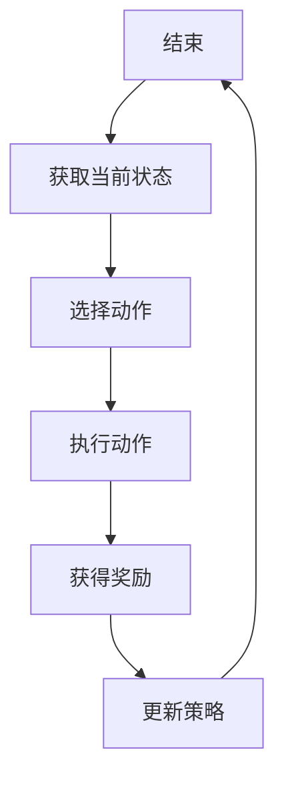
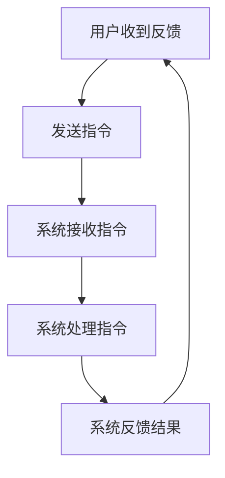
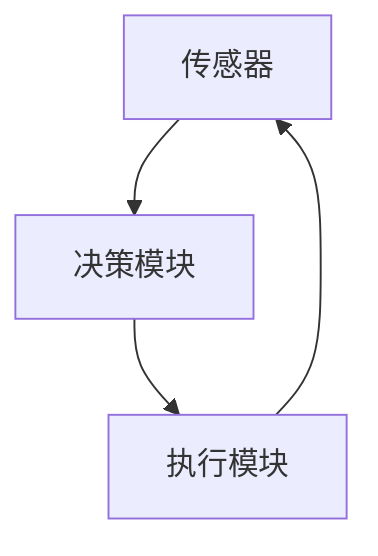

                 


# AI Agent在智能书桌灯中的照明优化

> 关键词：AI Agent，智能书桌灯，照明优化，算法原理，系统架构，项目实战

> 摘要：本文详细探讨了AI Agent在智能书桌灯中的应用，从算法原理到系统架构，再到项目实战，系统地分析了如何通过AI技术优化照明体验。文章结合理论与实践，展示了AI Agent在智能书桌灯中的潜力和应用价值。

---

## 第1章 AI Agent与智能照明系统概述

### 1.1 AI Agent的基本概念

#### 1.1.1 AI Agent的定义与特点
AI Agent（人工智能代理）是一种能够感知环境、自主决策并执行任务的智能体。它具备以下特点：
- **自主性**：能够自主决策，无需外部干预。
- **反应性**：能够实时感知环境并做出反应。
- **目标导向**：基于目标进行决策和行动。

#### 1.1.2 AI Agent的核心功能与应用场景
AI Agent的核心功能包括感知、推理、决策和执行。在智能书桌灯中的应用场景主要有：
- 根据用户行为调整亮度。
- 自动调节色温以适应不同场景。
- 学习用户的使用习惯，提供个性化照明方案。

#### 1.1.3 智能书桌灯的照明优化需求
智能书桌灯的照明优化需求主要体现在：
- 提供舒适的阅读环境。
- 节能减排，降低能耗。
- 提供智能化的控制方式。

### 1.2 智能照明系统的基本原理

#### 1.2.1 照明系统的组成与分类
智能照明系统通常由传感器、控制器、执行器和用户界面组成。常见的分类包括：
- 基于时间的照明系统。
- 基于场景的照明系统。
- 基于用户行为的照明系统。

#### 1.2.2 智能照明系统的控制方式
智能照明系统的控制方式主要有：
- 手动控制：用户通过按钮或App进行控制。
- 自动控制：系统根据环境或用户行为自动调整。

#### 1.2.3 智能书桌灯的特殊需求与挑战
智能书桌灯的特殊需求包括：
- 高精度的光线调节。
- 快速响应用户需求。
- 能耗控制。

### 1.3 AI Agent在智能书桌灯中的作用

#### 1.3.1 AI Agent如何优化照明
AI Agent通过以下方式优化照明：
- 自动调整亮度和色温。
- 学习用户的使用习惯，提供个性化照明方案。

#### 1.3.2 AI Agent与智能书桌灯的结合方式
AI Agent与智能书桌灯的结合方式包括：
- 硬件集成：AI Agent嵌入灯具内部。
- 软件控制：AI Agent通过App或云平台控制灯具。

#### 1.3.3 照明优化的用户需求与体验提升
用户需求主要体现在：
- 舒适性：光线柔和，保护视力。
- 智能性：自动化控制，方便使用。
- 节能性：降低能耗，环保。

---

## 第2章 AI Agent的核心算法与原理

### 2.1 AI Agent的算法基础

#### 2.1.1 机器学习算法简介
机器学习算法是AI Agent的核心，常用算法包括：
- **监督学习**：如线性回归、支持向量机。
- **无监督学习**：如聚类、降维。

#### 2.1.2 强化学习算法简介
强化学习通过奖励机制优化决策，常用算法包括：
- Q-Learning。
- Deep Q-Networks。

#### 2.1.3 联合概率图模型简介
联合概率图模型用于推理和决策，常用模型包括：
- Bayesian Network。
- Markov Decision Process。

### 2.2 AI Agent在照明优化中的算法选择

#### 2.2.1 算法选择的依据与标准
选择算法的依据包括：
- 数据量：监督学习需要大量数据，强化学习适合实时反馈。
- 响应时间：强化学习适合实时调整，无监督学习适合长期优化。

#### 2.2.2 基于强化学习的照明优化算法
强化学习通过奖励机制优化照明参数，算法流程如下：



#### 2.2.3 基于机器学习的用户行为预测算法
用户行为预测算法用于预测用户的使用习惯，常用模型包括：
- K近邻算法（KNN）。
- 支持向量回归（SVR）。

### 2.3 算法实现的数学模型

#### 2.3.1 强化学习的数学模型
强化学习的数学模型如下：

$$ R(s, a) = \sum_{s'} P(s'|s,a) R(s',a) $$

其中：
- \( R(s,a) \)：状态-动作对的奖励。
- \( P(s'|s,a) \)：从状态\( s \)执行动作\( a \)转移到状态\( s' \)的概率。

#### 2.3.2 用户行为预测的数学模型
用户行为预测模型如下：

$$ \hat{y} = \sum_{i=1}^n w_i x_i + b $$

其中：
- \( \hat{y} \)：预测的用户行为。
- \( w_i \)：权重。
- \( x_i \)：输入特征。
- \( b \)：偏置项。

---

## 第3章 AI Agent与智能照明系统的系统架构

### 3.1 系统架构设计

#### 3.1.1 系统功能模块划分
系统功能模块包括：
- 状态感知模块：感知光照、用户行为。
- 决策控制模块：基于感知数据做出决策。
- 执行模块：调整灯具参数。

#### 3.1.2 系统架构的分层设计
系统架构分为：
- 传感器层：收集环境数据。
- 控制层：处理数据并做出决策。
- 执行层：调整灯具参数。

#### 3.1.3 系统架构的可扩展性设计
系统架构具备良好的扩展性，支持多种灯具类型和控制方式。

### 3.2 系统功能设计

#### 3.2.1 照明优化功能模块
照明优化功能模块包括：
- 自动调整亮度和色温。
- 用户行为分析。

#### 3.2.2 用户行为分析模块
用户行为分析模块包括：
- 数据采集：记录用户的使用习惯。
- 数据分析：分析用户行为，预测需求。

#### 3.2.3 系统控制与反馈模块
系统控制与反馈模块包括：
- 接收用户指令。
- 调整灯具参数。
- 反馈执行结果。

### 3.3 系统接口设计

#### 3.3.1 系统内部接口设计
系统内部接口包括：
- 状态感知接口。
- 决策控制接口。

#### 3.3.2 系统外部接口设计
系统外部接口包括：
- 用户界面接口。
- 第三方服务接口。

#### 3.3.3 接口协议与数据格式
接口协议包括：
- HTTP协议。
- MQTT协议。

数据格式包括：
- JSON格式。
- XML格式。

### 3.4 系统交互设计

#### 3.4.1 用户与系统的交互流程
用户与系统的交互流程如下：



#### 3.4.2 系统内部的交互流程
系统内部的交互流程如下：



---

## 第4章 项目实战——AI Agent在智能书桌灯中的实现

### 4.1 项目环境与工具安装

#### 4.1.1 开发环境的搭建
开发环境包括：
- 操作系统：Windows 10或更高版本。
- 开发工具：PyCharm、VS Code。

#### 4.1.2 开发工具的选择与安装
开发工具选择：
- Python：用于算法实现。
- OpenCV：用于图像处理。
- Flask：用于Web接口。

#### 4.1.3 第三方库的安装与配置
安装第三方库：
- pip install numpy。
- pip install matplotlib。
- pip install flask。

### 4.2 系统核心功能实现

#### 4.2.1 AI Agent算法的实现
AI Agent算法实现如下：

```python
class AI-Agent:
    def __init__(self):
        self.model = self.build_model()

    def build_model(self):
        # 构建机器学习模型
        pass

    def predict(self, input):
        # 预测输出
        return self.model.predict(input)
```

#### 4.2.2 照明优化功能的实现
照明优化功能实现如下：

```python
def optimize_lighting():
    # 获取当前状态
    current_state = get_state()
    # 调整亮度和色温
    new_brightness = adjust_brightness(current_state)
    new_color_temp = adjust_color_temp(current_state)
    # 执行调整
    set_brightness(new_brightness)
    set_color_temp(new_color_temp)
```

#### 4.2.3 用户行为分析模块的实现
用户行为分析模块实现如下：

```python
def analyze_user_behavior():
    # 获取用户数据
    user_data = collect_user_data()
    # 分析行为模式
    behavior_pattern = detect_pattern(user_data)
    # 返回分析结果
    return behavior_pattern
```

### 4.3 代码实现与解读

#### 4.3.1 AI Agent算法的Python代码实现
AI Agent算法的Python代码实现如下：

```python
import numpy as np
from sklearn import linear_model

class AI-Agent:
    def __init__(self):
        self.model = linear_model.LinearRegression()

    def train(self, X, y):
        self.model.fit(X, y)

    def predict(self, X):
        return self.model.predict(X)
```

#### 4.3.2 照明优化功能的代码实现
照明优化功能的代码实现如下：

```python
def optimize_lighting(current_state):
    # 基于当前状态优化亮度和色温
    brightness = current_state['brightness']
    color_temp = current_state['color_temp']
    # 调整亮度
    new_brightness = brightness + 10
    # 调整色温
    new_color_temp = color_temp - 50
    return {'brightness': new_brightness, 'color_temp': new_color_temp}
```

#### 4.3.3 系统控制与反馈模块的代码实现
系统控制与反馈模块的代码实现如下：

```python
def control_system(action):
    # 执行动作并返回反馈
    feedback = execute_action(action)
    return feedback
```

### 4.4 系统优化与部署

#### 4.4.1 算法优化
算法优化包括：
- 参数调整：优化模型参数，提高预测精度。
- 模型优化：使用更复杂的模型，如深度学习模型。

#### 4.4.2 系统测试
系统测试包括：
- 功能测试：确保所有功能正常运行。
- 性能测试：测试系统在高负载下的表现。

#### 4.4.3 用户反馈与迭代优化
根据用户反馈，不断优化系统，提高用户体验。

### 4.5 本章小结

---

## 第5章 系统优化与部署

### 5.1 算法优化与调优

#### 5.1.1 基于强化学习的优化
优化策略包括：
- 使用更深的网络结构。
- 增加奖励机制的复杂性。

#### 5.1.2 系统性能优化
系统性能优化包括：
- 优化数据处理速度。
- 减少计算延迟。

### 5.2 系统测试与验证

#### 5.2.1 功能测试
功能测试包括：
- 测试亮度调节功能。
- 测试色温调节功能。

#### 5.2.2 性能测试
性能测试包括：
- 测试系统响应时间。
- 测试系统稳定性。

### 5.3 用户反馈与迭代优化

#### 5.3.1 用户反馈收集
用户反馈收集包括：
- 收集用户满意度调查。
- 分析用户使用日志。

#### 5.3.2 系统优化迭代
根据用户反馈，持续优化系统，提高用户体验。

### 5.4 本章小结

---

## 第6章 实际应用案例分析

### 6.1 案例背景介绍

#### 6.1.1 项目背景
项目背景包括：
- 项目目标：优化智能书桌灯的照明体验。
- 项目需求：提供个性化的照明方案。

### 6.2 系统实现与分析

#### 6.2.1 系统实现
系统实现包括：
- 硬件部分：智能书桌灯的硬件设计。
- 软件部分：AI Agent算法的实现。

#### 6.2.2 系统分析
系统分析包括：
- 功能实现：亮度和色温调节。
- 用户体验：舒适性和智能性。

### 6.3 实际应用效果

#### 6.3.1 应用效果评估
应用效果评估包括：
- 用户满意度调查。
- 系统性能测试。

#### 6.3.2 应用案例总结
应用案例总结包括：
- 成功经验：AI Agent优化照明体验。
- 改进建议：进一步优化算法和系统架构。

### 6.4 本章小结

---

## 第7章 总结与展望

### 7.1 研究成果总结

#### 7.1.1 核心成果
核心成果包括：
- 成功实现AI Agent在智能书桌灯中的应用。
- 提供个性化的照明优化方案。

#### 7.1.2 技术创新点
技术创新点包括：
- 强化学习在照明优化中的应用。
- 用户行为分析在智能控制中的应用。

### 7.2 研究不足与改进建议

#### 7.2.1 研究不足
研究不足包括：
- 算法的泛化能力有待提高。
- 系统的实时性有待优化。

#### 7.2.2 未来研究方向
未来研究方向包括：
- 更复杂的强化学习算法。
- 更智能的用户行为分析模型。

### 7.3 展望
未来，随着AI技术的发展，智能书桌灯将更加智能化和个性化，为用户提供更好的使用体验。

---

## 作者：AI天才研究院（AI Genius Institute）

欢迎关注我们的公众号或网站，获取更多关于AI和计算机程序设计的深度文章和技术分享！

