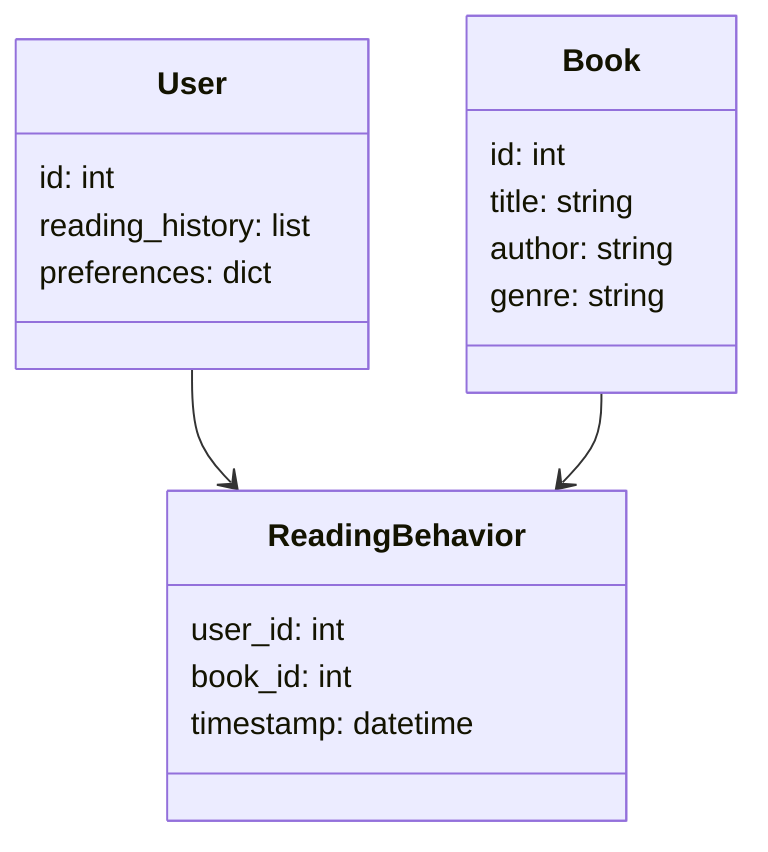
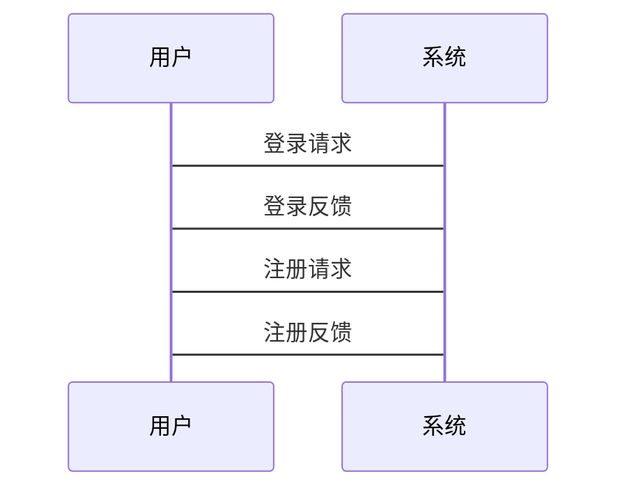

                 


# AI Agent在智能书立中的阅读习惯分析

> 关键词：AI Agent, 智能书架, 阅读习惯, 数据分析, 机器学习

> 摘要：本文探讨AI Agent在智能书架中的应用，分析其如何通过阅读习惯数据优化用户体验。从基础概念到系统架构，结合实际案例，详细阐述AI Agent在阅读习惯分析中的原理与实践。

---

## 第一部分: AI Agent与智能书架的背景与概念

### 第1章: AI Agent与智能书架概述

#### 1.1 AI Agent的基本概念

##### 1.1.1 什么是AI Agent
AI Agent（人工智能代理）是指能够感知环境并采取行动以实现目标的智能实体。它通过传感器获取信息，利用计算模型进行决策，并通过执行器与环境互动。

##### 1.1.2 AI Agent的核心特征
- **自主性**：无需外部干预，自主决策。
- **反应性**：实时感知环境变化并做出反应。
- **目标导向**：所有行为均以实现特定目标为导向。
- **学习能力**：通过经验改进自身性能。

##### 1.1.3 AI Agent与传统软件的区别
| 特性         | AI Agent                      | 传统软件                     |
|--------------|-----------------------------|-----------------------------|
| 智能性       | 高                           | 低                           |
| 自主性       | 强                           | 弱                           |
| 学习能力     | 强                           | 无                           |
| 适应性       | 高                           | 低                           |

#### 1.2 智能书架的定义与特点

##### 1.2.1 智能书架的概念
智能书架是结合AI技术的实体或虚拟设备，用于管理和推荐书籍，能够分析用户的阅读习惯，提供个性化服务。

##### 1.2.2 智能书架的功能特点
- **自动化推荐**：基于用户行为推荐书籍。
- **实时反馈**：即时更新推荐结果。
- **个性化服务**：根据用户偏好定制推荐。
- **数据驱动**：依赖用户行为数据进行分析。

##### 1.2.3 智能书架与传统书架的对比
| 特性         | 智能书架                      | 传统书架                     |
|--------------|-----------------------------|-----------------------------|
| 管理方式     | 智能化                       | 手动化                       |
| 用户体验     | 个性化                       | 标准化                       |
| 数据利用     | 高                           | 低                           |

#### 1.3 阅读习惯分析的必要性

##### 1.3.1 阅读习惯分析的意义
通过分析用户的阅读行为，智能书架可以优化推荐算法，提高用户体验。

##### 1.3.2 阅读习惯分析的应用场景
- **个性化推荐**：为用户提供定制化阅读建议。
- **市场分析**：帮助出版商了解读者偏好。
- **教育领域**：辅助学习者选择合适的学习材料。

##### 1.3.3 阅读习惯分析的挑战
- **数据隐私**：用户数据的安全性问题。
- **模型准确性**：如何提高推荐的准确性。
- **实时性要求**：需要快速响应用户需求。

#### 1.4 本章小结
本章介绍了AI Agent和智能书架的基本概念，并分析了阅读习惯分析的意义和应用场景，同时指出了面临的挑战。

---

## 第二部分: AI Agent在阅读习惯分析中的核心概念与联系

### 第2章: AI Agent的核心原理

#### 2.1 AI Agent的核心原理

##### 2.1.1 AI Agent的感知与决策机制
AI Agent通过传感器获取环境数据，利用算法进行处理，生成决策并执行。

##### 2.1.2 AI Agent的学习与推理过程
通过机器学习算法，AI Agent能够从历史数据中学习，推理出新的结论。

##### 2.1.3 AI Agent的自适应能力
AI Agent能够根据环境变化调整自身行为，以达到更好的目标实现。

#### 2.2 阅读习惯分析的核心要素

##### 2.2.1 阅读行为数据的采集
通过记录用户的阅读时间、频率、偏好等数据，分析用户的阅读习惯。

##### 2.2.2 阅读偏好分析的方法
- **基于协同过滤**：寻找相似用户的偏好。
- **基于内容推荐**：根据书籍内容推荐。
- **基于混合模型**：结合多种推荐方法。

##### 2.2.3 阅读习惯的预测模型
利用机器学习模型，预测用户的未来阅读行为。

#### 2.3 AI Agent与阅读习惯分析的关系

##### 2.3.1 AI Agent在阅读习惯分析中的角色
AI Agent作为数据处理和决策的核心，能够高效分析用户行为数据。

##### 2.3.2 AI Agent如何优化阅读习惯分析
通过实时数据处理和反馈机制，AI Agent能够提升推荐的准确性和及时性。

##### 2.3.3 阅读习惯分析对AI Agent的反哺作用
阅读习惯分析的结果能够优化AI Agent的算法和决策模型。

#### 1.4 本章小结
本章详细讲解了AI Agent的核心原理，并分析了其在阅读习惯分析中的应用，展示了两者之间的相互作用。

---

## 第三部分: 阅读习惯分析的算法原理与数学模型

### 第3章: 阅读习惯分析的算法原理

#### 3.1 阅读习惯分析的常用算法

##### 3.1.1 基于协同过滤的推荐算法

###### 3.1.1.1 基于用户的协同过滤
通过寻找相似用户的偏好，推荐书籍。

###### 3.1.1.2 基于物品的协同过滤
通过分析书籍之间的相似性，推荐相关书籍。

##### 3.1.2 基于聚类分析的阅读习惯分组
将用户按阅读习惯分为不同的群组，进行个性化推荐。

##### 3.1.3 基于深度学习的阅读行为预测
利用神经网络模型，预测用户的阅读行为。

#### 3.2 基于协同过滤的推荐算法

##### 3.2.1 协同过滤的基本原理
通过计算用户之间的相似度，推荐用户可能感兴趣的书籍。

##### 3.2.2 基于用户的协同过滤实现
```python
def user_based_recommendation(user_id):
    # 计算用户相似度
    similarity = compute_similarity(user_id)
    # 找到最相似的用户
    top_users = get_top_users(similarity)
    # 聚合他们的推荐
    recommendations = aggregate_recommendations(top_users)
    return recommendations
```

##### 3.2.3 基于物品的协同过滤实现
```python
def item_based_recommendation(item_id):
    # 计算物品相似度
    item_similarity = compute_item_similarity(item_id)
    # 推荐相似物品
    recommendations = get_similar_items(item_similarity)
    return recommendations
```

#### 3.3 阅读习惯分析的数学模型

##### 3.3.1 阅读行为数据的特征表示
将用户的阅读行为转化为向量形式，便于计算。

##### 3.3.2 阅读习惯的相似度计算公式
$$ \text{相似度} = \frac{\sum (x_i - \mu)(y_i - \mu)}{\sqrt{\sum (x_i - \mu)^2} \sqrt{\sum (y_i - \mu)^2}} $$

##### 3.3.3 阅读习惯预测的数学模型
使用逻辑回归模型预测用户是否感兴趣：
$$ P(y=1|x) = \frac{1}{1 + e^{-\beta x}} $$

#### 3.4 本章小结
本章详细介绍了阅读习惯分析的常用算法，并通过Python代码和数学公式展示了其工作原理。

---

## 第四部分: 系统分析与架构设计

### 第4章: 阅读习惯分析系统的架构设计

#### 4.1 系统功能

##### 4.1.1 数据采集模块
负责采集用户的阅读行为数据。

##### 4.1.2 数据分析模块
对采集的数据进行处理和分析，生成用户画像。

##### 4.1.3 推荐系统模块
根据分析结果，生成个性化推荐。

##### 4.1.4 用户界面模块
展示推荐结果，并与用户互动。

#### 4.2 系统架构

##### 4.2.1 领域模型类图


##### 4.2.2 系统架构图
```mermaid
client --> 数据采集模块
数据采集模块 --> 数据存储模块
数据存储模块 --> 数据分析模块
数据分析模块 --> 推荐系统模块
推荐系统模块 --> 客户端
```

#### 4.3 系统交互流程

##### 4.3.1 用户登录与注册


#### 4.4 本章小结
本章设计了阅读习惯分析系统的架构，并展示了各模块之间的关系和交互流程。

---

## 第五部分: 项目实战与优化

### 第5章: 项目实战

#### 5.1 环境安装与配置

##### 5.1.1 安装依赖
```bash
pip install numpy pandas scikit-learn
```

##### 5.1.2 配置开发环境
使用Jupyter Notebook进行开发和调试。

#### 5.2 核心代码实现

##### 5.2.1 数据预处理
```python
import pandas as pd

# 加载数据
data = pd.read_csv('reading_data.csv')

# 清洗数据
data.dropna(inplace=True)
```

##### 5.2.2 模型训练
```python
from sklearn.neighbors import NearestNeighbors

# 训练模型
model = NearestNeighbors(n_neighbors=5).fit(X)
```

##### 5.2.3 推荐结果展示
```python
# 查询相似书籍
distances, indices = model.kneighbors(X_test)
```

#### 5.3 实际案例分析

##### 5.3.1 案例背景
分析一名用户的阅读历史，预测其可能感兴趣的书籍。

##### 5.3.2 数据分析
通过协同过滤算法，找到相似用户的推荐结果。

##### 5.3.3 模型优化
调整算法参数，提高推荐的准确性。

#### 5.4 项目小结
本章通过实际案例展示了AI Agent在阅读习惯分析中的应用，并通过优化提升了推荐效果。

---

## 第六部分: 最佳实践与总结

### 第6章: 最佳实践

#### 6.1 小结与回顾

##### 6.1.1 AI Agent的核心作用
AI Agent在智能书架中的应用显著提升了用户体验。

##### 6.1.2 阅读习惯分析的价值
通过分析用户行为，优化推荐算法，提高用户满意度。

#### 6.2 注意事项与建议

##### 6.2.1 数据隐私保护
确保用户数据的安全性，遵守相关法律法规。

##### 6.2.2 模型调优
定期更新模型，保持推荐的准确性。

##### 6.2.3 用户反馈机制
建立有效的用户反馈机制，持续改进推荐算法。

#### 6.3 拓展阅读与学习

##### 6.3.1 推荐算法研究
深入研究最新的推荐算法，如深度学习模型。

##### 6.3.2 AI Agent技术发展
关注AI Agent领域的最新进展，提升系统性能。

---

## 作者：AI天才研究院/AI Genius Institute & 禅与计算机程序设计艺术 /Zen And The Art of Computer Programming

---

本文通过系统化的分析和实践，全面探讨了AI Agent在智能书架中的应用，展示了如何通过阅读习惯分析优化用户体验。从理论到实践，本文为读者提供了详尽的知识和指导，帮助他们更好地理解和应用相关技术。

