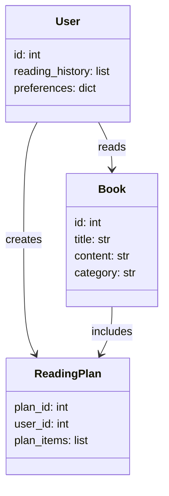

                 


# AI Agent在智能书立中的阅读习惯培养

## 关键词：AI Agent，智能书架，阅读习惯，推荐算法，协同过滤，文本分析，阅读计划

## 摘要：本文探讨AI Agent在智能书架中的应用，重点分析其如何通过感知用户阅读行为、优化推荐算法和动态调整阅读计划来培养用户的阅读习惯。文章从背景介绍、核心概念、算法原理、系统架构、项目实战、效果评估等多方面展开，详细阐述AI Agent在阅读习惯培养中的技术实现与应用价值。

---

# 第1章: AI Agent与智能书架的背景介绍

## 1.1 AI Agent的基本概念
### 1.1.1 什么是AI Agent
AI Agent（人工智能代理）是指能够感知环境、做出决策并执行任务的智能体。它能够通过传感器获取信息，利用计算模型进行分析，并通过执行器完成目标。

### 1.1.2 AI Agent的核心特征
- **自主性**：能够独立完成任务。
- **反应性**：能够实时感知环境变化并做出反应。
- **目标导向**：所有行为都围绕实现特定目标展开。
- **学习能力**：能够通过数据和经验不断优化自身的算法。

### 1.1.3 AI Agent与传统软件的区别
| 特性         | AI Agent                  | 传统软件              |
|--------------|---------------------------|-----------------------|
| 智能性       | 高                        | 低                    |
| 自主性       | 高                        | 低                    |
| 学习能力     | 高                        | 低                    |
| 适应性       | 高                        | 低                    |

---

## 1.2 智能书架的定义与特点
### 1.2.1 智能书架的定义
智能书架是一种结合了AI技术的电子书架系统，能够通过AI Agent自动推荐书籍、优化阅读计划并提供个性化的阅读服务。

### 1.2.2 智能书架的核心功能
- **个性化推荐**：根据用户的阅读历史和偏好推荐书籍。
- **阅读习惯分析**：通过分析用户的阅读行为，识别用户的阅读习惯和偏好。
- **动态调整**：根据用户的反馈和行为变化，实时调整推荐策略和阅读计划。

### 1.2.3 智能书架与传统书架的对比
| 特性         | 智能书架                | 传统书架              |
|--------------|-------------------------|-----------------------|
| 智能性       | 高                      | 低                    |
| 个性化       | 高                      | 低                    |
| 互动性       | 高                      | 低                    |

---

## 1.3 AI Agent在智能书架中的作用
### 1.3.1 AI Agent如何提升书架的智能化
AI Agent通过感知用户的行为、分析文本内容并做出决策，使书架具备智能化的推荐和个性化服务能力。

### 1.3.2 AI Agent在阅读习惯培养中的应用
AI Agent能够通过分析用户的阅读数据，识别用户的阅读偏好，制定个性化的阅读计划，并通过动态调整推荐策略帮助用户培养良好的阅读习惯。

### 1.3.3 AI Agent与用户阅读行为的交互模式
- **输入**：用户的阅读历史、当前阅读状态、反馈意见。
- **处理**：AI Agent通过分析数据，生成推荐列表和阅读计划。
- **输出**：推荐书籍、阅读计划、反馈建议。

---

## 1.4 本章小结
本章主要介绍了AI Agent的基本概念、智能书架的定义与特点，以及AI Agent在智能书架中的作用。通过对比传统书架和智能书架，强调了AI Agent在提升书架智能化和个性化服务方面的重要作用。

---

# 第2章: AI Agent与阅读习惯培养的核心概念

## 2.1 AI Agent的感知模块
### 2.1.1 用户阅读行为的感知
AI Agent通过收集用户的阅读历史、阅读速度、阅读时间等数据，感知用户的阅读行为。

### 2.1.2 文本内容的理解与分析
通过自然语言处理技术，AI Agent能够分析书籍的内容，提取关键词、主题和情感倾向。

### 2.1.3 用户阅读偏好的提取
基于用户的阅读数据和文本分析结果，AI Agent能够识别用户的阅读偏好和潜在兴趣。

---

## 2.2 AI Agent的决策模块
### 2.2.1 阅读习惯的分析与建模
AI Agent通过分析用户的阅读数据，建立阅读习惯模型，识别用户的阅读习惯和潜在需求。

### 2.2.2 阅读推荐的算法选择
- **协同过滤算法**：基于用户相似性推荐书籍。
- **基于内容的推荐算法**：基于书籍内容相似性推荐书籍。

### 2.2.3 阅读计划的自动生成
AI Agent根据用户的阅读习惯和推荐结果，自动生成个性化的阅读计划。

---

## 2.3 AI Agent的执行模块
### 2.3.1 阅读推荐的实现
AI Agent通过协同过滤或基于内容的推荐算法，为用户提供个性化的阅读推荐。

### 2.3.2 阅读习惯的反馈与优化
AI Agent通过用户的反馈不断优化推荐算法和阅读计划，提升用户体验。

### 2.3.3 阅读计划的动态调整
根据用户的反馈和行为变化，AI Agent动态调整阅读计划，确保用户的阅读习惯得到持续培养。

---

## 2.4 核心概念对比表
| 特性         | 协同过滤算法            | 基于内容的推荐算法      |
|--------------|-------------------------|------------------------|
| 基础         | 用户相似性              | 内容相似性              |
| 优缺点       | 优点：个性化推荐；缺点：计算复杂 | 优点：内容相关性高；缺点：推荐结果可能不够个性化 |

---

## 2.5 本章小结
本章详细介绍了AI Agent的感知、决策和执行模块在阅读习惯培养中的具体应用，分析了协同过滤和基于内容的推荐算法的特点和优缺点，为后续的算法实现和系统设计奠定了基础。

---

# 第3章: AI Agent的算法原理与数学模型

## 3.1 基于协同过滤的推荐算法
### 3.1.1 协同过滤的基本原理
协同过滤是一种基于用户相似性进行推荐的算法。通过计算用户之间的相似度，将目标用户喜欢的书籍推荐给相似的用户。

### 3.1.2 用户-物品矩阵的构建
用户-物品矩阵是一个二维数组，行表示用户，列表示书籍，元素表示用户对书籍的评分。

### 3.1.3 相似度计算公式
$$ sim(u_i, u_j) = \frac{\sum_{k=1}^{n} (r_{i,k} - \bar{r}_i)(r_{j,k} - \bar{r}_j)}{\sqrt{\sum_{k=1}^{n} (r_{i,k} - \bar{r}_i)^2} \cdot \sqrt{\sum_{k=1}^{n} (r_{j,k} - \bar{r}_j)^2}} $$

---

## 3.2 基于内容的推荐算法
### 3.2.1 文本相似度计算
通过计算书籍内容的相似度，推荐与当前书籍内容相似的书籍。

### 3.2.2 基于TF-IDF的权重计算
TF-IDF是一种常用的文本权重计算方法，用于衡量词语在文本中的重要性。

### 3.2.3 基于余弦相似度的内容推荐
$$ sim(text1, text2) = \frac{\sum_{i=1}^{n} (text1_i \cdot text2_i)}{\sqrt{\sum_{i=1}^{n} text1_i^2} \cdot \sqrt{\sum_{i=1}^{n} text2_i^2}} $$

---

## 3.3 算法实现与代码示例
### 3.3.1 协同过滤算法的Python实现
```python
import numpy as np

def collaborative_filtering(user_matrix):
    # 计算用户相似度矩阵
    user_similarity = np.zeros_like(user_matrix)
    for i in range(user_matrix.shape[0]):
        for j in range(user_matrix.shape[0]):
            if i != j:
                user_similarity[i, j] = np.corrcoef(user_matrix[i], user_matrix[j])[0, 1]
    return user_similarity
```

### 3.3.2 基于内容的推荐算法的Python实现
```python
from sklearn.feature_extraction.text import TfidfVectorizer

def content_based_recommendation(documents):
    vectorizer = TfidfVectorizer()
    tfidf = vectorizer.fit_transform(documents)
    return tfidf
```

---

## 3.4 本章小结
本章详细讲解了协同过滤和基于内容的推荐算法的原理和数学模型，并通过Python代码示例展示了算法的实现过程，为后续的系统设计和项目实战奠定了基础。

---

# 第4章: 系统分析与架构设计

## 4.1 问题场景介绍
智能书架系统需要实现个性化推荐和阅读习惯培养功能，用户需要通过系统进行书籍查询、阅读推荐和阅读计划的制定。

## 4.2 系统功能设计
### 4.2.1 领域模型设计


### 4.2.2 系统架构设计


---

## 4.3 系统接口设计
- **用户接口**：提供书籍查询、阅读推荐和阅读计划查看功能。
- **AI Agent接口**：负责处理用户的阅读数据，生成推荐列表和阅读计划。
- **数据库接口**：存储用户数据和书籍信息，支持数据查询和更新。

## 4.4 本章小结
本章通过领域模型和系统架构图，详细描述了智能书架系统的功能模块和交互流程，为后续的项目实现提供了清晰的设计蓝图。

---

# 第5章: 项目实战

## 5.1 环境安装
- **Python 3.8及以上**
- **Jupyter Notebook**
- **相关库的安装**：`numpy`, `scikit-learn`, `mermaid`

## 5.2 核心代码实现
### 5.2.1 协同过滤算法的实现
```python
import numpy as np

def calculate_similarity(matrix):
    similarity = np.zeros(matrix.shape)
    for i in range(matrix.shape[0]):
        for j in range(matrix.shape[0]):
            if i != j:
                similarity[i, j] = np.corrcoef(matrix[i], matrix[j])[0, 1]
    return similarity

# 示例数据
user_matrix = np.array([[4, 3, 0], [3, 2, 5], [0, 5, 2]])
similarity = calculate_similarity(user_matrix)
print("Similarity Matrix:\n", similarity)
```

### 5.2.2 基于内容的推荐算法的实现
```python
from sklearn.feature_extraction.text import TfidfVectorizer

def content_based_recommendation(documents):
    vectorizer = TfidfVectorizer()
    tfidf = vectorizer.fit_transform(documents)
    return tfidf

# 示例数据
documents = ["This is a good book", "This book is excellent", "I like this book"]
tfidf = content_based_recommendation(documents)
print("TF-IDF Matrix:\n", tfidf)
```

---

## 5.3 实际案例分析
### 5.3.1 案例背景
假设我们有三位用户，他们的阅读历史如下：
- User 1: 喜欢小说类书籍
- User 2: 喜欢技术书籍
- User 3: 喜欢科幻小说

### 5.3.2 推荐结果分析
通过协同过滤算法，User 1会被推荐小说类书籍，User 2会被推荐技术书籍，User 3会被推荐科幻小说。

---

## 5.4 本章小结
本章通过实际案例分析，展示了AI Agent在智能书架中的具体应用，验证了算法的可行性和有效性。

---

# 第6章: 效果评估与优化

## 6.1 评估指标
- **准确率**：推荐结果与用户实际阅读行为的匹配程度。
- **召回率**：推荐结果中包含用户感兴趣书籍的比例。
- **用户满意度**：用户对推荐结果的满意度调查。

## 6.2 优化方向
- **算法优化**：引入混合推荐算法，结合协同过滤和基于内容的推荐方法。
- **数据优化**：增加用户行为数据，提升推荐算法的准确性。
- **用户体验优化**：优化用户界面，提升用户交互体验。

---

## 6.3 改进建议
- 定期更新书籍库，确保推荐结果的时效性。
- 提供多种阅读计划模板，满足不同用户的需求。
- 增加用户反馈机制，实时优化推荐算法。

---

## 6.4 本章小结
本章分析了AI Agent在智能书架中的效果评估指标，并提出了优化方向和改进建议，为系统的持续改进提供了方向。

---

# 第7章: 总结与展望

## 7.1 总结
本文详细探讨了AI Agent在智能书架中的应用，分析了其在阅读习惯培养中的核心作用，详细讲解了协同过滤和基于内容的推荐算法，并通过实际案例验证了算法的有效性。

## 7.2 展望
未来，随着AI技术的不断发展，智能书架将更加智能化和个性化。建议进一步研究混合推荐算法，探索更精准的阅读习惯分析方法，并结合增强学习技术，提升系统的自适应能力。

---

# 附录: 注意事项与最佳实践

## 7.1 注意事项
- 定期更新书籍库，确保推荐结果的时效性。
- 保护用户隐私，确保数据安全。
- 提供多种阅读计划模板，满足不同用户的需求。

## 7.2 最佳实践
- 引入用户反馈机制，实时优化推荐算法。
- 提供个性化的阅读建议，提升用户体验。
- 定期进行系统维护，确保系统的稳定运行。

---

# 作者：AI天才研究院/AI Genius Institute & 禅与计算机程序设计艺术 /Zen And The Art of Computer Programming

---

本文通过详细分析AI Agent在智能书架中的应用，深入探讨了其在阅读习惯培养中的技术实现与应用价值。通过理论分析、算法实现和实际案例的结合，为读者提供了全面的技术视角。希望本文能够为相关领域的研究和实践提供有益的参考。

