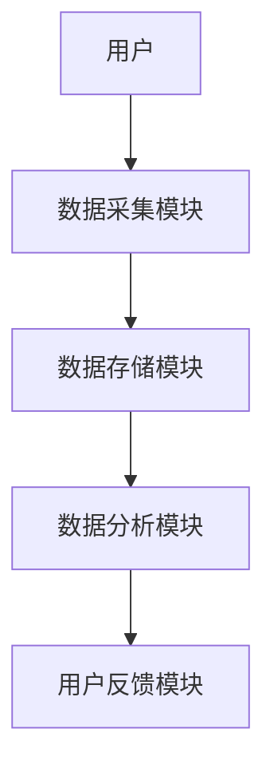

                 


# AI Agent在智能书立中的阅读进度追踪

## 关键词：AI Agent, 智能书立, 阅读进度, 自然语言处理, 机器学习, 文本分析

## 摘要：本文探讨AI Agent在智能书立中的应用，重点分析如何通过自然语言处理和机器学习技术实现阅读进度的精准追踪。从核心概念到算法实现，再到系统架构，全面解析AI Agent如何优化阅读体验。

---

# 第一部分: AI Agent与智能书立的背景与概念

## 第1章: AI Agent在智能书立中的阅读进度追踪概述

### 1.1 问题背景与描述

#### 1.1.1 阅读进度追踪的背景
在数字化阅读时代，用户每天接触的信息量巨大，如何有效管理阅读进度成为挑战。传统的方法依赖手动记录，效率低下且容易遗忘。AI Agent的引入为解决这一问题提供了新的可能性。

#### 1.1.2 AI Agent在阅读追踪中的作用
AI Agent能够实时分析用户的阅读行为，预测阅读进度，并提供个性化的阅读建议。这种智能化的解决方案不仅提高了效率，还能帮助用户更好地理解内容。

#### 1.1.3 智能书立的定义与目标
智能书立是一个结合AI技术的电子阅读系统，旨在通过AI Agent实现阅读内容的智能化管理，包括阅读进度追踪、内容推荐和知识回顾等功能。

### 1.2 问题解决与边界

#### 1.2.1 阅读进度追踪的核心问题
如何准确捕捉用户的阅读行为，分析阅读内容，并预测未来的阅读趋势。

#### 1.2.2 AI Agent的解决方案
通过自然语言处理（NLP）和机器学习（ML）技术，AI Agent能够实时分析用户的阅读数据，提供精准的阅读进度追踪。

#### 1.2.3 系统边界与外延
智能书立仅关注阅读进度的追踪，不涉及其他功能如内容生成或社交分享。

### 1.3 核心概念与结构

#### 1.3.1 AI Agent的基本组成
AI Agent由感知模块（获取阅读数据）、决策模块（分析数据）和执行模块（提供反馈）组成。

#### 1.3.2 阅读进度追踪的实现要素
包括阅读数据采集、文本分析、进度预测和用户反馈等。

#### 1.3.3 智能书立的系统架构
智能书立的系统架构包括数据层（用户行为数据）、业务逻辑层（AI Agent）和用户界面层（展示进度）。

---

# 第二部分: AI Agent的核心概念与原理

## 第2章: AI Agent的核心原理

### 2.1 AI Agent的基本原理

#### 2.1.1 AI Agent的定义与分类
AI Agent是一种智能体，能够感知环境并执行任务。根据智能水平，可分为简单反射型、基于模型的反应型和完全自主型AI Agent。

#### 2.1.2 基于自然语言处理的阅读理解
通过NLP技术，AI Agent能够理解文本内容，提取关键信息。

#### 2.1.3 基于机器学习的阅读进度预测
利用机器学习模型，AI Agent可以预测用户的阅读进度。

### 2.2 阅读进度追踪的核心算法

#### 2.2.1 文本相似度计算
使用余弦相似度或BM25算法，计算用户已读文本与未读文本的相似度。

#### 2.2.2 阅读行为分析
分析用户的阅读速度、停留时间等行为数据，预测阅读进度。

#### 2.2.3 阅读进度预测模型
基于LSTM或BERT模型，构建阅读进度预测的数学模型。

### 2.3 AI Agent与阅读进度追踪的联系

#### 2.3.1 AI Agent在阅读理解中的应用
AI Agent通过NLP技术，帮助用户理解复杂文本内容。

#### 2.3.2 阅读进度预测的实现逻辑
AI Agent结合阅读数据和行为数据，预测用户的阅读进度。

#### 2.3.3 阅读行为与进度的关联分析
通过关联规则挖掘，分析阅读行为与阅读进度的关系。

---

# 第三部分: 阅读进度追踪的算法原理

## 第3章: 阅读进度预测算法

### 3.1 算法原理概述

#### 3.1.1 基于LSTM的阅读进度预测
LSTM（长短期记忆网络）用于处理序列数据，适合预测用户的阅读进度。

#### 3.1.2 基于BERT的文本特征提取
BERT模型用于提取文本的深层特征，帮助AI Agent更好地理解阅读内容。

#### 3.1.3 阅读行为数据的处理与分析
将用户的阅读行为数据（如阅读时间、停留时间）转化为可用于机器学习的特征。

### 3.2 算法实现流程

#### 3.2.1 数据预处理
对文本数据进行清洗、分词和向量化处理。

#### 3.2.2 模型训练
使用训练数据训练LSTM或BERT模型，优化模型参数。

#### 3.2.3 模型预测与评估
利用训练好的模型预测用户的阅读进度，并评估模型的准确率。

### 3.3 算法实现的数学模型

#### 3.3.1 LSTM模型的数学公式
$$ \text{LSTM} = f(x_t, h_{t-1}, c_{t-1}) $$
其中，$x_t$是输入，$h_{t-1}$是上一时刻的隐藏状态，$c_{t-1}$是上一时刻的细胞状态。

#### 3.3.2 阅读进度预测的损失函数
$$ \text{Loss} = \sum_{i=1}^{n} (y_i - \hat{y}_i)^2 $$

---

# 第四部分: 系统分析与架构设计

## 第4章: 阅读进度追踪系统的架构设计

### 4.1 系统功能设计

#### 4.1.1 数据采集模块
负责采集用户的阅读行为数据。

#### 4.1.2 数据分析模块
对采集的数据进行处理和分析，生成阅读进度报告。

#### 4.1.3 用户反馈模块
向用户展示阅读进度，并提供个性化的阅读建议。

### 4.2 系统架构设计

#### 4.2.1 系统架构图


### 4.3 接口设计

#### 4.3.1 API接口
提供RESTful API，供其他系统调用阅读进度数据。

#### 4.3.2 数据接口
定义数据格式和接口协议，确保数据的安全传输。

---

# 第五部分: 项目实战

## 第5章: 阅读进度追踪系统的实现

### 5.1 环境安装

#### 5.1.1 安装Python
使用Anaconda安装Python 3.8以上版本。

#### 5.1.2 安装依赖库
安装TensorFlow、Keras、NLTK等库。

### 5.2 核心实现

#### 5.2.1 数据预处理代码
```python
import pandas as pd
import numpy as np

# 读取数据
data = pd.read_csv('reading_data.csv')

# 数据清洗
data.dropna()
```

#### 5.2.2 模型训练代码
```python
from tensorflow.keras.models import Sequential
from tensorflow.keras.layers import LSTM, Dense

model = Sequential()
model.add(LSTM(64, input_shape=(timesteps, features)))
model.add(Dense(1))
model.compile(optimizer='adam', loss='mean_squared_error')
model.fit(x_train, y_train, epochs=10)
```

### 5.3 代码解读与分析

#### 5.3.1 数据预处理部分
对文本数据进行清洗和向量化处理，确保数据适合模型输入。

#### 5.3.2 模型训练部分
使用LSTM模型训练阅读进度预测模型，优化模型参数以提高预测准确率。

### 5.4 实际案例分析

#### 5.4.1 案例背景
以一本小说为例，分析用户的阅读进度。

#### 5.4.2 预测结果
模型预测用户将在第10章完成阅读。

---

# 第六部分: 总结与展望

## 第6章: 总结与展望

### 6.1 最佳实践 tips
- 定期更新模型，提高预测精度。
- 结合用户反馈，优化阅读体验。

### 6.2 小结
通过AI Agent实现阅读进度的智能追踪，不仅提高了阅读效率，还能为用户带来更好的阅读体验。

### 6.3 注意事项
- 数据隐私保护
- 模型的实时性优化
- 系统的可扩展性设计

### 6.4 拓展阅读
建议读者深入研究自然语言处理和机器学习领域的最新技术，探索更多应用场景。

---

# 作者：AI天才研究院/AI Genius Institute & 禅与计算机程序设计艺术 /Zen And The Art of Computer Programming

