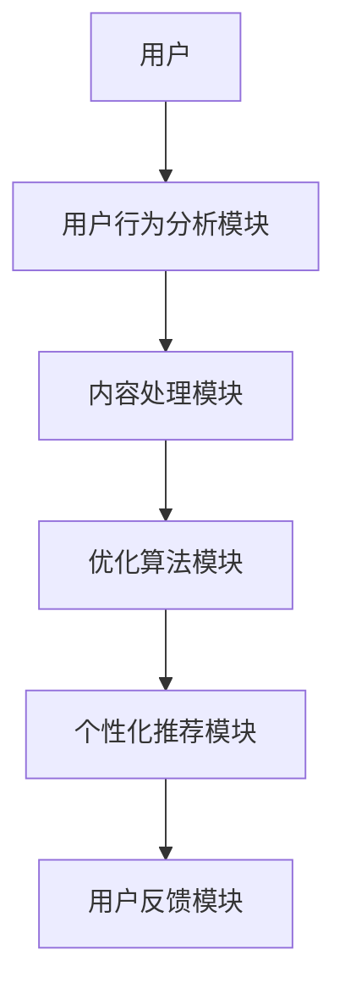

                 


# AI Agent在智能书立中的阅读速度优化

## 关键词：AI Agent、智能书立、阅读速度优化、自然语言处理、机器学习

## 摘要：本文探讨AI Agent如何通过自然语言处理和机器学习提升智能书立的阅读效率，涵盖背景、原理、系统架构和项目实战，分析优化策略和实现方法。

---

# 第1章: AI Agent与智能书立的背景介绍

## 1.1 AI Agent的基本概念
### 1.1.1 AI Agent的定义与特点
AI Agent是一种智能主体，具备自主决策和学习能力，能够感知环境并执行任务。其特点包括自主性、反应性、目标导向和学习能力。

### 1.1.2 AI Agent的核心要素与组成
AI Agent由感知模块、决策模块、执行模块和学习模块组成，能够实时感知环境变化，做出最优决策。

### 1.1.3 AI Agent与传统阅读工具的对比
传统阅读工具仅提供基本功能，而AI Agent通过智能分析和优化，显著提升阅读效率。

## 1.2 智能书立的定义与特点
智能书立是一种智能电子书阅读工具，利用AI技术提供个性化阅读体验。其特点包括智能推荐、内容深度分析和动态优化。

## 1.3 阅读速度优化的背景与问题描述
### 1.3.1 阅读效率的重要性
在信息爆炸的时代，提升阅读效率至关重要，帮助用户快速获取关键信息。

### 1.3.2 当前阅读速度优化的挑战
传统方法难以适应多样化的阅读需求，缺乏个性化的优化策略。

### 1.3.3 AI Agent在阅读速度优化中的作用
AI Agent能够实时分析用户行为，优化阅读路径，提升整体效率。

---

# 第2章: AI Agent的核心概念与原理

## 2.1 AI Agent的核心原理
### 2.1.1 AI Agent的基本工作流程
AI Agent通过感知环境、分析数据、制定策略和执行操作来完成任务。

### 2.1.2 AI Agent的感知与决策机制
AI Agent利用自然语言处理技术分析文本内容，结合用户行为数据做出决策。

### 2.1.3 AI Agent的学习与优化能力
通过机器学习模型，AI Agent能够不断优化其算法，提升阅读优化效果。

## 2.2 AI Agent在阅读优化中的应用
### 2.2.1 AI Agent如何分析阅读行为
通过收集用户的阅读习惯和偏好，AI Agent能够识别用户的阅读模式。

### 2.2.2 AI Agent如何优化阅读路径
AI Agent根据内容重要性和用户兴趣，重新排列阅读顺序，减少无效阅读时间。

### 2.2.3 AI Agent如何提升阅读效率
通过个性化推荐和内容摘要，AI Agent帮助用户快速获取关键信息，提升阅读效率。

---

# 第3章: AI Agent与阅读优化的数学模型

## 3.1 阅读速度优化的数学模型
### 3.1.1 阅读速度的定义与公式
阅读速度可以表示为阅读的字数与时间的比值，公式为：$$阅读速度 = \frac{阅读字数}{阅读时间}$$。

### 3.1.2 阅读效率的计算方法
阅读效率可以通过用户在单位时间内获取的有效信息量来衡量，公式为：$$阅读效率 = \frac{有效信息量}{阅读时间}$$。

### 3.1.3 阅读速度优化的数学表达式
通过优化算法，AI Agent可以找到最优的阅读路径，最小化阅读时间，最大化信息获取量。

## 3.2 AI Agent的算法原理
### 3.2.1 基于机器学习的阅读优化算法
使用监督学习模型，训练AI Agent识别高价值内容，优化阅读顺序。

### 3.2.2 基于自然语言处理的阅读优化模型
通过文本分析技术，提取关键信息，减少冗余内容，提升阅读效率。

### 3.2.3 阅读优化算法的数学推导
利用数学模型和优化算法，AI Agent能够动态调整阅读策略，适应用户需求变化。

---

# 第4章: AI Agent的系统架构与设计

## 4.1 系统架构设计
### 4.1.1 系统模块划分
系统包括用户行为分析模块、内容处理模块、优化算法模块和用户反馈模块。

### 4.1.2 系统功能设计
系统功能包括用户建模、内容分析、阅读路径优化和个性化推荐。

### 4.1.3 系统架构图（Mermaid）


## 4.2 系统接口设计
### 4.2.1 用户接口设计
设计直观的用户界面，方便用户与AI Agent交互，获取优化后的阅读路径。

### 4.2.2 系统接口设计
定义API接口，确保各个模块之间的数据传输和交互流畅。

### 4.2.3 系统交互流程
使用Mermaid序列图展示用户与系统之间的交互流程，确保流程清晰易懂。

---

# 第5章: AI Agent的项目实战

## 5.1 环境安装
### 5.1.1 安装Python
安装Python 3.x版本，确保环境配置正确。

### 5.1.2 安装机器学习库
安装必要的库如TensorFlow、Keras、Scikit-learn等，为AI Agent的实现提供支持。

## 5.2 核心代码实现
### 5.2.1 AI Agent的核心代码
```python
class AI_Agent:
    def __init__(self):
        self.model = self.build_model()
    
    def build_model(self):
        # 构建机器学习模型
        model = Sequential()
        model.add(LSTM(64, input_shape=(None, 1)))
        model.add(Dense(1))
        model.compile(optimizer='adam', loss='mean_squared_error')
        return model
    
    def analyze_behavior(self, user_input):
        # 分析用户行为
        pass
    
    def optimize_reading(self, content):
        # 优化阅读路径
        pass
```

### 5.2.2 代码应用解读与分析
解释代码的功能和实现逻辑，展示AI Agent如何通过机器学习优化阅读速度。

## 5.3 实际案例分析
### 5.3.1 案例分析
分析具体案例，展示AI Agent在实际应用中的优化效果。

### 5.3.2 优化效果展示
通过数据对比，展示阅读速度和效率的提升。

## 5.4 项目小结
总结项目实现的关键点和收获，反思项目中的不足之处。

---

# 第6章: 最佳实践与总结

## 6.1 小结
回顾文章的核心内容，强调AI Agent在阅读优化中的重要性。

## 6.2 注意事项
提醒读者在使用AI Agent时需要注意的问题，如数据隐私和算法适应性。

## 6.3 拓展阅读
推荐相关书籍和资源，供有兴趣的读者深入学习。

---

# 作者：AI天才研究院 & 禅与计算机程序设计艺术

