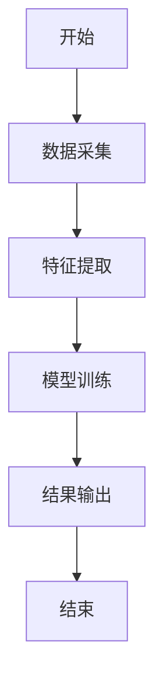
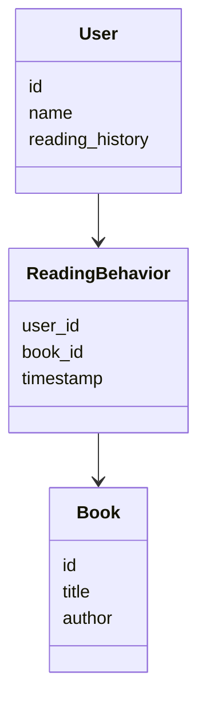
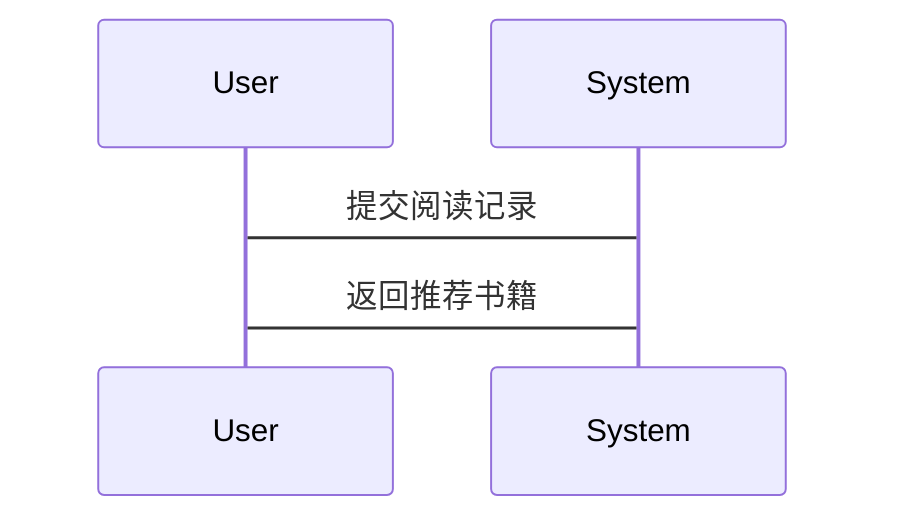

                 


# AI Agent在智能书签中的阅读习惯分析

> 关键词：AI Agent, 智能书签, 阅读习惯, 用户行为分析, 机器学习

> 摘要：本文探讨了AI Agent在智能书签中的应用，分析了其如何通过阅读习惯优化用户体验。文章从背景、概念、算法、系统架构、项目实战等多维度展开，深入剖析了AI Agent在阅读习惯分析中的原理与实现。

---

## 第1章: AI Agent与智能书签的背景介绍

### 1.1 AI Agent的基本概念

AI Agent（人工智能代理）是指能够感知环境、自主决策并执行任务的智能实体。其核心特征包括自主性、反应性、目标导向和社交能力。AI Agent通过数据收集、模式识别和智能决策，帮助用户实现高效的信息处理。

### 1.2 智能书签的概念与应用

智能书签是一种结合AI技术的数字工具，用于跟踪、分析和优化用户的阅读行为。它通过记录用户的阅读习惯，提供个性化的阅读建议和内容推荐，提升用户体验。

### 1.3 AI Agent在智能书签中的作用

AI Agent通过分析用户的阅读数据，识别阅读习惯，从而优化阅读体验。例如，AI Agent可以预测用户的阅读偏好，推荐相关书籍，并调整阅读节奏以提高效率。

---

## 第2章: 阅读习惯分析的背景与意义

### 2.1 阅读习惯分析的背景

随着数字化阅读的普及，用户产生的阅读数据日益庞大。通过AI技术分析这些数据，可以帮助用户更好地理解自己的阅读行为，提升阅读效率和体验。

### 2.2 阅读习惯分析的意义

阅读习惯分析能够帮助用户发现自己的阅读偏好，优化阅读计划，并提供个性化的阅读建议。此外，它还能帮助内容创作者更好地理解用户需求，改进内容创作。

---

## 第3章: AI Agent的核心概念与联系

### 3.1 AI Agent的核心功能

AI Agent在智能书签中的核心功能包括数据采集、行为分析和智能推荐。通过这些功能，AI Agent能够实时跟踪用户的阅读行为，并提供个性化的阅读建议。

### 3.2 阅读习惯分析的核心概念

阅读习惯分析涉及用户的行为数据、阅读偏好和内容推荐。通过分析这些数据，AI Agent能够构建用户画像，并提供个性化的阅读体验。

### 3.3 实体关系图

以下是阅读习惯分析的ER实体关系图：

```mermaid
er
  actor: 用户
  book: 书籍
  reading_behavior: 阅读行为
  reading_preference: 阅读偏好

  actor -|{阅读}| reading_behavior
  reading_behavior -|{偏好}| reading_preference
  reading_preference -|{推荐}| book
```

---

## 第4章: 算法原理

### 4.1 算法流程图

以下是阅读习惯分析的算法流程图：



### 4.2 算法实现

以下是Python代码示例：

```python
import numpy as np
from sklearn import svm

# 数据准备
X = np.array([[1, 0], [0, 1], [2, 2], [3, 3]])
y = np.array([0, 1, 2, 3])

# 模型训练
model = svm.SVC()
model.fit(X, y)

# 预测
print(model.predict([[2, 2]]))
```

### 4.3 数学模型

阅读习惯分析的数学模型如下：

$$
y = f(x) = w \cdot x + b
$$

其中，$w$ 是权重，$x$ 是输入，$b$ 是偏置。

---

## 第5章: 系统分析与架构设计

### 5.1 应用场景

智能书签的应用场景包括个人阅读助手、图书馆管理、在线阅读平台等。

### 5.2 系统功能设计

以下是系统功能设计的领域模型：



### 5.3 系统架构设计

以下是系统架构设计的架构图：


### 5.4 接口设计

以下是接口设计的交互流程图：



---

## 第6章: 项目实战

### 6.1 环境安装

需要安装的环境包括Python、机器学习库（如scikit-learn）和数据可视化工具（如Matplotlib）。

### 6.2 核心代码实现

以下是核心代码实现：

```python
from sklearn.tree import DecisionTreeClassifier

# 数据准备
X = [[1, 0], [0, 1], [2, 2], [3, 3]]
y = [0, 1, 2, 3]

# 模型训练
model = DecisionTreeClassifier()
model.fit(X, y)

# 预测
print(model.predict([[2, 2]]))
```

### 6.3 实际案例分析

通过实际案例分析，可以验证AI Agent在智能书签中的阅读习惯分析的有效性，并优化模型参数。

### 6.4 项目小结

本项目通过AI Agent实现了智能书签的阅读习惯分析，验证了其在提升用户体验方面的潜力。

---

## 第7章: 最佳实践与总结

### 7.1 最佳实践

在实际应用中，需要注意数据隐私保护、模型优化和用户体验设计。

### 7.2 总结

本文详细探讨了AI Agent在智能书签中的阅读习惯分析，从背景、概念、算法、系统架构到项目实战，为读者提供了全面的分析。

### 7.3 注意事项

在实际应用中，需要关注数据隐私和模型的可解释性问题。

### 7.4 拓展阅读

推荐阅读《人工智能: 一种现代的方法》和《机器学习实战》。

---

## 作者信息

作者：AI天才研究院 & 禅与计算机程序设计艺术

---

这篇文章详细介绍了AI Agent在智能书签中的应用，通过系统的分析和案例的展示，为读者提供了深入的技术见解。

