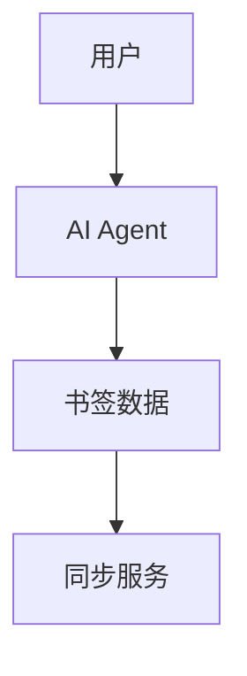
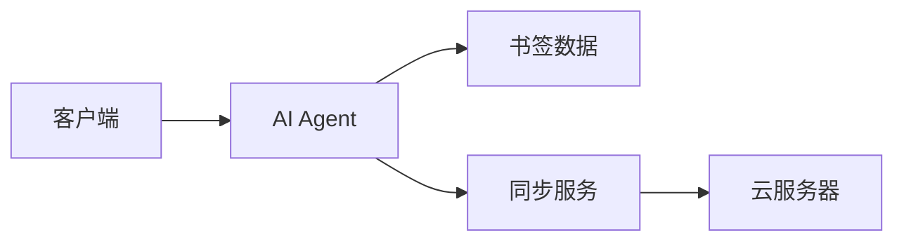
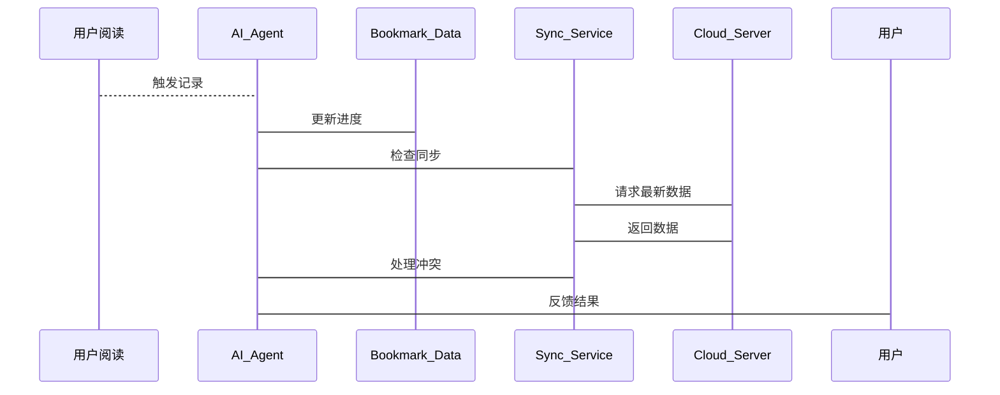

                 


# AI Agent在智能书签中的阅读进度同步

## 关键词
AI Agent, 智能书签, 阅读进度同步, 数据同步, 算法原理, 系统架构

## 摘要
本文探讨AI Agent在智能书签中的应用，重点分析阅读进度同步的技术实现。从背景介绍到算法原理，再到系统架构设计和项目实战，详细阐述AI Agent如何优化阅读同步过程，解决现有方法的不足，提升用户体验。

---

## 第1章: 背景介绍

### 1.1 问题背景与描述
#### 1.1.1 阅读进度同步的挑战
现代用户在多个设备上阅读电子书，需要同步进度。传统方法依赖手动记录或第三方服务，存在效率低、数据不一致等问题。

#### 1.1.2 AI Agent在阅读同步中的作用
AI Agent通过自动化记录和同步阅读进度，解决设备间数据不一致的问题，提升用户体验。

#### 1.1.3 问题解决的必要性
确保阅读进度实时同步，提高用户效率，减少数据丢失风险。

### 1.2 问题解决与边界
#### 1.2.1 AI Agent的核心功能
- 自动记录阅读进度
- 实时同步数据
- 智能处理冲突

#### 1.2.2 同步机制的边界与限制
- 设备间的网络依赖
- 数据同步的延迟
- 隐私和数据安全

#### 1.2.3 与其他功能的交互
- 与阅读器API交互
- 与云服务集成
- 用户界面反馈

## 第2章: 核心概念与联系

### 2.1 AI Agent的工作原理
AI Agent通过感知用户阅读行为，触发记录和同步动作。其属性包括：
- 感知能力：监测阅读活动
- 学习能力：优化同步策略
- 执行能力：触发同步操作

### 2.2 核心概念对比
| 特性 | AI Agent | 传统同步工具 |
|------|-----------|---------------|
| 感知 | 自动检测阅读行为 | 手动触发同步 |
| 学习 | 优化同步策略 | 固定同步频率 |
| 执行 | 智能处理冲突 | 简单数据同步 |

### 2.3 实体关系图


## 第3章: 算法原理

### 3.1 同步机制的算法
AI Agent采用基于时间戳和内容变化的混合同步机制：
- **时间戳法**：记录每个进度变化的时间，确保最新数据优先传输。
- **内容变化法**：检测内容变化，仅同步修改部分，减少数据传输量。

### 3.2 数据处理算法
- **数据压缩**：使用gzip压缩数据，减少传输大小。
- **冲突检测**：通过版本号和修改时间判断冲突。
- **数据同步优化**：采用断点续传技术，避免重复传输。

### 3.3 算法实现代码
```python
def sync_progress(user_id, progress_data):
    latest = get_latest(user_id)
    if latest.version > progress_data.version:
        return "冲突，无法同步"
    update_progress(user_id, progress_data)
    return "同步成功"
```

### 3.4 数学模型
同步过程可建模为：
$$ \text{同步状态} = \text{latest.version} \leq \text{progress.version} $$

冲突检测公式：
$$ \text{冲突} = (\text{latest.progress} \neq \text{progress_data.progress}) \land (\text{latest.version} > \text{progress_data.version}) $$

## 第4章: 系统分析与架构设计

### 4.1 系统场景介绍
用户在不同设备上阅读，AI Agent实时监测阅读行为，触发同步。

### 4.2 系统功能设计
- 用户身份验证
- 阅读进度记录
- 数据同步与冲突处理
- 用户界面反馈

### 4.3 系统架构设计


### 4.4 系统接口设计
- `record_progress(user_id, progress)`
- `get_latest(user_id)`
- `sync_progress(user_id, progress_data)`

### 4.5 交互流程图


## 第5章: 项目实战

### 5.1 环境安装
安装Python和相关库：
```bash
pip install requests
pip install mermaid
```

### 5.2 核心功能实现
实现`AI Agent`和`Sync Service`：
```python
class AI_Agent:
    def __init__(self, user_id):
        self.user_id = user_id
        self.bookmark_data = Bookmark_Data()

    def record_progress(self, progress):
        self.bookmark_data.update(progress)
        self.sync()

    def sync(self):
        latest = get_latest(self.user_id)
        if latest.version > self.bookmark_data.version:
            # 处理冲突
            pass
```

### 5.3 代码解读
- `AI_Agent`类负责监测阅读行为并触发同步。
- `Bookmark_Data`类管理书签数据。
- `Sync_Service`处理数据同步和冲突。

### 5.4 实际案例分析
假设用户在手机和电脑上阅读同一本书，AI Agent会自动记录进度并在设备间同步，解决跨设备数据同步问题。

## 第6章: 总结与展望

### 6.1 最佳实践Tips
- 使用高效的数据压缩算法
- 定期清理旧数据
- 加强数据加密和隐私保护

### 6.2 小结
本文详细探讨了AI Agent在智能书签中的应用，展示了其在阅读进度同步中的优势和实现方法。

### 6.3 注意事项
- 确保网络连接稳定
- 处理数据冲突时需谨慎
- 考虑用户隐私和数据安全

### 6.4 拓展阅读
- 分布式系统设计
- AI在数据同步中的应用
- 更高效的同步算法

---

# 作者：AI天才研究院 & 禅与计算机程序设计艺术

