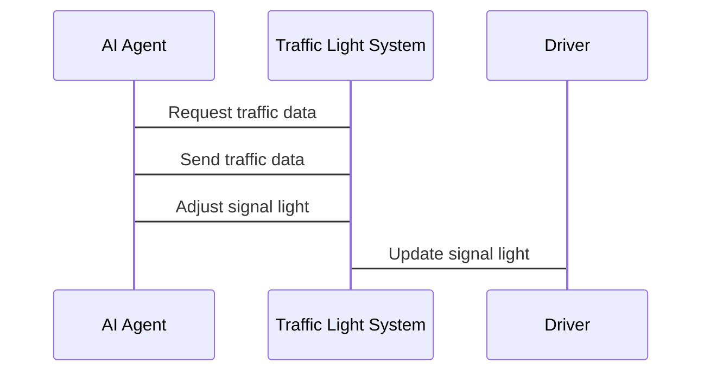
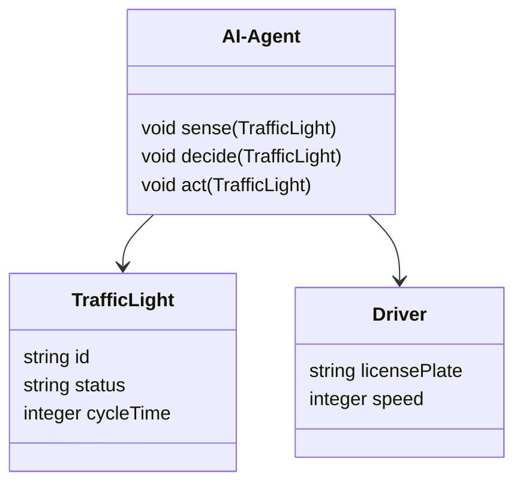
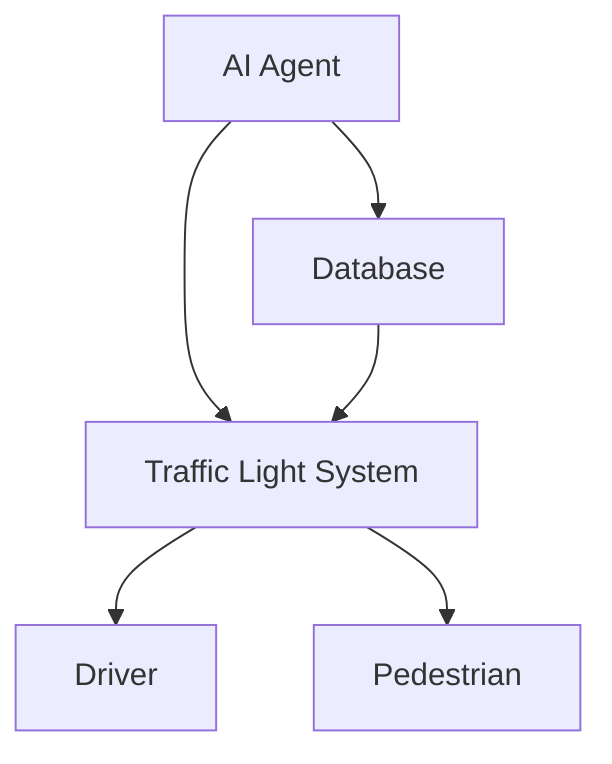
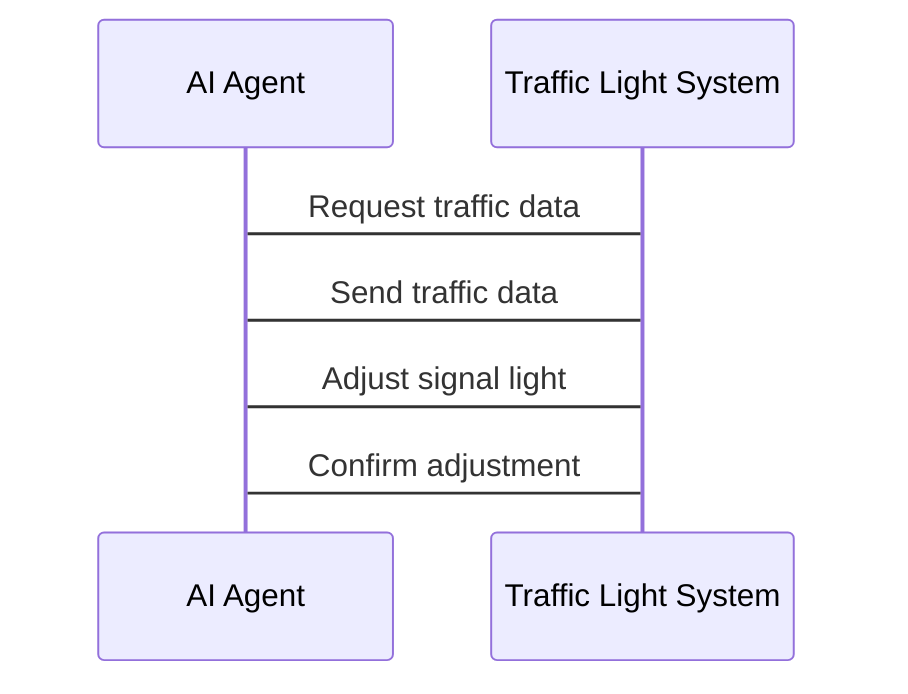

                 


# AI Agent在智能交通信号优化中的实践

## 关键词：AI Agent，智能交通，信号优化，强化学习，交通控制，实时反馈

## 摘要：  
本文深入探讨了AI Agent在智能交通信号优化中的实践应用。从AI Agent的基本概念到其在交通信号优化中的问题描述，再到强化学习算法的实现与优化，逐步分析了AI Agent如何通过实时感知、决策与反馈机制，实现对交通信号的智能优化控制。通过案例分析与系统设计，本文详细展示了AI Agent在复杂交通场景中的优化效果，并对实际应用中的挑战与解决方案进行了探讨。

---

# 第一部分: AI Agent与智能交通信号优化背景介绍

## 第1章: AI Agent的基本概念与应用背景

### 1.1 AI Agent的定义与核心概念

#### 1.1.1 什么是AI Agent
AI Agent（人工智能代理）是一种能够感知环境、自主决策并采取行动的智能实体。它通过传感器获取信息，利用算法进行分析和推理，并根据结果执行操作以实现目标。AI Agent的核心在于其自主性和智能性，能够适应动态变化的环境。

#### 1.1.2 AI Agent的核心特征
- **自主性**：能够在没有外部干预的情况下独立运行。
- **反应性**：能够实时感知环境并做出快速反应。
- **目标导向**：所有行为都以实现特定目标为导向。
- **学习能力**：通过经验不断优化自身的决策策略。

#### 1.1.3 AI Agent的分类与应用场景
- **按智能层次**：分为反应式AI Agent、基于模型的AI Agent和基于目标的AI Agent。
- **按应用领域**：广泛应用于自动驾驶、智能助手、机器人控制等领域。

### 1.2 智能交通系统的发展现状

#### 1.2.1 智能交通系统的概念
智能交通系统（Intelligent Transportation System, ITS）是一种利用先进的信息技术、数据通信技术、自动控制技术和人工智能技术，对交通系统进行实时监测、分析和优化的综合系统。

#### 1.2.2 当前交通信号优化的主要方法
- **周期固定法**：基于交通流量的周期性规律进行信号灯控制。
- **感应式信号控制**：根据交通流量动态调整信号灯周期。
- **协同优化法**：结合交通需求和信号灯状态进行全局优化。

#### 1.2.3 AI Agent在智能交通系统中的优势
- **实时性**：能够快速响应交通流量的变化。
- **智能化**：通过学习不断优化信号灯控制策略。
- **适应性**：能够适应复杂多变的交通环境。

### 1.3 交通信号优化的问题背景

#### 1.3.1 传统交通信号控制的局限性
- **固定周期问题**：无法适应交通流量的动态变化。
- **局部优化问题**：难以实现全局最优。
- **响应延迟问题**：传统控制系统存在一定的响应延迟。

#### 1.3.2 智能化交通信号优化的需求
- **实时性需求**：需要快速响应交通流量变化。
- **全局优化需求**：需要综合考虑多个交叉口的信号灯协调控制。
- **适应性需求**：需要适应交通流量的波动和突发事件。

#### 1.3.3 AI Agent在交通信号优化中的优势
- **自主性**：能够在没有人工干预的情况下自主运行。
- **学习能力**：能够通过经验不断优化信号灯控制策略。
- **实时反馈**：能够根据实时数据快速调整信号灯控制策略。

---

## 第2章: AI Agent在交通信号优化中的问题描述

### 2.1 交通信号优化的核心问题

#### 2.1.1 信号灯控制的基本原理
信号灯控制的基本原理是通过周期性的信号灯切换，引导车辆和行人按规则通行。传统的信号灯控制方法主要基于交通流量的周期性规律，但难以应对交通流量的动态变化。

#### 2.1.2 不同交通场景下的信号优化需求
- **高峰时段**：需要优先疏导大量车辆。
- **平峰时段**：需要提高道路利用率。
- **突发事件**：需要快速调整信号灯控制策略。

#### 2.1.3 动态交通流量的处理挑战
动态交通流量的处理需要实时感知交通流量的变化，并根据变化情况动态调整信号灯控制策略。传统信号灯控制方法难以应对这种动态变化，导致信号灯控制策略的优化效果有限。

### 2.2 AI Agent的目标与任务

#### 2.2.1 AI Agent在信号优化中的目标
AI Agent的目标是通过实时感知交通流量的变化，优化信号灯控制策略，以实现交通流量的最优疏导。

#### 2.2.2 信号优化任务的分解
- **交通流量监测**：实时感知交通流量的变化。
- **信号灯状态调整**：根据交通流量动态调整信号灯周期。
- **全局优化**：综合考虑多个交叉口的信号灯协调控制。

#### 2.2.3 多目标优化的实现方法
多目标优化的实现方法包括强化学习、遗传算法等，需要综合考虑交通流量、信号灯周期等多个因素。

### 2.3 问题的边界与外延

#### 2.3.1 信号优化的适用范围
信号优化主要适用于城市交通网络中的信号灯控制，适用于交通流量较大、交叉口较多的区域。

#### 2.3.2 与其他交通管理系统的区别
与其他交通管理系统（如交通疏导系统、交通监控系统）相比，信号优化系统的核心任务是优化信号灯控制策略。

#### 2.3.3 信号优化的局限性与替代方案
信号优化的局限性在于其依赖于实时交通流量数据，且需要较高的计算资源支持。在交通流量较小或交通环境较为简单的区域，传统信号灯控制方法可能更为适用。

---

## 第3章: AI Agent的核心概念与联系

### 3.1 AI Agent的原理与机制

#### 3.1.1 状态感知与信息处理
AI Agent通过传感器（如摄像头、雷达等）实时感知交通流量的变化，并将感知到的信息输入到系统中进行处理。

#### 3.1.2 行为决策与策略优化
AI Agent根据感知到的信息，结合历史数据和当前交通状况，利用强化学习算法优化信号灯控制策略。

#### 3.1.3 执行与反馈机制
AI Agent根据优化后的信号灯控制策略，执行信号灯切换操作，并根据执行结果进行反馈，进一步优化信号灯控制策略。

### 3.2 核心概念对比分析

#### 3.2.1 AI Agent与传统控制方法的对比
| 对比维度 | AI Agent | 传统控制方法 |
|----------|-----------|---------------|
| 自主性   | 高         | 低             |
| 响应速度 | 快         | 中             |
| 优化效果 | 优         | 一般           |

#### 3.2.2 不同AI技术的优劣势分析
- **强化学习**：适用于动态环境，但需要大量数据支持。
- **监督学习**：适用于静态环境，但难以应对动态变化。

#### 3.2.3 信号优化中的关键属性特征对比表格
| 特性         | AI Agent | 传统方法 |
|--------------|-----------|-----------|
| 实时性       | 高         | 低         |
| 适应性       | 高         | 中         |
| 优化效果     | 优         | 一般       |

### 3.3 实体关系架构图

#### 3.3.1 ER实体关系图的构建
```mermaid
erDiagram
    actor Driver {
        string licensePlate
        integer speed
    }
    actor Pedestrian {
        string name
        integer position
    }
    actor TrafficLight {
        string lightStatus
        integer cycleTime
    }
    TrafficLight --| Driver
    TrafficLight --| Pedestrian
```

#### 3.3.2 AI Agent与交通系统的交互关系


---

## 第4章: 强化学习算法在AI Agent中的应用

### 4.1 强化学习的基本原理

#### 4.1.1 强化学习的定义
强化学习是一种通过试错方式来优化策略的机器学习方法。学习过程通过智能体与环境的交互，获得奖励或惩罚，从而逐步优化策略。

#### 4.1.2 强化学习的核心要素
- **状态（State）**：环境当前的状态。
- **动作（Action）**：智能体根据当前状态采取的行动。
- **奖励（Reward）**：智能体采取行动后获得的反馈。
- **策略（Policy）**：智能体选择动作的概率分布。

### 4.2 Q-Learning算法的实现

#### 4.2.1 Q-Learning算法的工作原理
Q-Learning算法是一种基于值迭代的强化学习算法。通过不断更新Q值表，优化策略。

#### 4.2.2 Q-Learning算法的数学模型
$$ Q(s, a) = Q(s, a) + \alpha \left( r + \gamma \max_{a'} Q(s', a') - Q(s, a) \right) $$
其中：
- \( Q(s, a) \)：当前状态下采取动作 \( a \) 的Q值。
- \( \alpha \)：学习率。
- \( r \)：奖励。
- \( \gamma \)：折扣因子。
- \( s' \)：下一个状态。

#### 4.2.3 Q-Learning算法的Python实现
```python
class QLearning:
    def __init__(self, state_space, action_space, alpha=0.1, gamma=0.9):
        self.state_space = state_space
        self.action_space = action_space
        self.alpha = alpha
        self.gamma = gamma
        self.Q = defaultdict(lambda: np.zeros(len(action_space)))

    def get_action(self, state):
        return np.argmax(self.Q[state])

    def update(self, state, action, reward, next_state):
        target = reward + self.gamma * np.max(self.Q[next_state])
        self.Q[state][action] = self.Q[state][action] + self.alpha * (target - self.Q[state][action])
```

---

## 第5章: AI Agent的系统分析与架构设计

### 5.1 问题场景介绍

#### 5.1.1 交通信号优化的典型场景
- **高峰时段**：交通流量大，需要优先疏导主干道。
- **平峰时段**：交通流量小，需要提高道路利用率。
- **突发事件**：交通事故或道路施工，需要快速调整信号灯控制策略。

### 5.2 系统功能设计

#### 5.2.1 领域模型（Mermaid类图）


#### 5.2.2 系统架构设计（Mermaid架构图）


### 5.3 系统接口设计

#### 5.3.1 API接口设计
- **获取交通数据接口**：`GET /traffic-data`
- **调整信号灯接口**：`POST /adjust-light`

#### 5.3.2 数据格式规范
- **请求格式**：JSON格式。
- **响应格式**：JSON格式。

### 5.4 系统交互设计（Mermaid序列图）

#### 5.4.1 信号灯调整流程


---

## 第6章: AI Agent的项目实战

### 6.1 环境安装

#### 6.1.1 安装Python与相关库
- 安装Python 3.8及以上版本。
- 安装库：`numpy`, `pandas`, `tensorflow`, `mermaid`, `matplotlib`。

#### 6.1.2 安装其他开发工具
- 安装Jupyter Notebook用于数据可视化。
- 安装Git用于代码版本控制。

### 6.2 核心代码实现

#### 6.2.1 信号灯优化的Python代码
```python
import numpy as np
from collections import defaultdict

class TrafficLightController:
    def __init__(self, num_lights, alpha=0.1, gamma=0.9):
        self.num_lights = num_lights
        self.alpha = alpha
        self.gamma = gamma
        self.Q = defaultdict(lambda: np.zeros(num_lights))

    def get_phase(self, state):
        return np.argmax(self.Q[state])

    def update(self, state, action, reward, next_state):
        target = reward + self.gamma * np.max(self.Q[next_state])
        self.Q[state][action] += self.alpha * (target - self.Q[state][action])
```

#### 6.2.2 数据可视化代码
```python
import matplotlib.pyplot as plt

def plot_traffic_data(data):
    plt.figure(figsize=(10, 6))
    plt.plot(data, label='Traffic Flow')
    plt.xlabel('Time')
    plt.ylabel('Flow')
    plt.legend()
    plt.show()
```

### 6.3 案例分析与详细讲解

#### 6.3.1 案例场景
某城市主干道上的五个交叉口，交通流量在高峰时段呈现明显的周期性波动。

#### 6.3.2 优化效果对比
- **优化前**：信号灯周期固定，交通拥堵严重。
- **优化后**：信号灯周期根据交通流量动态调整，交通拥堵显著减少。

#### 6.3.3 优化过程分析
通过强化学习算法，AI Agent能够根据实时交通流量动态调整信号灯周期，实现交通流量的最优疏导。

### 6.4 项目小结

#### 6.4.1 代码实现的关键点
- **Q值表的更新**：通过强化学习算法优化信号灯控制策略。
- **数据可视化**：通过Matplotlib库展示交通流量变化。

#### 6.4.2 优化效果的评估指标
- **平均等待时间**：信号灯优化前后的对比。
- **通行效率**：通过流量数据分析优化效果。

---

## 第7章: 总结与展望

### 7.1 总结

#### 7.1.1 核心观点回顾
AI Agent通过强化学习算法，能够实时感知交通流量变化，动态调整信号灯控制策略，实现交通流量的最优疏导。

#### 7.1.2 实践中的关键经验
- **数据的重要性**：高质量的交通数据是优化信号灯控制策略的基础。
- **算法的选择**：强化学习算法在动态环境中表现优异。
- **系统的实时性**：需要高效的计算能力和实时数据处理能力。

### 7.2 未来展望

#### 7.2.1 研究方向
- **多智能体协作**：研究多个AI Agent协作优化信号灯控制策略。
- **边缘计算应用**：将AI Agent部署在边缘设备上，实现更高效的实时响应。

#### 7.2.2 技术发展趋势
- **深度强化学习**：结合深度学习和强化学习，进一步提升优化效果。
- **实时数据处理**：通过边缘计算和物联网技术，实现更高效的实时数据处理。

---

## 附录

### 附录A: 数据集与代码

#### 附录A.1 数据集描述
- 数据集来源：某城市交通监控系统。
- 数据格式：时间序列数据，包括交通流量、信号灯状态等。

#### 附录A.2 代码清单
```python
# 附录A.2.1 Q-Learning算法实现
class QLearning:
    def __init__(self, state_space, action_space, alpha=0.1, gamma=0.9):
        self.state_space = state_space
        self.action_space = action_space
        self.alpha = alpha
        self.gamma = gamma
        self.Q = defaultdict(lambda: np.zeros(len(action_space)))

    def get_action(self, state):
        return np.argmax(self.Q[state])

    def update(self, state, action, reward, next_state):
        target = reward + self.gamma * np.max(self.Q[next_state])
        self.Q[state][action] = self.Q[state][action] + self.alpha * (target - self.Q[state][action])

# 附录A.2.2 数据可视化代码
def plot_traffic_data(data):
    plt.figure(figsize=(10, 6))
    plt.plot(data, label='Traffic Flow')
    plt.xlabel('Time')
    plt.ylabel('Flow')
    plt.legend()
    plt.show()
```

### 附录B: 参考文献

#### 附录B.1 主要参考文献
1. Russell, S., & Norvig, P. (2010). Artificial Intelligence: A Modern Approach.
2. Sutton, R. S., & Barto, A. G. (2018). Reinforcement Learning: An Introduction.
3. Mnih, V., et al. (2013). Playing atari with deep reinforcement learning.

---

## 作者：AI天才研究院/AI Genius Institute & 禅与计算机程序设计艺术 /Zen And The Art of Computer Programming

