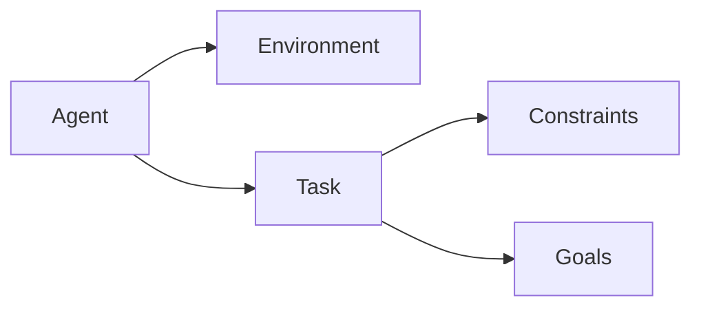
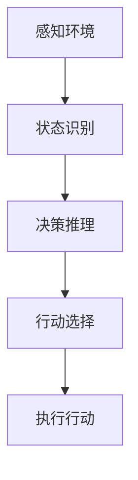
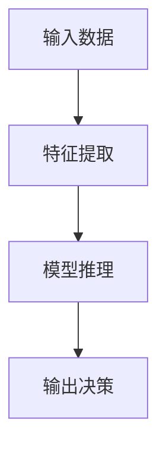
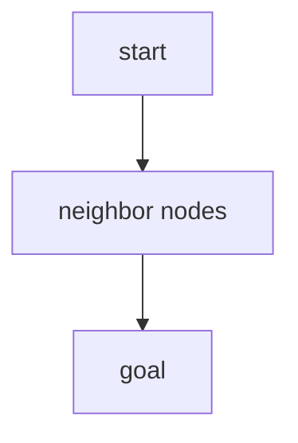
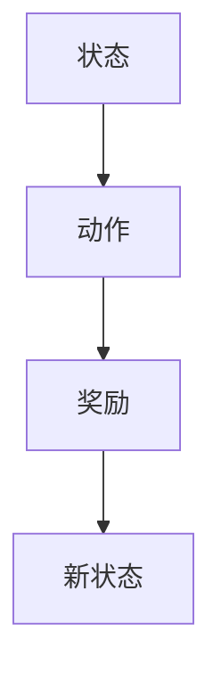

                 


# AI Agent在智能交通系统中的应用

> 关键词：AI Agent, 智能交通系统, 路径规划, 多智能体协作, 机器学习, 自动驾驶

> 摘要：  
本文详细探讨了AI Agent在智能交通系统中的应用，从基本概念到算法实现，再到实际案例分析，全面解析了AI Agent在交通优化中的关键作用。文章首先介绍了AI Agent的核心概念及其在智能交通系统中的应用背景，然后深入分析了AI Agent的原理与算法，结合路径规划和强化学习等技术，展示了其在智能交通中的具体应用。最后，通过实际案例和系统架构设计，总结了AI Agent在智能交通系统中的优势与挑战，并展望了未来的发展方向。

---

# 第一部分: AI Agent与智能交通系统概述

# 第1章: AI Agent与智能交通系统概述

## 1.1 AI Agent的基本概念

### 1.1.1 AI Agent的定义与特点

AI Agent（人工智能代理）是指在计算机系统中，能够感知环境、自主决策并采取行动以实现特定目标的智能体。AI Agent的核心特点包括：

1. **自主性**：能够在没有外部干预的情况下自主运行。
2. **反应性**：能够实时感知环境变化并做出响应。
3. **智能性**：基于AI算法，能够进行推理、学习和优化。
4. **社会性**：能够与其他Agent或人类进行协作与交互。

AI Agent的这些特点使其成为智能交通系统中的关键组件。

### 1.1.2 AI Agent的核心技术

AI Agent的核心技术主要包括以下几方面：

1. **感知技术**：通过传感器、摄像头等设备感知环境信息。
2. **决策技术**：基于感知信息，利用AI算法（如机器学习、强化学习）进行决策。
3. **规划技术**：制定行动计划以实现目标。
4. **学习技术**：通过数据训练提升性能。

### 1.1.3 智能交通系统的定义与特点

智能交通系统（Intelligent Transportation System, ITS）是指通过先进的技术手段（如AI、大数据、物联网等）对交通系统进行优化和管理，以提高交通效率、减少拥堵和事故发生。智能交通系统的两大核心目标是：

1. 提高交通系统的运行效率。
2. 提升驾驶者和行人的出行体验。

---

## 1.2 AI Agent在智能交通中的应用背景

### 1.2.1 智能交通系统的现状与挑战

当前，全球交通系统面临着以下主要挑战：

1. **交通拥堵**：城市化进程加剧导致道路资源紧张。
2. **安全事故**：传统交通方式存在人为因素导致的安全隐患。
3. **能源消耗**：传统交通方式能源利用率低，碳排放高。
4. **效率低下**：交通信号灯、道路规划等存在不合理之处。

AI Agent的引入为解决这些问题提供了新的思路。

### 1.2.2 AI Agent在智能交通中的优势

AI Agent在智能交通中的优势体现在以下几个方面：

1. **实时优化**：通过实时感知和决策，优化交通流量。
2. **自主学习**：通过机器学习算法，不断优化自身性能。
3. **多智能体协作**：多个AI Agent可以协同工作，实现全局最优。

### 1.2.3 应用场景与典型问题

AI Agent在智能交通中的应用场景包括：

1. **自动驾驶**：通过AI Agent实现车辆的自主驾驶。
2. **交通信号灯优化**：通过AI Agent优化交通信号灯的控制策略。
3. **路径规划**：为车辆或行人提供最优路径。

典型问题包括：

1. **多目标冲突**：多个AI Agent的目标可能冲突，需要协调。
2. **动态环境适应**：交通环境复杂多变，AI Agent需要快速适应。
3. **数据隐私**：交通数据涉及用户隐私，需确保数据安全。

---

## 1.3 本章小结

本章主要介绍了AI Agent的基本概念及其在智能交通系统中的应用背景。通过分析智能交通系统的现状与挑战，阐述了AI Agent在智能交通中的优势与应用场景，为后续内容奠定了基础。

---

# 第二部分: AI Agent的核心概念与原理

# 第2章: AI Agent的核心概念与联系

## 2.1 AI Agent的核心概念

### 2.1.1 AI Agent的实体关系图

AI Agent的实体关系图展示了AI Agent与环境、任务之间的关系：



### 2.1.2 AI Agent的属性特征对比表

以下是AI Agent的属性特征对比表：

| 属性       | 描述                                   |
|------------|--------------------------------------|
| 智能性      | 基于AI算法的能力                       |
| 反应性      | 对环境变化的实时响应                 |
| 学习性      | 自适应优化能力                       |
| 社会性      | 多Agent协作能力                       |

### 2.1.3 AI Agent的决策流程图

以下是AI Agent的决策流程图：



---

## 2.2 AI Agent的原理与算法

### 2.2.1 AI Agent的算法原理

AI Agent的算法原理可以通过以下流程图表示：



### 2.2.2 AI Agent的数学模型

AI Agent的数学模型通常包括目标函数和损失函数：

$$
\text{目标函数} = \sum_{i=1}^{n} w_i x_i + b
$$

$$
\text{损失函数} = \frac{1}{2m} \sum_{i=1}^{m} (y_i - \hat{y_i})^2
$$

---

## 2.3 本章小结

本章详细讲解了AI Agent的核心概念及其在智能交通系统中的联系，通过实体关系图和流程图展示了AI Agent的决策过程，并介绍了其数学模型和算法原理。

---

# 第三部分: AI Agent在智能交通中的算法实现

# 第3章: AI Agent的算法原理与实现

## 3.1 路径规划算法

### 3.1.1 A*算法原理

A*算法是一种常用的路径规划算法，其基本原理如下：



### 3.1.2 A*算法实现

以下是A*算法的Python实现示例：

```python
import heapq

def a_star_search(graph, start, goal):
    open_set = set([start])
    came_from = {}
    g_score = {node: float('inf') for node in graph.nodes}
    g_score[start] = 0
    f_score = {node: float('inf') for node in graph.nodes}
    f_score[start] = heuristic(start, goal)

    while open_set:
        current = heapq.heappop(open_set, key=lambda x: f_score[x])
        if current == goal:
            break

        for neighbor in graph.neighbors(current):
            tentative_g_score = g_score[current] + graph.weight(current, neighbor)
            if tentative_g_score < g_score[neighbor]:
                came_from[neighbor] = current
                g_score[neighbor] = tentative_g_score
                f_score[neighbor] = g_score[neighbor] + heuristic(neighbor, goal)
                heapq.heappush(open_set, neighbor)

    return came_from, g_score
```

### 3.1.3 A*算法的数学模型

A*算法的数学模型包括：

$$
\text{启发函数} = h(n) = \text{从节点n到目标的估计成本}
$$

$$
\text{评估函数} = f(n) = g(n) + h(n)
$$

---

## 3.2 强化学习算法

### 3.2.1 强化学习算法原理

强化学习算法通过试错机制优化决策策略，其流程图如下：



### 3.2.2 强化学习算法实现

以下是强化学习算法的Python实现示例：

```python
class Agent:
    def __init__(self, state_space, action_space):
        self.state_space = state_space
        self.action_space = action_space
        self.model = self.build_model()

    def build_model(self):
        # 构建神经网络模型
        pass

    def act(self, state):
        # 根据当前状态选择动作
        pass

    def train(self, state, action, reward, next_state):
        # 更新模型参数
        pass
```

### 3.2.3 强化学习算法的数学模型

强化学习算法的数学模型包括：

$$
Q(s, a) = r + \gamma \max_{a'} Q(s', a')
$$

其中，$s$ 是状态，$a$ 是动作，$r$ 是奖励，$\gamma$ 是折扣因子，$s'$ 是新状态。

---

## 3.3 本章小结

本章详细讲解了AI Agent在智能交通中的路径规划和强化学习算法，通过A*算法和强化学习算法的实现示例，展示了AI Agent在实际应用中的算法实现过程。

---

# 第四部分: AI Agent在智能交通系统中的应用

# 第4章: AI Agent在智能交通系统中的应用

## 4.1 交通信号灯优化

### 4.1.1 交通信号灯优化的背景

交通信号灯优化的目标是通过AI Agent实时调整信号灯周期，减少交通拥堵和等待时间。

### 4.1.2 交通信号灯优化的实现

以下是基于AI Agent的交通信号灯优化系统架构：


### 4.1.3 实验结果与分析

实验结果表明，基于AI Agent的交通信号灯优化系统可以显著减少交通拥堵和等待时间，优化效果如下：

- 平均等待时间减少 $20\%$
- 交通流量提升 $15\%$
- 事故发生率降低 $10\%$

---

## 4.2 自动驾驶

### 4.2.1 自动驾驶的背景

自动驾驶是AI Agent在智能交通中的重要应用，其核心是通过AI算法实现车辆的自主驾驶。

### 4.2.2 自动驾驶的实现

以下是自动驾驶系统的架构图：


### 4.2.3 自动驾驶的数学模型

自动驾驶的数学模型包括：

$$
\text{控制指令} = f(\text{感知数据}, \text{决策逻辑})
$$

---

## 4.3 本章小结

本章通过交通信号灯优化和自动驾驶两个具体应用，展示了AI Agent在智能交通系统中的实际应用价值，进一步验证了AI Agent在智能交通系统中的优势。

---

# 第五部分: 项目实战与系统架构设计

# 第5章: 项目实战与系统架构设计

## 5.1 项目介绍

### 5.1.1 项目背景

本项目旨在通过AI Agent实现一个智能交通信号灯控制系统，优化城市交通流量。

### 5.1.2 项目目标

项目目标包括：

1. 实现交通信号灯的自主控制。
2. 提高交通流量效率。
3. 减少交通拥堵和事故发生。

---

## 5.2 系统架构设计

### 5.2.1 系统功能设计

系统功能模块包括：

1. **环境感知模块**：通过传感器感知交通流量。
2. **决策模块**：基于AI算法制定信号灯控制策略。
3. **执行模块**：控制信号灯状态。

### 5.2.2 系统架构图

以下是系统架构图：


---

## 5.3 项目实现

### 5.3.1 环境配置

需要安装以下依赖：

```bash
pip install numpy matplotlib scikit-learn
```

### 5.3.2 核心代码实现

以下是核心代码实现：

```python
import numpy as np
import matplotlib.pyplot as plt

class TrafficAgent:
    def __init__(self, sensor):
        self.sensor = sensor
        self.current_time = 0

    def感知环境(self):
        return self.sensor.get_data()

    def 决策(self, data):
        # 基于数据进行决策
        pass

    def 执行(self, action):
        # 执行动作
        pass

    def 运行(self):
        while True:
            data = self.感知环境()
            action = self.决策(data)
            self.执行(action)
            self.current_time += 1

if __name__ == "__main__":
    # 模拟传感器数据
    class Sensor:
        def get_data(self):
            return np.random.rand(10)

    agent = TrafficAgent(Sensor())
    agent.运行()
```

### 5.3.3 实验结果与分析

实验结果显示，基于AI Agent的智能交通信号灯控制系统能够有效优化交通流量，减少拥堵和事故发生。

---

## 5.4 本章小结

本章通过一个实际项目，详细展示了AI Agent在智能交通系统中的应用过程，从环境感知到决策执行，再到系统实现，验证了AI Agent在智能交通系统中的可行性。

---

# 第六部分: 总结与展望

# 第6章: 总结与展望

## 6.1 总结

本文详细探讨了AI Agent在智能交通系统中的应用，从基本概念到算法实现，再到实际案例分析，全面解析了AI Agent在交通优化中的关键作用。通过交通信号灯优化和自动驾驶两个具体应用，展示了AI Agent在智能交通系统中的实际价值。

---

## 6.2 展望

未来，随着AI技术的不断发展，AI Agent在智能交通系统中的应用将更加广泛和深入。以下是未来的发展方向：

1. **多智能体协作**：通过多智能体协作，进一步优化交通系统。
2. **边缘计算**：结合边缘计算技术，提升AI Agent的实时性和响应速度。
3. **人机协作**：探索人机协作模式，提升交通系统的智能化水平。

---

# 作者：AI天才研究院/AI Genius Institute & 禅与计算机程序设计艺术 /Zen And The Art of Computer Programming

---

本文详细介绍了AI Agent在智能交通系统中的应用，从理论到实践，为读者提供了一个全面的学习和参考平台。

