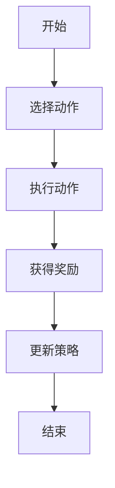
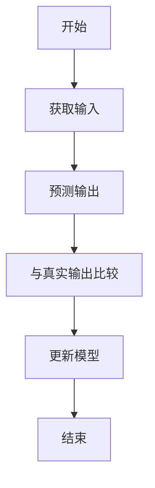
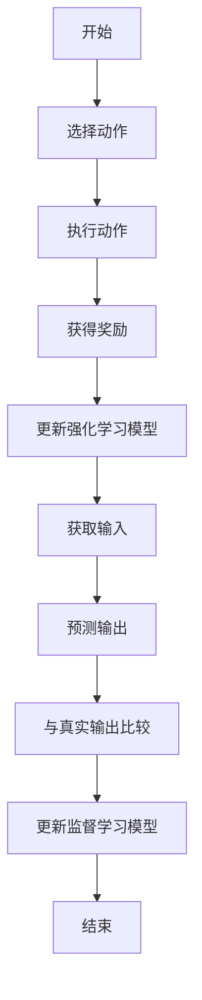
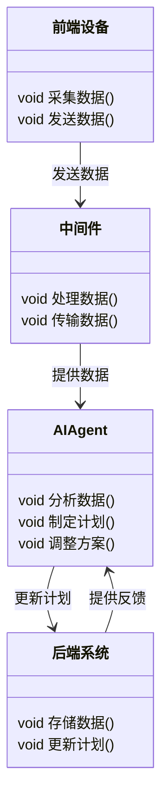
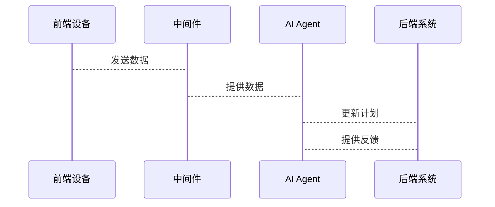

                 


# AI Agent在智能体育训练中的实践

> 关键词：AI Agent, 智能体育训练, 人工智能, 体育训练, 个性化训练

> 摘要：本文探讨了AI Agent在智能体育训练中的应用，分析了其核心概念、算法原理、系统架构设计以及实际项目中的实现。通过详细讲解AI Agent在体育训练中的感知、决策和执行过程，结合实际案例和数学模型，展示了AI Agent如何提升体育训练的效率和效果。文章还讨论了AI Agent在智能体育训练中的优势、挑战及未来发展方向。

---

## 第一章: AI Agent与智能体育训练概述

### 1.1 AI Agent的基本概念

#### 1.1.1 AI Agent的定义与特点

AI Agent（人工智能代理）是指能够感知环境、自主决策并执行任务的智能实体。它具备以下特点：

- **自主性**：能够在没有外部干预的情况下自主运行。
- **反应性**：能够实时感知环境并做出反应。
- **目标导向**：具备明确的目标，并根据目标优化行为。
- **学习能力**：能够通过数据和经验不断优化自身性能。

#### 1.1.2 智能体育训练的定义与特点

智能体育训练是指通过人工智能技术，结合体育训练的各个环节（如动作分析、体能评估、训练计划制定等），实现个性化、科学化的训练方式。其特点包括：

- **数据驱动**：基于大量运动数据进行分析和决策。
- **个性化**：根据个体特点制定专属训练计划。
- **实时反馈**：能够在训练过程中实时提供反馈和调整建议。
- **高效性**：通过优化算法提高训练效率和效果。

#### 1.1.3 AI Agent在智能体育训练中的作用

AI Agent在智能体育训练中充当了“智能教练”的角色，能够实时分析运动员的动作、体能、技术指标等数据，提供个性化的训练建议和调整方案。其作用包括：

- **实时数据分析**：通过传感器和摄像头获取运动员的运动数据，并进行实时分析。
- **个性化训练计划**：根据运动员的特点和目标，制定个性化的训练计划。
- **动态调整**：根据训练过程中的反馈，动态调整训练方案。

### 1.2 AI Agent与智能体育训练的关系

#### 1.2.1 AI Agent的核心功能

AI Agent在智能体育训练中的核心功能包括：

- **感知**：通过传感器、摄像头等设备获取运动员的运动数据。
- **决策**：基于感知数据，结合预设的算法和模型，做出训练调整决策。
- **执行**：根据决策结果，通过交互界面或执行机构（如智能设备）提供反馈或调整建议。

#### 1.2.2 AI Agent与智能体育训练的结合方式

AI Agent与智能体育训练的结合方式主要包括：

- **数据采集与分析**：AI Agent通过传感器和摄像头采集运动员的运动数据，并进行实时分析。
- **训练计划制定**：AI Agent根据分析结果，制定个性化的训练计划。
- **实时反馈与调整**：AI Agent能够在训练过程中实时提供反馈，并根据反馈结果动态调整训练方案。

#### 1.2.3 AI Agent在智能体育训练中的优势

AI Agent在智能体育训练中的优势包括：

- **高效性**：能够快速分析大量数据，并做出最优决策。
- **个性化**：能够根据个体特点制定专属训练计划。
- **实时性**：能够在训练过程中实时提供反馈和调整建议。

### 1.3 智能体育训练的背景与发展趋势

#### 1.3.1 传统体育训练的局限性

传统体育训练主要依赖教练的经验和主观判断，存在以下局限性：

- **缺乏数据支持**：教练的决策往往依赖经验，缺乏科学的数据支持。
- **个性化不足**：很难为每个运动员制定个性化的训练计划。
- **反馈滞后**：训练后的反馈往往滞后，无法实时调整训练方案。

#### 1.3.2 智能体育训练的兴起

随着人工智能技术的发展，智能体育训练逐渐兴起。智能体育训练能够通过传感器、摄像头等设备采集运动员的运动数据，并利用人工智能技术进行分析和决策，从而实现科学化的训练方式。

#### 1.3.3 AI Agent在智能体育训练中的应用前景

AI Agent在智能体育训练中的应用前景广阔。通过AI Agent，能够实现个性化、科学化的训练方式，提高运动员的训练效率和效果。未来，随着人工智能技术的不断发展，AI Agent在智能体育训练中的应用将更加广泛和深入。

---

## 第二章: AI Agent的核心概念与联系

### 2.1 AI Agent的核心原理

#### 2.1.1 AI Agent的感知层：数据采集与分析

AI Agent的感知层负责通过传感器和摄像头等设备采集运动员的运动数据，并进行实时分析。数据采集包括：

- **运动数据**：如速度、加速度、动作频率等。
- **生理数据**：如心率、体温、肌肉疲劳程度等。
- **环境数据**：如温度、湿度、光照强度等。

数据分析包括：

- **数据清洗**：去除噪声数据，确保数据的准确性。
- **特征提取**：从原始数据中提取有用的特征。
- **数据分析**：通过统计分析和机器学习算法，分析数据背后的规律。

#### 2.1.2 AI Agent的决策层：算法与策略

AI Agent的决策层负责根据感知层获取的数据，结合预设的算法和策略，做出训练调整决策。决策层的核心是算法，主要包括：

- **强化学习算法**：通过奖励机制，优化AI Agent的决策行为。
- **监督学习算法**：通过标注数据，训练AI Agent做出正确的决策。
- **混合算法**：结合强化学习和监督学习的优点，提高决策的准确性和效率。

#### 2.1.3 AI Agent的执行层：动作生成与反馈

AI Agent的执行层负责根据决策层的决策结果，通过交互界面或执行机构提供反馈或调整建议。执行层的主要功能包括：

- **反馈生成**：根据决策结果，生成个性化的反馈信息。
- **调整建议**：根据反馈信息，动态调整训练方案。
- **执行指令**：通过智能设备执行具体的训练指令。

### 2.2 AI Agent的属性特征对比

以下是不同AI Agent的属性特征对比：

| AI Agent属性 | 强化学习AI Agent | 监督学习AI Agent | 混合学习AI Agent |
|--------------|------------------|------------------|------------------|
| 反应速度     | 快速             | 较慢             | 较快             |
| 决策准确性   | 较高             | 较高             | 较高             |
| 适应性       | 强               | 较弱             | 强               |
| 训练时间     | 长               | 短               | 中               |

### 2.3 AI Agent的实体关系图

以下是AI Agent在智能体育训练中的实体关系图：

```mermaid
erDiagram
    前端设备
    {
        型号
        类型
    } 
    中间件
    {
        数据处理逻辑
        传输协议
    }
    AI Agent
    {
        算法模型
        决策逻辑
    }
    后端系统
    {
        数据库
        训练计划
    }
    前端设备 --> 中间件 : 传输数据
    中间件 --> AI Agent : 提供处理后的数据
    AI Agent --> 后端系统 : 更新训练计划
```

---

## 第三章: AI Agent的算法原理

### 3.1 AI Agent的算法概述

#### 3.1.1 强化学习算法

强化学习是一种通过奖励机制优化AI Agent行为的算法。以下是强化学习算法的流程图：



#### 3.1.2 监督学习算法

监督学习是一种通过标注数据训练AI Agent做出正确决策的算法。以下是监督学习算法的流程图：



#### 3.1.3 混合算法

混合算法是一种结合强化学习和监督学习优点的算法。以下是混合算法的流程图：



### 3.2 AI Agent的核心算法实现

以下是AI Agent的核心算法实现代码：

```python
import numpy as np
from sklearn.linear_model import LinearRegression
import tensorflow as tf
from tensorflow.keras import layers

# 强化学习部分
class ReinforcementLearningAgent:
    def __init__(self):
        self.model = self.build_model()
    
    def build_model(self):
        model = tf.keras.Sequential([
            layers.Dense(64, activation='relu', input_shape=(input_dim,)),
            layers.Dense(output_dim, activation='linear')
        ])
        return model

    def train(self, states, actions, rewards):
        # 将数据转换为适合模型输入的格式
        states = np.array(states)
        actions = np.array(actions)
        rewards = np.array(rewards)
        # 训练模型
        self.model.fit(states, actions, epochs=100, batch_size=32)

# 监督学习部分
class SupervisedLearningAgent:
    def __init__(self):
        self.model = LinearRegression()

    def train(self, X, y):
        self.model.fit(X, y)

    def predict(self, X):
        return self.model.predict(X)
```

### 3.3 AI Agent的数学模型与公式

以下是AI Agent的数学模型与公式：

#### 3.3.1 强化学习的数学模型

强化学习的数学模型可以表示为：

$$ Q(s, a) = Q(s, a) + \alpha (r + \gamma \max_{a'} Q(s', a') - Q(s, a)) $$

其中：

- \( Q(s, a) \) 表示在状态 \( s \) 下执行动作 \( a \) 的价值。
- \( \alpha \) 表示学习率。
- \( r \) 表示奖励。
- \( \gamma \) 表示折扣因子。
- \( s' \) 表示下一个状态。

#### 3.3.2 监督学习的数学模型

监督学习的数学模型可以表示为：

$$ y = \theta x + b $$

其中：

- \( y \) 表示输出。
- \( \theta \) 表示权重。
- \( x \) 表示输入。
- \( b \) 表示偏置。

---

## 第四章: 系统分析与架构设计

### 4.1 问题场景介绍

智能体育训练系统需要解决的主要问题包括：

- 如何实时采集运动员的运动数据。
- 如何对数据进行分析和处理，制定个性化的训练计划。
- 如何动态调整训练方案，提高训练效率和效果。

### 4.2 系统功能设计

以下是智能体育训练系统的功能设计：



### 4.3 系统架构设计

以下是智能体育训练系统的架构设计：

```mermaid
archi
    前端设备 [前端设备] 组件
    中间件 [中间件] 组件
    AI Agent [AI Agent] 组件
    后端系统 [后端系统] 组件
    前端设备 --> 中间件 : 数据传输
    中间件 --> AI Agent : 数据处理
    AI Agent --> 后端系统 : 训练计划
    后端系统 --> AI Agent : 反馈
```

### 4.4 系统接口设计

以下是系统接口设计：



---

## 第五章: 项目实战

### 5.1 环境安装

以下是项目实战所需的环境安装步骤：

1. 安装Python和相关库：
   ```bash
   pip install numpy scikit-learn tensorflow
   ```

2. 安装前端设备驱动：
   - 根据设备类型安装相应的驱动程序。

3. 安装中间件和后端系统：
   - 根据需求选择合适的技术栈（如Python/Django或Node.js/Express）。

### 5.2 系统核心实现

以下是系统核心实现代码：

```python
import numpy as np
from sklearn.linear_model import LinearRegression
import tensorflow as tf
from tensorflow.keras import layers

# 强化学习部分
class ReinforcementLearningAgent:
    def __init__(self):
        self.model = self.build_model()
    
    def build_model(self):
        model = tf.keras.Sequential([
            layers.Dense(64, activation='relu', input_shape=(input_dim,)),
            layers.Dense(output_dim, activation='linear')
        ])
        return model

    def train(self, states, actions, rewards):
        # 将数据转换为适合模型输入的格式
        states = np.array(states)
        actions = np.array(actions)
        rewards = np.array(rewards)
        # 训练模型
        self.model.fit(states, actions, epochs=100, batch_size=32)

# 监督学习部分
class SupervisedLearningAgent:
    def __init__(self):
        self.model = LinearRegression()

    def train(self, X, y):
        self.model.fit(X, y)

    def predict(self, X):
        return self.model.predict(X)
```

### 5.3 实际案例分析

以下是实际案例分析：

假设我们有一个运动员的训练数据，包括他的跑步速度、心率和动作频率。我们可以通过AI Agent分析这些数据，制定个性化的训练计划。以下是具体的实现步骤：

1. 数据采集与处理：
   - 通过传感器和摄像头采集运动员的跑步速度、心率和动作频率。
   - 对数据进行清洗和特征提取。

2. 数据分析与建模：
   - 使用强化学习算法分析运动员的动作，优化他的跑步姿势。
   - 使用监督学习算法分析运动员的心率和动作频率，制定训练计划。

3. 动态调整与反馈：
   - 根据训练过程中的反馈，动态调整训练方案。
   - 通过智能设备实时反馈运动员的训练效果。

---

## 第六章: 总结

### 6.1 最佳实践

- **数据隐私保护**：在处理运动员数据时，必须确保数据的安全性和隐私性。
- **模型更新频率**：根据训练需求，定期更新AI Agent的模型。
- **多模态数据融合**：结合多种数据源（如运动数据、生理数据、环境数据等），提高AI Agent的决策能力。

### 6.2 小结

AI Agent在智能体育训练中的应用前景广阔。通过AI Agent，能够实现个性化、科学化的训练方式，提高运动员的训练效率和效果。未来，随着人工智能技术的不断发展，AI Agent在智能体育训练中的应用将更加广泛和深入。

### 6.3 注意事项

- **数据质量问题**：确保数据的准确性和完整性。
- **模型可解释性**：在制定训练计划时，确保模型的决策过程可解释。
- **系统稳定性**：确保系统的稳定性和可靠性。

### 6.4 拓展阅读

- 《强化学习：原理与应用》
- 《机器学习在体育训练中的应用》
- 《AI Agent在智能系统中的设计与实现》

---

作者：AI天才研究院/AI Genius Institute & 禅与计算机程序设计艺术/Zen And The Art of Computer Programming

