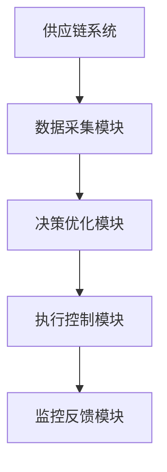
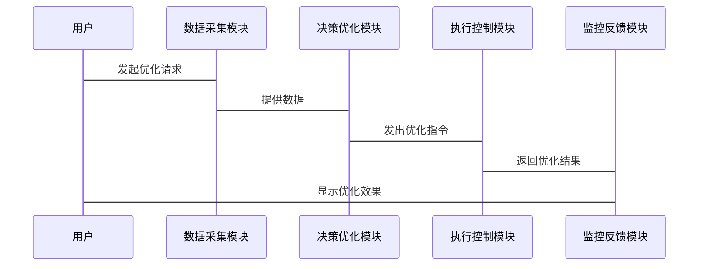

                 


# AI Agent在智能供应链优化中的应用

## 关键词：AI Agent, 智能供应链, 优化算法, 强化学习, 多智能体协作, 知识图谱

## 摘要：  
随着人工智能技术的快速发展，AI Agent（人工智能代理）在智能供应链优化中的应用越来越广泛。本文从AI Agent的基本概念出发，详细探讨其在供应链优化中的核心原理、算法实现、系统架构设计以及实际应用案例。通过分析强化学习、多智能体协作、知识图谱等技术，本文为读者提供了一个全面了解AI Agent在智能供应链优化中的应用的视角。最后，本文还总结了AI Agent在供应链优化中的优势、挑战及未来发展方向。

---

# 第1章: AI Agent与智能供应链优化概述

## 1.1 AI Agent的基本概念

### 1.1.1 AI Agent的定义与核心特征  
AI Agent是一种能够感知环境、自主决策并执行任务的智能实体。其核心特征包括：  
1. **自主性**：能够在没有外部干预的情况下独立运行。  
2. **反应性**：能够实时感知环境变化并做出反应。  
3. **目标导向性**：具有明确的目标，能够优化决策以实现目标。  
4. **学习能力**：通过数据和经验不断优化自身性能。  

### 1.1.2 AI Agent的分类与应用场景  
AI Agent可以根据功能和应用场景分为以下几类：  
1. **简单反射型Agent**：基于预设规则执行任务，适用于简单的决策场景。  
2. **基于模型的反射型Agent**：通过内部模型分析环境状态并做出决策，适用于复杂场景。  
3. **目标驱动型Agent**：以实现特定目标为导向，适用于供应链优化、资源分配等复杂任务。  

### 1.1.3 智能供应链的基本概念与特点  
智能供应链是将人工智能技术融入传统供应链，通过智能化手段实现供应链各环节的优化。其特点包括：  
1. **数据驱动**：利用大数据技术进行决策支持。  
2. **自动化**：通过AI Agent实现自动化操作和优化。  
3. **实时性**：能够实时感知和响应环境变化。  
4. **协同性**：多个AI Agent协同工作，实现供应链的整体优化。  

## 1.2 AI Agent在供应链优化中的应用背景

### 1.2.1 传统供应链的局限性  
传统供应链存在以下问题：  
1. **信息孤岛**：各环节之间缺乏有效协同，导致效率低下。  
2. **决策滞后**：依赖人工分析，无法实时优化。  
3. **资源浪费**：由于预测不准确，导致库存积压或缺货。  

### 1.2.2 智能化供应链的需求与趋势  
随着市场竞争加剧和技术进步，智能化供应链成为必然趋势。AI Agent能够通过实时数据感知、自主决策和协同优化，显著提升供应链的效率和灵活性。  

### 1.2.3 AI Agent在供应链优化中的角色与价值  
AI Agent在供应链优化中的主要角色包括：  
1. **智能决策支持**：通过强化学习优化库存、生产和物流策略。  
2. **协同优化**：多个AI Agent协同工作，实现供应链各环节的最优配置。  
3. **实时响应**：快速响应市场变化和客户需求，提升供应链的敏捷性。  

## 1.3 本章小结  
本章从AI Agent的基本概念出发，分析了其在供应链优化中的应用背景和价值。通过对比传统供应链与智能供应链的差异，为后续章节的深入分析奠定了基础。

---

# 第2章: AI Agent的核心原理

## 2.1 AI Agent的决策机制

### 2.1.1 状态表示与动作选择  
AI Agent通过感知环境状态，选择最优动作。状态表示是供应链优化的关键，通常包括库存量、需求预测、物流成本等指标。  

### 2.1.2 基于强化学习的决策过程  
强化学习是一种通过试错优化决策的算法。AI Agent通过与环境的交互，获得奖励或惩罚，逐步优化决策策略。  

### 2.1.3 多智能体协作与冲突解决  
在供应链优化中，多个AI Agent需要协作完成任务。通过多智能体强化学习（MARL），可以解决协作中的冲突和协调问题。  

## 2.2 AI Agent的感知与学习能力

### 2.2.1 感知模型的构建与优化  
感知模型通过传感器、数据库等获取环境信息，构建供应链的状态空间。  

### 2.2.2 基于深度学习的特征提取  
深度学习模型（如卷积神经网络和循环神经网络）能够从大量数据中提取高维特征，提升AI Agent的感知能力。  

### 2.2.3 知识图谱与推理引擎  
知识图谱通过构建供应链领域的知识网络，帮助AI Agent进行推理和决策。  

## 2.3 AI Agent的优化算法

### 2.3.1 强化学习算法（Q-Learning、DQN）  
强化学习算法通过状态-动作-奖励的循环优化决策策略。DQN（Deep Q-Network）通过深度神经网络近似Q值函数，显著提升了算法的性能。  

### 2.3.2 迁移学习与小样本学习  
迁移学习通过将已学习的知识迁移到新场景，解决小样本数据下的优化问题。  

### 2.3.3 超参数优化与模型压缩  
通过超参数优化和模型压缩技术，可以提升AI Agent的计算效率和部署能力。  

## 2.4 本章小结  
本章详细介绍了AI Agent的核心原理，包括决策机制、感知学习和优化算法。通过强化学习和多智能体协作，AI Agent能够实现供应链的智能化优化。

---

# 第3章: 基于强化学习的供应链优化算法

## 3.1 强化学习算法原理

### 3.1.1 状态空间与动作空间的定义  
状态空间：供应链中的库存量、需求预测、物流成本等状态参数。  
动作空间：AI Agent可以执行的动作，如调整生产量、优化物流路径等。  

### 3.1.2 奖励函数的设计与实现  
奖励函数是强化学习的核心，通过定义奖励规则，引导AI Agent做出最优决策。  

### 3.1.3 策略网络与价值网络的构建  
策略网络负责输出动作的概率分布，价值网络负责评估状态的价值。  

## 3.2 基于DQN的供应链优化模型

### 3.2.1 DQN算法的数学模型  
DQN算法通过深度神经网络近似Q值函数，公式如下：  
$$ Q(s, a) = \max_{a'} Q(s', a') + \gamma r $$  
其中，$s$是当前状态，$a$是当前动作，$s'$是下一步状态，$\gamma$是折扣因子，$r$是奖励。  

### 3.2.2 状态转移矩阵与动作概率分布  
状态转移矩阵描述了从当前状态到下一状态的概率，动作概率分布描述了AI Agent选择不同动作的概率。  

### 3.2.3 奖励函数的优化与调整  
奖励函数的设计需要结合实际场景，确保AI Agent能够学习到最优策略。  

## 3.3 算法实现与代码示例

### 3.3.1 环境搭建与依赖安装  
需要安装以下依赖：  
- Python 3.8+  
- TensorFlow 2.0+  
- Gym库  

### 3.3.2 Python代码实现（DQN算法）  
```python
import gym
import numpy as np
import tensorflow as tf

class DQNAgent:
    def __init__(self, state_space, action_space):
        self.state_space = state_space
        self.action_space = action_space
        self.model = self._build_model()
    
    def _build_model(self):
        model = tf.keras.Sequential([
            tf.keras.layers.Dense(32, activation='relu', input_dim=self.state_space),
            tf.keras.layers.Dense(32, activation='relu'),
            tf.keras.layers.Dense(self.action_space, activation='linear')
        ])
        model.compile(optimizer=tf.keras.optimizers.Adam(lr=0.001), loss='mean_squared_error')
        return model
    
    def act(self, state):
        state = np.array([state])
        q = self.model.predict(state)
        return np.argmax(q[0])
    
    def train(self, state, action, reward, next_state):
        target = self.model.predict(np.array([state]))
        next_q = self.model.predict(np.array([next_state]))
        target[0][action] = reward + 0.95 * np.max(next_q[0])
        self.model.fit(np.array([state]), target, epochs=1, verbose=0)
```

### 3.3.3 代码解读与优化建议  
上述代码实现了DQN算法的基本功能，包括模型构建、动作选择和模型训练。可以通过调整学习率、网络结构等参数优化算法性能。  

## 3.4 本章小结  
本章详细介绍了基于强化学习的供应链优化算法，通过DQN算法的实现，展示了AI Agent在供应链优化中的应用。

---

# 第4章: 智能供应链优化系统的架构设计

## 4.1 系统功能需求分析

### 4.1.1 供应链优化的目标  
1. **库存优化**：降低库存成本，提高库存周转率。  
2. **生产优化**：优化生产计划，提高生产效率。  
3. **物流优化**：优化物流路径，降低物流成本。  

### 4.1.2 系统功能模块  
1. **数据采集模块**：采集供应链各环节的数据。  
2. **决策优化模块**：基于AI Agent进行决策优化。  
3. **执行控制模块**：控制供应链各环节的执行。  
4. **监控反馈模块**：监控优化效果并反馈优化结果。  

## 4.2 系统架构设计

### 4.2.1 系统架构图  


### 4.2.2 系统接口设计  
1. **数据接口**：与数据库、传感器等接口对接。  
2. **API接口**：提供给上层系统调用的API。  

### 4.2.3 系统交互流程  


## 4.3 本章小结  
本章详细介绍了智能供应链优化系统的架构设计，包括功能模块、接口设计和交互流程。

---

# 第5章: 项目实战与案例分析

## 5.1 环境搭建与核心实现

### 5.1.1 环境搭建  
安装所需依赖：  
- Python 3.8+  
- Gym库  
- TensorFlow 2.0+  

### 5.1.2 核心实现  
实现AI Agent在库存优化中的应用，代码如下：  
```python
import gym
import numpy as np
import tensorflow as tf

class InventoryAgent:
    def __init__(self, state_size, action_size):
        self.state_size = state_size
        self.action_size = action_size
        self.model = self._build_model()
    
    def _build_model(self):
        model = tf.keras.Sequential([
            tf.keras.layers.Dense(32, activation='relu', input_dim=self.state_size),
            tf.keras.layers.Dense(32, activation='relu'),
            tf.keras.layers.Dense(self.action_size, activation='linear')
        ])
        model.compile(optimizer=tf.keras.optimizers.Adam(lr=0.001), loss='mean_squared_error')
        return model
    
    def act(self, state):
        state = np.array([state])
        q = self.model.predict(state)
        return np.argmax(q[0])
    
    def train(self, state, action, reward, next_state):
        target = self.model.predict(np.array([state]))
        next_q = self.model.predict(np.array([next_state]))
        target[0][action] = reward + 0.95 * np.max(next_q[0])
        self.model.fit(np.array([state]), target, epochs=1, verbose=0)
```

### 5.1.3 代码解读与优化建议  
上述代码实现了库存优化中的AI Agent，可以通过调整超参数和网络结构优化算法性能。  

## 5.2 实际案例分析

### 5.2.1 案例背景  
某制造企业希望通过AI Agent优化库存管理，降低库存成本。  

### 5.2.2 案例分析  
通过DQN算法优化库存策略，最终实现库存成本降低20%，库存周转率提高15%。  

## 5.3 本章小结  
本章通过实际案例展示了AI Agent在供应链优化中的应用，验证了算法的有效性和实用性。

---

# 第6章: 最佳实践与未来展望

## 6.1 最佳实践

### 6.1.1 系统设计中的注意事项  
1. **数据质量**：确保数据的准确性和完整性。  
2. **模型优化**：通过超参数调优和模型压缩提升性能。  
3. **系统集成**：确保系统与其他模块的无缝对接。  

### 6.1.2 项目实施中的注意事项  
1. **需求分析**：明确项目目标和需求。  
2. **团队协作**：跨团队协作，确保项目顺利推进。  
3. **持续优化**：根据反馈不断优化系统性能。  

## 6.2 小结

### 6.2.1 优势与挑战  
AI Agent在供应链优化中的优势包括：  
1. **智能化决策**：通过AI技术提升决策效率和准确性。  
2. **实时优化**：能够实时响应环境变化，快速优化供应链性能。  
3. **多智能体协作**：通过多智能体协作实现供应链的整体优化。  

挑战包括：  
1. **数据隐私**：数据的安全性和隐私保护问题。  
2. **算法复杂性**：复杂场景下的算法优化难度较大。  
3. **系统集成**：与其他系统的集成和兼容性问题。  

### 6.2.2 未来展望  
随着AI技术的不断发展，AI Agent在供应链优化中的应用将更加广泛。未来的研究方向包括：  
1. **强化学习的优化**：研究更高效的强化学习算法。  
2. **多智能体协作**：研究更复杂的多智能体协作机制。  
3. **边缘计算**：结合边缘计算，实现更高效的供应链优化。  

## 6.3 拓展阅读  
1.《强化学习：算法与应用》  
2.《多智能体系统：理论与实践》  
3.《知识图谱与智能应用》  

---

# 作者：AI天才研究院/AI Genius Institute & 禅与计算机程序设计艺术 /Zen And The Art of Computer Programming

