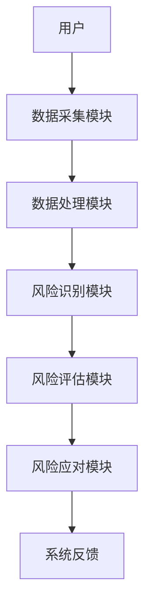
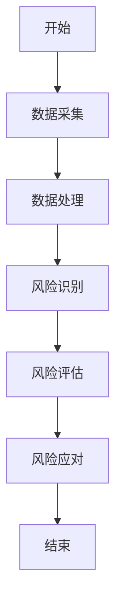
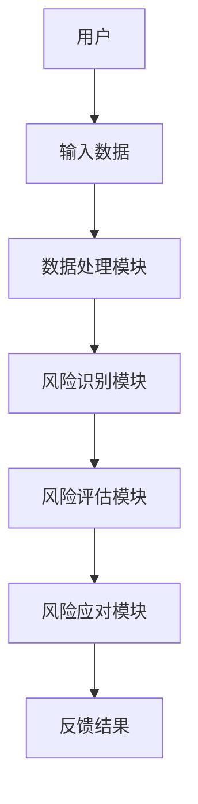

                 

# AI Agent在智能供应链风险管理中的应用

> 关键词：AI Agent, 智能供应链, 供应链风险管理, 人工智能, 供应链管理

> 摘要：本文深入探讨了AI Agent在智能供应链风险管理中的应用，从AI Agent的基本概念到其在供应链风险管理中的具体应用场景，详细分析了AI Agent的核心算法原理、系统架构设计以及项目实战案例，帮助读者全面理解AI Agent在智能供应链风险管理中的重要作用和实际应用价值。

---

## 第1章: AI Agent与供应链风险管理概述

### 1.1 AI Agent的基本概念

#### 1.1.1 AI Agent的定义与特点
AI Agent（人工智能代理）是指能够感知环境并采取行动以实现目标的智能实体。AI Agent的核心特点包括：
- **自主性**：能够在没有外部干预的情况下自主决策。
- **反应性**：能够实时感知环境变化并做出反应。
- **目标导向性**：通过目标驱动进行问题求解和行动选择。
- **学习能力**：能够通过数据学习和优化自身的决策能力。

#### 1.1.2 AI Agent的核心原理
AI Agent的核心原理包括：
- **知识表示**：将问题领域中的知识表示为数据结构或模型。
- **问题求解**：通过算法和推理机制解决问题。
- **行为推理**：基于知识和环境信息做出行为决策。

#### 1.1.3 AI Agent与传统供应链管理的区别
与传统供应链管理相比，AI Agent的优势在于其智能化和自动化能力。AI Agent能够通过实时数据感知供应链中的潜在风险，并通过智能算法快速制定应对策略，显著提高了供应链管理的效率和准确性。

---

### 1.2 智能供应链管理的定义与特点

#### 1.2.1 智能供应链管理的概念
智能供应链管理是指通过智能化技术（如人工智能、大数据分析等）对供应链的各个环节进行优化和管理，以提高供应链的效率和韧性。

#### 1.2.2 智能供应链管理的核心要素
智能供应链管理的核心要素包括：
- **数据采集**：通过传感器、物联网设备等实时采集供应链数据。
- **数据分析**：利用大数据分析技术对数据进行处理和挖掘。
- **智能决策**：通过AI算法对数据进行分析并制定最优决策。
- **自动化执行**：通过自动化系统执行决策并反馈结果。

#### 1.2.3 智能供应链管理的优势与挑战
智能供应链管理的优势在于其高效性和准确性，能够显著降低供应链中的不确定性和风险。然而，其挑战在于数据的实时性、算法的复杂性和系统的可扩展性。

---

### 1.3 供应链风险管理的重要性

#### 1.3.1 供应链风险管理的定义
供应链风险管理是指在供应链的各个环节中识别、评估和应对潜在风险的过程。

#### 1.3.2 供应链风险管理的关键环节
供应链风险管理的关键环节包括：
- **风险识别**：识别供应链中的潜在风险。
- **风险评估**：评估风险的可能性和影响程度。
- **风险应对**：制定并实施应对策略以降低风险影响。

#### 1.3.3 AI Agent在供应链风险管理中的作用
AI Agent在供应链风险管理中的作用主要体现在：
- **实时监控**：通过实时数据监控供应链中的潜在风险。
- **智能预警**：通过算法分析潜在风险并发出预警。
- **决策支持**：基于数据分析提供最优的风险应对策略。

---

## 第2章: AI Agent的核心概念与原理

### 2.1 AI Agent的核心概念

#### 2.1.1 知识表示
知识表示是AI Agent的核心技术之一，主要用于描述问题领域中的知识和信息。常见的知识表示方法包括：
- **符号表示法**：使用符号和规则表示知识。
- **语义网络**：通过节点和边表示概念及其关系。
- **本体论**：通过形式化语言描述知识。

#### 2.1.2 问题求解
问题求解是AI Agent的核心任务之一，主要通过算法和推理机制解决问题。常见的问题求解方法包括：
- **逻辑推理**：通过逻辑规则进行推理。
- **机器学习**：通过数据训练模型进行预测和分类。
- **自然语言处理**：通过语言理解技术进行信息提取。

#### 2.1.3 行为推理
行为推理是AI Agent通过知识和环境信息做出行为决策的过程。常见的行为推理方法包括：
- **基于规则的推理**：通过预定义规则进行推理。
- **基于模型的推理**：通过建立模型进行推理。
- **基于案例的推理**：通过类似案例进行推理。

---

### 2.2 AI Agent的核心原理

#### 2.2.1 知识表示模型
知识表示模型是AI Agent理解和表示知识的基础。常见的知识表示模型包括：
- **语义网络模型**：通过节点和边表示概念及其关系。
- **本体论模型**：通过形式化语言描述知识。
- **规则模型**：通过预定义规则表示知识。

#### 2.2.2 问题求解算法
问题求解算法是AI Agent解决问题的核心方法。常见的问题求解算法包括：
- **逻辑推理算法**：如归结式推理、演绎推理等。
- **机器学习算法**：如决策树、支持向量机、神经网络等。
- **自然语言处理算法**：如分词、句法分析、语义理解等。

#### 2.2.3 行为推理机制
行为推理机制是AI Agent基于知识和环境信息做出行为决策的过程。常见的行为推理机制包括：
- **基于规则的推理机制**：通过预定义规则进行推理。
- **基于模型的推理机制**：通过建立模型进行推理。
- **基于案例的推理机制**：通过类似案例进行推理。

---

### 2.3 AI Agent与供应链风险管理的结合

#### 2.3.1 AI Agent在供应链风险管理中的应用场景
AI Agent在供应链风险管理中的应用场景包括：
- **风险识别**：通过实时数据监控识别潜在风险。
- **风险评估**：通过算法分析评估风险的可能性和影响程度。
- **风险应对**：通过智能决策制定风险应对策略。

#### 2.3.2 AI Agent在供应链风险管理中的优势
AI Agent在供应链风险管理中的优势包括：
- **实时性**：能够实时感知和处理供应链中的潜在风险。
- **准确性**：通过算法分析提高风险评估的准确性。
- **高效性**：通过自动化决策提高供应链管理的效率。

#### 2.3.3 AI Agent在供应链风险管理中的挑战
AI Agent在供应链风险管理中的挑战包括：
- **数据的实时性**：需要实时采集和处理大量数据。
- **算法的复杂性**：需要复杂的算法进行分析和决策。
- **系统的可扩展性**：需要系统能够扩展以应对大规模数据和复杂场景。

---

## 第3章: AI Agent的算法原理与数学模型

### 3.1 AI Agent的核心算法

#### 3.1.1 逻辑推理算法
逻辑推理算法是AI Agent解决问题的核心算法之一。常见的逻辑推理算法包括：
- **归结式推理**：通过将问题转化为逻辑子句并进行归结。
- **演绎推理**：通过从一般到特定的推理过程进行推理。

#### 3.1.2 机器学习算法
机器学习算法是AI Agent通过数据训练模型进行预测和分类的核心算法。常见的机器学习算法包括：
- **决策树**：通过构建决策树模型进行分类和回归。
- **支持向量机**：通过构建支持向量机模型进行分类。
- **神经网络**：通过构建人工神经网络模型进行分类和回归。

#### 3.1.3 自然语言处理算法
自然语言处理算法是AI Agent通过语言理解技术进行信息提取的核心算法。常见的自然语言处理算法包括：
- **分词**：将文本分割成词语或短语。
- **句法分析**：分析句子的语法结构。
- **语义理解**：理解文本的语义含义。

---

### 3.2 AI Agent的数学模型

#### 3.2.1 知识表示的数学模型
知识表示的数学模型是AI Agent理解和表示知识的基础。常见的知识表示数学模型包括：
- **语义网络模型**：通过节点和边表示概念及其关系。
- **本体论模型**：通过形式化语言描述知识。
- **规则模型**：通过预定义规则表示知识。

#### 3.2.2 问题求解的数学模型
问题求解的数学模型是AI Agent解决问题的核心方法。常见的问题求解数学模型包括：
- **逻辑推理模型**：通过逻辑规则进行推理。
- **机器学习模型**：通过数据训练模型进行预测和分类。
- **自然语言处理模型**：通过语言理解技术进行信息提取。

#### 3.2.3 行为推理的数学模型
行为推理的数学模型是AI Agent基于知识和环境信息做出行为决策的过程。常见的行为推理数学模型包括：
- **基于规则的推理模型**：通过预定义规则进行推理。
- **基于模型的推理模型**：通过建立模型进行推理。
- **基于案例的推理模型**：通过类似案例进行推理。

---

### 3.3 AI Agent的算法实现

#### 3.3.1 逻辑推理算法的实现
逻辑推理算法的实现包括：
- **归结式推理**：通过将问题转化为逻辑子句并进行归结。
- **演绎推理**：通过从一般到特定的推理过程进行推理。

#### 3.3.2 机器学习算法的实现
机器学习算法的实现包括：
- **决策树**：通过构建决策树模型进行分类和回归。
- **支持向量机**：通过构建支持向量机模型进行分类。
- **神经网络**：通过构建人工神经网络模型进行分类和回归。

#### 3.3.3 自然语言处理算法的实现
自然语言处理算法的实现包括：
- **分词**：将文本分割成词语或短语。
- **句法分析**：分析句子的语法结构。
- **语义理解**：理解文本的语义含义。

---

## 第4章: 智能供应链风险管理系统的架构设计

### 4.1 智能供应链风险管理系统的总体架构

#### 4.1.1 系统功能模块划分
智能供应链风险管理系统的功能模块划分包括：
- **风险识别模块**：实时监控供应链中的潜在风险。
- **风险评估模块**：评估风险的可能性和影响程度。
- **风险应对模块**：制定并实施风险应对策略。

#### 4.1.2 系统功能流程设计
智能供应链风险管理系统的功能流程设计包括：
1. **数据采集**：通过传感器、物联网设备等实时采集供应链数据。
2. **数据处理**：对采集到的数据进行清洗和预处理。
3. **风险识别**：通过算法分析识别潜在风险。
4. **风险评估**：评估风险的可能性和影响程度。
5. **风险应对**：制定并实施风险应对策略。

#### 4.1.3 系统功能交互设计
智能供应链风险管理系统的功能交互设计包括：
- **用户界面**：用户通过界面输入数据和查看结果。
- **系统反馈**：系统通过反馈结果指导用户进行下一步操作。

---

### 4.2 系统功能模块设计

#### 4.2.1 风险识别模块
风险识别模块的主要功能包括：
- **实时监控**：通过传感器和物联网设备实时监控供应链中的潜在风险。
- **数据采集**：采集供应链中的实时数据。
- **风险预警**：通过算法分析潜在风险并发出预警。

#### 4.2.2 风险评估模块
风险评估模块的主要功能包括：
- **风险分析**：通过算法分析风险的可能性和影响程度。
- **风险优先级排序**：根据风险的优先级进行排序。
- **风险报告生成**：生成风险报告并反馈给用户。

#### 4.2.3 风险应对模块
风险应对模块的主要功能包括：
- **策略制定**：根据风险分析结果制定风险应对策略。
- **策略执行**：通过自动化系统执行风险应对策略。
- **结果反馈**：反馈策略执行结果并进行优化。

---

### 4.3 系统架构设计

#### 4.3.1 系统架构图
以下是智能供应链风险管理系统的架构图：

#### 4.3.2 系统功能流程图
以下是智能供应链风险管理系统的功能流程图：

#### 4.3.3 系统交互流程图
以下是智能供应链风险管理系统的交互流程图：

---

## 第5章: AI Agent在供应链风险管理中的项目实战

### 5.1 项目背景与目标

#### 5.1.1 项目背景
随着全球供应链的复杂化，供应链风险管理的重要性日益凸显。为了提高供应链的效率和韧性，越来越多的企业开始采用AI Agent技术进行供应链风险管理。

#### 5.1.2 项目目标
本项目的目标是通过AI Agent技术实现智能供应链风险管理，具体目标包括：
- 实现供应链中的风险识别、评估和应对。
- 提高供应链管理的效率和准确性。
- 降低供应链中的潜在风险。

#### 5.1.3 项目范围
项目范围包括：
- 数据采集与处理。
- 风险识别与评估。
- 风险应对与优化。

---

### 5.2 项目实施过程

#### 5.2.1 系统环境安装与配置
系统环境安装与配置包括：
- **操作系统**：选择合适的操作系统（如Linux、Windows等）。
- **开发工具**：安装Python、Jupyter Notebook等开发工具。
- **依赖库安装**：安装必要的依赖库（如NumPy、Pandas、Scikit-learn等）。

#### 5.2.2 系统核心功能实现
系统核心功能实现包括：
- **风险识别模块**：通过传感器和物联网设备实时采集数据并识别潜在风险。
- **风险评估模块**：通过算法分析风险的可能性和影响程度。
- **风险应对模块**：根据风险评估结果制定并实施风险应对策略。

#### 5.2.3 系统测试与优化
系统测试与优化包括：
- **功能测试**：测试系统各功能模块是否正常运行。
- **性能优化**：优化系统性能以提高运行效率。
- **用户体验优化**：优化用户界面和交互流程以提高用户体验。

---

### 5.3 项目实战案例分析

#### 5.3.1 案例背景
假设某公司供应链中存在原材料供应不稳定的问题，为了提高供应链的稳定性，该公司决定采用AI Agent技术进行供应链风险管理。

#### 5.3.2 数据采集与处理
数据采集与处理包括：
- **数据采集**：通过传感器和物联网设备实时采集供应链中的数据。
- **数据清洗**：对采集到的数据进行清洗和预处理。
- **数据存储**：将处理后的数据存储在数据库中。

#### 5.3.3 风险识别与评估
风险识别与评估包括：
- **风险识别**：通过算法分析识别供应链中的潜在风险。
- **风险评估**：评估风险的可能性和影响程度。

#### 5.3.4 风险应对与优化
风险应对与优化包括：
- **风险应对**：根据风险评估结果制定并实施风险应对策略。
- **策略优化**：根据策略执行结果优化风险应对策略。

---

## 第6章: 总结与展望

### 6.1 本章总结
本文深入探讨了AI Agent在智能供应链风险管理中的应用，从AI Agent的基本概念到其在供应链风险管理中的具体应用场景，详细分析了AI Agent的核心算法原理、系统架构设计以及项目实战案例，帮助读者全面理解AI Agent在智能供应链风险管理中的重要作用和实际应用价值。

### 6.2 未来展望
随着人工智能技术的不断发展，AI Agent在智能供应链风险管理中的应用前景广阔。未来，随着算法的优化和硬件的升级，AI Agent将能够处理更复杂的问题，实现更高效的供应链管理。同时，随着云计算和大数据技术的发展，AI Agent在供应链风险管理中的应用将更加智能化和自动化。

---

## 最佳实践 Tips

- **数据采集**：确保数据的实时性和准确性。
- **算法选择**：根据具体场景选择合适的算法。
- **系统优化**：不断优化系统性能和用户体验。

## 小结
通过本文的探讨，我们可以看到AI Agent在智能供应链风险管理中的巨大潜力。未来，随着技术的不断发展，AI Agent将在供应链风险管理中发挥越来越重要的作用。

---

## 注意事项
- 在实际应用中，需注意数据隐私和安全问题。
- 系统设计时，需考虑系统的可扩展性和可维护性。
- 算法实现时，需注意算法的复杂度和运行效率。

---

## 拓展阅读
- 《AI Agent与智能供应链管理》
- 《人工智能在供应链管理中的应用》
- 《供应链风险管理的理论与实践》

---

## 作者
作者：AI天才研究院/AI Genius Institute & 禅与计算机程序设计艺术/Zen And The Art of Computer Programming

