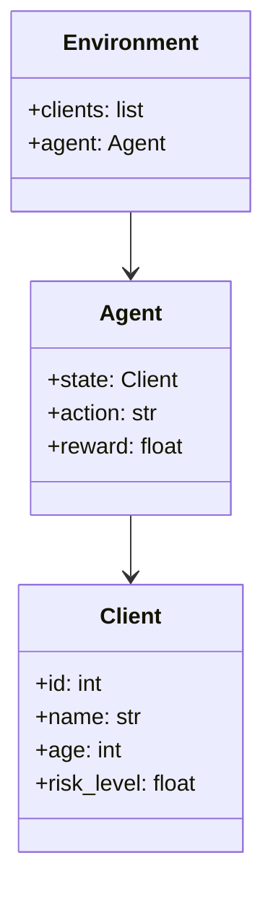
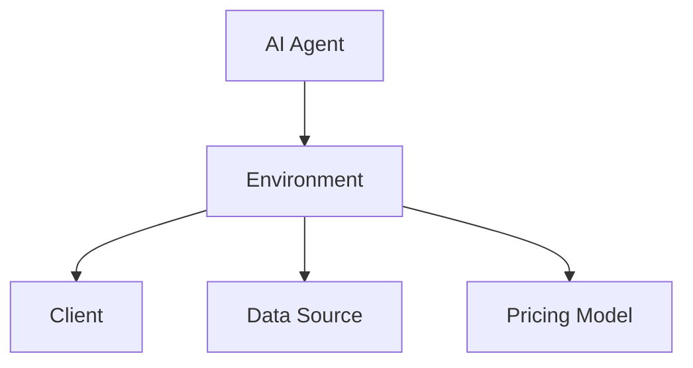
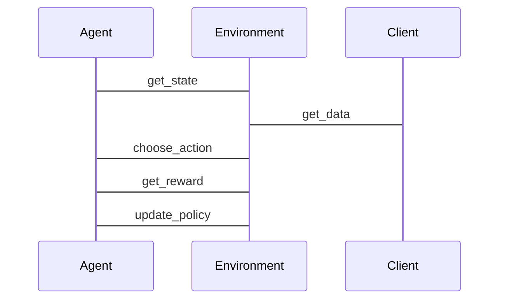

                 


# AI Agent在智能保险产品定价中的应用

**关键词**: AI Agent, 智能保险, 定价模型, 保险定价, 强化学习, 神经网络

**摘要**: 随着人工智能技术的飞速发展，AI Agent（智能代理）在保险行业的应用越来越广泛。本文将深入探讨AI Agent在智能保险产品定价中的应用，从背景、原理到实现，全面解析其在保险定价中的作用和价值。通过具体案例和数学模型的分析，本文旨在为读者提供一个系统化的视角，理解如何利用AI技术优化保险定价策略，提升保险公司竞争力和客户满意度。

---

# 第1章: AI Agent与智能保险定价概述

## 1.1 AI Agent的基本概念

### 1.1.1 AI Agent的定义与特点

AI Agent（智能代理）是一种能够感知环境、做出决策并执行任务的智能系统。它通常具备以下特点：

1. **自主性**：AI Agent能够在没有外部干预的情况下自主运行。
2. **反应性**：能够实时感知环境变化并做出相应反应。
3. **目标导向**：具有明确的目标，通过行为选择来实现目标。
4. **学习能力**：能够通过数据和经验不断优化自身行为。

### 1.1.2 AI Agent的核心功能与应用场景

AI Agent的核心功能包括：

1. **感知**：通过传感器或数据输入感知环境信息。
2. **决策**：基于感知信息，利用算法做出最优决策。
3. **执行**：根据决策结果执行相应操作。

在保险行业，AI Agent的应用场景包括：

- **风险评估**：通过数据分析评估客户的风险等级。
- **定价优化**：基于客户数据和市场趋势优化保险产品定价。
- **客户服务**：通过智能客服为客户提供个性化的保险咨询和理赔服务。

### 1.1.3 AI Agent在保险行业的潜力与价值

AI Agent为保险行业带来的价值包括：

- **提高效率**：通过自动化流程减少人工干预，提高业务处理效率。
- **降低成本**：通过精准定价和风险控制降低保险公司的运营成本。
- **提升客户体验**：为客户提供个性化的保险产品和服务，增强客户满意度。

---

## 1.2 智能保险定价的背景与现状

### 1.2.1 传统保险定价的局限性

传统保险定价方法主要依赖于历史数据和经验判断，存在以下问题：

1. **数据依赖性强**：需要大量历史数据支持，难以应对新兴风险。
2. **主观性高**：定价结果受人为因素影响较大，缺乏客观性。
3. **响应速度慢**：传统定价方法难以快速适应市场变化。

### 1.2.2 智能保险定价的兴起

随着大数据和人工智能技术的发展，智能保险定价应运而生。智能定价通过整合实时数据和机器学习算法，能够快速、精准地评估客户风险并制定最优定价策略。

### 1.2.3 当前保险行业的数字化转型趋势

保险行业正经历数字化转型，越来越多的保险公司开始采用AI技术来优化业务流程。AI Agent作为数字化转型的重要工具，正在改变保险行业的定价模式和客户服务方式。

---

## 1.3 AI Agent在保险定价中的作用

### 1.3.1 数据驱动的定价决策

AI Agent通过收集和分析大量的客户数据，包括年龄、职业、健康状况等，能够更精准地评估客户风险。

### 1.3.2 AI Agent如何优化定价模型

AI Agent可以通过强化学习和神经网络等算法，不断优化定价模型，提高定价的准确性和合理性。

### 1.3.3 智能定价对保险公司和客户的价值

- **对保险公司**：提高定价效率，降低风险，增强市场竞争力。
- **对客户**：获得个性化的保险产品，享受更优质的服务体验。

---

## 1.4 本章小结

本章介绍了AI Agent的基本概念及其在保险定价中的作用，分析了传统定价的局限性和智能定价的潜力。通过理解AI Agent的核心功能和价值，读者可以更好地认识智能保险定价的重要性。

---

# 第2章: AI Agent的核心原理与数学基础

## 2.1 AI Agent的核心原理

### 2.1.1 AI Agent的感知、决策与执行机制

AI Agent的感知、决策与执行机制如下：

1. **感知**：通过传感器或数据输入获取环境信息。
2. **决策**：基于感知信息，利用算法做出最优决策。
3. **执行**：根据决策结果执行相应操作。

### 2.1.2 基于强化学习的定价策略

强化学习是一种通过试错不断优化行为的算法。在保险定价中，强化学习可以通过以下步骤优化定价策略：

1. **状态定义**：定义定价状态，如客户风险等级。
2. **动作选择**：选择最优的定价策略。
3. **奖励机制**：根据定价结果获得奖励或惩罚。

### 2.1.3 多智能体协作在保险定价中的应用

多智能体协作可以通过多个AI Agent协同工作，提高定价的准确性和效率。例如，一个AI Agent负责客户数据收集，另一个负责风险评估，协同完成定价任务。

---

## 2.2 定价模型的数学基础

### 2.2.1 线性回归模型在定价中的应用

线性回归模型是一种常用的定价模型。其基本公式为：

$$ y = \beta_0 + \beta_1x_1 + \beta_2x_2 + \dots + \beta_nx_n $$

其中，$y$ 是目标变量（如保费），$x_i$ 是自变量（如年龄、职业等）。

### 2.2.2 风险评估的贝叶斯网络模型

贝叶斯网络是一种基于概率的定价模型。其核心思想是通过概率推理来评估客户风险。

### 2.2.3 基于神经网络的定价模型

神经网络是一种常用的深度学习模型。其基本结构包括输入层、隐藏层和输出层。神经网络可以通过以下步骤进行定价：

1. **数据输入**：输入客户数据。
2. **特征提取**：通过隐藏层提取数据特征。
3. **输出结果**：输出最终定价。

---

## 2.3 AI Agent定价模型的数学公式

### 2.3.1 线性回归模型公式

$$ y = \beta_0 + \beta_1x_1 + \beta_2x_2 + \dots + \beta_nx_n $$

### 2.3.2 神经网络定价模型公式

$$ y = \sigma(w \cdot x + b) $$

其中，$\sigma$ 是激活函数，$w$ 是权重，$b$ 是偏置。

### 2.3.3 强化学习定价策略公式

$$ Q(s,a) = r + \gamma \max_{a'} Q(s',a') $$

其中，$s$ 是当前状态，$a$ 是动作，$r$ 是奖励，$\gamma$ 是折扣因子。

---

## 2.4 本章小结

本章详细讲解了AI Agent的核心原理和数学基础，包括感知、决策、执行机制，强化学习定价策略，以及神经网络定价模型。通过这些理论知识，读者可以更好地理解AI Agent在智能保险定价中的应用。

---

# 第3章: AI Agent定价算法的实现

## 3.1 基于强化学习的定价算法

### 3.1.1 强化学习的基本原理

强化学习通过试错不断优化行为。在保险定价中，强化学习可以通过以下步骤优化定价策略：

1. **状态定义**：定义定价状态，如客户风险等级。
2. **动作选择**：选择最优的定价策略。
3. **奖励机制**：根据定价结果获得奖励或惩罚。

### 3.1.2 在保险定价中的应用

通过强化学习，AI Agent可以不断优化定价策略，提高定价的准确性和效率。

### 3.1.3 算法实现步骤与代码示例

以下是基于强化学习的定价算法实现步骤：

1. **环境初始化**：定义定价环境，如客户数据。
2. **状态感知**：感知当前状态。
3. **动作选择**：选择最优动作。
4. **执行动作**：执行选择的动作。
5. **奖励反馈**：根据结果获得奖励或惩罚。
6. **更新策略**：根据奖励更新策略。

以下是Python代码示例：

```python
import numpy as np

# 初始化环境
class Environment:
    def __init__(self):
        self.client_data = [...]  # 客户数据

    def get_state(self):
        # 返回当前状态
        return self.client_data

# 强化学习算法
class Agent:
    def __init__(self, state_space, action_space):
        self.state_space = state_space
        self.action_space = action_space
        self.q_table = np.zeros((state_space, action_space))

    def choose_action(self, state, epsilon=0.1):
        if np.random.random() < epsilon:
            return np.random.randint(self.action_space)
        else:
            return np.argmax(self.q_table[state])

    def update_q_table(self, state, action, reward):
        self.q_table[state][action] = reward

# 主程序
env = Environment()
agent = Agent(state_space=..., action_space=...)

for episode in range(num_episodes):
    state = env.get_state()
    action = agent.choose_action(state)
    reward = env.get_reward(action)
    agent.update_q_table(state, action, reward)
```

---

## 3.2 基于神经网络的定价算法

### 3.2.1 神经网络的基本结构

神经网络的基本结构包括输入层、隐藏层和输出层。以下是神经网络的Python代码示例：

```python
import tensorflow as tf
from tensorflow import keras

# 定义神经网络模型
model = keras.Sequential([
    keras.layers.Dense(64, activation='relu'),
    keras.layers.Dense(1, activation='linear')
])

# 编译模型
model.compile(optimizer='adam', loss='mean_squared_error')
```

### 3.2.2 在保险定价中的应用

通过神经网络，AI Agent可以更精准地预测客户风险，优化定价策略。

### 3.2.3 算法实现步骤与代码示例

以下是基于神经网络的定价算法实现步骤：

1. **数据准备**：收集和整理客户数据。
2. **模型训练**：训练神经网络模型。
3. **模型预测**：利用模型预测客户风险。
4. **定价决策**：根据预测结果制定定价策略。

以下是Python代码示例：

```python
# 数据准备
client_data = [...]  # 客户数据

# 模型训练
model.fit(client_data, labels, epochs=100, batch_size=32)

# 模型预测
predictions = model.predict(client_data)

# 定价决策
prices = [...]  # 根据预测结果制定价格
```

---

## 3.3 本章小结

本章详细讲解了基于强化学习和神经网络的定价算法，通过代码示例和理论分析，读者可以更好地理解AI Agent在智能保险定价中的实现过程。

---

# 第4章: AI Agent定价系统的架构设计与实现

## 4.1 系统功能设计

### 4.1.1 问题场景介绍

在保险定价中，AI Agent需要完成以下任务：

- **数据采集**：收集客户数据。
- **风险评估**：评估客户风险。
- **定价决策**：制定最优定价策略。
- **反馈优化**：根据反馈优化定价模型。

### 4.1.2 项目介绍

本项目旨在开发一个基于AI Agent的智能保险定价系统，通过整合客户数据和机器学习算法，实现精准定价。

### 4.1.3 系统功能设计

以下是系统功能设计的类图：



---

## 4.2 系统架构设计

### 4.2.1 系统架构图

以下是系统架构图：



---

## 4.3 系统接口设计

### 4.3.1 接口设计

以下是系统接口设计：

- **输入接口**：客户数据输入。
- **输出接口**：定价结果输出。

---

## 4.4 系统交互流程图

以下是系统交互流程图：



---

## 4.5 本章小结

本章详细讲解了AI Agent定价系统的架构设计与实现，包括功能设计、系统架构、接口设计和交互流程图。通过这些设计，读者可以更好地理解AI Agent在智能保险定价中的具体应用。

---

# 第5章: 项目实战与案例分析

## 5.1 环境配置与数据准备

### 5.1.1 环境配置

以下是Python环境配置代码：

```bash
pip install numpy pandas scikit-learn tensorflow
```

### 5.1.2 数据准备

以下是客户数据示例：

```python
import pandas as pd

client_data = pd.DataFrame({
    'id': [1, 2, 3, 4, 5],
    'age': [25, 30, 35, 40, 45],
    'income': [50000, 60000, 70000, 80000, 90000],
    'risk_level': [0.1, 0.2, 0.3, 0.4, 0.5]
})
```

---

## 5.2 系统核心实现

### 5.2.1 基于强化学习的定价模型实现

以下是基于强化学习的定价模型实现代码：

```python
import numpy as np

class Agent:
    def __init__(self, state_space, action_space):
        self.q_table = np.zeros((state_space, action_space))

    def choose_action(self, state, epsilon=0.1):
        if np.random.random() < epsilon:
            return np.random.randint(action_space)
        else:
            return np.argmax(self.q_table[state])

    def update_q_table(self, state, action, reward):
        self.q_table[state][action] = reward
```

### 5.2.2 基于神经网络的定价模型实现

以下是基于神经网络的定价模型实现代码：

```python
import tensorflow as tf
from tensorflow import keras

model = keras.Sequential([
    keras.layers.Dense(64, activation='relu'),
    keras.layers.Dense(1, activation='linear')
])

model.compile(optimizer='adam', loss='mean_squared_error')
```

---

## 5.3 代码应用解读与分析

### 5.3.1 基于强化学习的定价模型应用

通过强化学习，AI Agent可以不断优化定价策略，提高定价的准确性和效率。

### 5.3.2 基于神经网络的定价模型应用

通过神经网络，AI Agent可以更精准地预测客户风险，制定最优定价策略。

---

## 5.4 案例分析

### 5.4.1 案例背景

某保险公司希望通过AI Agent优化保险产品定价，降低运营成本，提高客户满意度。

### 5.4.2 数据分析与建模

通过对客户数据的分析和建模，AI Agent能够精准评估客户风险，制定最优定价策略。

### 5.4.3 模型优化与部署

通过模型优化和部署，保险公司可以实现精准定价，提高市场竞争力。

---

## 5.5 本章小结

本章通过项目实战和案例分析，详细讲解了AI Agent定价系统的实现过程，包括环境配置、数据准备、模型实现和案例分析。通过这些实践，读者可以更好地理解AI Agent在智能保险定价中的具体应用。

---

# 第6章: 总结与展望

## 6.1 总结

本文深入探讨了AI Agent在智能保险定价中的应用，从背景、原理到实现，全面解析了其在保险定价中的作用和价值。通过具体案例和数学模型的分析，本文为读者提供了一个系统化的视角，理解如何利用AI技术优化保险定价策略，提升保险公司竞争力和客户满意度。

---

## 6.2 展望

未来，随着AI技术的不断发展，AI Agent在保险定价中的应用将更加广泛和深入。保险公司可以通过不断优化AI Agent算法，提升定价的准确性和效率，为客户提供更优质的保险产品和服务。

---

## 6.3 最佳实践 Tips

- **数据隐私保护**：在处理客户数据时，必须严格遵守数据隐私保护法规。
- **模型解释性**：在设计AI Agent时，应注重模型的解释性，以便更好地理解和优化定价策略。

---

## 6.4 本章小结

本章总结了全文的主要内容，并展望了未来的发展方向。同时，本文还提供了最佳实践 Tips，帮助读者更好地理解和应用AI Agent技术。

---

# 作者

**作者：AI天才研究院/AI Genius Institute & 禅与计算机程序设计艺术 /Zen And The Art of Computer Programming**

---

以上是《AI Agent在智能保险产品定价中的应用》的技术博客文章的完整目录和内容。文章从AI Agent的基本概念到具体实现，再到系统设计和项目实战，全面涵盖了AI Agent在智能保险定价中的应用。通过理论与实践相结合的方式，本文为读者提供了一个系统化的视角，理解如何利用AI技术优化保险定价策略，提升保险公司竞争力和客户满意度。

