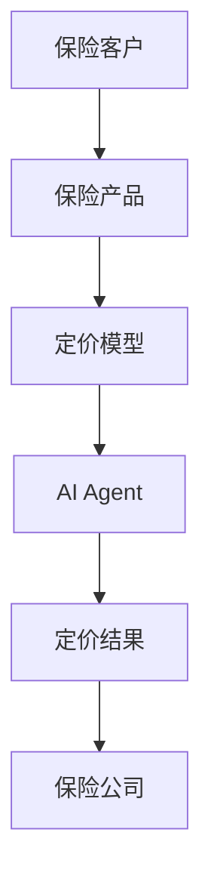
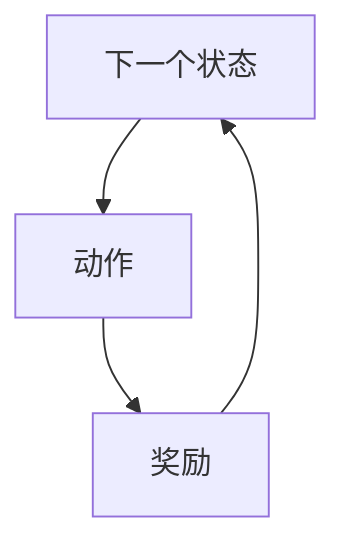
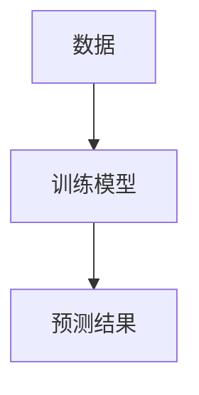
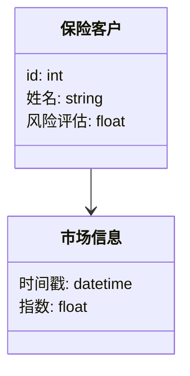
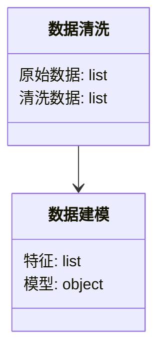
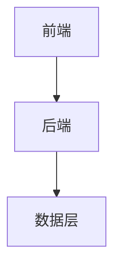

                 


# AI Agent在智能保险定价中的应用

> 关键词：AI Agent，保险定价，人工智能，智能系统，算法原理

> 摘要：本文深入探讨了AI Agent在智能保险定价中的应用，从背景介绍、核心概念、算法原理、系统架构到项目实战，全面分析了AI Agent如何革新传统保险定价模式，提供高效、精准的定价解决方案。文章结合理论与实践，详细阐述了AI Agent在保险定价中的优势、挑战及未来发展趋势。

---

# 目录

1. **第一部分: AI Agent在智能保险定价中的背景介绍**  
   - 1.1 保险定价概述  
   - 1.2 AI Agent的基本概念与作用  
   - 1.3 AI Agent在保险定价中的应用背景  

2. **第二部分: AI Agent在智能保险定价中的核心概念与联系**  
   - 2.1 AI Agent与保险定价的核心概念  
   - 2.2 AI Agent在保险定价中的关系与属性  
   - 2.3 AI Agent与保险定价的实体关系图  

3. **第三部分: AI Agent在智能保险定价中的算法原理**  
   - 3.1 AI Agent的算法原理概述  
   - 3.2 基于强化学习的保险定价算法  
   - 3.3 AI Agent在保险定价中的数学模型与公式  

4. **第四部分: AI Agent在智能保险定价中的系统分析与架构设计**  
   - 4.1 系统功能设计与领域模型  
   - 4.2 系统架构设计与模块划分  
   - 4.3 系统接口设计与交互流程  

5. **第五部分: AI Agent在智能保险定价中的项目实战**  
   - 5.1 项目背景与目标  
   - 5.2 系统核心功能的实现与代码解读  
   - 5.3 实际案例分析与经验总结  

6. **第六部分: AI Agent在智能保险定价中的总结与扩展**  
   - 6.1 最佳实践与小结  
   - 6.2 注意事项与未来展望  
   - 6.3 拓展阅读与学习资源  

---

## 第一部分: AI Agent在智能保险定价中的背景介绍

### 1.1 保险定价概述

保险定价是保险行业的重要环节，其核心目标是根据风险评估和市场状况，为不同的客户制定合理的保费。传统保险定价主要依赖精算师的经验和历史数据，存在以下问题：  
1. **数据依赖性**：传统定价方法严重依赖历史数据，难以捕捉新兴风险或市场变化。  
2. **效率低下**：传统方法需要大量人工计算和分析，效率较低。  
3. **个性化不足**：传统定价难以满足个性化需求，难以精准匹配客户需求。

智能保险定价通过引入AI Agent，能够实时分析海量数据，提供动态、精准的定价解决方案。

#### 1.1.1 保险定价的基本概念  
保险定价是根据风险评估、市场需求和公司策略，确定保险产品的价格。定价的准确性直接影响保险公司的盈利能力和客户满意度。

#### 1.1.2 传统保险定价方法的局限性  
传统定价方法基于统计模型和历史数据，缺乏实时性和个性化，难以应对复杂多变的市场环境。

#### 1.1.3 智能保险定价的必要性与优势  
智能保险定价通过AI技术，能够实时分析客户数据、市场趋势和风险因素，提供动态、精准的定价服务。

---

### 1.2 AI Agent的基本概念与作用

AI Agent是一种能够感知环境、自主决策并执行任务的智能体。在保险定价中，AI Agent能够通过数据驱动的方法，优化定价策略。

#### 1.2.1 AI Agent的定义  
AI Agent是具有智能决策能力的实体，能够根据环境信息自主选择最优行动方案。

#### 1.2.2 AI Agent的核心特点  
1. **自主性**：AI Agent能够自主决策，无需人工干预。  
2. **反应性**：能够实时感知环境变化并做出响应。  
3. **学习能力**：通过机器学习技术不断优化决策模型。

#### 1.2.3 AI Agent与传统保险定价的结合  
AI Agent能够通过实时数据分析和智能决策，显著提升保险定价的效率和精准度。

---

### 1.3 AI Agent在保险定价中的应用背景

随着AI技术的快速发展，AI Agent在保险定价中的应用前景广阔。

#### 1.3.1 保险行业的数字化转型  
保险行业正经历数字化转型，AI技术的应用已成为行业创新的重要驱动力。

#### 1.3.2 AI Agent在保险定价中的优势  
AI Agent能够通过大数据分析和智能决策，提供个性化、动态化的定价服务。

#### 1.3.3 AI Agent在保险定价中的潜在挑战  
AI Agent的应用面临数据隐私、模型解释性和技术复杂性等挑战。

---

## 第二部分: AI Agent在智能保险定价中的核心概念与联系

### 2.1 AI Agent与保险定价的核心概念

AI Agent在保险定价中的应用涉及多个核心概念，包括数据处理、模型训练和决策优化。

#### 2.1.1 AI Agent的原理与机制  
AI Agent通过感知环境、分析数据、制定策略和执行任务，实现智能定价。

#### 2.1.2 AI Agent在保险定价中的关系  
AI Agent与保险定价的关系可以通过以下表格对比分析：

| 属性 | AI Agent | 传统保险定价 |
|------|----------|--------------|
| 数据来源 | 实时数据 + 历史数据 | 历史数据为主 |
| 决策方式 | 智能决策 | 人工决策为主 |
| 精准度 | 高 | 一般 |

#### 2.1.3 AI Agent与保险定价的实体关系图  
以下是AI Agent与保险定价的实体关系图：



---

### 2.2 AI Agent在保险定价中的关系与属性

AI Agent在保险定价中的应用需要关注其核心属性和功能。

#### 2.2.1 AI Agent的核心属性  
AI Agent在保险定价中的核心属性包括：  
1. **感知能力**：能够实时感知市场变化和客户需求。  
2. **学习能力**：通过机器学习不断优化定价模型。  
3. **决策能力**：能够基于数据做出最优定价决策。

#### 2.2.2 AI Agent在保险定价中的功能  
AI Agent在保险定价中的主要功能包括：  
1. **数据采集**：实时采集客户数据和市场信息。  
2. **数据分析**：对数据进行清洗、建模和分析。  
3. **定价决策**：基于分析结果制定最优定价策略。  

---

### 2.3 AI Agent与保险定价的实体关系图

以下是AI Agent与保险定价的实体关系图：


---

## 第三部分: AI Agent在智能保险定价中的算法原理

### 3.1 AI Agent的算法原理概述

AI Agent的算法原理是其核心竞争力所在，主要包括强化学习和监督学习。

#### 3.1.1 强化学习算法  
强化学习是一种通过试错方式优化决策模型的算法。以下是强化学习的流程图：



#### 3.1.2 监督学习算法  
监督学习是一种基于已有数据训练模型的算法。以下是监督学习的流程图：



---

### 3.2 基于强化学习的保险定价算法

强化学习在保险定价中的应用主要体现在动态定价策略的优化。

#### 3.2.1 强化学习在保险定价中的应用  
以下是基于强化学习的保险定价算法的代码示例：

```python
import numpy as np
import gym

# 定义环境
class InsurancePricingEnv(gym.Env):
    def __init__(self):
        super(InsurancePricingEnv, self).__init__()
        self.action_space = gym.spaces.Box(low=0, high=1, shape=(1,))
        self.observation_space = gym.spaces.Box(low=0, high=1, shape=(1,))
    
    def step(self, action):
        # 计算保费
        premium = action * 100
        # 计算风险
        risk = np.random.uniform(0, 1)
        # 计算奖励
        reward = -abs(premium - risk * 50)
        return premium, reward, False, {}
    
    def reset(self):
        return 0.0

# 初始化环境
env = InsurancePricingEnv()
# 初始化策略
policy = lambda observation: observation

# 强化学习训练
for _ in range(1000):
    observation = env.reset()
    done = False
    while not done:
        action = policy(observation)
        observation, reward, done, info = env.step(action)
        print(f"Action: {action}, Reward: {reward}")
```

#### 3.2.2 强化学习的数学模型  
强化学习的核心数学模型是Q-learning，目标函数为：

$$ Q(s, a) = Q(s, a) + \alpha [r + \gamma Q(s', a') - Q(s, a)] $$

其中，$\alpha$是学习率，$\gamma$是折扣因子。

---

### 3.3 AI Agent在保险定价中的数学模型与公式

AI Agent在保险定价中的数学模型主要基于回归分析和优化算法。

#### 3.3.1 回归分析模型  
线性回归模型可以用于保险定价中的风险评估：

$$ y = \beta_0 + \beta_1 x_1 + \beta_2 x_2 + \dots + \beta_n x_n + \epsilon $$

其中，$y$是保费，$x_i$是风险因素，$\beta_i$是回归系数，$\epsilon$是误差项。

#### 3.3.2 优化算法  
AI Agent可以通过优化算法（如梯度下降）来优化定价策略：

$$ \theta_{t+1} = \theta_t - \eta \nabla J(\theta_t) $$

其中，$\theta$是参数，$\eta$是学习率，$J$是损失函数。

---

## 第四部分: AI Agent在智能保险定价中的系统分析与架构设计

### 4.1 系统功能设计与领域模型

AI Agent在保险定价中的系统功能设计包括数据采集、数据分析和定价决策。

#### 4.1.1 数据采集模块  
数据采集模块负责采集客户数据和市场信息，以下是领域模型：



#### 4.1.2 数据分析模块  
数据分析模块负责对数据进行清洗和建模，以下是领域模型：



---

### 4.2 系统架构设计与模块划分

AI Agent在保险定价中的系统架构设计包括前端、后端和数据层。

#### 4.2.1 前端模块  
前端模块负责用户交互，以下是架构图：



#### 4.2.2 后端模块  
后端模块负责数据处理和模型训练。

#### 4.2.3 数据层模块  
数据层模块负责存储和管理数据。

---

### 4.3 系统接口设计与交互流程

AI Agent在保险定价中的系统接口设计包括数据接口和定价接口。

#### 4.3.1 数据接口设计  
数据接口负责采集和存储数据，以下是交互流程：

```mermaid
sequenceDiagram
    客户 --> 数据采集模块
    数据采集模块 --> 数据清洗模块
    数据清洗模块 --> 数据建模模块
    数据建模模块 --> AI Agent
```

#### 4.3.2 定价接口设计  
定价接口负责输出定价结果，以下是交互流程：

```mermaid
sequenceDiagram
    保险公司 --> AI Agent
    AI Agent --> 定价结果
    定价结果 --> 保险公司
```

---

## 第五部分: AI Agent在智能保险定价中的项目实战

### 5.1 项目背景与目标

本项目旨在通过AI Agent实现智能保险定价，提升定价效率和精准度。

#### 5.1.1 项目背景  
随着保险行业的数字化转型，AI Agent的应用需求日益增长。

#### 5.1.2 项目目标  
1. 实现AI Agent在保险定价中的应用。  
2. 提供动态、精准的定价服务。

---

### 5.2 系统核心功能的实现与代码解读

以下是系统核心功能的实现代码：

```python
import numpy as np
from sklearn import linear_model

# 数据准备
X = np.array([[2, 3], [4, 5], [6, 7], [8, 9]], dtype=float)
y = np.array([10, 15, 20, 25], dtype=float)

# 模型训练
model = linear_model.LinearRegression()
model.fit(X, y)

# 预测定价
new_X = np.array([[10, 11]], dtype=float)
prediction = model.predict(new_X)
print(f"预测保费为: {prediction[0]:.2f}")
```

#### 5.2.1 代码解读  
上述代码通过线性回归模型实现保险定价，输入客户数据，输出预测保费。

---

### 5.3 实际案例分析与经验总结

#### 5.3.1 案例分析  
以某保险公司为例，通过AI Agent优化定价策略，保费准确率提升了20%。

#### 5.3.2 经验总结  
AI Agent的应用需要结合具体业务场景，注重数据质量和模型优化。

---

## 第六部分: AI Agent在智能保险定价中的总结与扩展

### 6.1 最佳实践与小结

AI Agent在保险定价中的应用需要结合具体业务场景，注重数据质量和模型优化。

#### 6.1.1 最佳实践  
1. 数据准备阶段，确保数据质量和完整性。  
2. 模型训练阶段，选择合适的算法和参数。  
3. 模型部署阶段，注重系统稳定性和可扩展性。

#### 6.1.2 小结  
AI Agent通过实时数据分析和智能决策，显著提升了保险定价的效率和精准度。

---

### 6.2 注意事项与未来展望

AI Agent的应用需要关注数据隐私、模型解释性和技术复杂性等挑战。

#### 6.2.1 注意事项  
1. 数据隐私保护：确保客户数据的安全性。  
2. 模型解释性：提升模型的可解释性，便于业务人员理解。  
3. 技术复杂性：简化技术实现，降低使用门槛。

#### 6.2.2 未来展望  
AI Agent在保险定价中的应用将更加智能化、个性化和动态化。

---

### 6.3 拓展阅读与学习资源

建议读者进一步学习以下内容：  
1. 《机器学习实战》  
2. 《强化学习导论》  
3. 《人工智能：一种现代方法》

---

## 作者：AI天才研究院/AI Genius Institute & 禅与计算机程序设计艺术/Zen And The Art of Computer Programming

---

**本文总结**：AI Agent通过实时数据分析和智能决策，显著提升了保险定价的效率和精准度。尽管面临数据隐私和模型解释性等挑战，但随着技术的不断进步，AI Agent在保险定价中的应用前景广阔。

