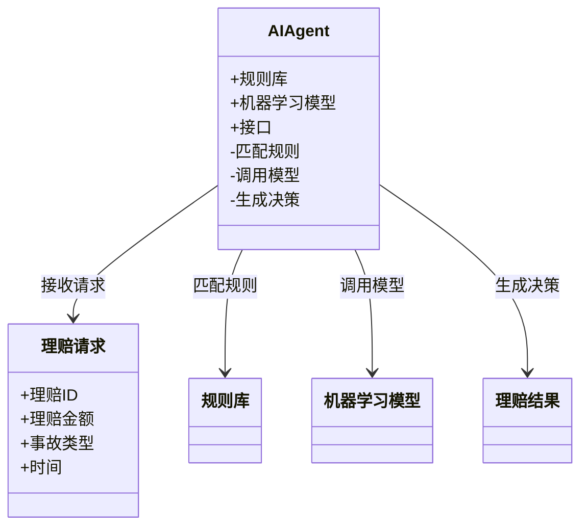
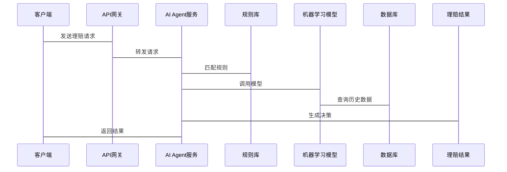

                 


# AI Agent在智能保险理赔审核中的应用

> 关键词：AI Agent, 保险理赔, 智能审核, 人工智能, 保险科技

> 摘要：本文深入探讨AI Agent在保险理赔审核中的应用，分析其核心概念、算法原理、系统架构及实际案例，展示如何利用AI技术提升保险理赔效率和准确性。

---

## 第1章: 保险理赔审核的背景与挑战

### 1.1 保险理赔审核的基本概念

#### 1.1.1 保险理赔的基本流程
保险理赔是指在保险事故发生后，保险公司根据保险合同的条款，对被保险人提出的索赔请求进行审核、确认和赔付的过程。传统理赔流程包括报案、立案、资料收集、审核、赔付等环节。

#### 1.1.2 保险理赔审核的关键环节
1. **资料完整性检查**：确认理赔申请是否包含所有必要的文件，如保单、事故报告、医疗记录等。
2. **风险评估**：通过分析理赔案件的性质、金额和历史数据，评估理赔风险。
3. **规则匹配**：根据保险条款和公司政策，判断理赔请求是否符合赔付条件。
4. **决策审批**：最终决定是否批准理赔请求，并确定赔付金额。

#### 1.1.3 传统保险理赔审核的痛点
1. **效率低下**：人工审核流程繁琐，耗时长，尤其在处理大量索赔时。
2. **错误率高**：由于人为疏忽或经验不足，容易出现审核错误。
3. **成本高昂**：需要大量人力投入，增加了企业的运营成本。
4. **规则复杂**：保险条款复杂，人工难以快速准确匹配所有规则。

### 1.2 AI技术在保险行业的应用现状

#### 1.2.1 AI技术在保险行业的典型应用
1. **客户画像**：利用AI分析客户行为和历史数据，进行精准画像。
2. **风险评估**：通过机器学习模型预测客户风险，优化保险定价。
3. ** fraud detection**：识别 fraudulent claims，降低欺诈风险。

#### 1.2.2 AI技术在保险理赔审核中的潜力
AI技术可以通过自动化处理、智能规则匹配和实时数据分析，显著提高理赔审核的效率和准确性。

### 1.3 AI Agent的概念与特点

#### 1.3.1 AI Agent的基本定义
AI Agent（人工智能代理）是指能够感知环境、执行任务并做出决策的智能实体。在保险理赔中，AI Agent可以作为虚拟助手，帮助审核员完成复杂任务。

#### 1.3.2 AI Agent的核心特点
1. **自主性**：AI Agent能够独立执行任务，无需人工干预。
2. **反应性**：能够实时感知环境变化并做出响应。
3. **学习能力**：通过机器学习不断优化决策模型。
4. **可解释性**：决策过程透明，便于审核员理解和信任。

#### 1.3.3 AI Agent与传统AI技术的区别
| 特性       | 传统AI技术          | AI Agent             |
|------------|---------------------|----------------------|
| 任务执行    | 需要人工触发         | 自主执行任务         |
| 决策能力    | 基于预设规则         | 具备自主决策能力     |
| 环境交互    | 单向输入输出         | 双向交互，动态调整    |

---

## 第2章: AI Agent在保险理赔审核中的应用价值

### 2.1 提高理赔审核效率

#### 2.1.1 AI Agent如何优化审核流程
AI Agent可以自动处理理赔申请，快速匹配规则，减少人工干预，显著缩短审核时间。

#### 2.1.2 AI Agent在批量处理中的优势
AI Agent可以同时处理多个理赔请求，尤其在处理大量相似案件时表现出色。

### 2.2 提升理赔审核的准确性

#### 2.2.1 AI Agent在风险识别中的作用
AI Agent可以利用机器学习模型分析历史数据，识别潜在风险点，帮助审核员做出更准确的判断。

#### 2.2.2 AI Agent在复杂案例分析中的优势
对于复杂的理赔案例，AI Agent可以通过多维度分析，提供更全面的决策支持。

### 2.3 降低理赔成本

#### 2.3.1 AI Agent如何减少人工干预
通过自动化处理和智能决策，AI Agent可以大幅减少对人工审核的依赖。

#### 2.3.2 AI Agent在资源优化配置中的作用
AI Agent可以实时分配任务，优化资源利用，降低运营成本。

---

## 第3章: AI Agent在保险理赔审核中的核心概念与联系

### 3.1 AI Agent的核心原理

#### 3.1.1 基于规则的推理机制
AI Agent通过预设的保险条款和规则库，匹配理赔请求，判断是否符合赔付条件。

#### 3.1.2 基于机器学习的决策模型
AI Agent利用训练好的机器学习模型，分析理赔数据，预测赔付金额和风险等级。

#### 3.1.3 综合推理与决策的实现方式
AI Agent可以结合规则推理和机器学习模型，综合多种因素做出最优决策。

### 3.2 AI Agent与传统规则引擎的对比

#### 3.2.1 传统规则引擎的特点
传统规则引擎基于固定的规则库，无法处理复杂或模糊的理赔请求。

#### 3.2.2 AI Agent的优势
AI Agent具备学习能力和动态调整能力，能够应对复杂的理赔场景。

#### 3.2.3 两者的适用场景对比
| 场景         | 传统规则引擎       | AI Agent             |
|--------------|--------------------|----------------------|
| 复杂度       | 适用于简单规则     | 适用于复杂规则       |
| 灵活性       | 规则固定，难以调整   | 可动态优化规则       |
| 决策能力     | 基于规则匹配       | 基于机器学习模型     |

### 3.3 AI Agent与机器学习模型的结合

#### 3.3.1 机器学习模型的输入与输出
机器学习模型的输入包括理赔申请信息、历史数据等，输出包括赔付概率、风险等级等。

#### 3.3.2 AI Agent如何调用机器学习模型
AI Agent通过API调用机器学习模型，获取预测结果，并结合规则库做出最终决策。

#### 3.3.3 两者的协同工作模式
AI Agent负责任务分配和规则匹配，机器学习模型负责复杂决策，两者协同工作，提高理赔审核的准确性和效率。

---

## 第4章: AI Agent在保险理赔审核中的算法原理

### 4.1 基于规则的推理算法

#### 4.1.1 规则库的构建与管理
规则库包括保险条款、赔付条件、例外情况等，通常以if-else规则形式存储。

#### 4.1.2 规则匹配的实现流程
1. **输入理赔请求**：包括理赔金额、事故类型、时间等信息。
2. **规则匹配**：AI Agent遍历规则库，匹配符合当前理赔请求的规则。
3. **结果输出**：根据匹配规则，生成初步决策结果。

#### 4.1.3 规则优化与更新
AI Agent可以通过分析历史数据，优化规则库，提高规则匹配的准确率。

### 4.2 基于机器学习的决策算法

#### 4.2.1 机器学习模型的训练
AI Agent利用历史理赔数据，训练分类模型或回归模型，用于预测赔付金额和风险等级。

#### 4.2.2 模型的输入与输出
- **输入**：理赔申请信息、历史赔付记录、客户画像等。
- **输出**：赔付概率、风险评分、建议赔付金额等。

#### 4.2.3 模型的应用流程
1. **数据预处理**：清洗和归一化数据。
2. **模型训练**：利用训练数据优化模型参数。
3. **模型预测**：输入新理赔请求，输出预测结果。
4. **结果解释**：将模型输出解释为人类可理解的决策建议。

### 4.3 综合推理与决策的实现

#### 4.3.1 综合推理的实现流程
1. **规则匹配**：AI Agent首先根据规则库进行初步判断。
2. **模型预测**：调用机器学习模型进行进一步分析。
3. **结果整合**：结合规则匹配和模型预测结果，做出最终决策。

#### 4.3.2 结果整合的实现方式
AI Agent可以根据规则和模型的权重，对最终决策结果进行加权计算，确保决策的准确性和合理性。

---

## 第5章: AI Agent在保险理赔审核中的系统分析与架构设计方案

### 5.1 保险理赔审核的场景介绍

#### 5.1.1 场景描述
保险公司在处理理赔请求时，需要快速准确地判断是否符合赔付条件。AI Agent可以辅助审核员完成这一过程。

### 5.2 系统功能设计

#### 5.2.1 领域模型设计


#### 5.2.2 系统架构设计


#### 5.2.3 系统接口设计
1. **接收理赔请求接口**：API接口接收理赔请求信息。
2. **规则匹配接口**：调用规则库，匹配符合规则的理赔请求。
3. **模型预测接口**：调用机器学习模型，获取预测结果。
4. **决策结果输出接口**：将最终决策结果返回给审核员。

#### 5.2.4 系统交互设计


---

## 第6章: AI Agent在保险理赔审核中的项目实战

### 6.1 项目介绍

#### 6.1.1 项目目标
开发一个基于AI Agent的保险理赔审核系统，实现自动化的理赔审核流程。

### 6.2 系统核心实现

#### 6.2.1 环境安装
```bash
pip install numpy scikit-learn flask
```

#### 6.2.2 核心代码实现
```python
class AI-Agent:
    def __init__(self, rules, model):
        self.rules = rules
        self.model = model

    def process_claim(self, claim):
        # 匹配规则
        matched_rules = self._match_rules(claim)
        # 调用模型
        model_prediction = self._predict_with_model(claim)
        # 综合决策
        decision = self._make_decision(matched_rules, model_prediction)
        return decision

    def _match_rules(self, claim):
        # 匹配规则库中的规则
        matched = []
        for rule in self.rules:
            if rule.match(claim):
                matched.append(rule)
        return matched

    def _predict_with_model(self, claim):
        # 调用机器学习模型
        return self.model.predict(claim)

    def _make_decision(self, matched_rules, model_prediction):
        # 综合规则和模型预测结果，做出最终决策
        return self._combine_results(matched_rules, model_prediction)

    def _combine_results(self, matched_rules, model_prediction):
        # 根据规则和模型的权重，计算最终结果
        rule_weight = len(matched_rules) / len(self.rules)
        model_weight = model_prediction['confidence']
        combined_score = rule_weight * model_weight
        return combined_score > 0.5
```

#### 6.2.3 代码应用解读与分析
- **AI-Agent类**：封装了规则匹配和模型调用的功能。
- **process_claim方法**：接收理赔请求，调用规则匹配和模型预测，生成最终决策。
- **_match_rules方法**：遍历规则库，匹配符合当前理赔请求的规则。
- **_predict_with_model方法**：调用机器学习模型，获取预测结果。
- **_make_decision方法**：综合规则匹配和模型预测结果，做出最终决策。

### 6.3 实际案例分析

#### 6.3.1 案例背景
某保险公司收到一份车险理赔请求，金额为1万元，事故类型为单方事故。

#### 6.3.2 系统处理流程
1. **规则匹配**：AI Agent匹配到规则库中的单方事故赔付规则，符合条件。
2. **模型预测**：机器学习模型预测赔付概率为0.8，风险评分为中等。
3. **综合决策**：AI Agent综合规则匹配和模型预测结果，生成最终决策：赔付金额为9000元。

### 6.4 项目小结
通过实际案例分析，展示了AI Agent在保险理赔审核中的应用价值。AI Agent能够有效提高理赔审核的效率和准确性，同时降低运营成本。

---

## 第7章: AI Agent在保险理赔审核中的最佳实践

### 7.1 数据质量的重要性
确保理赔数据的完整性和准确性，是AI Agent正常运行的前提条件。

### 7.2 模型的可解释性
选择具有可解释性的机器学习模型，便于审核员理解和信任AI Agent的决策。

### 7.3 系统的安全性
确保AI Agent系统的安全性，防止数据泄露和恶意攻击。

### 7.4 持续优化
定期更新规则库和机器学习模型，确保AI Agent能够适应新的保险政策和理赔需求。

### 7.5 人机协作
AI Agent作为辅助工具，审核员仍然需要对最终决策进行把关，确保决策的合理性和合规性。

---

## 第8章: 结语

AI Agent在保险理赔审核中的应用，不仅提高了效率和准确性，还为保险公司带来了显著的成本节约。随着AI技术的不断发展，AI Agent将在保险行业发挥越来越重要的作用。

---

## 作者：AI天才研究院/AI Genius Institute & 禅与计算机程序设计艺术 /Zen And The Art of Computer Programming

---

### END

