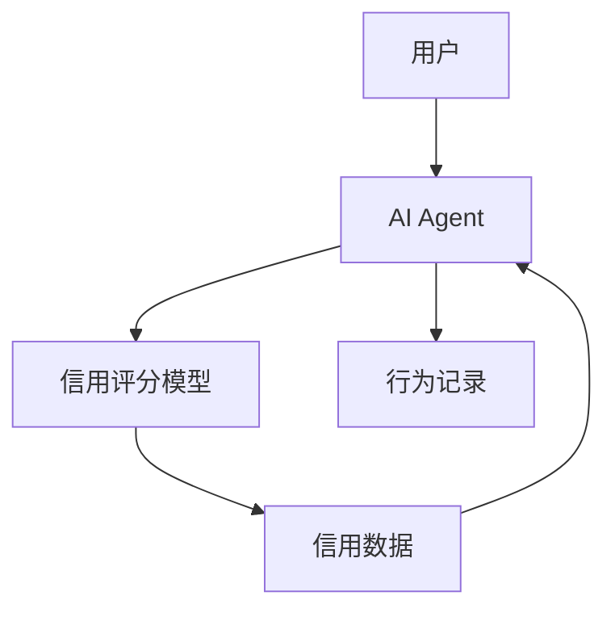
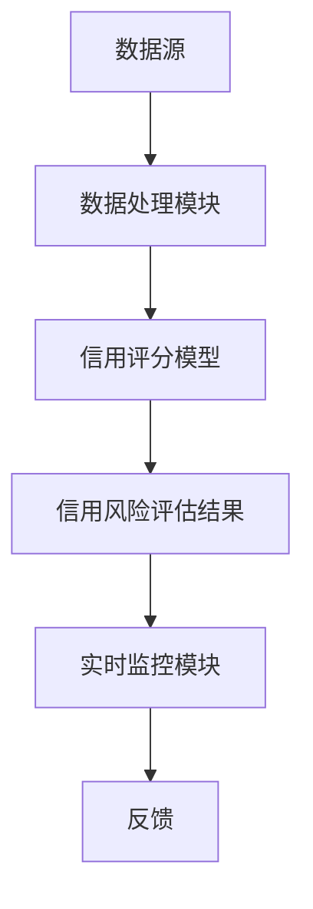
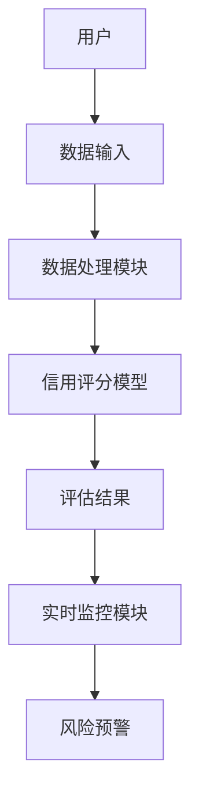

                 


# AI Agent在智能信用风险评估中的应用

---

## 关键词：AI Agent, 信用风险评估, 智能系统, 金融风控, 人工智能

---

## 摘要：本文探讨了AI Agent在信用风险评估中的应用，从背景、核心概念、算法原理到系统架构，再到项目实战和最佳实践，全面解析了AI Agent如何提升信用风险评估的效率和准确性。文章通过详细的数学公式、算法流程图和系统架构图，结合实际案例，展示了AI Agent在信用风险评估中的潜力和优势。

---

## 第1章: AI Agent与信用风险评估的背景与概念

### 1.1 信用风险评估的背景与意义

#### 1.1.1 信用风险的基本概念
信用风险是指借款人或交易对手未能履行其合同义务，导致资金损失的风险。在金融领域，信用风险评估是金融机构评估客户信用状况、决定贷款额度和利率的重要环节。

#### 1.1.2 传统信用风险评估方法的局限性
传统的信用风险评估方法主要依赖于人工审核和简单的统计模型，存在以下问题：
- 数据维度有限，难以捕捉复杂信用行为。
- 评估效率低，难以应对海量数据和实时需求。
- 模型泛化能力弱，难以适应复杂多变的信用环境。

#### 1.1.3 AI Agent在信用风险评估中的优势
AI Agent（智能体）是一种能够感知环境、自主决策并采取行动的智能系统。在信用风险评估中，AI Agent的优势包括：
- 高效的数据处理能力，能够快速分析海量数据。
- 强大的特征提取能力，能够发现传统方法难以察觉的信用风险因素。
- 实时监控能力，能够动态调整评估策略，及时发现和预警信用风险。

### 1.2 AI Agent的基本概念与特点

#### 1.2.1 AI Agent的定义
AI Agent是一种能够感知环境、自主决策、执行行动的智能系统。它通过传感器获取环境信息，利用算法进行分析和推理，并根据推理结果采取相应的行动。

#### 1.2.2 AI Agent的核心特点
- **自主性**：AI Agent能够自主决策，无需人工干预。
- **反应性**：AI Agent能够实时感知环境变化并做出反应。
- **学习能力**：AI Agent能够通过机器学习算法不断优化自身的决策能力。

#### 1.2.3 AI Agent与传统算法的区别
AI Agent的核心区别在于其自主性和反应性。传统算法通常需要人工干预和参数调整，而AI Agent能够自主运行并动态适应环境变化。

### 1.3 AI Agent在信用风险评估中的应用前景

#### 1.3.1 信用风险评估的潜在应用领域
- **个人信用评估**：评估个人的信用状况，用于信用卡审批、个人贷款等。
- **企业信用评估**：评估企业的信用状况，用于企业贷款、供应链金融等。
- **信用风险预警**：实时监控信用风险，及时发现和预警潜在风险。

#### 1.3.2 AI Agent在信用风险评估中的优势
- **高效性**：AI Agent能够快速处理海量数据，提高评估效率。
- **准确性**：通过机器学习算法，AI Agent能够提高信用评估的准确性。
- **实时性**：AI Agent能够实时监控信用风险，及时发现潜在问题。

#### 1.3.3 应用中的挑战与机遇
- **挑战**：数据隐私、模型解释性、算法鲁棒性等问题。
- **机遇**：通过AI Agent提升信用风险评估的效率和准确性，推动金融智能化。

### 1.4 本章小结
本章介绍了信用风险评估的背景和意义，分析了传统方法的局限性，并提出了AI Agent在信用风险评估中的优势和应用前景。通过对比AI Agent与传统算法的区别，明确了AI Agent在信用风险评估中的潜在价值。

---

## 第2章: 信用风险评估的核心概念

### 2.1 信用风险评估的基本原理

#### 2.1.1 信用风险的构成要素
信用风险的构成要素包括：
- **借款人的信用状况**：包括信用历史、收入水平、资产状况等。
- **借款人的行为特征**：包括还款意愿、消费习惯等。
- **经济环境因素**：包括经济周期、利率水平等。

#### 2.1.2 信用评分模型的原理
信用评分模型是通过数学模型对借款人的信用状况进行评分，评分结果用于判断借款人是否具备还款能力。常用的信用评分模型包括：
- **分数卡模型**：基于信用评分卡对借款人进行评分。
- **机器学习模型**：基于机器学习算法对借款人进行评分。

#### 2.1.3 信用风险的分类与度量
信用风险的分类包括：
- **违约风险**：借款人无法按时偿还债务的风险。
- **信用迁移风险**：借款人的信用状况发生恶化或好转的风险。

信用风险的度量方法包括：
- **违约概率（PD）**：借款人在一定期限内违约的概率。
- **违约损失率（LGD）**：违约发生时的平均损失率。

### 2.2 AI Agent在信用风险评估中的角色

#### 2.2.1 AI Agent在数据处理中的作用
AI Agent能够通过数据挖掘技术对海量数据进行清洗、特征提取和数据建模，为信用风险评估提供高质量的数据支持。

#### 2.2.2 AI Agent在决策支持中的作用
AI Agent能够通过机器学习算法对信用风险进行预测和评估，为金融机构提供决策支持。

#### 2.2.3 AI Agent在实时监控中的作用
AI Agent能够实时监控信用风险的变化，及时发现和预警潜在风险。

### 2.3 核心概念的ER实体关系图

```mermaid
er
actor: 用户
agent: AI Agent
model: 信用评分模型
data: 信用数据
action: 行为记录
```

### 2.4 核心概念的流程图



### 2.5 本章小结
本章详细介绍了信用风险评估的核心概念，包括信用风险的构成要素、评分模型和分类与度量方法。同时，分析了AI Agent在信用风险评估中的角色和作用，并通过ER图和流程图展示了核心概念的关系和流程。

---

## 第3章: AI Agent的算法原理

### 3.1 基于概率论的信用风险评估

#### 3.1.1 贝叶斯定理在信用评分中的应用
贝叶斯定理是一种用于计算条件概率的公式，广泛应用于信用评分模型中。公式如下：

$$ P(A|B) = \frac{P(B|A) \cdot P(A)}{P(B)} $$

其中：
- \( P(A|B) \) 是在B条件下A发生的概率。
- \( P(B|A) \) 是在A条件下B发生的概率。
- \( P(A) \) 是A发生的先验概率。
- \( P(B) \) 是B发生的全概率。

#### 3.1.2 马尔可夫链在信用状态转移中的应用
马尔可夫链是一种描述系统状态转移的概率模型，常用于信用风险评估中的信用等级转移分析。状态转移矩阵如下：

$$
\begin{pmatrix}
p_{11} & p_{12} & p_{13} \\
p_{21} & p_{22} & p_{23} \\
p_{31} & p_{32} & p_{33}
\end{pmatrix}
$$

其中，\( p_{ij} \) 表示从状态i转移到状态j的概率。

#### 3.1.3 贝叶斯网络的构建与应用
贝叶斯网络是一种基于概率论的图形化模型，用于表示变量之间的条件概率关系。在信用风险评估中，贝叶斯网络可以用于建模信用风险的影响因素。

### 3.2 基于统计学的信用风险评估

#### 3.2.1 logistic回归模型的原理
logistic回归是一种用于分类的统计学方法，常用于信用风险评估中的违约概率预测。logistic回归模型的公式如下：

$$ P(Y=1|X) = \frac{1}{1 + e^{-\beta X}} $$

其中：
- \( Y \) 是目标变量（违约或不违约）。
- \( X \) 是自变量（信用特征）。
- \( \beta \) 是回归系数。

#### 3.2.2 支持向量机（SVM）在信用评分中的应用
支持向量机是一种用于分类的机器学习算法，常用于信用评分模型中。SVM通过找到一个超平面，将数据分成两类，实现信用评分的分类。

#### 3.2.3 随机森林在信用风险预测中的应用
随机森林是一种基于决策树的集成学习算法，常用于信用风险预测。随机森林通过构建多个决策树，进行投票或平均，提高模型的准确性和稳定性。

### 3.3 基于强化学习的信用风险评估

#### 3.3.1 强化学习的基本原理
强化学习是一种通过智能体与环境交互，学习最优策略的机器学习方法。在信用风险评估中，强化学习可以用于动态调整信用评估策略。

#### 3.3.2 强化学习在信用风险中的应用
强化学习可以通过状态-动作-奖励机制，优化信用评估策略。例如，智能体可以根据信用评分的变化，调整评估参数，提高评估准确率。

### 3.4 本章小结
本章详细介绍了AI Agent在信用风险评估中的算法原理，包括概率论、统计学和强化学习的应用。通过具体的数学公式和算法流程图，展示了AI Agent在信用风险评估中的技术实现。

---

## 第4章: AI Agent的系统架构与实现

### 4.1 系统架构设计

#### 4.1.1 系统功能设计
系统功能包括：
- 数据采集与处理
- 信用评分模型构建
- 信用风险评估与预警
- 实时监控与反馈

#### 4.1.2 系统架构图


### 4.2 系统实现细节

#### 4.2.1 数据处理模块
数据处理模块包括：
- 数据清洗
- 特征提取
- 数据建模

#### 4.2.2 信用评分模型
信用评分模型包括：
- logistic回归模型
- 支持向量机（SVM）
- 随机森林

#### 4.2.3 实时监控模块
实时监控模块包括：
- 实时数据采集
- 实时风险评估
- 风险预警

### 4.3 系统交互设计

#### 4.3.1 系统交互流程图


### 4.4 本章小结
本章详细介绍了AI Agent在信用风险评估中的系统架构与实现，包括系统功能设计、架构图和交互流程图。通过具体的实现细节，展示了AI Agent在信用风险评估中的技术实现。

---

## 第5章: 项目实战与案例分析

### 5.1 项目实战

#### 5.1.1 环境安装
- 安装Python
- 安装机器学习库（scikit-learn、XGBoost、TensorFlow）
- 安装数据处理工具（Pandas、NumPy）

#### 5.1.2 核心代码实现
```python
import pandas as pd
from sklearn.model_selection import train_test_split
from sklearn.metrics import accuracy_score
from sklearn.ensemble import RandomForestClassifier

# 数据加载
data = pd.read_csv('credit_data.csv')
# 数据预处理
X = data.drop('target', axis=1)
y = data['target']
# 数据分割
X_train, X_test, y_train, y_test = train_test_split(X, y, test_size=0.2)
# 模型训练
model = RandomForestClassifier()
model.fit(X_train, y_train)
# 模型预测
y_pred = model.predict(X_test)
# 模型评估
print(accuracy_score(y_test, y_pred))
```

#### 5.1.3 案例分析
以某银行的信用评分数据为例，通过随机森林模型进行信用评分，评估模型的准确率和召回率。

### 5.2 案例分析

#### 5.2.1 数据分析
通过对某银行的信用评分数据进行分析，提取关键特征，如收入、信用历史、贷款金额等。

#### 5.2.2 模型评估
通过模型评估指标（准确率、召回率、F1分数）评估模型的性能。

### 5.3 本章小结
本章通过项目实战和案例分析，展示了AI Agent在信用风险评估中的具体实现。通过代码实现和案例分析，验证了AI Agent在信用风险评估中的有效性和准确性。

---

## 第6章: 最佳实践与未来展望

### 6.1 最佳实践

#### 6.1.1 数据处理
- 数据清洗
- 特征工程
- 数据建模

#### 6.1.2 模型优化
- 参数调优
- 模型集成
- 模型解释性

#### 6.1.3 系统部署
- 系统架构设计
- 接口设计
- 系统监控

### 6.2 未来展望

#### 6.2.1 技术发展
- 更强的算法性能
- 更高的数据处理能力
- 更好的模型解释性

#### 6.2.2 应用拓展
- 更多的金融场景应用
- 更多的行业应用
- 更智能化的信用风险评估

### 6.3 本章小结
本章总结了AI Agent在信用风险评估中的最佳实践，并展望了未来的技术发展和应用前景。通过最佳实践，提高了AI Agent在信用风险评估中的效率和准确性，推动了金融智能化的发展。

---

## 作者：AI天才研究院/AI Genius Institute & 禅与计算机程序设计艺术 /Zen And The Art of Computer Programming

---

本文通过系统化的分析和实践，全面探讨了AI Agent在智能信用风险评估中的应用。从背景介绍到算法实现，从系统架构到项目实战，层层深入，展示了AI Agent在信用风险评估中的巨大潜力和广阔前景。希望本文能够为读者提供有益的参考，推动信用风险评估的智能化发展。

