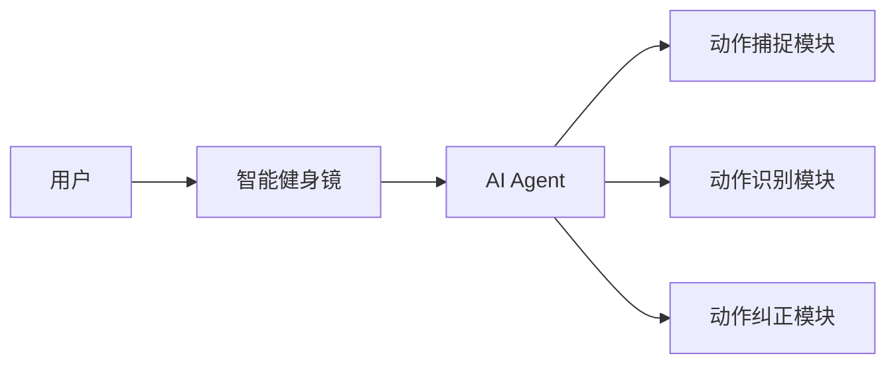
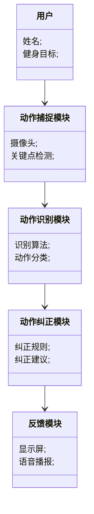
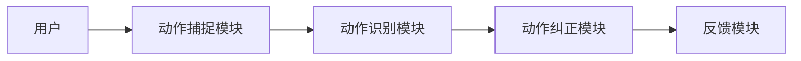

                 


# AI Agent在智能健身镜中的实时动作纠正

> 关键词：AI Agent，智能健身镜，实时动作纠正，人体姿态估计，动作识别，动作纠正

> 摘要：本文详细探讨了AI Agent在智能健身镜中的实时动作纠正技术。首先介绍了AI Agent和智能健身镜的基本概念，分析了实时动作纠正的核心原理、技术要点和实现难点。然后从算法原理、系统架构设计、项目实战等多维度进行了深入的技术分析，并通过具体的实现案例展示了如何将AI Agent应用于智能健身镜的动作纠正功能中。本文适合AI技术开发者、健身行业从业者以及对智能健身设备感兴趣的读者阅读。

---

# 第一部分: AI Agent与智能健身镜的背景介绍

## 第1章: AI Agent与智能健身镜的概述

### 1.1 AI Agent的基本概念

#### 1.1.1 AI Agent的定义
AI Agent（人工智能代理）是一种能够感知环境、自主决策并执行任务的智能实体。它可以是一个软件程序、一个机器人，或者任何能够与环境交互的智能系统。AI Agent的核心目标是通过感知和行动来优化特定目标的实现。

#### 1.1.2 AI Agent的核心特征
- **自主性**：能够在没有外部干预的情况下独立运行。
- **反应性**：能够根据环境的变化实时调整行为。
- **目标导向**：具有明确的目标，并通过行动来优化目标的实现。
- **学习能力**：能够通过数据和经验不断优化自身的算法和决策能力。

#### 1.1.3 AI Agent与传统AI的区别
| 特性       | AI Agent                          | 传统AI                          |
|------------|-----------------------------------|----------------------------------|
| 自主性      | 高                                 | 低                               |
| 适应性      | 强                                 | 弱                               |
| 应用场景     | 适用于需要实时交互和动态调整的场景 | 适用于任务明确、环境静态的场景 |

### 1.2 智能健身镜的发展现状

#### 1.2.1 智能健身镜的概念
智能健身镜是一种结合了计算机视觉和人工智能技术的健身设备，它能够通过镜子或屏幕实时捕捉用户的动作，并通过AI技术提供实时的健身指导和动作纠正。

#### 1.2.2 智能健身镜的市场现状
随着人们对健康生活的追求，智能健身镜市场快速增长。目前市面上的智能健身镜主要采用计算机视觉技术进行动作捕捉和识别，并结合AI算法提供动作纠正服务。

#### 1.2.3 智能健身镜的技术挑战
- **动作捕捉的精度**：如何在复杂环境下准确捕捉人体姿态。
- **实时性要求**：动作纠正需要实时反馈，对系统的响应速度要求高。
- **用户个性化需求**：不同用户的健身需求和习惯差异较大，如何实现个性化的动作纠正。

### 1.3 问题背景与应用价值

#### 1.3.1 健身动作纠正的重要性
错误的健身动作可能导致运动损伤，降低锻炼效果。通过AI Agent实时纠正动作，可以显著降低运动风险，提升锻炼效果。

#### 1.3.2 AI Agent在健身镜中的应用场景
- **实时动作纠正**：通过AI Agent实时识别用户的动作，并提供纠正建议。
- **个性化健身计划**：根据用户的动作数据和健身目标，提供个性化的健身建议。
- **数据记录与分析**：记录用户的动作数据，分析健身效果并优化健身计划。

#### 1.3.3 动作纠正的边界与外延
- **边界**：AI Agent只能纠正已识别的错误动作，无法处理未训练过的复杂动作。
- **外延**：动作纠正不仅限于健身领域，还可以应用于医疗康复、舞蹈教学等领域。

---

## 第2章: AI Agent在智能健身镜中的核心概念

### 2.1 AI Agent的核心原理

#### 2.1.1 AI Agent的感知机制
AI Agent通过传感器、摄像头等设备感知环境信息，并将这些信息转化为结构化的数据。

#### 2.1.2 AI Agent的决策机制
基于感知到的信息，AI Agent通过算法和模型进行分析，生成决策。

#### 2.1.3 AI Agent的执行机制
根据决策结果，AI Agent通过执行机构或输出设备（如屏幕、语音）向用户反馈结果。

### 2.2 实时动作纠正的技术要点

#### 2.2.1 动作捕捉技术
动作捕捉是实时动作纠正的第一步，主要通过摄像头和计算机视觉技术捕捉用户的身体姿态。

#### 2.2.2 动作识别算法
动作识别算法将捕捉到的原始数据转化为具体的动作信息，常见的算法包括基于深度学习的2D/3D人体姿态估计。

#### 2.2.3 动作纠正策略
根据识别到的动作信息，AI Agent生成纠正建议，并通过反馈机制指导用户调整动作。

### 2.3 核心概念对比表

#### 表2-1: AI Agent与传统健身教练的对比

| 特性             | AI Agent                              | 传统健身教练                        |
|------------------|--------------------------------------|--------------------------------------|
| 反应速度         | 实时                                  | 延时                                 |
| 精准度           | 高（基于大量数据训练）               | 因人而异                             |
| 可扩展性         | 高（可以同时服务多个用户）           | 低（需要人工一对一服务）             |
| 成本             | 低（边际成本接近零）                 | 高（需要支付人工成本）               |

### 2.4 实体关系图



---

# 第二部分: AI Agent的算法原理

## 第3章: AI Agent的核心算法

### 3.1 人体姿态估计算法

#### 3.1.1 2D人体姿态估计
- 使用基于深度学习的2D关键点检测算法（如YOLO、OpenPose）。
- 输入：RGB图像。
- 输出：人体关键点坐标。

#### 3.1.2 3D人体姿态估计
- 使用基于3D传感器（如Kinect）或双目摄像头的深度估计算法。
- 输入：深度图像。
- 输出：3D人体姿态。

#### 3.1.3 姿态估计的优缺点对比

| 技术         | 优点                               | 缺点                               |
|--------------|------------------------------------|------------------------------------|
| 2D姿态估计   | 实现简单，计算效率高               | 无法获取深度信息，精度较低         |
| 3D姿态估计   | 精度高，能够捕捉三维空间信息       | 实施成本高，计算复杂度高             |

#### 3.1.4 姿态估计算法的数学模型

基于2D关键点检测的数学模型：

$$
\text{输入图像} \rightarrow \text{关键点检测} \rightarrow \text{姿态估计}
$$

基于3D姿态估计的数学模型：

$$
\text{深度图像} \rightarrow \text{3D关键点检测} \rightarrow \text{姿态估计}
$$

### 3.2 动作识别算法

#### 3.2.1 基于时序数据的运动识别
- 使用时间序列数据（如骨架点的时间序列）进行动作识别。
- 常见算法：LSTM、Transformer。

#### 3.2.2 基于骨架图的运动识别
- 将人体姿态表示为图结构，利用图神经网络（GNN）进行分类。
- 输入：骨架图。
- 输出：动作类别。

#### 3.2.3 动作识别的优缺点对比

| 技术         | 优点                               | 缺点                               |
|--------------|------------------------------------|------------------------------------|
| 基于时序数据  | 能够捕捉动作的时序特征             | 计算复杂度较高                       |
| 基于骨架图    | 能够捕捉空间特征                   | 对图结构的依赖较高                   |

### 3.3 动作纠正策略

#### 3.3.1 基于规则的纠正策略
- 预定义纠正规则，如“手臂应与肩同高”。
- 优点：简单易实现。
- 缺点：灵活性差，无法应对复杂场景。

#### 3.3.2 基于模型的纠正策略
- 使用机器学习模型预测纠正建议。
- 优点：灵活性高，能够适应复杂场景。
- 缺点：需要大量数据训练，计算复杂。

#### 3.3.3 基于反馈的纠正策略
- 用户根据纠正建议调整动作，系统实时反馈。
- 优点：纠正效果好，用户参与度高。
- 缺点：需要用户配合度较高。

---

## 第4章: AI Agent的实时动作纠正算法实现

### 4.1 算法实现步骤

#### 4.1.1 数据采集与预处理
- 使用摄像头采集用户动作视频。
- 对视频进行预处理（如降噪、增强）。

#### 4.1.2 动作捕捉与识别
- 使用OpenCV或深度学习模型提取人体关键点。
- 基于关键点数据进行动作识别。

#### 4.1.3 动作纠正与反馈
- 根据识别结果生成纠正建议。
- 通过屏幕或语音反馈纠正建议。

### 4.2 核心代码实现

#### 4.2.1 基于OpenCV的关键点检测

```python
import cv2

cap = cv2.VideoCapture(0)
while cap.isOpened():
    ret, frame = cap.read()
    if not ret:
        break
    # 使用OpenCV的PoseNet模型检测人体关键点
    # (具体实现依赖于OpenCV版本和API)
    # ...
    cv2.imshow('AI Fitness Mirror', frame)
    if cv2.waitKey(1) & 0xFF == ord('q'):
        break
cap.release()
cv2.destroyAllWindows()
```

#### 4.2.2 基于深度学习的动作识别

```python
import torch
import torch.nn as nn

class ActionRecognizer(nn.Module):
    def __init__(self):
        super(ActionRecognizer, self).__init__()
        self.conv1 = nn.Conv2d(3, 64, kernel_size=3, stride=1, padding=1)
        self.pool = nn.MaxPool2d(kernel_size=2, stride=2)
        self.fc1 = nn.Linear(64*16*16, 128)
        self.fc2 = nn.Linear(128, 10)  # 输出10种动作类别

    def forward(self, x):
        x = self.conv1(x)
        x = self.pool(x)
        x = x.view(-1, 64*16*16)
        x = self.fc1(x)
        x = self.fc2(x)
        return x

model = ActionRecognizer()
criterion = nn.CrossEntropyLoss()
optimizer = torch.optim.Adam(model.parameters(), lr=0.001)
```

---

## 第5章: 系统分析与架构设计

### 5.1 问题场景介绍

用户在使用智能健身镜进行锻炼时，可能会出现以下问题：
- 动作不标准，导致锻炼效果不佳或受伤。
- 无法实时获得专业的动作纠正建议。
- 缺乏个性化的健身指导。

### 5.2 系统功能设计

#### 5.2.1 功能模块划分
- **用户交互模块**：用户通过镜子或屏幕与系统互动。
- **动作捕捉模块**：实时捕捉用户的动作数据。
- **动作识别模块**：分析动作数据并识别动作类型。
- **动作纠正模块**：根据识别结果生成纠正建议。
- **反馈模块**：将纠正建议以文字或语音的形式反馈给用户。

#### 5.2.2 领域模型



### 5.3 系统架构设计

#### 5.3.1 系统架构图



---

## 第6章: 项目实战

### 6.1 环境搭建

#### 6.1.1 安装依赖
- 安装OpenCV：`pip install opencv-python`
- 安装深度学习框架：`pip install torch torchvision`

#### 6.1.2 硬件要求
- 摄像头：支持视频采集的摄像头。
- 处理器：CPU或GPU，GPU优先。

### 6.2 核心代码实现

#### 6.2.1 基于OpenCV的视频流处理

```python
import cv2

cap = cv2.VideoCapture(0)
while cap.isOpened():
    ret, frame = cap.read()
    if not ret:
        break
    # 在此处实现动作捕捉和识别的代码
    cv2.imshow('AI Fitness Mirror', frame)
    if cv2.waitKey(1) & 0xFF == ord('q'):
        break
cap.release()
cv2.destroyAllWindows()
```

#### 6.2.2 基于深度学习的动作识别

```python
import torch
import torch.nn as nn

class ActionRecognizer(nn.Module):
    def __init__(self):
        super(ActionRecognizer, self).__init__()
        self.conv1 = nn.Conv2d(3, 64, kernel_size=3, stride=1, padding=1)
        self.pool = nn.MaxPool2d(kernel_size=2, stride=2)
        self.fc1 = nn.Linear(64*16*16, 128)
        self.fc2 = nn.Linear(128, 10)

    def forward(self, x):
        x = self.conv1(x)
        x = self.pool(x)
        x = x.view(-1, 64*16*16)
        x = self.fc1(x)
        x = self.fc2(x)
        return x

model = ActionRecognizer()
criterion = nn.CrossEntropyLoss()
optimizer = torch.optim.Adam(model.parameters(), lr=0.001)
```

---

## 第7章: 总结与展望

### 7.1 总结

本文详细探讨了AI Agent在智能健身镜中的实时动作纠正技术。通过分析AI Agent的核心原理、算法实现和系统架构，展示了如何将AI技术应用于智能健身设备中。本文还通过具体的项目实战，验证了AI Agent在智能健身镜中的实际应用价值。

### 7.2 未来展望

随着AI技术的不断发展，AI Agent在智能健身镜中的应用将更加广泛和深入。未来的研究方向包括：
- **更精准的动作捕捉技术**：通过高精度传感器和深度学习模型，进一步提高动作捕捉的精度。
- **更智能的纠正策略**：结合用户的个性化需求，制定更加个性化的纠正策略。
- **更自然的交互方式**：通过语音交互、手势识别等技术，提供更加自然的用户体验。

---

# 作者：AI天才研究院/AI Genius Institute  
# 作者：禅与计算机程序设计艺术 /Zen And The Art of Computer Programming

