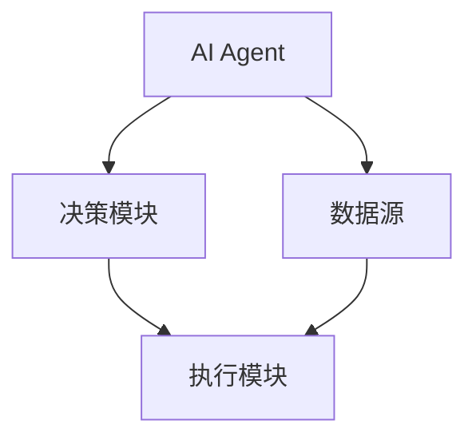
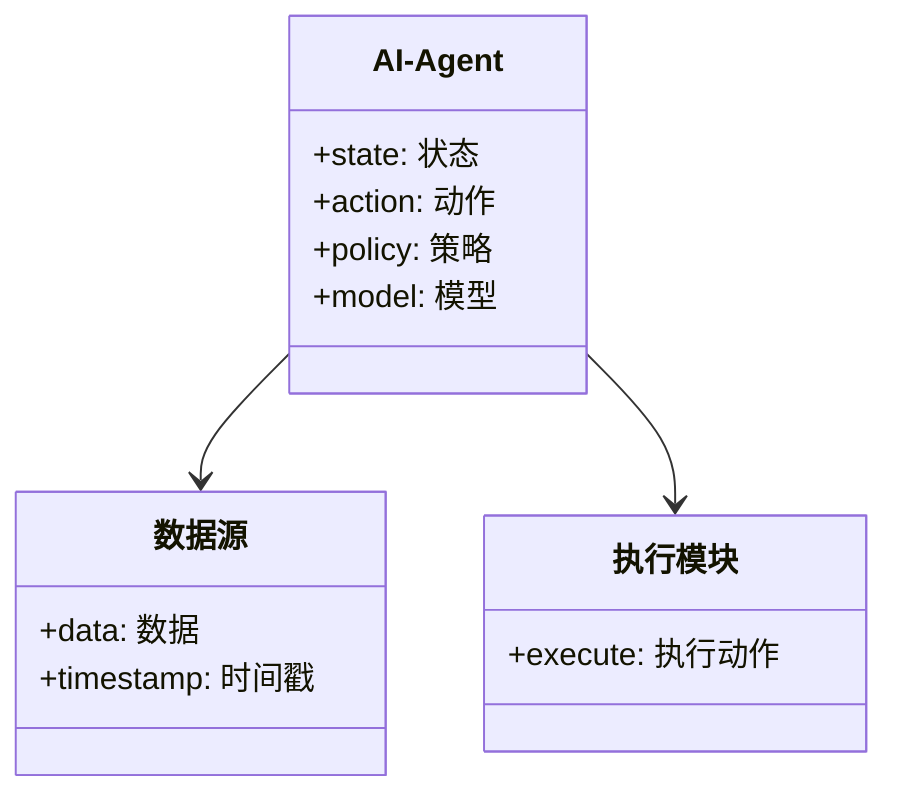

                 


# AI Agent在智能公共卫生监测中的角色

> 关键词：AI Agent, 公共卫生监测, 智能系统, 数据分析, 机器学习, 实时监测

> 摘要：AI Agent作为人工智能领域的核心技术，在公共卫生监测中发挥着越来越重要的作用。本文将详细探讨AI Agent在公共卫生监测中的角色，分析其核心概念、技术原理、系统架构及实际应用案例。通过本文的分析，读者将深入了解AI Agent如何助力公共卫生监测，提升疾病预防和控制能力。

---

# 第一部分: AI Agent在智能公共卫生监测中的背景与概述

## 第1章: AI Agent与公共卫生监测概述

### 1.1 AI Agent的基本概念

#### 1.1.1 AI Agent的定义
AI Agent（人工智能代理）是一种能够感知环境、自主决策并执行任务的智能实体。它通过接收输入信息（如数据、用户指令等），利用算法进行处理，并输出相应的结果或采取行动。AI Agent的核心目标是通过智能化的方式解决问题或完成特定任务。

#### 1.1.2 AI Agent的核心特征
- **自主性**：能够在没有外部干预的情况下自主运行。
- **反应性**：能够实时感知环境变化并做出响应。
- **学习能力**：通过数据和经验不断优化自身的决策能力。
- **协作性**：能够与其他系统或Agent协同工作。

#### 1.1.3 公共卫生监测的基本概念
公共卫生监测是指通过收集、分析和解释健康相关数据，以识别和评估公共卫生问题的过程。其目的是及时发现疾病暴发、流行趋势，并采取有效的防控措施。传统的公共卫生监测依赖人工分析，效率较低且容易遗漏关键信息。

---

### 1.2 AI Agent在公共卫生监测中的作用

#### 1.2.1 公共卫生监测的挑战
- 数据量庞大且来源多样化。
- 疾病传播具有复杂性，难以预测。
- 人工分析效率低，难以应对突发公共卫生事件。

#### 1.2.2 AI Agent在公共卫生监测中的角色
- **数据采集与处理**：AI Agent能够实时采集多源数据（如医疗记录、社交媒体、地理位置数据等），并进行清洗和预处理。
- **智能分析与预测**：通过机器学习算法，AI Agent能够分析数据，识别疾病传播趋势，并预测潜在的公共卫生风险。
- **实时预警与响应**：AI Agent能够在检测到异常情况时，立即发出预警，并协助制定应对措施。

#### 1.2.3 AI Agent的应用必要性
- 提高公共卫生监测的效率和准确性。
- 实现对疾病传播的实时跟踪和预测。
- 支持决策者制定科学的防控策略。

---

# 第二部分: AI Agent的核心概念与联系

## 第3章: AI Agent的核心概念与原理

### 3.1 AI Agent的感知模块

#### 3.1.1 数据采集与处理
AI Agent的感知模块负责从多种来源（如医疗数据库、社交媒体、传感器数据等）采集数据，并进行清洗、转换和标准化处理。例如，从社交媒体上提取用户健康相关的信息，需要去噪、去重和格式统一。

#### 3.1.2 数据分析与特征提取
通过自然语言处理（NLP）和统计分析，感知模块能够从非结构化数据中提取有用的信息。例如，从社交媒体文本中提取关键词，识别潜在的疾病传播趋势。

#### 3.1.3 感知模块的实现方式
感知模块通常采用以下技术：
- 数据清洗与预处理：如去除无效数据、填补缺失值等。
- 特征工程：如文本分词、TF-IDF特征提取等。
- 数据可视化：如使用图表展示数据分布和趋势。

---

### 3.2 AI Agent的决策模块

#### 3.2.1 决策模型的构建
决策模块是AI Agent的核心部分，负责根据感知模块提供的信息，通过算法进行决策。常用的决策算法包括：
- **强化学习（Reinforcement Learning）**：通过不断试错，优化决策策略。
- **监督学习（Supervised Learning）**：基于历史数据，训练分类或回归模型。
- **无监督学习（Unsupervised Learning）**：发现数据中的潜在模式。

#### 3.2.2 决策逻辑的优化
为了提高决策的准确性，AI Agent需要不断优化其决策逻辑。这可以通过以下方式实现：
- **在线学习**：实时更新模型参数，适应新数据的变化。
- **多目标优化**：在多个目标之间找到平衡点，例如在疫情预警中，既要减少误报，又要提高漏报率。

#### 3.2.3 多目标决策的实现
在公共卫生监测中，AI Agent通常需要在多个目标之间进行权衡。例如，在疫情预警中，既要考虑疫情的严重性，也要考虑资源的分配效率。这可以通过多目标优化算法（如帕累托优化）实现。

---

## 第4章: AI Agent在公共卫生监测中的核心概念与联系

### 4.1 核心概念的属性对比

| 核心概念 | 属性 | 描述 |
|----------|------|------|
| 数据源   | 多样性 | 包括医疗数据、社交媒体数据、地理位置数据等。 |
| 数据处理 | 实时性 | 需要快速处理数据，以实现实时监测。 |
| 决策模型 | 可解释性 | 需要确保决策过程可被人类理解。 |
| 系统架构 | 扩展性 | 系统应支持新增功能和数据源的接入。 |

### 4.2 实体关系图



---

# 第三部分: AI Agent的算法原理与系统架构

## 第5章: AI Agent的算法原理

### 5.1 强化学习算法

#### 5.1.1 算法流程
1. **状态感知**：AI Agent接收当前环境的状态信息。
2. **决策选择**：基于当前状态，选择一个动作。
3. **环境反馈**：执行动作后，获得环境的反馈（如奖励或惩罚）。
4. **策略优化**：根据反馈更新策略，以最大化累计奖励。

#### 5.1.2 算法公式
强化学习的核心是通过优化目标函数来更新策略。常用的优化目标是：
$$ J(\theta) = \mathbb{E}_{\tau} [\sum_{t} \gamma^{t} r_t] $$
其中，$\theta$是参数，$\tau$是轨迹，$\gamma$是折扣因子，$r_t$是奖励。

#### 5.1.3 Python实现示例
```python
import numpy as np
from collections import deque

class AI-Agent:
    def __init__(self, state_space, action_space):
        self.state_space = state_space
        self.action_space = action_space
        self.memory = deque(maxlen=1000)
        self.gamma = 0.99
        self.epsilon = 1.0
        self.epsilon_min = 0.01
        self.epsilon_decay = 0.995

    def act(self, state):
        if np.random.random() < self.epsilon:
            return np.random.randint(0, self.action_space)
        else:
            # 使用策略网络进行预测
            return np.argmax(self.model.predict(state))

    def remember(self, state, action, reward, next_state):
        self.memory.append((state, action, reward, next_state))

    def replay(self):
        # 随机抽取小批量记忆
        minibatch = np.random.choice(len(self.memory), 32)
        for i in minibatch:
            state, action, reward, next_state = self.memory[i]
            # 计算目标Q值
            target = reward + self.gamma * np.max(self.model.predict(next_state))
            # 更新策略网络
            self.model.fit(state, target, epochs=1, verbose=0)
```

---

### 5.2 监督学习算法

#### 5.2.1 算法流程
1. **数据预处理**：清洗和标注数据。
2. **特征提取**：提取有用的特征。
3. **模型训练**：基于标注数据，训练分类或回归模型。
4. **模型评估**：使用测试数据评估模型性能。

#### 5.2.2 算法公式
监督学习的目标是最小化预测值与真实值之间的误差。常用的损失函数是均方误差（MSE）：
$$ L = \frac{1}{n}\sum_{i=1}^{n}(y_i - \hat{y}_i)^2 $$

---

## 第6章: AI Agent的系统架构设计

### 6.1 系统功能设计

#### 6.1.1 领域模型设计


---

### 6.2 系统架构设计


---

# 第四部分: AI Agent的项目实战

## 第7章: 项目实战

### 7.1 环境安装与配置

```bash
pip install numpy scikit-learn tensorflow matplotlib
```

### 7.2 核心代码实现

#### 7.2.1 数据预处理
```python
import pandas as pd
import numpy as np

# 加载数据
data = pd.read_csv('health_data.csv')

# 数据清洗
data.dropna(inplace=True)
data['timestamp'] = pd.to_datetime(data['timestamp'])
data.set_index('timestamp', inplace=True)
```

#### 7.2.2 模型训练与评估
```python
from sklearn.model import model
from sklearn.metrics import accuracy_score

# 训练模型
model.fit(X_train, y_train)

# 模型评估
y_pred = model.predict(X_test)
print("Accuracy:", accuracy_score(y_test, y_pred))
```

### 7.3 实际案例分析

#### 7.3.1 疫情预警案例
假设我们有一个AI Agent用于疫情预警，其实现步骤如下：
1. **数据采集**：从医疗数据库和社交媒体获取数据。
2. **数据处理**：清洗、标准化和特征提取。
3. **模型训练**：使用监督学习算法训练分类模型。
4. **实时监测**：部署模型，实时监控疫情发展趋势。
5. **预警与响应**：当模型预测到疫情爆发时，立即发出预警，并协助制定防控措施。

---

# 第五部分: 最佳实践与总结

## 第8章: 最佳实践与总结

### 8.1 最佳实践

- **数据质量管理**：确保数据的准确性和完整性。
- **模型可解释性**：避免使用过于复杂的模型，确保决策过程可被理解。
- **实时性优化**：通过分布式计算和并行处理提高系统的响应速度。

### 8.2 小结

通过本文的分析，我们可以看到，AI Agent在公共卫生监测中具有重要的作用。它能够通过智能化的方式，帮助我们更高效地发现和应对公共卫生问题。然而，AI Agent的应用也面临一些挑战，例如数据隐私、模型可解释性等问题，需要我们在未来的研究中进一步探索和解决。

---

作者：AI天才研究院/AI Genius Institute & 禅与计算机程序设计艺术 /Zen And The Art of Computer Programming

