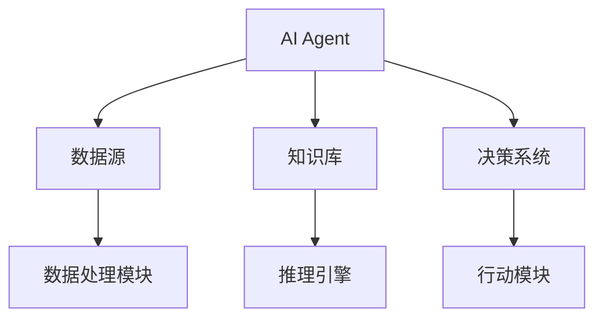
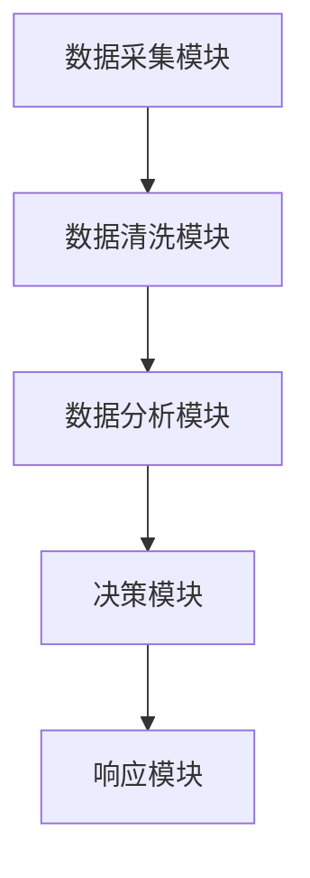

                 


# AI Agent在智能公共卫生监测中的角色

> 关键词：AI Agent，公共卫生监测，智能体，数据挖掘，机器学习

> 摘要：本文探讨了AI Agent在智能公共卫生监测中的角色，详细分析了AI Agent的核心概念、工作原理及其在公共卫生监测中的应用。通过实际案例和系统设计，展示了AI Agent如何通过数据采集、分析和决策优化，提升公共卫生监测的效率和准确性。

---

## 第一部分: 公共卫生监测的智能化转型

### 第1章: 公共卫生监测的现状与挑战

#### 1.1 公共卫生监测的定义与目标
公共卫生监测是指通过收集、分析和解释健康数据，以识别、评估和应对公共卫生事件的过程。其目标是及时发现疾病暴发、疫情扩散等潜在风险，为政府和医疗机构提供科学依据，从而保护公众健康。

- **挑战1：数据来源多样**  
  公共卫生数据来源广泛，包括医院、疾控中心、社交媒体等，数据格式和质量差异较大，整合难度高。
  
- **挑战2：数据量大且复杂**  
  公共卫生事件往往涉及海量数据，如病例数据、地理位置信息、人口统计数据等，传统的数据分析方法难以高效处理。

- **挑战3：实时性要求高**  
  公共卫生事件往往具有突发性和扩散性，需要实时监测和快速响应，传统的人工分析难以满足需求。

#### 1.2 AI Agent的定义与特点
AI Agent（智能体）是指能够感知环境、自主决策并执行任务的智能系统。其核心特点包括：
1. **自主性**：能够在没有外部干预的情况下独立运行。
2. **反应性**：能够实时感知环境变化并做出响应。
3. **学习能力**：通过机器学习算法不断优化自身行为。
4. **协作性**：能够与其他系统或人进行有效协作。

#### 1.3 AI Agent在公共卫生监测中的作用
AI Agent通过其强大的数据处理能力和自主决策能力，能够显著提升公共卫生监测的效率和准确性。具体作用包括：
1. **实时数据采集**：AI Agent能够从多个数据源实时采集数据，如社交媒体、医疗记录等。
2. **智能分析与预测**：利用机器学习算法，AI Agent能够分析数据，识别潜在的公共卫生风险，并预测事件的发展趋势。
3. **快速响应**：当发现异常情况时，AI Agent能够立即触发警报，并提供应对策略。

---

### 第2章: AI Agent的核心概念与原理

#### 2.1 AI Agent的核心概念
AI Agent的工作原理可以分为三个主要阶段：
1. **感知阶段**：AI Agent通过传感器或数据接口获取环境中的信息，如温度、湿度、地理位置等。
2. **决策阶段**：AI Agent利用机器学习模型对感知到的数据进行分析，生成决策。
3. **执行阶段**：AI Agent根据决策结果采取行动，如发送警报、调整监测参数等。

#### 2.2 AI Agent的实体关系图
以下是一个简单的实体关系图，展示了AI Agent在公共卫生监测中的主要实体关系：


#### 2.3 AI Agent的算法原理
AI Agent的核心算法包括监督学习、无监督学习和强化学习。以下是几种常见算法的简要介绍：

##### 2.3.1 监督学习
监督学习是一种通过已标注的数据训练模型的方法。例如，可以使用支持向量机（SVM）或随机森林（Random Forest）算法来分类疾病类型。

##### 2.3.2 无监督学习
无监督学习适用于数据未标注的情况，常用聚类算法（如K-means）来发现数据中的潜在模式。

##### 2.3.3 强化学习
强化学习是一种通过试错方式优化决策的算法，常用于动态环境下的决策问题。

---

## 第二部分: AI Agent在公共卫生监测中的应用

### 第3章: AI Agent在公共卫生监测中的应用

#### 3.1 数据采集与整合
AI Agent能够从多个数据源（如医院、疾控中心、社交媒体）实时采集数据，并通过数据清洗和预处理，确保数据的准确性和一致性。

#### 3.2 数据分析与预测
通过机器学习模型，AI Agent可以分析数据，识别潜在的公共卫生风险，并预测事件的发展趋势。

#### 3.3 实时监测与响应
AI Agent能够实时监测数据变化，当发现异常情况时，立即触发警报，并提供应对策略。

---

### 第4章: 公共卫生监测系统的架构设计

#### 4.1 系统功能设计
公共卫生监测系统的功能模块包括：
1. **数据采集模块**：负责从多种数据源采集数据。
2. **数据分析模块**：对采集到的数据进行处理和分析。
3. **决策模块**：根据分析结果生成决策。
4. **响应模块**：执行决策，如发送警报或调整监测参数。

#### 4.2 系统架构图
以下是公共卫生监测系统的架构图：


---

## 第三部分: 项目实战

### 第5章: 项目实战

#### 5.1 环境搭建
需要安装以下工具和库：
- Python 3.8+
- NumPy、Pandas、Scikit-learn等机器学习库。

#### 5.2 核心代码实现
以下是一个简单的AI Agent实现代码：
```python
import pandas as pd
from sklearn.ensemble import RandomForestClassifier
from sklearn.metrics import accuracy_score

# 数据加载
data = pd.read_csv('public_health.csv')

# 数据预处理
X = data.drop('label', axis=1)
y = data['label']

# 模型训练
model = RandomForestClassifier()
model.fit(X, y)

# 模型预测
y_pred = model.predict(X)
print("准确率:", accuracy_score(y, y_pred))
```

#### 5.3 实际案例分析
以某地区流感疫情监测为例，AI Agent可以实时监测病例数据，分析疫情发展趋势，并提前预警。

---

## 第四部分: 总结与展望

### 第6章: 总结与展望

#### 6.1 总结
本文详细探讨了AI Agent在智能公共卫生监测中的角色，分析了其核心概念、算法原理及应用场景。通过实际案例和系统设计，展示了AI Agent如何提升公共卫生监测的效率和准确性。

#### 6.2 展望
未来，随着AI技术的不断发展，AI Agent在公共卫生监测中的应用将更加广泛和深入。可能的研究方向包括：
1. **更高效的算法**：开发适用于大规模数据的高效算法。
2. **多模态数据融合**：结合文本、图像等多种数据源，提升监测精度。
3. **隐私保护**：在数据采集和分析过程中，确保个人隐私的安全。

---

作者：AI天才研究院/AI Genius Institute & 禅与计算机程序设计艺术 /Zen And The Art of Computer Programming

