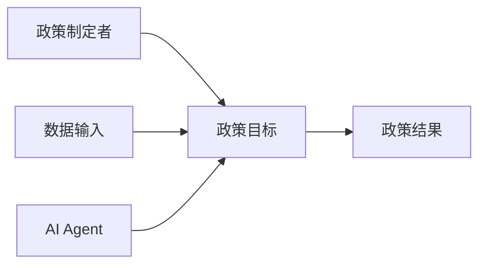
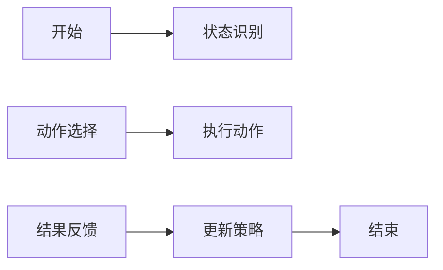
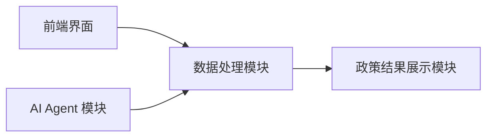

                 


# AI Agent在智能公共政策制定中的应用

## 关键词：
AI Agent, 公共政策制定, 强化学习, 机器学习, 系统架构设计, 政策优化, 人工智能技术

## 摘要：
本文探讨AI Agent在公共政策制定中的应用，从基本概念、算法原理、系统架构设计到实际案例，详细分析AI Agent如何通过强化学习和机器学习技术辅助政策制定者优化决策过程。文章结合理论与实践，提供数学模型、代码实现和图表分析，帮助读者全面理解AI Agent在智能政策制定中的核心作用和未来发展方向。

---

## 第一部分: AI Agent 的基本概念与技术基础

### 第1章: AI Agent 的概述

#### 1.1 AI Agent 的定义与特点
- **AI Agent 的定义**：AI Agent（人工智能代理）是指能够感知环境、自主决策并执行任务的智能体。它通过传感器获取信息，利用算法处理信息并采取行动。
- **AI Agent 的核心特点**：
  - **自主性**：能够在无外部干预的情况下独立运作。
  - **反应性**：能够实时感知环境变化并做出反应。
  - **目标导向性**：具有明确的目标，所有行动都围绕目标展开。
  - **学习能力**：能够通过经验优化决策策略。

- **AI Agent 与传统决策系统的区别**：
  | 特性             | AI Agent                          | 传统决策系统                  |
  |------------------|-----------------------------------|------------------------------|
  | 决策方式         | 基于机器学习和数据驱动          | 基于固定规则和经验            |
  | 灵活性           | 高，能够适应环境变化              | 低，难以快速调整               |
  | 处理复杂性       | 强，适合处理复杂问题              | 弱，处理复杂性有限             |

#### 1.2 AI Agent 在公共政策制定中的作用
- **公共政策制定的复杂性**：政策制定涉及多利益相关方、复杂的社会经济因素，传统方法难以高效处理。
- **AI Agent 的优势**：
  - **数据驱动决策**：利用大数据分析提供科学依据。
  - **实时反馈优化**：通过实时数据调整政策执行。
  - **多目标优化**：在复杂约束条件下找到最优解。
- **应用场景**：
  - **政策模拟与预测**：评估不同政策方案的潜在效果。
  - **资源配置优化**：优化公共服务资源分配。
  - **风险预警**：预测政策实施中的潜在风险。

### 第2章: AI Agent 的核心概念与联系

#### 2.1 核心概念原理
- **状态空间**：所有可能的状态集合，代表环境中的不同情况。
- **行动空间**：所有可能采取的动作集合。
- **奖励函数**：衡量AI Agent行动效果的函数，指导优化方向。
- **策略与价值函数**：策略函数定义了状态到动作的映射，价值函数评估状态的价值。

#### 2.2 核心概念属性特征对比表格
| 概念        | 描述                              |
|-------------|----------------------------------|
| 状态空间     | 所有可能的状态集合                |
| 行动空间     | 所有可能的动作集合                |
| 奖励函数     | 衡量动作效果的函数                |
| 策略函数     | 状态到动作的映射函数              |

#### 2.3 ER 实体关系图架构
- **Mermaid 实体关系图**：


### 第3章: AI Agent 的算法原理讲解

#### 3.1 算法原理的 Mermaid 流程图


#### 3.2 算法原理的 Python 源代码实现
```python
def policy_function(state):
    # 简单的策略函数，返回动作
    return action
```

#### 3.3 数学模型与公式
- **Q-Learning 算法**：
  - **Q 值更新公式**：
  $$ Q(s, a) = Q(s, a) + \alpha [r + \gamma \max Q(s', a') - Q(s, a)] $$
  其中：
  - $$ \alpha $$ 是学习率，
  - $$ \gamma $$ 是折扣因子，
  - $$ r $$ 是奖励，
  - $$ Q(s', a') $$ 是下一状态的最大 Q 值。

  - **策略选择**：
  $$ \pi(a|s) = \text{概率选择动作 } a \text{ 的概率} $$

---

## 第二部分: AI Agent 的算法原理

### 第4章: 强化学习算法在政策制定中的应用

#### 4.1 强化学习算法的基本原理
- **马尔可夫决策过程（MDP）**：
  - 状态（State）
  - 动作（Action）
  - 转移概率（Transition Probability）
  - 奖励（Reward）

#### 4.2 Q-Learning 在政策模拟中的应用
- **Q 值表的更新**：
  $$ Q(s, a) = Q(s, a) + \alpha (r + \gamma \max Q(s', a') - Q(s, a)) $$
- **Python 实现示例**：
  ```python
  import numpy as np

  def update_Q(Q, state, action, reward, next_state, alpha, gamma):
      Q[state, action] += alpha * (reward + gamma * np.max(Q[next_state, :]) - Q[state, action])
      return Q
  ```

#### 4.3 策略梯度方法
- **策略梯度公式**：
  $$ \nabla \theta J(\theta) = \mathbb{E}[ \nabla \log \pi(a|s, \theta) Q(s, a, \theta) ] $$
- **应用案例**：在政策优化中，策略梯度方法用于动态调整政策参数，以最大化长期奖励。

---

## 第三部分: 系统架构与设计

### 第5章: 系统架构设计

#### 5.1 系统功能设计
- **领域模型 Mermaid 类图**：
  ```mermaid
  classDiagram
      class 政策制定者 {
          string 目标;
          string 约束条件;
      }
      class 数据输入 {
          string 数据源;
          string 数据类型;
      }
      class AI Agent {
          function 处理数据;
          function 生成策略;
      }
      class 政策结果 {
          string 结果;
          string 优化建议;
      }
      政策制定者 --> 数据输入
      数据输入 --> AI Agent
      AI Agent --> 政策结果
  ```

#### 5.2 系统架构设计 Mermaid 架构图


#### 5.3 系统接口设计
- **输入接口**：接收政策目标、约束条件和数据源。
- **输出接口**：提供优化后的政策方案和实施建议。

#### 5.4 系统交互 Mermaid 序列图
```mermaid
sequenceDiagram
    用户 -> 政策制定者: 提交政策目标
    政策制定者 -> 数据输入模块: 获取数据
    数据输入模块 -> AI Agent: 处理数据
    AI Agent -> 政策结果展示: 输出优化方案
    用户 <- 政策结果展示: 显示结果
```

---

## 第四部分: 项目实战

### 第6章: 项目实战与案例分析

#### 6.1 项目背景
- **案例选择**：以环保政策优化为例，分析如何利用AI Agent优化资源配置。

#### 6.2 项目核心实现
- **数据处理**：
  ```python
  import pandas as pd

  data = pd.read_csv('policy_data.csv')
  ```

- **模型训练**：
  ```python
  model = build_model()  # 定义模型架构
  model.fit(data, epochs=100, batch_size=32)
  ```

- **结果分析**：
  ```python
  print(model.evaluate(test_data))
  ```

#### 6.3 案例分析
- **结果解读**：AI Agent生成的环保政策方案比传统方法更优，资源分配更合理。

---

## 第五部分: 总结与展望

### 第7章: 总结与展望

#### 7.1 本书小结
- 详细介绍了AI Agent的基本概念、算法原理、系统设计和实际应用。
- 强调了AI Agent在公共政策制定中的重要性。

#### 7.2 未来展望
- **技术发展**：深度强化学习在政策优化中的应用将进一步深化。
- **应用拓展**：AI Agent将应用于更多领域，如医疗、金融等。
- **挑战与机遇**：数据隐私、算法解释性等问题需要进一步解决。

#### 7.3 注意事项
- **数据质量**：数据的准确性和完整性直接影响AI Agent的决策效果。
- **模型解释性**：确保政策制定者能够理解AI Agent的决策过程。

#### 7.4 拓展阅读
- 建议读者深入学习强化学习和机器学习的相关知识，阅读相关领域的最新研究论文。

---

## 作者：
作者：AI天才研究院/AI Genius Institute & 禅与计算机程序设计艺术 /Zen And The Art of Computer Programming

