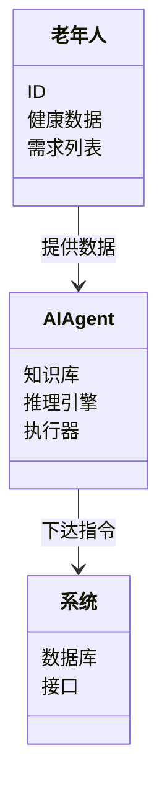
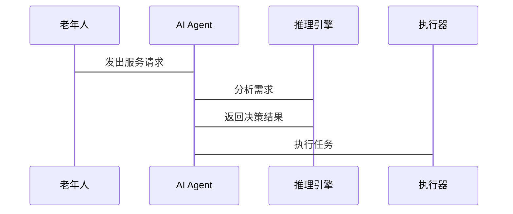

                 


# AI Agent在智能养老服务中的应用

> 关键词：AI Agent, 智能养老服务, 老年人需求, 多智能体协作, 健康监测, 知识表示

> 摘要：本文系统地探讨了AI Agent在智能养老服务中的应用，从核心概念、算法原理、系统架构到实际应用案例，详细阐述了如何利用AI技术提升养老服务的智能化水平。文章首先介绍了AI Agent的基本概念和智能养老服务的现状，然后分析了AI Agent在养老服务中的问题解决路径。接着，文章详细讲解了AI Agent的核心原理、算法模型以及在养老服务中的具体应用场景。最后，通过实际案例展示了AI Agent在智能养老服务中的实际应用，并总结了未来的发展方向。

---

# 第一部分: AI Agent与智能养老服务概述

## 第1章: AI Agent的基本概念与背景

### 1.1 AI Agent的定义与特点

#### 1.1.1 AI Agent的基本概念
AI Agent（人工智能代理）是一种能够感知环境、自主决策并执行任务的智能实体。它通过传感器获取信息，利用推理引擎进行分析，并通过执行器与环境交互。AI Agent的核心在于其自主性和智能性，能够根据实时数据动态调整行为。

#### 1.1.2 AI Agent的核心特点
1. **自主性**：AI Agent能够在没有外部干预的情况下自主运行。
2. **反应性**：能够实时感知环境变化并做出响应。
3. **协作性**：能够在多智能体环境中与其他Agent协作完成任务。
4. **学习能力**：通过机器学习算法不断优化自身的决策能力。

#### 1.1.3 AI Agent与传统养老服务的区别
传统的养老服务依赖人工操作，效率低且难以满足个性化需求。而AI Agent能够通过智能化的感知和决策，提供更加高效和个性化的服务。

### 1.2 智能养老服务的现状与挑战

#### 1.2.1 养老服务的需求分析
随着人口老龄化的加剧，老年人对养老服务的需求日益增加。老年人群体包括普通老年人和特殊需求群体（如失能、失智老人），他们的需求多样化且个性化。

#### 1.2.2 现有养老服务模式的局限性
1. **资源不足**：养老服务人员数量有限，难以覆盖庞大的老年群体。
2. **效率低下**：传统养老服务模式缺乏智能化支持，难以实现高效管理。
3. **个性化不足**：难以满足老年人的多样化需求，尤其是个性化健康管理和紧急救援。

#### 1.2.3 AI Agent在养老服务中的潜在价值
AI Agent能够通过智能化的感知和决策，提供个性化的养老服务，提高服务效率，降低运营成本。

---

## 第2章: AI Agent在智能养老服务中的应用背景

### 2.1 老年人群的需求分析

#### 2.1.1 老年人的基本需求
1. **健康监测**：实时监测老年人的健康状况，预防疾病。
2. **生活辅助**：协助完成日常生活中的一些基本操作，如购物、预约等。
3. **情感支持**：提供心理支持，缓解孤独感。

#### 2.1.2 特殊需求群体的养老服务需求
1. **失能老人**：需要长期护理和支持。
2. **失智老人**：需要特殊的认知支持和行为管理。
3. **慢性病患者**：需要持续的健康监测和管理。

#### 2.1.3 养老服务的多样性与个性化
不同老年人的需求差异较大，个性化服务是提升养老服务品质的关键。

### 2.2 AI Agent在养老服务中的问题背景

#### 2.2.1 养老服务资源的不足
养老服务资源的有限性使得传统的养老服务模式难以满足需求。

#### 2.2.2 养老服务效率的低下
传统养老服务依赖人工操作，效率低且难以扩展。

#### 2.2.3 AI Agent在养老服务中的问题解决
AI Agent能够通过智能化的手段，提高养老服务的效率和质量。

### 2.3 AI Agent在智能养老服务中的问题解决

#### 2.3.1 提供个性化养老服务
通过分析老年人的需求，AI Agent能够提供个性化的服务方案。

#### 2.3.2 提高养老服务效率
AI Agent能够快速响应需求，优化资源配置，提高服务效率。

#### 2.3.3 实现养老服务的智能化管理
通过智能化的管理系统，AI Agent能够实现养老服务的全面监控和优化。

---

## 第3章: AI Agent的核心概念与联系

### 3.1 AI Agent的核心原理

#### 3.1.1 知识表示与推理
知识表示是AI Agent进行推理的基础，通常采用逻辑推理、概率推理等方法。

#### 3.1.2 多智能体协作
在智能养老服务中，通常需要多个AI Agent协作完成任务，如健康监测、紧急救援等。

#### 3.1.3 动态环境下的决策机制
AI Agent需要在动态变化的环境中做出实时决策，确保服务的高效性和准确性。

### 3.2 核心概念对比表

| 概念       | 特性                                       |
|------------|------------------------------------------|
| AI Agent   | 具备自主性、反应性、协作性               |
| 智能养老服务 | 需要个性化、实时性、安全性               |

### 3.3 ER实体关系图

```mermaid
er
actor: 老年人
actor: 护理人员
actor: 家庭成员
object: 养老服务需求
object: 养老服务记录
object: AI Agent系统
```

---

## 第4章: AI Agent的算法原理与数学模型

### 4.1 AI Agent的决策算法

#### 4.1.1 基于概率的决策树
通过概率模型构建决策树，帮助AI Agent做出最优决策。

#### 4.1.2 基于规则的推理引擎
利用预定义的规则进行推理，适用于确定性场景。

#### 4.1.3 基于强化学习的优化算法
通过强化学习不断优化AI Agent的决策策略，提升服务效果。

### 4.2 数学模型与公式

#### 4.2.1 概率模型
$$ P(A|B) = \frac{P(B|A)P(A)}{P(B)} $$

#### 4.2.2 决策树模型
$$ \text{信息增益} = \text{熵} - \text{条件熵} $$

### 4.3 举例说明

#### 4.3.1 基于概率的健康状况判断
通过概率模型判断老年人的健康状况，如判断其是否可能患有某种疾病。

#### 4.3.2 基于规则的紧急情况处理
当检测到老年人的健康数据异常时，AI Agent根据预定义的规则触发紧急救援流程。

#### 4.3.3 基于强化学习的任务优化
通过强化学习优化AI Agent的任务分配策略，提高服务效率。

---

## 第5章: 系统分析与架构设计

### 5.1 系统分析

#### 5.1.1 问题场景介绍
AI Agent在智能养老服务中的应用场景包括健康监测、紧急救援、生活辅助等。

#### 5.1.2 项目介绍
本项目旨在设计并实现一个基于AI Agent的智能养老服务系统。

### 5.2 系统功能设计

#### 5.2.1 领域模型


#### 5.2.2 系统架构设计


#### 5.2.3 系统接口设计
系统需要与健康监测设备、紧急救援系统等外部系统进行接口对接。

#### 5.2.4 系统交互设计


---

## 第6章: 项目实战

### 6.1 环境安装

#### 6.1.1 系统需求
- 操作系统：Windows/Mac/Linux
- 开发工具：Python、Jupyter Notebook
- 依赖库：numpy, pandas, scikit-learn, matplotlib

#### 6.1.2 安装步骤
1. 安装Python和pip。
2. 安装所需的依赖库：`pip install numpy pandas scikit-learn matplotlib`.

### 6.2 系统核心实现源代码

#### 6.2.1 知识表示与推理

```python
# 知识表示
class KnowledgeBase:
    def __init__(self):
        self.knowledge = {}

    def add_rule(self, condition, action):
        if condition not in self.knowledge:
            self.knowledge[condition] = []
        self.knowledge[condition].append(action)

    def get_actions(self, condition):
        return self.knowledge.get(condition, [])

# 推理引擎
class ReasoningEngine:
    def __init__(self, knowledge_base):
        self.knowledge_base = knowledge_base

    def infer(self, condition):
        return self.knowledge_base.get_actions(condition)
```

#### 6.2.2 决策树模型

```python
from sklearn.tree import DecisionTreeClassifier
from sklearn import datasets

# 加载数据集
iris = datasets.load_iris()
X = iris.data
y = iris.target

# 训练决策树模型
clf = DecisionTreeClassifier()
clf.fit(X, y)

# 预测
print(clf.predict(X))
```

#### 6.2.3 强化学习算法

```python
import gym
from gym import spaces
import numpy as np

class Agent:
    def __init__(self, action_space):
        self.action_space = action_space
        self.reward_history = []

    def act(self, observation):
        # 随机选择动作
        return self.action_space.sample()

    def remember(self, reward):
        self.reward_history.append(reward)

# 创建环境
env = gym.make('CartPole-v0')
agent = Agent(env.action_space)

# 训练
for _ in range(100):
    observation = env.reset()
    done = False
    while not done:
        action = agent.act(observation)
        observation, reward, done, info = env.step(action)
        agent.remember(reward)

print(agent.reward_history)
```

### 6.3 实际案例分析与详细讲解剖析

#### 6.3.1 案例背景
某养老院引入AI Agent系统，用于管理老年人的健康监测和紧急救援。

#### 6.3.2 系统实现
通过AI Agent系统，实现对老年人健康数据的实时监测和异常情况的快速响应。

#### 6.3.3 应用效果
AI Agent系统显著提高了养老服务的效率和质量，减少了人力成本。

### 6.4 项目总结

#### 6.4.1 项目成果
成功实现了基于AI Agent的智能养老服务系统。

#### 6.4.2 经验总结
- AI Agent的应用能够显著提高养老服务的智能化水平。
- 系统设计需要充分考虑老年人的需求和使用习惯。

---

## 第7章: 最佳实践

### 7.1 小结

### 7.2 注意事项

### 7.3 拓展阅读

---

作者：AI天才研究院/AI Genius Institute & 禅与计算机程序设计艺术/Zen And The Art of Computer Programming

