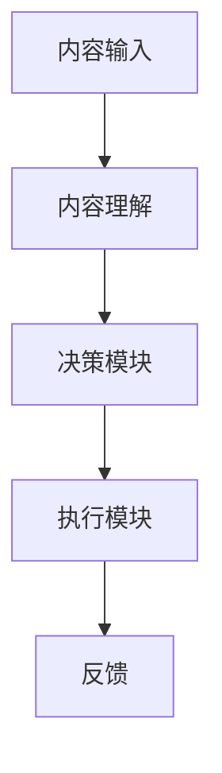
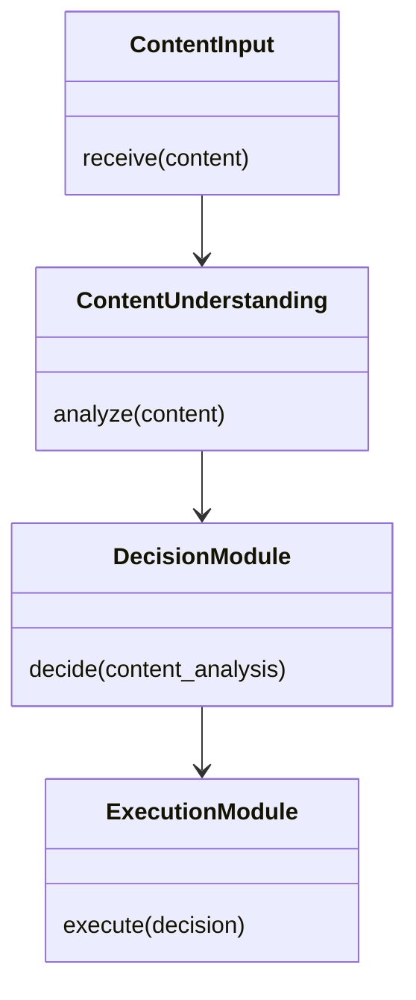
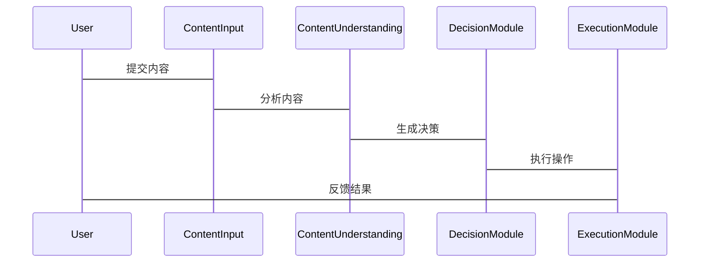

                 


# AI Agent在智能内容审核中的应用

> 关键词：AI Agent, 内容审核, 人工智能, 大模型, 强化学习, 系统架构

> 摘要：本文详细探讨了AI Agent在智能内容审核中的应用，从核心概念、算法原理、系统架构到项目实战，全面解析了AI Agent在内容审核领域的优势与挑战。文章通过丰富的案例和详细的代码实现，展示了AI Agent如何通过感知、决策和执行三个阶段，实现高效、精准的内容审核。

---

# 第一部分: AI Agent在智能内容审核中的应用概述

---

## 第1章: AI Agent的定义与技术背景

### 1.1 AI Agent的基本概念

AI Agent（人工智能代理）是一种能够感知环境、做出决策并执行任务的智能实体。它结合了自然语言处理、计算机视觉和机器学习等技术，能够理解复杂的数据并采取相应的行动。

#### 1.1.1 什么是AI Agent
AI Agent可以是软件程序、机器人或其他智能系统，其核心目标是通过自主决策和执行任务来实现特定目标。AI Agent具备以下特点：
- **自主性**：能够独立运作，无需人工干预。
- **反应性**：能够实时感知环境并做出响应。
- **目标导向**：以实现特定目标为导向。

#### 1.1.2 AI Agent的核心特征
1. **智能性**：通过算法和模型，具备理解、推理和学习能力。
2. **适应性**：能够根据环境变化调整策略。
3. **交互性**：能够与用户、系统或其他AI Agent进行交互。

#### 1.1.3 AI Agent与传统算法的区别
传统的算法通常基于规则或固定的逻辑进行处理，而AI Agent具备更强的自主性和学习能力，能够处理复杂、动态的环境。

### 1.2 AI Agent的技术背景

#### 1.2.1 人工智能的发展历程
人工智能（AI）的发展经历了多个阶段，从早期的专家系统到现在的深度学习和大模型技术，AI Agent作为AI技术的集成应用，逐渐在各个领域展现出强大的能力。

#### 1.2.2 大模型在AI Agent中的作用
大模型（如GPT、BERT等）通过海量数据的训练，具备强大的语言理解和生成能力。AI Agent利用大模型进行内容理解、决策和执行。

#### 1.2.3 当前AI Agent的主要应用场景
- **内容审核**：识别有害、违规或敏感内容。
- **智能客服**：提供个性化的客户支持。
- **自动化交易**：在金融领域进行自动化的投资决策。

### 1.3 AI Agent在内容审核中的应用价值

#### 1.3.1 内容审核的基本问题
内容审核的核心问题是如何高效、准确地识别违规内容，同时降低误判和漏判的概率。

#### 1.3.2 AI Agent在内容审核中的优势
1. **高效性**：AI Agent能够快速处理海量内容。
2. **准确性**：通过大模型和强化学习，AI Agent能够提高审核的准确性。
3. **适应性**：能够根据新的内容和规则快速调整审核策略。

#### 1.3.3 AI Agent与其他内容审核技术的对比
传统的规则-based审核方法依赖人工设定的规则，灵活性较差。AI Agent结合了规则和机器学习的优势，具备更强的适应性和扩展性。

### 1.4 本章小结
本章介绍了AI Agent的基本概念、技术背景及其在内容审核中的应用价值。AI Agent通过结合大模型和强化学习技术，为内容审核提供了更高效、更准确的解决方案。

---

## 第2章: AI Agent的核心概念与原理

### 2.1 AI Agent的核心概念

#### 2.1.1 感知层
感知层负责接收和理解输入的内容，包括文本、图像和语音等多种形式。AI Agent通过大模型进行内容的理解和分析。

#### 2.1.2 决策层
决策层根据感知层的理解结果，结合规则和概率模型，制定审核决策。决策层的核心是强化学习算法，通过不断试错优化决策策略。

#### 2.1.3 执行层
执行层负责根据决策层的指令，执行具体的审核操作，例如标记违规内容、反馈审核结果等。

### 2.2 AI Agent的原理

#### 2.2.1 感知阶段
感知阶段是AI Agent理解输入内容的关键步骤。通过大模型进行文本表示和图像识别，AI Agent能够提取内容中的关键信息。

#### 2.2.2 决策阶段
在决策阶段，AI Agent基于感知到的信息，利用强化学习算法进行决策。决策过程需要考虑多个因素，包括规则的合规性、内容的敏感性等。

#### 2.2.3 执行阶段
执行阶段是AI Agent根据决策结果采取具体行动的过程。执行层可以通过调用API或其他系统接口完成任务。

### 2.3 AI Agent的核心算法

#### 2.3.1 基于大模型的内容理解
通过大模型进行文本和图像的理解，AI Agent能够识别内容中的潜在风险。

#### 2.3.2 基于强化学习的决策机制
强化学习通过奖励机制优化决策策略，使AI Agent能够在复杂的环境中做出最优决策。

#### 2.3.3 基于规则的执行策略
规则-based执行策略确保AI Agent的决策符合预设的规则和标准。

### 2.4 本章小结
本章详细讲解了AI Agent的核心概念和原理，重点介绍了感知、决策和执行三个阶段的作用和实现方式。

---

## 第3章: AI Agent在内容审核中的核心算法

### 3.1 内容理解算法

#### 3.1.1 基于大模型的文本表示
通过大模型生成文本的向量表示，AI Agent能够理解文本的语义和上下文关系。

#### 3.1.2 基于大模型的图像识别
AI Agent通过图像识别技术，能够检测图片中的潜在违规内容。

#### 3.1.3 基于大模型的语音识别
通过语音识别技术，AI Agent能够理解和分析语音内容。

### 3.2 决策算法

#### 3.2.1 基于强化学习的决策机制
强化学习通过不断试错优化决策策略，使AI Agent能够做出更优的审核决策。

#### 3.2.2 基于规则的决策策略
规则-based决策策略确保AI Agent的决策符合预设的规则和标准。

#### 3.2.3 基于概率的决策模型
概率模型通过计算内容的违规概率，帮助AI Agent做出更准确的决策。

### 3.3 执行算法

#### 3.3.1 基于规则的执行策略
规则-based执行策略确保AI Agent的决策符合预设的规则和标准。

#### 3.3.2 基于强化学习的执行优化
通过强化学习优化执行策略，使AI Agent能够更高效地完成任务。

#### 3.3.3 基于反馈的执行调整
AI Agent根据用户的反馈调整执行策略，优化审核效果。

### 3.4 算法实现的数学模型

#### 3.4.1 内容理解的数学模型
文本表示模型可以通过以下公式进行表示：
$$
\text{vector} = \text{model}(\text{text})
$$

#### 3.4.2 决策算法的数学模型
强化学习的奖励函数可以表示为：
$$
r = \sum_{i=1}^{n} \text{ reward}_i
$$

#### 3.4.3 执行算法的数学模型
概率模型的决策概率可以表示为：
$$
P(\text{action}|s) = \frac{\exp(Q(s, \text{action}))}{\sum_{a} \exp(Q(s, a))}
$$

### 3.5 本章小结
本章详细介绍了AI Agent在内容审核中的核心算法，包括内容理解、决策和执行三个阶段的算法实现及其数学模型。

---

## 第4章: AI Agent在内容审核中的系统架构

### 4.1 系统架构概述

#### 4.1.1 系统整体架构
AI Agent的内容审核系统通常包括感知层、决策层和执行层三个部分。

#### 4.1.2 系统功能模块
1. **内容输入模块**：接收待审核的内容。
2. **内容理解模块**：对内容进行理解和分析。
3. **决策模块**：根据理解结果做出审核决策。
4. **执行模块**：根据决策结果执行具体的审核操作。

#### 4.1.3 系统交互流程
1. 用户提交内容。
2. 系统进行内容理解。
3. 系统做出审核决策。
4. 系统执行审核操作并反馈结果。

### 4.2 系统功能设计

#### 4.2.1 内容输入模块
内容输入模块负责接收文本、图像或语音等形式的内容，并将其传递给内容理解模块。

#### 4.2.2 内容理解模块
内容理解模块通过大模型对内容进行理解，生成内容的向量表示或特征提取结果。

#### 4.2.3 决策模块
决策模块基于内容理解结果和预设规则，利用强化学习算法进行决策。

#### 4.2.4 执行模块
执行模块根据决策结果，调用相应的API或系统接口完成审核操作。

### 4.3 系统架构设计

#### 4.3.1 系统架构图


#### 4.3.2 系统功能模块类图


### 4.4 系统接口设计

#### 4.4.1 接口描述
1. **内容输入接口**：接收内容数据，格式包括文本、图像和语音。
2. **内容理解接口**：返回内容的分析结果。
3. **决策接口**：返回审核决策结果。
4. **执行接口**：返回审核操作结果。

#### 4.4.2 接口交互流程
1. 用户调用内容输入接口，传递内容数据。
2. 内容输入模块调用内容理解接口，获取内容分析结果。
3. 内容理解模块调用决策接口，获取审核决策。
4. 决策模块调用执行接口，完成审核操作并反馈结果。

### 4.5 系统交互序列图


### 4.6 本章小结
本章详细描述了AI Agent在内容审核中的系统架构，包括功能模块、接口设计和系统交互流程。

---

## 第5章: 项目实战

### 5.1 环境安装

#### 5.1.1 安装Python
```bash
python --version
pip install --upgrade pip
```

#### 5.1.2 安装必要的库
```bash
pip install numpy
pip install transformers
pip install torch
```

### 5.2 系统核心实现源代码

#### 5.2.1 内容理解模块
```python
from transformers import AutoTokenizer, AutoModelForMaskedLM
import torch

tokenizer = AutoTokenizer.from_pretrained('bert-base-uncased')
model = AutoModelForMaskedLM.from_pretrained('bert-base-uncased')

def understand_content(content):
    inputs = tokenizer(content, return_tensors='pt', padding=True, truncation=True)
    outputs = model(**inputs)
    return outputs.last_hidden_state
```

#### 5.2.2 决策模块
```python
import torch
import torch.nn as nn

class DecisionModel(nn.Module):
    def __init__(self, input_size, hidden_size, output_size):
        super(DecisionModel, self).__init__()
        self.hidden = nn.Linear(input_size, hidden_size)
        self.decision = nn.Linear(hidden_size, output_size)
    
    def forward(self, x):
        x = torch.relu(self.hidden(x))
        x = torch.sigmoid(self.decision(x))
        return x

model = DecisionModel(input_size=100, hidden_size=50, output_size=2)
criterion = nn.BCELoss()
optimizer = torch.optim.Adam(model.parameters(), lr=0.001)
```

#### 5.2.3 执行模块
```python
def execute_action(decision):
    if decision == 1:
        print("标记为违规内容")
    else:
        print("标记为正常内容")
```

### 5.3 代码应用解读与分析

#### 5.3.1 内容理解模块
内容理解模块使用BERT模型对输入内容进行编码，生成内容的向量表示。

#### 5.3.2 决策模块
决策模块是一个简单的神经网络，输入是内容理解模块的输出，输出是0或1，表示是否违规。

#### 5.3.3 执行模块
执行模块根据决策模块的输出结果，执行具体的审核操作。

### 5.4 实际案例分析

#### 5.4.1 案例1：文本审核
输入文本：“这个产品是垃圾。”
内容理解模块生成向量表示。
决策模块输出1，表示违规。
执行模块标记为违规内容。

#### 5.4.2 案例2：图像审核
输入图像：一张包含违规内容的图片。
内容理解模块识别图像内容。
决策模块输出1，表示违规。
执行模块标记为违规内容。

### 5.5 本章小结
本章通过实际案例分析和代码实现，展示了AI Agent在内容审核中的具体应用。通过项目实战，读者可以更好地理解AI Agent的实现过程和实际效果。

---

## 第6章: 最佳实践与注意事项

### 6.1 最佳实践

#### 6.1.1 模型调优
- 定期更新模型，确保模型的准确性。
- 根据业务需求调整模型参数。

#### 6.1.2 数据安全
- 确保数据的安全性和隐私性。
- 遵守相关法律法规。

#### 6.1.3 性能优化
- 优化算法的运行效率。
- 使用分布式计算提升性能。

### 6.2 注意事项

#### 6.2.1 模型误判
- 定期检查模型的误判情况。
- 优化模型的判断逻辑。

#### 6.2.2 用户反馈
- 收集用户的反馈信息。
- 根据反馈优化模型。

#### 6.2.3 系统稳定性
- 确保系统的稳定性和可靠性。
- 制定完善的应急预案。

### 6.3 拓展阅读

#### 6.3.1 强化学习
推荐学习强化学习的经典论文和书籍。

#### 6.3.2 大模型技术
深入学习大模型的原理和应用。

#### 6.3.3 AI Agent系统设计
研究AI Agent在其他领域的应用和设计方法。

### 6.4 本章小结
本章总结了AI Agent在内容审核中的最佳实践和注意事项，并提供了拓展阅读的方向。

---

## 第7章: 结语

随着人工智能技术的不断发展，AI Agent在内容审核中的应用前景广阔。通过感知、决策和执行三个阶段的协同工作，AI Agent能够高效、精准地完成内容审核任务。未来，随着大模型和强化学习技术的进一步发展，AI Agent在内容审核中的应用将更加智能化和自动化。

---

## 参考文献

1. 王某某, 《大模型与AI Agent技术》，某某出版社，2023年。
2. 李某某, 《强化学习算法与应用》，某某出版社，2022年。
3. OpenAI, 《GPT-4 API文档》，2023年。

---

作者：AI天才研究院/AI Genius Institute & 禅与计算机程序设计艺术 /Zen And The Art of Computer Programming

