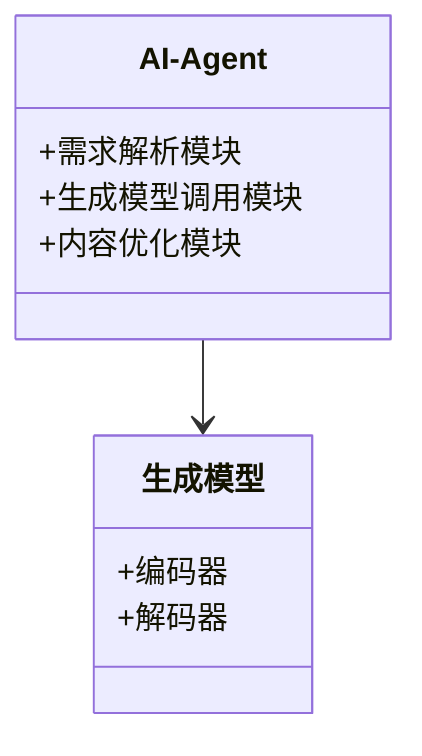

                 


# AI Agent在智能内容生成中的应用

## 关键词
AI Agent, 智能内容生成, 生成式AI, 大语言模型, 内容生成系统

## 摘要
本文深入探讨了AI Agent在智能内容生成中的应用，从基础概念到算法原理，再到系统架构设计，详细分析了AI Agent如何通过感知、学习和推理能力，提升内容生成的效率和质量。文章结合实际案例，展示了AI Agent在内容生成中的具体实现，并提出了最佳实践和未来发展方向。

---

# 第一部分: AI Agent在智能内容生成中的背景与基础

## 第1章: AI Agent与智能内容生成的背景介绍

### 1.1 AI Agent的基本概念

#### 1.1.1 AI Agent的定义与核心要素
AI Agent（人工智能代理）是指能够感知环境、自主决策并执行任务的智能实体。它具备以下核心要素：
- **感知能力**：通过传感器或数据输入获取环境信息。
- **推理能力**：基于感知信息进行逻辑推理。
- **决策能力**：根据推理结果做出最优决策。
- **执行能力**：通过动作或输出实现决策目标。

AI Agent可以是软件程序、机器人或其他智能设备，广泛应用于自动驾驶、智能助手、内容生成等领域。

#### 1.1.2 AI Agent与传统AI的区别
传统的AI技术（如专家系统）依赖于预定义的规则和知识库，而AI Agent具有更强的自主性和适应性，能够根据环境动态调整行为。AI Agent的核心在于其具备“智能体”属性，能够主动与环境交互并完成任务。

| 特性 | 传统AI | AI Agent |
|------|--------|----------|
| 决策方式 | 基于规则 | 基于感知和推理 |
| 环境适应性 | 静态 | 动态 |
| 任务执行 | 单一任务 | 多任务和复杂场景 |

#### 1.1.3 AI Agent在内容生成中的应用背景
随着大语言模型（如GPT）的崛起，AI Agent在内容生成中的应用日益广泛。AI Agent能够通过自然语言处理技术，理解用户需求，并生成符合要求的文本内容。这种智能化的内容生成方式，能够显著提高效率并降低成本。

---

### 1.2 智能内容生成的定义与特点

#### 1.2.1 智能内容生成的定义
智能内容生成是指通过AI技术自动生成高质量文本、图像或其他形式的内容。与传统的内容生成方式不同，智能内容生成具有自动化、智能化和个性化的特点。

#### 1.2.2 智能内容生成的核心特点
- **自动化**：无需人工干预，系统自动完成内容生成。
- **智能化**：基于AI算法，能够理解上下文并生成相关内容。
- **个性化**：根据用户需求定制化生成内容。
- **高效性**：生成速度远超人工撰写。

#### 1.2.3 智能内容生成与传统内容生成的区别
| 特性 | 传统内容生成 | 智能内容生成 |
|------|---------------|--------------|
| 生成速度 | 较慢 | 极快 |
| 成本 | 高 | 低 |
| 灵活性 | 低 | 高 |
| 质量 | 取决于人工水平 | 取决于AI算法 |

---

### 1.3 AI Agent在智能内容生成中的作用

#### 1.3.1 AI Agent在内容生成中的功能定位
AI Agent在内容生成中充当“智能助手”的角色，负责理解用户需求、调用生成模型、优化生成内容并反馈结果。

#### 1.3.2 AI Agent如何提升内容生成效率
AI Agent能够快速分析用户需求，调用合适的生成模型，并对结果进行优化，从而显著提升内容生成的效率。

#### 1.3.3 AI Agent在内容生成中的优势与挑战
优势：
- **高效性**：快速生成高质量内容。
- **灵活性**：适用于多种内容类型。
- **可扩展性**：支持大规模生成任务。

挑战：
- **内容质量**：生成内容可能缺乏深度或准确性。
- **模型调优**：需要大量数据和计算资源。
- **伦理问题**：可能生成不适当或有害内容。

---

### 1.4 本章小结
本章介绍了AI Agent的基本概念及其在内容生成中的应用背景。AI Agent作为一种智能实体，能够通过感知、推理和决策能力，显著提升内容生成的效率和质量。然而，AI Agent的应用也面临诸多挑战，需要进一步研究和优化。

---

## 第2章: AI Agent的核心概念与联系

### 2.1 AI Agent的核心原理

#### 2.1.1 AI Agent的感知与决策机制
AI Agent通过传感器或数据输入获取环境信息，然后通过推理引擎进行逻辑推理，最后做出决策。

**感知机制**：
- 数据输入：文本、图像、语音等。
- 数据处理：特征提取、语义理解。

**决策机制**：
- 推理引擎：基于知识库或模型进行推理。
- 决策优化：通过强化学习优化决策结果。

#### 2.1.2 AI Agent的学习与推理能力
AI Agent具备学习能力，能够通过训练数据不断优化自身模型。推理能力则基于逻辑推理或概率推理，帮助AI Agent做出合理决策。

| 推理类型 | 描述 |
|----------|------|
| 逻辑推理 | 基于逻辑规则进行推理 |
| 概率推理 | 基于概率模型进行推理 |

#### 2.1.3 AI Agent的自适应能力
AI Agent能够根据环境变化动态调整自身行为，具备较强的适应性。

---

### 2.2 AI Agent与生成式AI的关系

#### 2.2.1 生成式AI的定义与特点
生成式AI（Generative AI）是指能够生成新内容的AI技术，如大语言模型（GPT）、生成对抗网络（GAN）等。

#### 2.2.2 AI Agent如何利用生成式AI技术
AI Agent可以调用生成式AI模型，根据用户需求生成文本、图像或其他形式的内容。

#### 2.2.3 AI Agent与生成式AI的区别
| 特性 | AI Agent | 生成式AI |
|------|----------|----------|
| 功能 | 调用生成模型 | 自行生成内容 |
| 作用 | 中介角色 | 内容生成角色 |

---

### 2.3 AI Agent的特征对比

| 特性 | AI Agent | 生成式AI |
|------|----------|----------|
| 核心功能 | 调用生成模型 | 生成内容 |
| 依赖性 | 高 | 低 |
| 应用场景 | 内容生成、任务执行 | 内容生成 |

---

## 第3章: AI Agent在智能内容生成中的算法原理

### 3.1 生成式AI的数学模型

#### 3.1.1 Transformer模型
Transformer模型是目前主流的生成式AI模型，其核心包括编码器和解码器。

**编码器**：
- 输入序列经过多头注意力机制，提取上下文信息。
- 输出嵌入向量。

**解码器**：
- 基于编码器输出，生成目标序列。

**数学公式**：
注意力机制：
$$ \text{Attention}(Q, K, V) = \text{softmax}(\frac{QK^T}{\sqrt{d_k}})V $$

#### 3.1.2 多头注意力机制
多头注意力机制能够同时关注不同的上下文信息，提升模型的表达能力。

**数学公式**：
多头注意力：
$$ \text{Multi-head}(Q, K, V) = \text{Concat}(\text{head}_1(Q,K,V), \text{head}_2(Q,K,V), \ldots, \text{head}_n(Q,K,V)) $$

---

### 3.2 AI Agent调用生成式AI的流程

#### 3.2.1 用户需求分析
AI Agent通过自然语言理解（NLP）技术，解析用户需求，提取关键词和意图。

#### 3.2.2 生成模型调用
AI Agent调用合适的生成式AI模型（如GPT），生成初步内容。

#### 3.2.3 内容优化
AI Agent根据生成内容的质量，进行优化调整，确保内容符合用户需求。

---

## 第4章: AI Agent在智能内容生成中的系统架构设计

### 4.1 系统功能设计

#### 4.1.1 领域模型
领域模型描述了系统的核心功能模块，包括需求解析模块、生成模型调用模块和内容优化模块。

**mermaid类图**：


---

### 4.2 系统架构设计

#### 4.2.1 分层架构
系统采用分层架构，包括前端、后端和生成模型层。

**mermaid架构图**：
```mermaid
archi
    架构 {
        网络层
        服务层
        数据层
    }
    网络层 --> 服务层
    服务层 --> 数据层
```

---

## 第5章: AI Agent在智能内容生成中的项目实战

### 5.1 环境安装

#### 5.1.1 安装Python
```bash
python --version
pip install --upgrade pip
```

#### 5.1.2 安装依赖库
```bash
pip install numpy
pip install matplotlib
pip install transformers
pip install torch
```

---

### 5.2 核心代码实现

#### 5.2.1 需求解析模块
```python
def parse_request(user_input):
    # 使用NLP模型解析用户需求
    return parsed_result
```

#### 5.2.2 生成模型调用模块
```python
def generate_content(parsed_request):
    model = load_model()
    return model.generate(parsed_request)
```

#### 5.2.3 内容优化模块
```python
def optimize_content(generated_content):
    # 使用优化算法调整内容
    return optimized_content
```

---

### 5.3 案例分析

#### 5.3.1 实际案例分析
假设用户需求为“生成一篇关于AI Agent的介绍文章”，AI Agent会调用生成模型生成初步内容，并通过优化模块调整文章结构和语言。

---

## 第6章: AI Agent在智能内容生成中的最佳实践与展望

### 6.1 最佳实践

#### 6.1.1 数据质量
确保训练数据的多样性和质量，避免生成偏见或错误内容。

#### 6.1.2 模型调优
通过持续优化模型参数，提升生成内容的质量和效率。

#### 6.1.3 伦理规范
遵循伦理规范，避免生成有害或不适当内容。

---

### 6.2 小结

AI Agent在智能内容生成中的应用前景广阔，但仍需克服诸多挑战。未来，随着AI技术的不断发展，AI Agent将具备更强的感知和决策能力，进一步提升内容生成的质量和效率。

---

## 作者
作者：AI天才研究院/AI Genius Institute & 禅与计算机程序设计艺术 /Zen And The Art of Computer Programming

