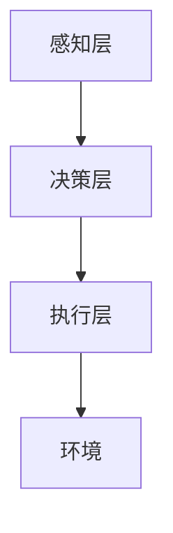

                 


# AI Agent在智能农业中的应用

> 关键词：AI Agent，智能农业，精准农业，机器学习，计算机视觉，自然语言处理

> 摘要：本文深入探讨了AI Agent在智能农业中的应用，从基本概念到具体应用场景，再到系统架构设计和项目实战，详细阐述了AI Agent如何推动农业智能化的发展。文章通过理论与实践结合的方式，分析了AI Agent在精准农业、病虫害监测、资源优化管理等领域的应用价值，并展望了未来的发展方向。

---

# 第1章: AI Agent与智能农业概述

## 1.1 AI Agent的基本概念

### 1.1.1 什么是AI Agent

AI Agent（人工智能代理）是一种能够感知环境、自主决策并执行任务的智能实体。它通过传感器获取信息，利用算法处理数据，并通过执行器与环境交互。AI Agent的核心目标是通过智能化的决策和行动，提高系统的效率和性能。

### 1.1.2 AI Agent的核心特征

- **自主性**：AI Agent能够自主决策，无需外部干预。
- **反应性**：能够实时感知环境变化并做出响应。
- **目标导向**：基于预设目标进行决策和行动。
- **学习能力**：通过数据和经验不断优化自身性能。

### 1.1.3 AI Agent与传统自动化系统的区别

| 特性               | AI Agent                 | 传统自动化系统           |
|--------------------|--------------------------|--------------------------|
| 决策方式           | 基于机器学习和数据驱动 | 基于预设规则和程序     |
| 环境适应性         | 高度灵活，能适应变化    | 较低，依赖固定环境条件   |
| 学习能力           | 具备学习能力             | 无学习能力               |

---

## 1.2 智能农业的定义与发展

### 1.2.1 智能农业的概念

智能农业是将现代信息技术（如物联网、大数据、人工智能）应用于农业生产和管理，以提高农业生产效率、资源利用率和产品质量。

### 1.2.2 智能农业的发展历程

1. **传统农业**：依赖自然条件和人工劳动。
2. **现代农业**：引入机械和化学技术，提高生产效率。
3. **智能农业**：通过数字化和智能化技术，实现精准化管理和优化决策。

### 1.2.3 智能农业的现状与挑战

- **现状**：广泛应用于精准种植、智能监测、供应链管理等领域。
- **挑战**：数据不足、模型泛化能力有限、计算资源需求高等。

---

## 1.3 AI Agent在智能农业中的应用背景

### 1.3.1 农业智能化的需求

- **提高效率**：减少人工干预，降低劳动成本。
- **精准管理**：通过数据驱动实现精准种植和资源优化。
- **应对环境变化**：快速响应天气、病虫害等突发问题。

### 1.3.2 AI Agent在农业中的潜在价值

- **精准决策**：通过数据分析优化种植方案。
- **实时监测**：实时感知土壤、气象等数据，及时预警。
- **自动化管理**：实现从监测到执行的全流程自动化。

### 1.3.3 当前应用的边界与外延

- **边界**：AI Agent的应用主要集中在数据可获取、环境可预测的场景。
- **外延**：未来将扩展到更多领域，如智能供应链、农业金融等。

---

## 1.4 本章小结

本章介绍了AI Agent的基本概念、核心特征及其在智能农业中的应用背景。AI Agent作为智能农业的核心技术之一，通过自主决策和数据驱动的方式，为农业生产提供了新的可能性。下一章将深入探讨AI Agent的核心原理，包括其工作流程和技术基础。

---

# 第2章: AI Agent的核心原理

## 2.1 AI Agent的基本工作原理

### 2.1.1 信息感知与数据采集

AI Agent通过传感器、摄像头等设备获取环境数据，如土壤湿度、温度、光照等。

### 2.1.2 问题分析与决策制定

AI Agent利用机器学习模型对数据进行分析，生成决策。例如，使用决策树或随机森林模型预测作物的最佳播种时间。

### 2.1.3 行动执行与反馈优化

AI Agent根据决策结果执行行动（如灌溉、施肥）并收集反馈数据，不断优化模型。

---

## 2.2 AI Agent的关键技术

### 2.2.1 机器学习与深度学习

- **机器学习**：通过训练数据生成模型，用于分类、回归等任务。
- **深度学习**：利用神经网络处理复杂数据，如图像识别。

### 2.2.2 自然语言处理

AI Agent可以通过自然语言处理技术与人类进行交互，理解农民的问题并提供解决方案。

### 2.2.3 计算机视觉

计算机视觉技术用于图像识别，如病虫害检测、作物生长监测。

---

## 2.3 AI Agent的核心算法

### 2.3.1 监督学习

$$
\text{损失函数} = \sum_{i=1}^{n} (y_i - \hat{y}_i)^2
$$

### 2.3.2 无监督学习

$$
\text{聚类中心} = \text{argmax} \sum_{i=1}^{n} \max_{j} \text{similarity}(x_i, c_j)
$$

### 2.3.3 强化学习

$$
Q(s, a) = r + \gamma \max_{a'} Q(s', a')
$$

---

## 2.4 本章小结

本章详细介绍了AI Agent的核心原理和技术基础，包括信息感知、决策制定、算法选择等。AI Agent通过多种技术的结合，实现智能化的农业生产管理。下一章将探讨AI Agent在精准农业中的具体应用。

---

# 第3章: AI Agent在精准农业中的应用

## 3.1 精准农业的概念与目标

### 3.1.1 精准农业的定义

精准农业通过数据驱动的方式，实现作物的精准种植和管理。

### 3.1.2 精准农业的核心目标

- 提高产量
- 降低成本
- 保护环境

### 3.1.3 精准农业的关键技术

- IoT传感器
- 无人机
- 大数据分析

---

## 3.2 AI Agent在精准农业中的应用场景

### 3.2.1 土地监测与管理

AI Agent通过分析土壤数据，制定最优的施肥方案。

### 3.2.2 农作物生长监测

通过计算机视觉技术，实时监测作物生长情况。

### 3.2.3 病虫害智能识别与防治

AI Agent可以识别病虫害类型，并推荐防治方案。

---

## 3.3 AI Agent在精准农业中的优势

### 3.3.1 提高农业生产效率

通过数据驱动优化种植方案。

### 3.3.2 降低资源浪费

精准管理减少水、肥等资源的浪费。

### 3.3.3 实现个性化种植管理

根据地块和作物特点制定个性化管理方案。

---

## 3.4 本章小结

本章详细探讨了AI Agent在精准农业中的应用场景和优势。AI Agent通过数据驱动的方式，实现精准化、个性化的农业生产管理。下一章将从系统架构的角度，深入分析AI Agent在智能农业中的设计与实现。

---

# 第4章: AI Agent在智能农业中的系统架构

## 4.1 系统架构设计概述

### 4.1.1 系统架构的基本概念

AI Agent的系统架构包括感知层、决策层和执行层。

### 4.1.2 AI Agent在智能农业中的架构特点

- 分层设计
- 数据驱动
- 实时响应

### 4.1.3 系统架构设计的原则

- 可扩展性
- 可靠性
- 实时性

---

## 4.2 系统功能模块设计

### 4.2.1 数据采集模块

- 传感器数据采集
- 数据预处理

### 4.2.2 数据分析模块

- 机器学习模型训练
- 数据可视化

### 4.2.3 决策与执行模块

- 决策制定
- 执行器控制

---

## 4.3 系统架构设计图



---

## 4.4 本章小结

本章详细分析了AI Agent在智能农业中的系统架构设计，包括功能模块和架构图。AI Agent的系统架构为农业生产提供了高效、可靠的智能化管理解决方案。下一章将通过具体项目实战，展示AI Agent的实际应用。

---

# 第5章: AI Agent在智能农业中的项目实战

## 5.1 项目背景与目标

### 5.1.1 项目背景

本项目旨在开发一个基于AI Agent的智能灌溉系统。

### 5.1.2 项目目标

实现土壤湿度监测、智能决策和自动灌溉。

---

## 5.2 环境配置与代码实现

### 5.2.1 环境配置

```bash
pip install numpy scikit-learn matplotlib
```

### 5.2.2 核心代码实现

```python
import numpy as np
from sklearn.tree import DecisionTreeClassifier

# 数据预处理
X = np.array([[20, 50], [25, 45], [30, 40]])
y = np.array([0, 1, 0])

# 模型训练
model = DecisionTreeClassifier()
model.fit(X, y)

# 决策边界可视化
import matplotlib.pyplot as plt
x_min, x_max = X[:, 0].min(), X[:, 0].max()
y_min, y_max = X[:, 1].min(), X[:, 1].max()
xx = np.arange(x_min, x_max, 0.1)
yy = np.arange(y_min, y_max, 0.1)
XX, YY = np.meshgrid(xx, yy)
Z = model.predict(np.c_[XX.ravel(), YY.ravel()])

plt.contourf(XX, YY, Z, cmap='viridis')
plt.scatter(X[:, 0], X[:, 1], c=y, cmap='viridis')
plt.show()
```

---

## 5.3 项目小结

本章通过具体项目实战，展示了AI Agent在智能农业中的应用。从环境配置到代码实现，详细讲解了AI Agent的开发流程。通过实际案例，读者可以更好地理解AI Agent在农业中的具体应用。

---

# 第6章: AI Agent在智能农业中的应用案例

## 6.1 智能灌溉系统的应用案例

### 6.1.1 系统介绍

智能灌溉系统通过土壤湿度传感器和AI Agent进行数据分析，实现自动灌溉。

### 6.1.2 系统优势

- 节水节能
- 提高作物产量
- 实时监控

---

## 6.2 系统优化与挑战

### 6.2.1 系统优化

- 提高模型泛化能力
- 优化传感器布局
- 提升系统实时性

### 6.2.2 应用挑战

- 数据不足
- 模型复杂度高
- 计算资源需求大

---

## 6.3 本章小结

本章通过智能灌溉系统的应用案例，展示了AI Agent在智能农业中的实际应用。同时，分析了系统优化和应用中的挑战，为未来的改进提供了方向。

---

# 第7章: 总结与展望

## 7.1 总结

AI Agent作为智能农业的核心技术，通过数据驱动的方式，为农业生产提供了高效、精准的管理方案。其在精准农业、病虫害监测、资源优化管理等领域展现了巨大的潜力。

## 7.2 未来展望

未来，AI Agent在智能农业中的应用将更加广泛。随着技术的进步，AI Agent将具备更强的感知能力、决策能力和学习能力，进一步推动农业智能化的发展。

---

# 作者

作者：AI天才研究院/AI Genius Institute & 禅与计算机程序设计艺术 /Zen And The Art of Computer Programming

---

如需进一步探讨或获取更多资料，请联系：[email protected]

