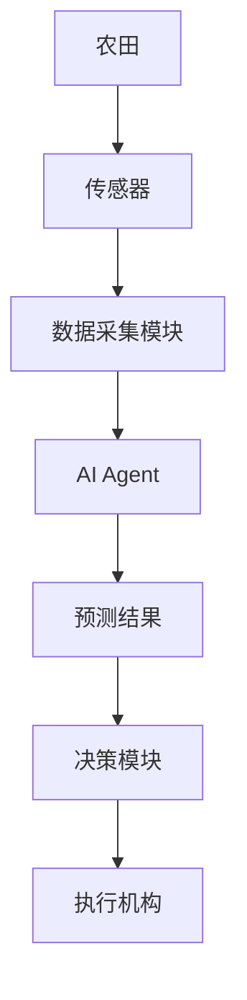

                 

# AI Agent在智能农业产量预测中的实践

## 关键词：AI Agent，智能农业，产量预测，机器学习，物联网，数据分析

## 摘要：  
本文详细探讨了AI Agent在智能农业中的应用，特别是其在农业产量预测中的实践。通过分析AI Agent的核心原理、算法实现、系统架构及实际案例，本文展示了如何利用AI技术提升农业生产的智能化水平，帮助农民实现更精准的产量预测和管理。

---

# 第一部分：AI Agent在智能农业中的背景与概念

## 第1章：AI Agent与智能农业概述

### 1.1 AI Agent的基本概念

#### 1.1.1 AI Agent的定义与特点
AI Agent（人工智能代理）是一种能够感知环境、做出决策并执行动作的智能实体。它具备以下特点：
- **自主性**：能够在没有外部干预的情况下自主运行。
- **反应性**：能够实时感知环境变化并做出响应。
- **目标导向性**：具有明确的目标，并通过行动实现这些目标。
- **学习能力**：能够通过数据和经验不断优化自身性能。

#### 1.1.2 AI Agent的核心功能与应用场景
AI Agent的核心功能包括数据采集、分析、决策和执行。在农业中的应用场景广泛，例如：
- 农田环境监测
- 农作物生长状态分析
- 病虫害预警
- 产量预测
- 农业资源优化配置

#### 1.1.3 智能农业的概念与发展趋势
智能农业是利用信息技术、物联网、人工智能等技术，实现农业生产、管理和服务的智能化。其发展趋势包括：
- 数据驱动的精准农业
- 自动化与智能化的生产流程
- 可持续发展的绿色农业
- 数字化与智能化的农业管理

---

### 1.2 AI Agent在农业中的应用价值

#### 1.2.1 农业智能化的需求与挑战
随着气候变化、土地资源减少和劳动力短缺等问题的加剧，农业智能化成为必然趋势。然而，传统农业预测方法存在以下挑战：
- 数据采集不全面
- 模型泛化能力不足
- 决策过程缺乏实时性

#### 1.2.2 AI Agent在农业中的具体应用场景
AI Agent在农业中的应用包括：
- **数据采集与处理**：通过传感器和无人机收集农田数据。
- **智能决策**：基于数据进行作物生长预测和病虫害预警。
- **实时监控与反馈**：通过物联网实现农田的实时监测和自动调节。

#### 1.2.3 AI Agent对农业产量预测的推动作用
AI Agent通过实时数据采集、智能分析和动态调整，显著提高了产量预测的准确性和及时性，帮助农民实现精准管理。

---

## 第2章：农业产量预测的背景与问题分析

### 2.1 农业产量预测的重要性
#### 2.1.1 农业生产中的关键问题
- 气候变化对农作物生长的影响
- 土壤肥力和水分管理的复杂性
- 病虫害的不确定性

#### 2.1.2 产量预测在农业管理中的作用
- 优化资源配置，降低生产成本
- 提高农业生产效率
- 为政府制定农业政策提供数据支持

### 2.2 传统农业产量预测方法的局限性

#### 2.2.1 统计分析法的局限性
统计分析法依赖历史数据，但无法捕捉实时变化和复杂因素。

#### 2.2.2 专家经验法的局限性
专家经验法依赖个人知识，具有主观性和局限性。

#### 2.2.3 机器学习方法的局限性
传统机器学习方法需要大量标注数据，且缺乏实时性和动态调整能力。

### 2.3 AI Agent在农业产量预测中的优势

#### 2.3.1 数据采集与处理的优势
AI Agent能够实时采集农田数据，包括温度、湿度、光照、土壤酸碱度等。

#### 2.3.2 智能决策的优势
通过机器学习和强化学习，AI Agent能够快速分析数据并制定最优决策。

#### 2.3.3 实时监控与反馈的优势
AI Agent能够实时监控农田状态，并根据反馈调整预测模型，提高预测精度。

---

# 第二部分：AI Agent的核心概念与原理

## 第3章：AI Agent的核心原理与机制

### 3.1 AI Agent的基本原理

#### 3.1.1 感知层：数据采集与处理
AI Agent通过传感器、摄像头和无人机等设备采集农田数据，并通过数据预处理模块进行清洗和特征提取。

#### 3.1.2 决策层：状态分析与决策制定
基于感知层的数据，AI Agent利用机器学习算法（如强化学习和监督学习）进行状态分析和决策制定。

#### 3.1.3 执行层：动作输出与反馈
AI Agent根据决策层的指令，通过执行机构（如灌溉系统、施肥设备）执行动作，并将反馈信息传递给感知层。

### 3.2 AI Agent的关键技术

#### 3.2.1 机器学习算法
- 强化学习：通过试错优化决策策略。
- 监督学习：基于历史数据训练预测模型。

#### 3.2.2 自然语言处理技术
用于分析农业文献和病虫害描述，辅助诊断和预测。

#### 3.2.3 实时数据处理技术
通过流数据处理框架（如Kafka、Flink）实现实时数据处理和分析。

### 3.3 AI Agent的实体关系图

---

## 第4章：AI Agent与农业产量预测的核心联系

### 4.1 农业产量预测的核心要素

#### 4.1.1 数据源
- **环境数据**：温度、湿度、光照、风速等。
- **土壤数据**：酸碱度、水分含量、养分含量等。
- **作物数据**：生长周期、病虫害情况、历史产量等。

#### 4.1.2 数据处理
- 数据清洗：去除噪声和异常值。
- 特征提取：提取关键特征用于模型训练。

#### 4.1.3 模型训练
- 使用机器学习算法（如随机森林、支持向量机）训练预测模型。
- 通过交叉验证优化模型参数。

---

## 第5章：AI Agent在农业产量预测中的实践

### 5.1 系统架构设计

#### 5.1.1 系统功能模块
- 数据采集模块：负责采集农田数据。
- 数据处理模块：对数据进行清洗和特征提取。
- 预测模块：基于机器学习算法进行产量预测。
- 决策模块：根据预测结果制定管理策略。

#### 5.1.2 系统架构图

### 5.2 实际案例分析

#### 5.2.1 案例背景
某农场使用AI Agent进行水稻产量预测，希望通过实时监测和动态调整提高产量。

#### 5.2.2 数据采集与处理
- 传感器采集农田环境数据和作物生长数据。
- 数据预处理模块清洗数据并提取特征。

#### 5.2.3 模型训练与预测
- 使用随机森林算法训练产量预测模型。
- 模型预测水稻产量并生成管理建议。

#### 5.2.4 决策与执行
- 决策模块根据预测结果调整灌溉和施肥计划。
- 执行机构执行决策，优化作物生长环境。

---

## 第6章：AI Agent在农业产量预测中的优化与挑战

### 6.1 数据质量问题
- 数据的完整性与准确性直接影响预测结果。
- 如何处理缺失数据和异常值是关键。

### 6.2 模型优化
- 通过超参数调优和模型融合提高预测精度。
- 引入深度学习模型（如LSTM）捕捉时间序列数据的特征。

### 6.3 系统稳定性与可扩展性
- 确保系统在高并发和大规模数据下的稳定运行。
- 优化系统架构，提高可扩展性。

### 6.4 智能决策的实时性
- 提高决策的实时性，确保快速响应环境变化。

---

## 第7章：总结与展望

### 7.1 总结
本文详细探讨了AI Agent在农业产量预测中的应用，展示了其在数据采集、分析和决策中的优势。通过实际案例分析，验证了AI Agent在提高农业生产效率和精准管理中的价值。

### 7.2 展望
未来，随着人工智能和物联网技术的不断发展，AI Agent在农业中的应用将更加广泛。研究方向包括：
- 更高效的算法优化。
- 更智能的决策系统。
- 更广泛的数据共享与合作。

---

## 作者：AI天才研究院/AI Genius Institute & 禅与计算机程序设计艺术 /Zen And The Art of Computer Programming

