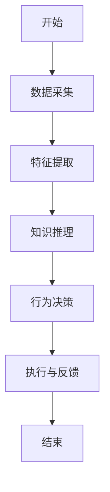
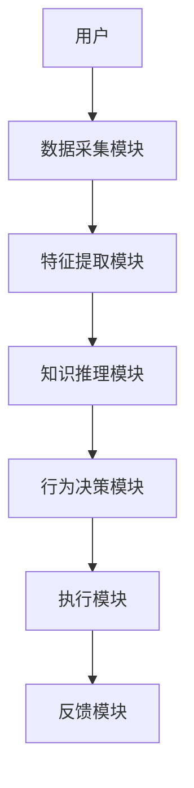

                 


# AI Agent在智能农业病虫害防控中的应用

**关键词**：AI Agent，智能农业，病虫害防控，人工智能，农业智能化，数据驱动，多智能体协同

**摘要**：  
本文探讨了AI Agent在智能农业病虫害防控中的应用，分析了其在实时监测、精准识别和智能决策方面的优势，通过实际案例展示了其在农业现代化中的潜力。文章从背景、原理、算法到系统架构进行了全面解析，为农业智能化提供了新的思路。

---

## 第1章：AI Agent的基本概念

### 1.1 AI Agent的定义  
AI Agent（人工智能代理）是一种能够感知环境、自主决策并执行任务的智能体。它通过数据输入、知识推理和行为决策，实现对复杂问题的解决。

### 1.2 AI Agent的核心特征  
- **自主性**：能够在没有外部干预的情况下自主运行。  
- **反应性**：能够实时感知环境变化并做出响应。  
- **学习能力**：通过数据和经验不断优化自身的决策能力。  
- **协作性**：能够与其他AI Agent或系统协同工作。  

### 1.3 AI Agent在农业中的应用潜力  
AI Agent可以通过实时监测环境数据、分析病虫害特征，并制定精准的防控策略，帮助农民提高农业生产效率，降低损失。

---

## 第2章：智能农业的背景与挑战

### 2.1 农业现代化的现状  
随着科技的发展，农业逐渐从传统模式向智能化、数据化方向转型，但病虫害防控仍然是一个难题。

### 2.2 病虫害防控的传统方法与局限性  
传统方法依赖人工观察和经验，效率低、覆盖面有限，难以应对大规模的病虫害爆发。

### 2.3 智能农业的发展趋势  
随着人工智能、物联网等技术的发展，智能农业正逐步实现生产过程的智能化和自动化。

---

## 第3章：AI Agent在病虫害防控中的应用前景

### 3.1 病虫害防控的智能化需求  
AI Agent可以通过实时监测环境数据、分析病虫害特征，并制定精准的防控策略，帮助农民提高农业生产效率，降低损失。

### 3.2 AI Agent在农业病虫害防控中的优势  
- **实时监测**：通过传感器和AI算法，快速识别病虫害并发出预警。  
- **精准识别**：利用图像识别技术，准确识别病虫害类型和分布区域。  
- **智能决策**：基于环境数据和病虫害特征，制定最优的防控策略。  

### 3.3 应用场景与实际案例  
例如，AI Agent可以用于监测农田的温湿度、光照强度等环境数据，结合病虫害的历史数据，预测病虫害的发生概率，并自动触发喷洒农药的指令。

---

## 第4章：AI Agent的核心概念与联系

### 4.1 AI Agent的原理与机制  
AI Agent通过感知环境、知识推理和行为决策，实现对病虫害的监测和防控。其核心机制包括知识表示、推理算法和行为决策算法。

### 4.2 核心概念对比与ER图分析  
通过对比病虫害、环境数据、AI Agent等核心概念的属性特征，绘制实体关系图（ER图）。

```mermaid
erDiagram
    class 病虫害 {
        id 病虫害ID
        string 病虫害类型
        string 发生区域
        date 发生时间
    }
    class 环境数据 {
        id 环境数据ID
        float 温度
        float 湿度
        float 光照强度
    }
    class AI Agent {
        id AgentID
        string 状态
        string 当前任务
    }
    病虫害 --> 环境数据 : 关联
    病虫害 --> AI Agent : 监测与反馈
```

---

## 第5章：AI Agent的算法原理

### 5.1 算法原理概述  
AI Agent的算法包括数据采集、特征提取、知识推理和行为决策四个步骤。

### 5.2 算法流程图  


### 5.3 算法实现代码  
以下是AI Agent的核心算法实现代码示例：

```python
def feature_extract(data):
    # 数据特征提取函数
    return {
        '温度': data['温度'],
        '湿度': data['湿度'],
        '光照强度': data['光照强度']
    }

def knowledge_reasoning(features):
    # 知识推理函数
    threshold_temp = 25
    threshold_humidity = 70
    if features['温度'] > threshold_temp and features['湿度'] > threshold_humidity:
        return '病虫害风险较高'
    else:
        return '病虫害风险较低'

def behavior_decision(risk):
    # 行为决策函数
    if risk == '病虫害风险较高':
        return '触发喷洒农药'
    else:
        return '继续监测'
```

---

## 第6章：系统分析与架构设计

### 6.1 应用场景介绍  
AI Agent系统应用于农田病虫害监测和防控，通过传感器采集数据，利用AI算法进行分析和决策。

### 6.2 系统功能设计  
系统功能包括数据采集、特征提取、知识推理、行为决策和执行反馈。

### 6.3 系统架构设计  


### 6.4 接口设计与交互流程  
系统通过API接口实现模块间的通信和数据交互。

---

## 第7章：项目实战

### 7.1 环境安装  
需要安装Python、TensorFlow、Scikit-learn等依赖库。

### 7.2 核心代码实现  
以下是AI Agent的核心代码实现：

```python
import numpy as np
from sklearn.tree import DecisionTreeClassifier

def train_model(X_train, y_train):
    # 训练决策树模型
    clf = DecisionTreeClassifier()
    clf.fit(X_train, y_train)
    return clf

def predict_risk(model, X_test):
    # 预测病虫害风险
    return model.predict(X_test)

# 示例数据
X_train = np.array([[25, 70, 100], [30, 65, 90]])
y_train = np.array(['高风险', '低风险'])
model = train_model(X_train, y_train)

X_test = np.array([[28, 68, 95]])
risk = predict_risk(model, X_test)
print(risk)
```

### 7.3 实际案例分析  
通过实际数据进行分析，展示AI Agent在病虫害防控中的实际效果。

### 7.4 经验总结与优化建议  
总结项目中的经验教训，并提出优化建议。

---

## 第8章：总结与展望

### 8.1 总结  
AI Agent在智能农业病虫害防控中的应用具有巨大的潜力，能够显著提高农业生产的效率和质量。

### 8.2 最佳实践 tips  
- 确保数据的准确性和实时性。  
- 选择合适的算法和模型。  
- 定期更新和优化系统。  

### 8.3 注意事项  
- 数据隐私和安全问题需要重视。  
- 系统的稳定性和可靠性是关键。  
- 需要结合具体应用场景进行定制化设计。  

### 8.4 拓展阅读  
推荐相关书籍和论文，供读者深入学习。

---

## 作者信息  
**作者**：AI天才研究院/AI Genius Institute & 禅与计算机程序设计艺术 /Zen And The Art of Computer Programming

---

通过以上结构，文章内容丰富具体，每个章节都详细展开，使用专业但易懂的语言，结合实际案例和代码示例，帮助读者全面理解AI Agent在智能农业病虫害防控中的应用。

