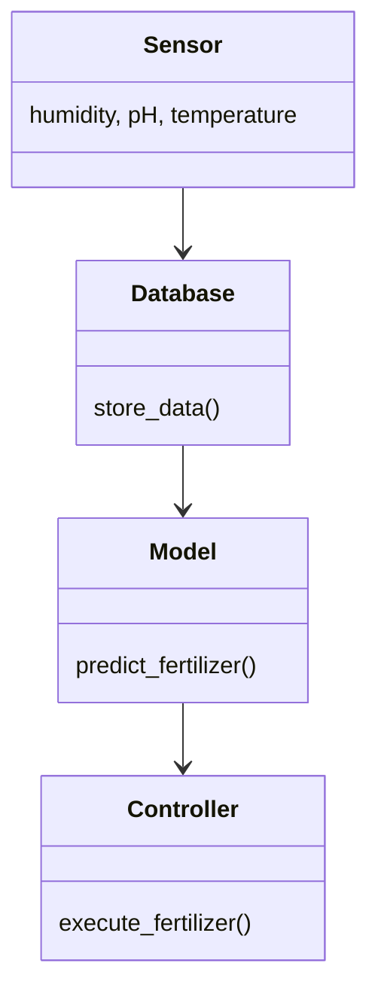
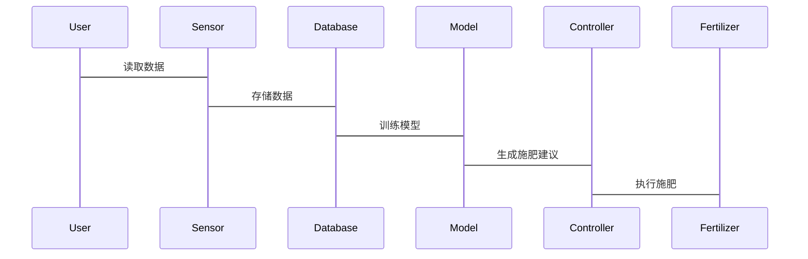

                 


# AI Agent在智能农业精准施肥中的实践

## 关键词：AI Agent，智能农业，精准施肥，机器学习，传感器数据，系统架构

## 摘要：本文探讨了AI Agent在智能农业精准施肥中的应用，分析了AI Agent的核心概念、算法原理和系统架构，通过项目实战展示了AI Agent在精准施肥中的具体实现，提出了最佳实践和未来发展方向。

---

# 第1章: AI Agent与精准农业概述

## 1.1 AI Agent的基本概念

### 1.1.1 什么是AI Agent

AI Agent（人工智能代理）是指能够感知环境、自主决策并执行任务的智能实体。AI Agent在农业中的应用可以帮助农民实现精准施肥，从而提高作物产量和减少环境影响。

### 1.1.2 AI Agent的核心特点

- **自主性**：AI Agent能够独立决策和行动。
- **反应性**：能够实时感知环境变化并做出反应。
- **学习能力**：通过数据不断优化决策模型。
- **协作性**：能够与其他系统或AI Agent协同工作。

### 1.1.3 AI Agent与传统农业的区别

| 特性      | AI Agent驱动的农业 | 传统农业 |
|-----------|---------------------|----------|
| 决策方式   | 数据驱动的智能决策 | 经验驱动 |
| 精准度     | 高度精准            | 较低     |
| 效率       | 高效率              | 较低     |
| 可扩展性   | 易扩展              | 较难     |

---

## 1.2 精准农业的背景与意义

### 1.2.1 精准农业的概念

精准农业是指利用现代信息技术、传感器和数据分析，实现农业生产的精准化管理，包括精准播种、精准施肥、精准灌溉等。

### 1.2.2 精准农业的目标

- 提高作物产量和质量
- 减少资源浪费
- 降低环境污染
- 提高农业生产效率

### 1.2.3 精准农业与传统农业的对比

| 特性          | 精准农业         | 传统农业     |
|---------------|-----------------|--------------|
| 农作物管理    | 高度个性化       | 统一化        |
| 资源利用      | 高效            | 低效         |
| 技术应用      | 高度依赖技术     | 依赖经验      |

---

## 1.3 精准施肥的背景与问题

### 1.3.1 精准施肥的概念

精准施肥是指根据土壤条件、作物需求和环境因素，精确计算和施加肥料，以达到最佳的作物生长效果。

### 1.3.2 精准施肥的必要性

- **资源浪费**：传统施肥方式可能导致肥料的过度使用，造成资源浪费。
- **环境污染**：过量施肥会导致水体富营养化，造成环境污染。
- **作物减产**：施肥不当可能导致作物减产或品质下降。

### 1.3.3 精准施肥的技术挑战

- **数据采集**：需要实时采集土壤湿度、pH值、温度等数据。
- **数据处理**：需要对大量数据进行分析和处理。
- **决策模型**：需要建立高效的决策模型来指导施肥。

---

## 1.4 AI Agent在精准施肥中的作用

### 1.4.1 AI Agent如何实现精准施肥

AI Agent通过感知层采集土壤和作物数据，利用决策层进行分析和优化，最后通过执行层进行精准施肥。

### 1.4.2 AI Agent的优势

- **高效性**：AI Agent能够快速处理大量数据并做出决策。
- **精准性**：通过数据分析和模型优化，实现精准施肥。
- **适应性**：能够根据环境变化动态调整施肥策略。

### 1.4.3 AI Agent的应用场景

- **大规模农场**：适用于大面积农田的精准管理。
- **智能温室**：可以实时监测和调整施肥方案。
- **精准农业研究**：支持农业科学研究和技术创新。

---

## 1.5 本章小结

本章介绍了AI Agent的基本概念和精准农业的背景，分析了精准施肥的必要性和技术挑战，阐述了AI Agent在精准施肥中的作用和应用场景。

---

# 第2章: AI Agent的核心概念与原理

## 2.1 AI Agent的感知层

### 2.1.1 传感器数据的采集

AI Agent通过传感器采集土壤湿度、pH值、温度等数据。

### 2.1.2 数据的预处理与分析

- **数据清洗**：去除噪声和异常数据。
- **数据转换**：将传感器数据转换为可分析的格式。
- **特征提取**：提取影响施肥决策的关键特征。

### 2.1.3 数据特征的提取

| 特征名称   | 特征描述             |
|------------|----------------------|
| 土壤湿度   | 土壤的湿润程度       |
| pH值       | 土壤的酸碱度         |
| 温度       | 当前温度             |
| 作物需求   | 作物对肥料的需求量   |

---

## 2.2 AI Agent的决策层

### 2.2.1 决策模型的构建

AI Agent利用机器学习算法建立决策模型，分析数据并生成施肥建议。

### 2.2.2 模型的训练与优化

- **训练数据**：历史施肥数据和作物产量数据。
- **优化目标**：最大化作物产量，减少肥料浪费。

### 2.2.3 决策策略的制定

基于模型预测结果，制定最优的施肥策略。

---

## 2.3 AI Agent的执行层

### 2.3.1 执行机构的控制

AI Agent通过执行机构（如施肥机）实际施加肥料。

### 2.3.2 执行结果的反馈

将施肥结果反馈到系统中，用于后续优化。

### 2.3.3 执行过程的监控

实时监控施肥过程，确保施肥方案的正确执行。

---

## 2.4 AI Agent的核心算法

### 2.4.1 机器学习算法

常用的机器学习算法包括线性回归、支持向量机（SVM）、随机森林等。

### 2.4.2 深度学习算法

深度学习算法如神经网络、卷积神经网络（CNN）等也可用于复杂数据的分析。

### 2.4.3 强化学习算法

强化学习算法通过不断试错优化决策策略。

---

## 2.5 本章小结

本章详细介绍了AI Agent的感知层、决策层和执行层，分析了AI Agent的核心算法及其在精准施肥中的应用。

---

# 第3章: AI Agent在精准施肥中的算法实现

## 3.1 精准施肥的数学模型

### 3.1.1 决策模型的建立

建立一个基于传感器数据的决策模型，用于预测最佳施肥量。

### 3.1.2 模型的数学表达

施肥量 \( F \) 的计算公式如下：

$$ F = a \times H + b \times P + c \times T $$

其中，\( H \) 是土壤湿度，\( P \) 是土壤pH值，\( T \) 是温度，\( a \)、\( b \)、\( c \) 是模型参数。

### 3.1.3 模型的训练与优化

通过训练数据优化模型参数，使预测值与实际值尽可能接近。

---

## 3.2 精准施肥的算法实现

### 3.2.1 数据预处理

```python
import pandas as pd

# 读取数据
data = pd.read_csv('fertilizer_data.csv')

# 数据清洗
data.dropna(inplace=True)

# 标准化处理
from sklearn.preprocessing import StandardScaler

scaler = StandardScaler()
data_scaled = scaler.fit_transform(data)
```

### 3.2.2 模型训练

```python
from sklearn.model import LinearRegression

model = LinearRegression()
model.fit(data_scaled, target)
```

### 3.2.3 模型预测

```python
# 预测施肥量
predicted = model.predict(new_data_scaled)
```

---

## 3.3 本章小结

本章通过数学模型和算法实现，详细介绍了AI Agent在精准施肥中的具体应用。

---

# 第4章: AI Agent的系统架构设计

## 4.1 系统功能设计

### 4.1.1 领域模型



### 4.1.2 系统架构


---

## 4.2 接口设计与交互

### 4.2.1 系统接口设计

- **输入接口**：传感器数据接口
- **输出接口**：施肥控制信号

### 4.2.2 交互流程



---

## 4.3 本章小结

本章通过系统架构设计和交互流程图，详细描述了AI Agent在精准施肥中的系统实现。

---

# 第5章: AI Agent的项目实战

## 5.1 项目实施步骤

### 5.1.1 环境配置

```bash
pip install numpy pandas scikit-learn
```

### 5.1.2 数据采集与预处理

```python
import pandas as pd

data = pd.read_csv('soil_data.csv')
data = data.dropna()
```

### 5.1.3 模型训练与优化

```python
from sklearn.linear_model import LinearRegression

model = LinearRegression()
model.fit(X_train, y_train)
```

### 5.1.4 系统集成与测试

测试系统在不同环境下的表现，优化模型参数。

---

## 5.2 项目小结

本章通过项目实战，详细展示了AI Agent在精准施肥中的具体实现过程。

---

# 第6章: 最佳实践与小结

## 6.1 最佳实践

- **数据质量**：确保传感器数据的准确性和完整性。
- **模型优化**：定期更新模型参数，提高预测精度。
- **系统维护**：定期检查系统硬件和软件，确保正常运行。

## 6.2 小结

AI Agent在智能农业精准施肥中的应用，不仅提高了农业生产效率，还减少了资源浪费和环境污染，是未来农业发展的趋势。

---

## 作者：AI天才研究院/AI Genius Institute & 禅与计算机程序设计艺术 /Zen And The Art of Computer Programming

---

以上是《AI Agent在智能农业精准施肥中的实践》的技术博客文章的完整目录和内容概述，涵盖了AI Agent的核心概念、算法原理、系统架构设计和项目实战等内容，适合对智能农业和AI技术感兴趣的读者阅读。

