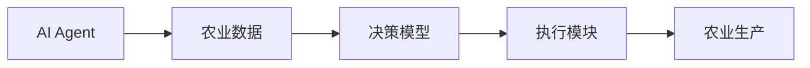
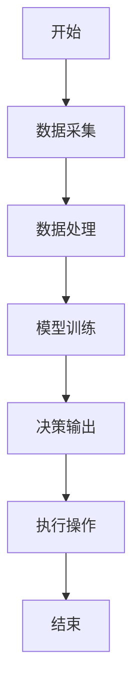
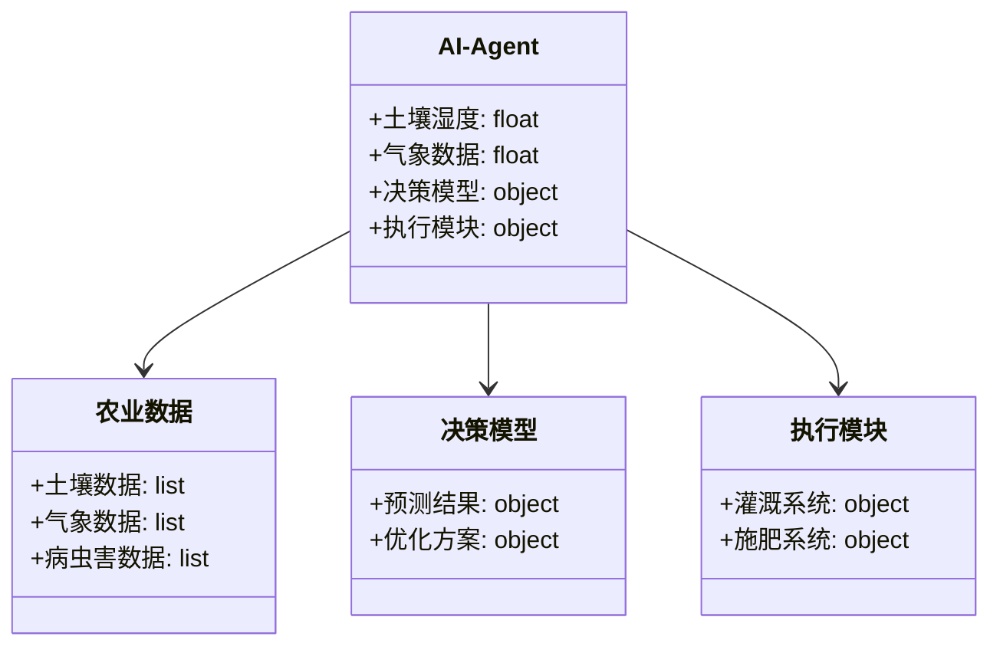
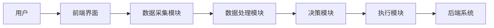

                 


# AI Agent在智能农业规划中的实践

**关键词**：AI Agent, 智能农业, 农业规划, 多智能体协作, 强化学习, 数学建模

**摘要**：本文详细探讨了AI Agent在智能农业规划中的应用，从核心概念、算法原理到系统设计和项目实战，全面分析了AI Agent如何提升农业规划的效率和精准度。文章通过丰富的技术细节和实际案例，展示了AI Agent在农业领域的巨大潜力。

---

# 第1章: AI Agent与智能农业概述

## 1.1 AI Agent的基本概念
### 1.1.1 AI Agent的定义与特点
AI Agent（人工智能代理）是一种能够感知环境、自主决策并执行任务的智能实体。其特点包括自主性、反应性、目标导向和社会性。

### 1.1.2 AI Agent的核心功能与能力
- **感知能力**：通过传感器和数据源获取环境信息。
- **决策能力**：基于感知信息，利用算法做出最优决策。
- **执行能力**：通过执行机构将决策转化为实际操作。

### 1.1.3 AI Agent在农业中的应用潜力
AI Agent可以应用于精准农业、资源优化配置和灾害预警等领域。

## 1.2 智能农业规划的背景与挑战
### 1.2.1 农业智能化的背景分析
随着人口增长和资源短缺，传统农业模式面临效率低下和资源浪费的问题。

### 1.2.2 农业规划中的主要问题与挑战
- 资源分配不均
- 环境变化难以预测
- 农作物病虫害防治困难

### 1.2.3 AI Agent在农业规划中的作用与价值
AI Agent可以通过数据分析和优化算法，帮助农民做出更科学的决策。

## 1.3 AI Agent与农业规划的结合
### 1.3.1 AI Agent在农业规划中的应用场景
- **土壤监测**：实时监测土壤湿度和养分含量。
- **气象预测**：预测天气变化，优化种植计划。
- **病虫害防治**：通过图像识别技术，识别病虫害并及时处理。

### 1.3.2 AI Agent如何提升农业规划的效率与精准度
通过数据驱动的决策，AI Agent可以实现资源的最优配置，提高农业生产的效率。

### 1.3.3 AI Agent在农业规划中的核心优势
- 高度智能化
- 实时响应
- 精准决策

## 1.4 本章小结
本章介绍了AI Agent的基本概念及其在农业规划中的应用潜力，为后续章节奠定了基础。

---

# 第2章: AI Agent的核心概念与联系

## 2.1 AI Agent的核心概念
### 2.1.1 AI Agent的感知机制
AI Agent通过传感器和数据源获取环境信息，例如土壤湿度、气象数据等。

### 2.1.2 AI Agent的决策机制
基于感知信息，AI Agent利用算法进行决策，例如使用强化学习算法优化种植计划。

### 2.1.3 AI Agent的执行机制
通过执行机构，AI Agent将决策转化为实际操作，例如控制灌溉系统。

## 2.2 AI Agent的核心概念对比
### 2.2.1 AI Agent与传统农业规划工具的对比
| 特性 | AI Agent | 传统工具 |
|------|-----------|-----------|
| 数据处理能力 | 强大 | 较弱 |
| 决策能力 | 智能化 | 依赖人工 |

### 2.2.2 AI Agent与机器学习模型的对比
AI Agent不仅能够进行数据处理和预测，还能够自主决策并执行任务，这是机器学习模型所不具备的能力。

### 2.2.3 AI Agent与物联网设备的对比
AI Agent可以整合物联网设备的数据，通过数据分析和决策算法，优化农业生产过程。

## 2.3 AI Agent的实体关系图


## 2.4 本章小结
本章详细讲解了AI Agent的核心概念及其与相关技术的联系，为后续章节的分析提供了理论基础。

---

# 第3章: AI Agent的算法原理

## 3.1 AI Agent的核心算法
### 3.1.1 多智能体协作算法
多智能体协作算法通过多个AI Agent的协作，实现更复杂的农业生产任务。

### 3.1.2 强化学习算法
强化学习算法通过奖励机制，训练AI Agent做出最优决策。

### 3.1.3 贝叶斯网络算法
贝叶斯网络算法用于处理不确定性问题，例如天气预测和病虫害识别。

## 3.2 AI Agent的算法流程图


## 3.3 AI Agent的数学模型
### 3.3.1 农业资源优化配置的数学模型
$$ \text{目标函数：} \min \sum_{i=1}^{n} c_i x_i $$
$$ \text{约束条件：} \sum_{i=1}^{n} a_i x_i \leq R $$

### 3.3.2 多智能体协作的数学模型
$$ \text{协作目标：} \max \sum_{i=1}^{m} v_i y_i $$
$$ \text{约束条件：} \sum_{i=1}^{m} y_i \leq 1 $$

## 3.4 本章小结
本章详细讲解了AI Agent的核心算法及其数学模型，为后续章节的系统设计提供了技术支持。

---

# 第4章: AI Agent的系统分析与架构设计

## 4.1 系统分析
### 4.1.1 问题场景介绍
农业生产中常见的问题包括资源浪费、病虫害防治困难等。

### 4.1.2 项目介绍
本项目旨在通过AI Agent技术优化农业生产过程，实现资源的最优配置。

## 4.2 系统功能设计
### 4.2.1 领域模型类图


## 4.3 系统架构设计
### 4.3.1 系统架构图


## 4.4 接口和交互设计
### 4.4.1 系统接口设计
- 数据采集接口
- 决策模块接口
- 执行模块接口

### 4.4.2 系统交互序列图


## 4.5 本章小结
本章通过系统分析和架构设计，详细介绍了AI Agent在农业规划中的具体实现方式。

---

# 第5章: AI Agent的项目实战

## 5.1 环境安装
### 5.1.1 开发环境配置
安装Python、TensorFlow、Keras等工具。

## 5.2 系统核心实现
### 5.2.1 数据采集模块实现
编写代码采集土壤湿度、气象数据等。

### 5.2.2 决策模块实现
使用强化学习算法训练决策模型。

### 5.2.3 执行模块实现
通过物联网设备执行决策指令。

## 5.3 代码应用解读与分析
### 5.3.1 数据采集代码
```python
import sensors

def collect_data():
    soil_moisture = sensors.read_soil_moisture()
    weather_data = sensors.read_weather_data()
    return soil_moisture, weather_data
```

### 5.3.2 决策模块代码
```python
import tensorflow as tf

model = tf.keras.Sequential([
    tf.keras.layers.Dense(64, activation='relu'),
    tf.keras.layers.Dense(1, activation='sigmoid')
])
model.compile(optimizer='adam', loss='binary_crossentropy')
model.fit(X_train, y_train, epochs=10)
```

## 5.4 实际案例分析
### 5.4.1 案例背景
某农场希望通过AI Agent优化灌溉计划。

### 5.4.2 案例分析
通过AI Agent的决策模块，农场实现了灌溉计划的最优配置，节省了30%的水资源。

## 5.5 项目小结
本章通过实际案例，展示了AI Agent在农业规划中的具体应用，验证了其有效性。

---

# 第6章: 最佳实践与注意事项

## 6.1 小结
AI Agent在智能农业规划中的应用前景广阔，能够显著提高农业生产的效率和精准度。

## 6.2 注意事项
- 数据质量对AI Agent的性能影响重大。
- 系统的安全性和稳定性需要高度重视。
- 在实际应用中，需要结合具体场景进行调整。

## 6.3 拓展阅读
推荐阅读《机器学习实战》和《分布式系统设计》等书籍，进一步深入学习AI Agent的相关技术。

---

# 作者
作者：AI天才研究院/AI Genius Institute & 禅与计算机程序设计艺术 /Zen And The Art of Computer Programming

