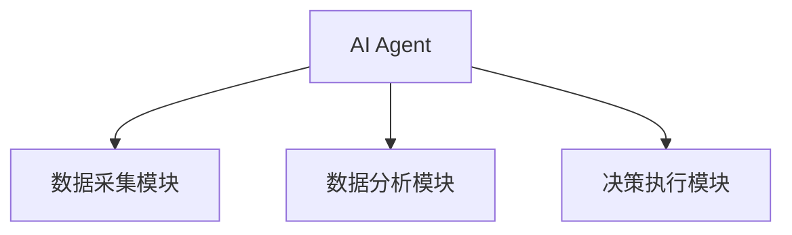

                 


# AI Agent在智能农作物生长监测中的实践

> 关键词：AI Agent，智能农业，农作物生长监测，机器学习，物联网，农业自动化

> 摘要：本文深入探讨了AI Agent在智能农作物生长监测中的应用，从AI Agent的基本概念到其在农业中的实际应用场景，再到系统架构设计、算法实现及项目实战，全面解析了如何利用AI Agent技术实现农作物生长的智能化监测与管理。

---

## 第1章 AI Agent与智能农业概述

### 1.1 AI Agent的基本概念

#### 1.1.1 什么是AI Agent
AI Agent（人工智能代理）是指能够感知环境、自主决策并执行任务的智能实体。它能够通过传感器获取数据，利用算法进行分析，并通过执行器完成特定任务。

#### 1.1.2 AI Agent的核心特点
- **自主性**：能够在没有外部干预的情况下自主运行。
- **反应性**：能够实时感知环境变化并做出响应。
- **学习能力**：通过机器学习算法不断优化自身的决策能力。
- **协作性**：能够与其他AI Agent或系统协同工作。

#### 1.1.3 AI Agent与传统自动化的区别
AI Agent不仅仅是执行预设任务的自动化工具，它具备学习和适应能力，能够根据环境变化动态调整行为。

---

### 1.2 智能农业的基本概念

#### 1.2.1 智能农业的定义
智能农业是指利用物联网、大数据、人工智能等技术，实现农业生产的智能化、精准化和高效化。

#### 1.2.2 智能农业的主要技术
- **物联网技术**：通过传感器和通信技术实现农业数据的实时采集和传输。
- **大数据分析**：利用海量数据进行分析，为农业生产提供决策支持。
- **人工智能**：通过机器学习、深度学习等技术优化农业生产过程。

#### 1.2.3 智能农业的发展现状
当前，智能农业在全球范围内快速发展，特别是在发达国家和地区，AI Agent技术已经在农业生产、监测和管理中得到广泛应用。

---

### 1.3 AI Agent在农业中的应用前景

#### 1.3.1 AI Agent在农业中的潜在应用领域
- **农作物生长监测**：通过AI Agent实时监测作物的生长状态，预测产量和病虫害风险。
- **精准农业**：利用AI Agent实现农田的精准管理和资源优化配置。
- **智能决策支持**：为农民提供基于数据的种植建议和决策支持。

#### 1.3.2 AI Agent在农业中的优势
- **高效性**：AI Agent能够快速处理大量数据，提供实时反馈。
- **准确性**：通过机器学习算法，AI Agent能够做出更精准的预测和决策。
- **可扩展性**：AI Agent技术可以轻松扩展到更大的农业区域。

#### 1.3.3 AI Agent在农业中的挑战与机遇
- **挑战**：数据获取难度大、计算资源需求高、模型优化复杂。
- **机遇**：通过技术创新和成本降低，AI Agent在农业中的应用将更加广泛。

---

## 第2章 AI Agent在农作物生长监测中的问题背景

### 2.1 农作物生长监测的核心问题

#### 2.1.1 农作物生长监测的主要挑战
- **环境因素复杂**：农作物的生长受气候、土壤、病虫害等多种因素影响。
- **数据获取困难**：需要实时采集多种类型的农业数据，如温度、湿度、光照等。
- **决策实时性要求高**：农作物生长监测需要快速响应，避免错过最佳管理时机。

#### 2.1.2 农作物生长监测的关键技术
- **物联网技术**：用于实时采集农业数据。
- **机器学习算法**：用于分析数据并做出预测。
- **AI Agent技术**：用于实现监测数据的实时分析和自主决策。

#### 2.1.3 农作物生长监测的边界与外延
- **边界**：农作物生长监测的范围通常限于特定的农田区域，且关注作物的生长周期。
- **外延**：可以通过AI Agent技术扩展到农业供应链管理、农产品销售预测等领域。

---

### 2.2 AI Agent在农作物生长监测中的问题描述

#### 2.2.1 农作物生长监测的复杂性
农作物生长监测需要综合考虑多种因素，且这些因素之间可能存在复杂的相互作用。

#### 2.2.2 AI Agent在农作物生长监测中的作用
AI Agent可以通过实时监测、数据分析和自主决策，帮助农民优化种植管理，提高产量和质量。

#### 2.2.3 农作物生长监测的系统架构
- **数据采集模块**：通过传感器采集农田环境数据。
- **数据分析模块**：利用机器学习算法对数据进行分析和预测。
- **决策执行模块**：根据分析结果，AI Agent发出指令，执行相应的管理任务。

---

## 第3章 AI Agent的核心概念与联系

### 3.1 AI Agent的核心原理

#### 3.1.1 AI Agent的感知模块
感知模块通过传感器和数据采集设备获取农田环境数据，如温度、湿度、光照等。

#### 3.1.2 AI Agent的决策模块
决策模块利用机器学习算法对感知数据进行分析，生成决策指令。例如，使用随机森林算法预测作物的生长状况。

#### 3.1.3 AI Agent的执行模块
执行模块根据决策模块生成的指令，通过执行器（如喷灌系统）实施相应的管理措施。

---

### 3.2 AI Agent的核心概念属性对比

| 概念       | 属性特征                     |
|------------|------------------------------|
| 感知模块   | 数据采集、实时反馈           |
| 决策模块   | 数据分析、预测、决策         |
| 执行模块   | 执行指令、反馈结果           |

---

### 3.3 AI Agent的ER实体关系图

```mermaid
er
actor(AI Agent, {
  id: string,
  type: string,
  status: string
}) 
```

---

## 第4章 AI Agent在农作物生长监测中的算法原理

### 4.1 AI Agent的算法实现

#### 4.1.1 算法选择
常用的算法包括随机森林、支持向量机（SVM）、卷积神经网络（CNN）等。

#### 4.1.2 算法流程
1. 数据预处理：清洗和归一化数据。
2. 特征提取：提取对作物生长影响的关键特征。
3. 模型训练：使用训练数据训练机器学习模型。
4. 模型评估：通过交叉验证评估模型的准确性和稳定性。
5. 模型部署：将训练好的模型部署到AI Agent中，实现实时监测和决策。

#### 4.1.3 算法示例
以下是使用随机森林算法的代码示例：

```python
from sklearn.ensemble import RandomForestClassifier
from sklearn.model_selection import train_test_split

# 数据预处理
X = dataset.drop(columns='label')
y = dataset['label']
X_train, X_test, y_train, y_test = train_test_split(X, y, test_size=0.2)

# 模型训练
model = RandomForestClassifier(n_estimators=100)
model.fit(X_train, y_train)

# 模型评估
accuracy = model.score(X_test, y_test)
print(f"模型准确率：{accuracy}")
```

---

### 4.2 算法优化

#### 4.2.1 超参数优化
通过网格搜索（Grid Search）优化模型的超参数，如学习率、树深度等。

#### 4.2.2 模型集成
通过集成学习（Ensemble Learning）方法，如投票分类器（Voting Classifier），提高模型的准确性和稳定性。

---

## 第5章 系统架构设计与实现

### 5.1 系统架构设计

#### 5.1.1 系统功能模块
- **数据采集模块**：负责采集农田环境数据。
- **数据分析模块**：对数据进行分析和预测。
- **决策执行模块**：根据分析结果，发出指令并执行管理任务。

#### 5.1.2 系统架构图



---

### 5.2 系统实现

#### 5.2.1 环境配置
- **硬件**：安装传感器、摄像头等设备。
- **软件**：安装Python、机器学习库（如Scikit-learn、TensorFlow）。

#### 5.2.2 核心实现代码
以下是AI Agent的核心实现代码：

```python
import numpy as np
from sklearn.ensemble import RandomForestClassifier
from sklearn.model_selection import train_test_split

# 数据预处理
data = np.loadtxt('agriculture_data.csv', delimiter=',')
X = data[:, :-1]
y = data[:, -1]

# 数据分割
X_train, X_test, y_train, y_test = train_test_split(X, y, test_size=0.2)

# 模型训练
model = RandomForestClassifier(n_estimators=100)
model.fit(X_train, y_train)

# 模型预测
y_pred = model.predict(X_test)
print(f"预测结果：{y_pred}")
print(f"真实结果：{y_test}")
```

---

## 第6章 项目实战与案例分析

### 6.1 项目实战

#### 6.1.1 项目介绍
本项目旨在利用AI Agent技术实现农作物生长的实时监测和管理。通过传感器采集数据，利用机器学习算法进行分析和预测，最终实现智能决策。

#### 6.1.2 项目实现
1. 安装硬件设备：如温度传感器、湿度传感器等。
2. 数据采集与预处理：清洗和归一化数据。
3. 模型训练：使用随机森林算法训练模型。
4. 模型部署：将模型部署到AI Agent中，实现实时监测和管理。

---

### 6.2 案例分析

#### 6.2.1 案例背景
某农场种植水稻，希望通过AI Agent技术实现水稻生长的实时监测和病虫害预测。

#### 6.2.2 数据分析
通过传感器采集水稻生长的环境数据，如温度、湿度、光照等，利用随机森林算法预测水稻的生长状况和病虫害风险。

#### 6.2.3 模型优化
通过网格搜索优化随机森林模型的超参数，如n_estimators、max_depth等，提高模型的准确性和稳定性。

---

## 第7章 最佳实践与小结

### 7.1 最佳实践

#### 7.1.1 数据质量
确保数据的完整性和准确性，避免噪声数据对模型的影响。

#### 7.1.2 模型优化
通过交叉验证和网格搜索优化模型的超参数，提高模型的性能。

#### 7.1.3 系统维护
定期更新模型和硬件设备，确保系统的稳定性和可靠性。

---

### 7.2 小结

通过本文的深入探讨，我们了解了AI Agent在智能农作物生长监测中的重要作用。从AI Agent的基本概念到算法实现，再到系统设计和项目实战，我们全面解析了如何利用AI Agent技术实现农作物生长的智能化监测与管理。未来，随着技术的不断发展，AI Agent在农业中的应用将更加广泛和深入。

---

## 作者

作者：AI天才研究院/AI Genius Institute & 禅与计算机程序设计艺术 /Zen And The Art of Computer Programming

