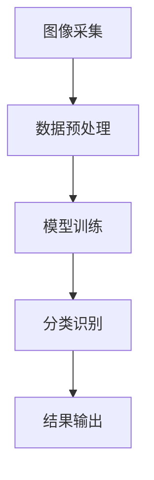
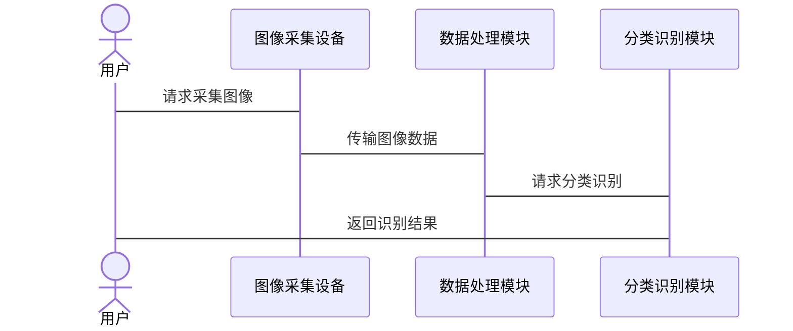
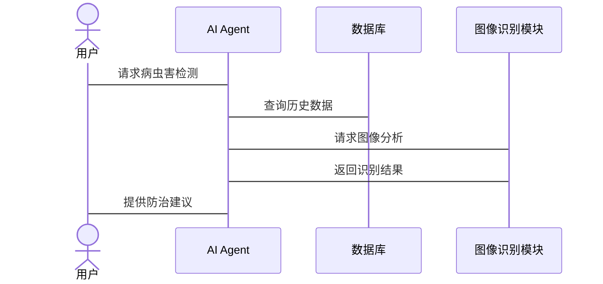

                 


# AI Agent在智能农作物病虫害检测中的实践

> 关键词：AI Agent, 农作物病虫害检测, 图像识别, 机器学习, 深度学习

> 摘要：本文探讨了AI Agent在农作物病虫害检测中的应用，分析了其技术原理，并通过实际案例展示了AI Agent在提高检测效率和准确性方面的优势。文章详细介绍了AI Agent的核心概念、算法原理、系统架构设计以及实际项目实现，为读者提供了全面的技术视角。

---

# 第一部分: AI Agent与智能农作物病虫害检测的背景介绍

## 第1章: AI Agent与农作物病虫害检测的背景

### 1.1 问题背景

#### 1.1.1 农作物病虫害检测的重要性
农作物病虫害是影响农业产量和质量的主要因素之一。传统的病虫害检测依赖于人工观察和经验判断，存在效率低、误差大、成本高等问题。AI Agent作为一种智能代理，能够通过图像识别、数据处理和决策支持，显著提高病虫害检测的效率和准确性。

#### 1.1.2 传统病虫害检测的局限性
传统方法主要依赖于人工检查，这种方式效率低下，特别是在大规模种植的情况下。此外，人工检测容易受到主观因素的影响，导致误诊或漏诊。传统方法还难以实时监测病虫害的动态变化。

#### 1.1.3 AI技术在农业中的应用前景
随着AI技术的快速发展，其在农业中的应用前景广阔。AI Agent能够通过图像识别技术快速识别病虫害类型，提供实时监测和决策支持，帮助农民实现精准农业管理。

### 1.2 问题描述

#### 1.2.1 病虫害检测的复杂性
病虫害的种类繁多，不同种类的病虫害在外观表现上可能相似，导致检测难度大。此外，病虫害的严重程度也会影响检测结果，需要综合分析多方面的信息。

#### 1.2.2 农作物病虫害的多样性
农作物病虫害的表现形式多样，包括叶斑病、锈病、虫害等。每种病虫害的特征不同，检测方法也需灵活调整。

#### 1.2.3 AI Agent在病虫害检测中的作用
AI Agent能够通过图像识别和机器学习技术，快速准确地识别病虫害类型，并提供相应的防治建议，帮助农民及时采取措施。

### 1.3 问题解决

#### 1.3.1 AI Agent的核心优势
AI Agent具有高效性、准确性、实时性和可扩展性等优势。它能够快速处理大量数据，提供实时监测，并适用于不同类型的病虫害检测。

#### 1.3.2 AI Agent在病虫害检测中的具体应用
AI Agent可以通过图像识别技术，对农作物叶片进行分析，识别病斑、虫害等异常情况，并结合历史数据和气象信息，预测病虫害的发生趋势。

#### 1.3.3 AI Agent与传统检测方法的对比
与传统方法相比，AI Agent能够显著提高检测效率和准确性，减少人工成本，同时支持大规模种植的实时监测。

### 1.4 边界与外延

#### 1.4.1 病虫害检测的边界条件
病虫害检测的边界条件包括检测范围、检测精度、数据来源和环境条件等。不同条件下，AI Agent的应用需要进行相应的调整。

#### 1.4.2 AI Agent的应用范围
AI Agent不仅适用于病虫害检测，还可以应用于作物生长监测、产量预测等领域，具有广泛的应用潜力。

#### 1.4.3 病虫害检测的未来发展方向
未来的病虫害检测将更加智能化和自动化，AI Agent将与物联网、大数据等技术结合，实现更加精准和高效的监测与管理。

### 1.5 概念结构与核心要素组成

#### 1.5.1 AI Agent的基本组成
AI Agent通常包括感知模块、决策模块和执行模块。感知模块负责数据采集，决策模块进行分析和判断，执行模块负责输出结果。

#### 1.5.2 农作物病虫害检测的核心要素
病虫害检测的核心要素包括图像采集、特征提取、分类识别和结果输出。这些要素共同构成了检测系统的功能模块。

#### 1.5.3 AI Agent与病虫害检测的结合点
AI Agent通过图像识别和机器学习技术，与病虫害检测的关键环节结合，实现高效准确的检测和防治。

---

# 第二部分: AI Agent的核心概念与原理

## 第2章: AI Agent的核心概念与原理

### 2.1 AI Agent的定义与特点

#### 2.1.1 AI Agent的定义
AI Agent是一种智能代理，能够通过感知环境、执行任务和与用户交互，实现特定目标。在病虫害检测中，AI Agent通过图像识别和数据分析，帮助农民快速诊断病虫害。

#### 2.1.2 AI Agent的核心特点
- **智能性**：能够自主学习和适应新的数据。
- **实时性**：能够快速处理数据并提供实时反馈。
- **准确性**：通过深度学习算法，提高检测的准确性。

#### 2.1.3 AI Agent与传统AI的区别
AI Agent不仅具备AI的核心功能，还具有更强的自主性和适应性，能够根据环境变化动态调整行为。

### 2.2 农作物病虫害检测的核心原理

#### 2.2.1 病虫害检测的基本原理
病虫害检测的基本原理是通过图像分析和模式识别，识别病斑、虫害等异常特征。

#### 2.2.2 AI在病虫害检测中的应用原理
AI通过卷积神经网络（CNN）等深度学习模型，对图像进行特征提取和分类，识别病虫害类型。

#### 2.2.3 AI Agent在病虫害检测中的具体实现
AI Agent通过图像采集、数据预处理、模型训练和结果输出，实现病虫害的自动检测和分类。

### 2.3 AI Agent与农作物病虫害检测的联系

#### 2.3.1 AI Agent在病虫害检测中的作用
AI Agent通过图像识别和数据分析，帮助农民快速准确地诊断病虫害，减少损失。

#### 2.3.2 AI Agent与病虫害检测的结合方式
AI Agent通过与图像采集设备、传感器和数据库的结合，实现数据的实时采集、分析和反馈。

#### 2.3.3 AI Agent在病虫害检测中的优势
AI Agent能够处理大量数据，提高检测效率和准确性，同时支持大规模种植的实时监测。

---

## 第3章: AI Agent的算法原理与数学模型

### 3.1 AI Agent的核心算法

#### 3.1.1 常见的AI算法概述
常见的AI算法包括支持向量机（SVM）、随机森林（RF）和卷积神经网络（CNN）。这些算法各有优缺点，适用于不同的应用场景。

#### 3.1.2 AI Agent在病虫害检测中的具体算法
在病虫害检测中，卷积神经网络（CNN）是最常用的算法之一。它能够有效地提取图像中的特征，实现高精度的分类。

#### 3.1.3 算法的优缺点分析
- **CNN的优势**：能够自动提取图像特征，适用于大规模数据的处理。
- **CNN的缺点**：需要大量的标注数据，计算资源消耗较大。

### 3.2 算法原理的详细讲解

#### 3.2.1 卷积神经网络（CNN）的工作原理
CNN通过卷积操作、池化操作和全连接层，逐步提取图像的高层次特征，实现图像分类。

#### 3.2.2 CNN的数学模型
$$ \text{卷积操作：} f(x) = \sum_{i=1}^{n} w_i x_i $$
$$ \text{池化操作：} p(x) = \max(x_1, x_2, x_3, x_4) $$

#### 3.2.3 CNN的网络结构
- **卷积层**：提取图像的空间特征。
- **池化层**：降低计算复杂度，防止过拟合。
- **全连接层**：进行分类预测。

#### 3.2.4 CNN的实现流程
1. **图像输入**：将病虫害图像输入CNN网络。
2. **卷积操作**：提取图像的特征。
3. **池化操作**：降低计算复杂度。
4. **全连接层**：进行分类预测。

### 3.3 算法实现的代码示例

#### 3.3.1 环境安装
```bash
pip install tensorflow keras matplotlib
```

#### 3.3.2 CNN模型实现
```python
import tensorflow as tf
from tensorflow.keras import layers

model = tf.keras.Sequential([
    layers.Conv2D(32, (3,3), activation='relu', input_shape=(224, 224, 3)),
    layers.MaxPooling2D((2,2)),
    layers.Conv2D(64, (3,3), activation='relu'),
    layers.MaxPooling2D((2,2)),
    layers.Flatten(),
    layers.Dense(128, activation='relu'),
    layers.Dense(10, activation='softmax')
])
```

#### 3.3.3 模型训练
```python
model.compile(optimizer='adam', loss='sparse_categorical_crossentropy', metrics=['accuracy'])
model.fit(X_train, y_train, epochs=10, batch_size=32)
```

### 3.4 算法的优化与改进

#### 3.4.1 数据增强技术
通过旋转、缩放和翻转等数据增强技术，增加训练数据的多样性，提高模型的泛化能力。

#### 3.4.2 模型优化策略
- **学习率调整**：使用学习率衰减策略，提高训练效率。
- **正则化技术**：使用Dropout防止过拟合。

#### 3.4.3 模型评估
通过准确率、召回率和F1分数等指标，评估模型的性能，并根据评估结果进行优化。

---

## 第4章: 系统分析与架构设计

### 4.1 问题场景介绍

#### 4.1.1 病虫害检测的场景
病虫害检测通常在田间进行，需要实时监测和快速反馈。

#### 4.1.2 系统的需求分析
系统需要具备图像采集、数据处理和结果输出的功能，能够支持大规模种植的实时监测。

### 4.2 系统架构设计

#### 4.2.1 系统功能设计
系统功能包括图像采集、特征提取、分类识别和结果输出。

#### 4.2.2 系统架构图


#### 4.2.3 接口设计
系统需要提供图像采集接口、数据处理接口和结果输出接口，与其他设备和系统进行数据交互。

### 4.3 交互设计

#### 4.3.1 系统交互流程


#### 4.3.2 交互序列图


---

## 第5章: 项目实战

### 5.1 环境安装

#### 5.1.1 Python环境
```bash
python --version
pip install numpy matplotlib scikit-learn tensorflow
```

#### 5.1.2 数据集准备
使用公开的病虫害图像数据集，例如CIFAR-10或自定义数据集。

### 5.2 系统核心实现

#### 5.2.1 数据预处理
```python
import numpy as np
from sklearn.model_selection import train_test_split

X_train, X_test, y_train, y_test = train_test_split(X, y, test_size=0.2)
```

#### 5.2.2 模型训练
```python
model.fit(X_train, y_train, epochs=10, batch_size=32, validation_data=(X_test, y_test))
```

#### 5.2.3 结果输出
```python
print(model.evaluate(X_test, y_test))
```

### 5.3 代码应用解读与分析

#### 5.3.1 代码实现
```python
import tensorflow as tf
from tensorflow.keras import layers

model = tf.keras.Sequential([
    layers.Conv2D(32, (3,3), activation='relu', input_shape=(224, 224, 3)),
    layers.MaxPooling2D((2,2)),
    layers.Conv2D(64, (3,3), activation='relu'),
    layers.MaxPooling2D((2,2)),
    layers.Flatten(),
    layers.Dense(128, activation='relu'),
    layers.Dense(10, activation='softmax')
])

model.compile(optimizer='adam', loss='sparse_categorical_crossentropy', metrics=['accuracy'])
model.fit(X_train, y_train, epochs=10, batch_size=32)
```

#### 5.3.2 代码功能分析
- **卷积层**：提取图像特征。
- **池化层**：降低计算复杂度。
- **全连接层**：进行分类预测。

### 5.4 案例分析与总结

#### 5.4.1 实际案例分析
通过实际案例分析，验证AI Agent在病虫害检测中的效果，评估其准确性和效率。

#### 5.4.2 总结
AI Agent通过图像识别和深度学习技术，显著提高了病虫害检测的效率和准确性，为农业智能化管理提供了有力支持。

---

## 第6章: 最佳实践、小结、注意事项和拓展阅读

### 6.1 最佳实践

#### 6.1.1 数据质量
确保数据的多样性和质量，避免过拟合。

#### 6.1.2 模型优化
通过数据增强、学习率调整等技术，优化模型性能。

### 6.2 小结

#### 6.2.1 AI Agent的核心优势
AI Agent通过图像识别和深度学习技术，显著提高了病虫害检测的效率和准确性。

#### 6.2.2 项目实现的关键点
- 数据预处理
- 模型选择
- 系统架构设计

### 6.3 注意事项

#### 6.3.1 数据隐私
确保数据的安全性和隐私性，避免数据泄露。

#### 6.3.2 系统稳定性
确保系统的稳定性和可靠性，特别是在大规模种植的情况下。

### 6.4 拓展阅读

#### 6.4.1 深度学习与计算机视觉
推荐阅读《Deep Learning》和《Computer Vision: Algorithms and Applications》。

#### 6.4.2 AI在农业中的应用
推荐关注《AI in Agriculture》和《Smart Farming with AI》。

---

# 作者：AI天才研究院/AI Genius Institute & 禅与计算机程序设计艺术 /Zen And The Art of Computer Programming

